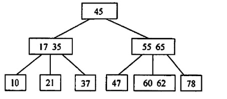

# B树和B+树
2022.10.11

[TOC]

## B树及其基本操作

1. 定义：B树又名多路平衡查找树。m阶B树每个节点最多有m个指针和m-1个关键字！

   

2. 性质

   1. 结点孩子个数(失败结点) = 结点关键字+1
   2. 根结点没有关键字就没有子树，B树为空；根结点有关键字，其子树必然大于等于两棵
   3. 除根结点外所有非终端结点至少有 $\lceil m/2 \rceil$ 个子树, 最少$\lceil m/2 \rceil-1$个关键字
   4. 结点中关键字从左到右递增有序
   5. 高度：m阶B树有n个结点。
   6. 每个结点最多m-1个结点：B树高度$h ≥ log_m (n+1)$，n≤(m-1)(1+m+m^2+...+m^{h-1})=m^h -1
   7. B树结点叶子 = 关键字n + 1 ≥ $2(\lceil m/2 \rceil)^{k-1}$
   8. 【**所有叶子结点都在同一层**！】

3. B树的查找

4. B树的插入

   1. 上溢的方法：m阶B树最多一个结点m-1个结点。如果超了就要上溢。上溢的结点是$\lceil m/2 \rceil$
   2. 

5. B树的删除

   1. 直接删除：如果结点关键字≥$\lceil m/2 \rceil$，可以直接删除

   2. 兄弟够借：兄弟借一个到父结点，父结点拿一个下来

      

   3. 兄弟不够借：父结点直接和兄弟组一个新子结点

      

## B+树的基本概念

## 习题

1. 下图所示是一棵（ ）.

   

   A.4阶B树
   B.4阶B树
   C.3阶B树
   D.3阶B树

   【答案】：B

2. 下列关于m阶B树的说法中，错误的是(）
   A.根结点至多有m棵子树
   B.所有叶结点都在同一层次上
   C.非叶结点至少有m/2（m为偶数）或(m+1)/2（m为奇数）棵子树
   D.根结点中的数据是有序的

   【答案】：B -> C

3. 以下关于m阶B树的说法中，正确的是（）
   I.每个结点至少有两棵非空子树
   II.树中每个结点至多有m-1个关键字
   III.所有叶结点在同一层
   IV.插入一个元素引起B树结点分裂后，树长高一层
   A.I、II
   B.II、III
   C.III、IV
   D.I、II、IV

   【答案】：B

4. 在一棵m阶B树中做插入操作前，若一个结点中的关键字个数等于（ ），则必须分裂成两个结点；向一棵m阶的B树做删除操作前，若一个结点中的关键字个数等于(），則可能需要同它的左兄弟或右兄弟结点合并成一个结点
   A. m, floor{m/2}-2
   B. m-1. floor{m/2}-1
   C. m+1, floor{m/2}
   D. m/2, floor{m/2}+1

   **【答案】：B**

5. 具有n个关键字的m阶B树，应有（ ）个叶结点
   A.n+1
   B.n-1
   C.mn
   D.nm/2

   **【答案】：B**，叶子结点个数对应查找失败的个数。

6. 高度为5的3阶B树至少有（ ）个结点，至多有（ )个结点
   A. 32
   B. 31
   C. 120
   D. 121

   【答案】：

7. 含有九个非叶结点的m阶B树中至少包含（）个关键字
   A. n(m+1)
   B. n
   C. n(m/27-1
   D. (n-1)(floor{m/2}-1)+1

   【答案】：

8. 已知一採5阶B树中共有53个关键宇，則树的最大高度为（），最小高度为（）
   A. 2
   B. 3
   C. 4
   D. 5

   【答案】：

9. 已知一採3阶B树中有2047 个关键宇，则此日树的最大高度为（），最小高度为（，
   A.11
   B.10
   C.8
   D.7

   【答案】：

10. 下列关于B树和B+树的級述中，不正确的是(
    A.B树和B+树都能有效地支持顺序安找
    B.B树和B+树都能有效地支持随机查找
    C.B树和B+树都是平街的多叉树
    D.B树和B+树都可以用于文件家引结构

    【答案】：

11. 【2009統考真题】下列级述中，不村合m阶B树定义要求的是（）.
    A.根结点至多有m棵子树
    B. 所有叶结点都在同一层上
    C.各结点内关鍵字均升序或降序排列 
    D.叶结点之间通过指针链接

    【答案】：

12. 【2012 統考真题】已知一林3分B村，如下田所示。利除关健宇78得到一標新B树。其最右叶结,点中的关键字是（）

    

    A. 60
    B. 60, 62
    C. 62,65
    D. 65

    【答案】：

13. 【2013 統考真题】在一架高度为2的5阶B树中，所含关鍵宇的个数至少是(）。
    A.5
    B.7
    C. 8
    D.14

    【答案】：

14. 【2014號参真题】在一祥有15个关健宇的4於日村中，含关键宇的结点个数最多是(）。
    A. 5
    B. 6
    C. 10
    D. 15

    【答案】：

15. 【2016 統考真题】B+树不同于日树的特点之一是（）
    A.能支持版序查找
    B.结点中含有关鍵字
    C.根结点至少有两个分支
    D. 所方叶结点都在阿一层上

    【答案】：

16. 【2017 統考真题】下列应用中，适合使用B+树的是（）
    A.編译器中的词法分析
    B.关系数据库系統中的索引
    C.网络中的路由表快速查找
    D.操作系統的磁盘空闲块管理

    【答案】：

17. 【2018 統考真题】高度为5的3阶B村含有的关键字个数至少是（）
    A. 15
    B. 31
    C. 62
    D. 242

    【答案】：

18. 【2020统考真题】依次将关鍵宇5，6，9，13，8，2，12，15插入初始为空的4阶日柎后，根结点中包含的关键宇是（）.
    A. 8
    B. 6.9
    C. 8.
    D. 9, 12

    【答案】：

19. 【2021 統考真题】在一标高度为3的3阶B树中，根为第1层，若第2层中有4个关键字，则该树的结点数最多是（ ）
    A. 11
    B. 10
    C. 9
    D. 8

    【答案】：
