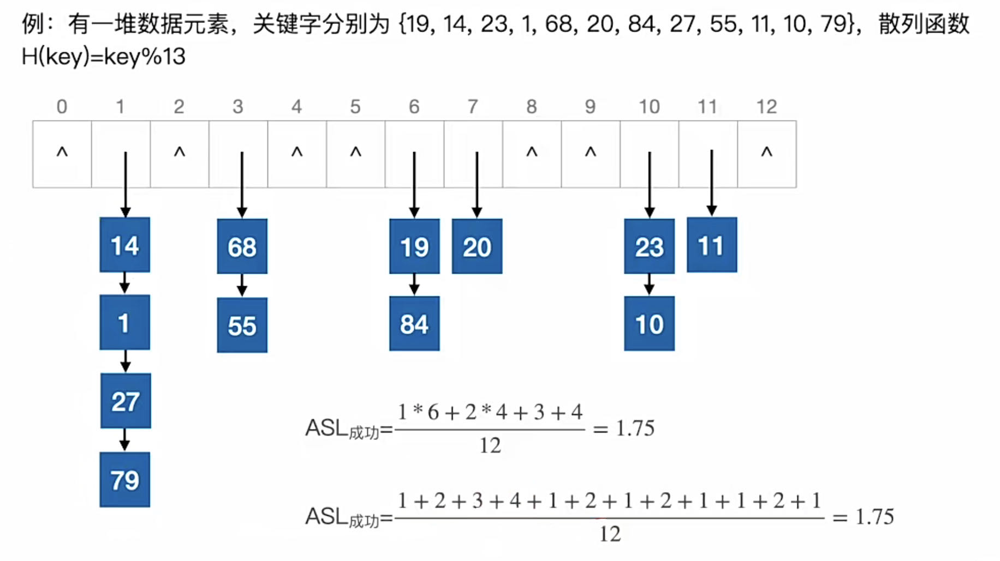
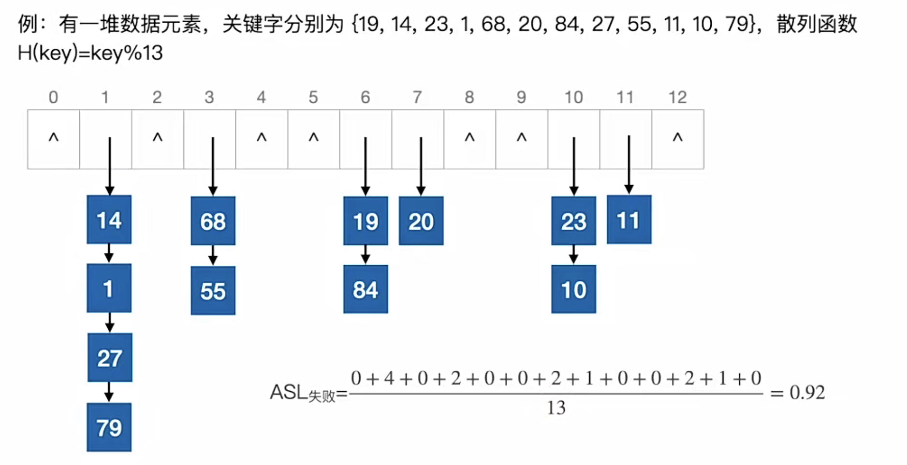

# 散列表
2022.11.02

[TOC]

## 散列表的基本概念

1. 散列函数：Hash(Key)=Addr
2. 散列表：建立了关键字与存储地址的直接映射关系

## 散列函数的构造方法

1. 直接定址法
   $$
   \begin{align*}
   H(Key)=key或H(Key)=a\times key + b
   \end{align*}
   $$

2. 除留余数法
   $$
   \begin{align*}
   H(Key)=key\% p
   \end{align*}
   $$

3. 数字分析法：分析给定数字集合的某几位分布均匀。

4. 平方取中法：平方后去中间n位。

## 处理冲突的方法

1. 开放定址法
   $$
   \begin{align*}
   H_i=(H(Key) + d_i)\% m
   \end{align*}
   $$

   1. 线性探测法：di=0,1,2,3,...m。相当于一个位置占上了就放后一个。

   2. 平方探测法：di=0^2,1^2,-1^2,2^2,-2^2,...,k^2,-k^2。k≤m/2，m=4k+3，是素数

   3. 双散列法：di=Hash_2(key), i是冲突次数
      $$
      \begin{align*}
      H_i=(H(Key) + i\times hash_2(key))\% m
      \end{align*}
      $$

   4. 伪随机序列法

   5. 开放定址法的删除并不是直接删除，而是做一个删除的标记，定期维护。
   
2. 拉链法：相同的位置形成一个链表

## 计算ASL

1. **装填因子 = 表中记录数 / 散列表长度**

2. ASL取决于三个因素：装填因子，散列函数，冲突处理方法

3. 查找成功

   

4. 查找失败

   

## 例题

1. 只能在顺序存储结构上进行的查找方法是（ ）。
   A.顺序查找法
   B.折半查找法
   C.树型查找法
   D.散列查找法

   【答案】：D->B

2. 散列查找一般适用于（ ）的情况下的查找。
   A.查找表为链表
   B.查找表为有序表
   C.关键字集合比地址集合大得多
   D.关键字集合与地址集合之间存在对应关系

   【答案】：C->D

3. 下列关于散列表的说法中，正确的是（）。
   I. 若散列表的填装因子a＜1，则可避免碰撞的产生
   II. 散列查找中不需要任何关键字的比较
   III. 散列表在查找成功时平均查找长度与表长有关
   IV. 若在散列表中删除一个元素，不能简单地将该元素删除
   A. I和IV
   B. II和II
   C. III
   D. IV

   【答案】：D

4. 在开放定址法中散列到同一个地址而引起的“堆积”问题是由于（ ）引起的。
   A. 同义词之间发生冲突
   B. 非同义词之间发生冲突
   C. 同义词之间或非同义词之间发生冲突
   D. 散列表“溢出”

   【答案】：C

5. 下列关于散列冲突处理方法的说法中，正确的有（)。
   I.  采用再散列法处理冲突时不易产生聚集
   II. 采用线性採测法处理冲突时，所有同义词在散列表中一定相邻
   III. 采用链地址法处理冲突时，若限定在链首插入，则插入任一个元素的时间是相同的
   IV. 采用链地址法处理冲突易引起聚集现象
   A. I和III
   B. I、II和III
   C. III和IV
   D. I和IV

   【答案】：A

6. 设有一个含有200个表项的散列表，用线性探测法解决冲突，按关键宇查询时找到一个表项的平均探测次数不超过1.5，则散列表项应能够容纳（）个表项（设查找成功的平均查找长度为 ASL=[1+1/(1-a)]/2，其中a为装填因子）。
   A. 400
   B. 526
   C. 624
   D. 676

   【答案】：

   1.5 = [1+1/(1-a)]/2 -> 2=1/(1-a) -> a=0.5，A

7. 假定有K个关键宇互为同义词，若用线性探测法把这 K个关键宇填入数列表，至少要进行（）次探测。
   A. K-1
   B. K
   C. K+1
   D. K(K+1)/2

   【答案】：D

8. 对包含n个元素的散列表进行查找，平均查找长度（）
   A.为 O(log2n)
   B.为O(1)
   C.不直接依赖于n
   D.直接依赖于表长n

   【答案】：C

9. 采用开放定址法解决沖突的散列查找中，发生聚集的原因主要是()。
   A. 数据元素过多
   B. 负载因字过大
   C. 散列函数选择不当
   D. 解决冲突的方法选择不当

   **【答案】**：B->D

10. 一组记录的关键字为{19,14,23,1,68,20,84,27,55,11,10,79}，用链地址法构造散列表，散列函数为 H(key)=key MOD 13，散列地址为 1 的链中有（ ）个记录.
    A. 1
    B. 2
    C. 3
    D. 4

    **【答案】**：C->D😭1也是！

11. 在采用链地址法处理冲突所构成的散列表上查找菜一关键宇，则在查找成功的情况下，所探测的这些位置上的键值（ )；若采用线性探测法，则( ）.
    A. 一定都是同义词
    B. 不一定都是同义词
    C. 都相同
    D. 一定都不是同义词

    【答案】：AB

12. 若采用链地址法构造散列表，散列函数为H(key)=key MoD 17，则需（①）个链表。这些链的链首指针构成一个指针数组，数组的下标范围为(②)
    ①

    A. 17
    B. 13
    C. 16
    D.任意

    ②

    A.0~17
    B 1~17
    C:0～16
    D:1~16

    【答案】：AC

13. 设散列表长m=14，散列函数为 H(key)=key%11，表中仅有4 个结点H(15)=4，H(38)=5, H(61)=6，H(84)=7，若采用线性探测法处理冲突；则关键字为 49 的结点地址是（ ）
    A. 8
    B. 3
    C. 5
    D. 9

    【答案】：A

14. 将10个元素散列到 100000个单元的散列表中，则（）产生冲突。
    A. 一定会
    B. 一定不会
    C. 仍可能会
    D. 不确定

    【答案】：C

15. 【2011 统考真题】为提高散列表的查找效率，可以来取的正确措施是(）
    I. 增大装填（载）因子
    II. 设计冲突（碰拉）少的散列函数
    III. 处理冲突（碰撞）时避免产生聚集（堆积）现象
    A.仅I
    B.仅II
    C.仅I、II
    D.仅II、III

    【答案】：D

16. 【2014 统考真题】用哈希（散列）方法处理冲突（碰撞）时可能出现堆积（聚集）现象，下列选项中，会受堆积现象直接影响的是（）
    A. 存储效率
    B. 散列函数
    C. 装填（装载）因子
    D. 平均查找长度

    【答案】：D

17. 【2018 统考真题】现有长度为7、初始为空的散列表HT，散列函数H(K)=k%7，用线性採测再散列法解決冲突。将关键宇 22，43，15 依次插入 HT 后，查找成功的平均查找长度是(）。
    A. 1.5
    B. 1.6
    C. 2
    D. 3

    【答案】：22(1->1)，43(1->2)，15->(1->3),1+2+3/3=2，C

18. **【2019统考真题】**现有长度为11旦初始为空的散列表HT，散列函数是H(key)=key%7，采用线性採查（线性探测再散列）法解决冲突。将关键宇序列 87,40,30,6,11,22,98,20 依次插入HT后，HT 查找失败的平均查找长度是(）.
    A. 4
    B. 5.25
    C. 6
    D. 29

    【答案】：87(3->3),40(5->5),30(2->2),6(6->6),11(4->4),22(1->1),98(0->0),20(6->7)

    【错】 (2+3+4+5+6+7+8)/7=10*7/7，**Null的比较也算一次**

    (3+4+5+6+7+8+9)/7=12*7/7/2=**6**

    **散列函数不能算出地址7！**

    