# 树型查找
2022.10.10

[TOC]

## 思想

### 二叉排序树(BST)

1. BST的思想：左<根<右
2. BST删除结点：如果某一边子树为空，就把另一边子树接上。如果两边子树都不是空，就找到**右边的最左下或左边的最右下**，放到删除的结点的位置。

### 平衡二叉树(AVL)

* AVL树的思想：左右子树高度差<1

* AVL树的插入：先插入，再调整。

  * 左旋：RR

    

    

  * 右旋：LL

    

    

  * 先左后右：LR

    

    

  * 先右后左：RL

    

    

* AVL树的删除：删完了在进行上述的旋转

### 红黑树

> ⭕️ 知乎红黑树专题：https://www.zhihu.com/topic/19648609/hot
>
> ✨ 红黑树定义与插入：https://www.bilibili.com/video/BV1BB4y1X7u3/
>
> ✨ 红黑树的删除：https://www.bilibili.com/video/BV1Ce4y1Q76H

1. 红黑树的定义：

   1. 根结点：黑色
   2. 叶子结点：黑色
   3. 普通结点：红色或黑色
   4. 不存在两个相邻的红结点
   5. 每个节点，从该结点到任一叶结点的简单路径上，所含黑结点数量相同
   6. 新节点默认为红色

   > 根叶黑，不红红，黑路同

2. 概念与结论

   1. 黑高：从某一结点(不含)到叶子结点路径上黑结点的个数叫黑高。根结点的黑高称为红黑树的黑高
   
   2. 从根结点到叶子结点的最长路径不大于最短路径的2倍。最短路径一定是全黑，路径最长时一定n红+n黑
   
   3. 有n个内部结点的红黑树的高度h≤log_2 (n+1)
   
   4. [高清svg格式图](https://charlesshan.top/KnowledgeMap/计算机科学/数据结构/notes/查找/resources/红黑树.svg)
   
      [Xmind源文件](https://charlesshan.top/KnowledgeMap/计算机科学/数据结构/notes/查找/resources/小结.xmind)


> 红黑树删除妙记：
>
> 每个人都有一颗心。有的人，心是红的；有的人，心是黑的。
>
> 红心的人善良，遇到事情自己扛。而黑心的人总想着利用别人，真是还要拉人下水！
>
> 让一个红心的人离开，她真的就兀自走开了。(*直接删除红色叶子结点*)
>
> 但当一个心黑的人离开，他一定要搞一些事情，而且还从身边的人下手！
>
> 一个心黑的人离开，他会对自己的唯一的孩子痛下杀手，让天真的孩子变成昔日的自己。（*黑结点有一个红孩子，删除黑结点，红孩子染黑*）
>
> 当这个心黑的人没有孩子，他就会对自己兄弟下手。可笑的事，不是一家人，不进一家门。心黑的人通常有个心黑的兄弟。黑心兄弟发现有人害自己，赶紧把自己的苦难转移给别人。（*黑叶子结点+黑色兄弟的情况*）
>
> 这个黑心的兄弟不仅残害自己的善良的孩子，还欺负自己年迈的父亲。黑心的兄弟谋朝篡位，自己当爷爷，让原来的爷爷和自己善良的孩子变得心黑（*删除黑叶子，黑色兄弟有红孩子，LL和RR情况*）。当然也有另一种可能，他善良的孩子由于耳濡目染，也学起了自己的父亲，并做了孙子当爷爷的勾当（*删除黑叶子，黑色兄弟有红孩子，LR和RL情况*）！
>
> 更有趣的是，当这个心黑的人和他黑心的兄弟都没有孩子时，这两个人便打起了他们老父亲的主意。当父亲是个善良的人时，可怜的父亲愿意背负起孩子的罪恶，替孩子赎罪。（*删除黑叶子，黑色兄弟无红孩子，父结点为红色，父结点与兄弟结点交换颜色*）
>
> 当黑心人与黑心兄弟赶上了黑心的父亲，这才是真的坏透了。然而物极必反，黑心兄弟良心发现！不过这仍阻止不了黑心人与黑心父亲惦记起了更年迈的曾爷爷😭。此时，黑心的爷爷仿佛成了上文的黑心人。（*删除黑叶子，黑色兄弟无红孩子，父结点为黑色，兄弟结点变红，爷结点当成删除的结点进行递归*）
>
> 有些人说，一个黑心人也可能没有黑心兄弟。确实，不过经实验表明，善良的兄弟会被黑心人同化，导致上述故事的重演。（*删除黑叶子，红色兄弟，通过旋转+变色，转换为黑兄弟情况*）
>
> 所以，屏幕前的你，请保持善良。否则，主的审判迅速降临。

## 实现

### 二叉排序树(BST)

```C
BSTNode *BSTSearch(BSTree &_T,Element e,BSTree &father){
    BSTNode *T = _T;
    father=NULL;
	while(T!=NULL && ele_get_weight(T->data)!= ele_get_weight(e)){
        visit(T);
        if(ele_get_weight(e) < ele_get_weight(T->data))
        {father=T;T=T->lchild;}
        else
        {father=T;T=T->rchild;}
    }
	return T;
}

bool BSTInsert(BSTree &p,Element e){
    BSTNode *q = p;
	if(q==NULL){
        InitTree(p);
        SetTreeData(p,e);
        return true;
    }
    while(1){
        visit(q);
        if(ele_get_weight(e)< ele_get_weight(q->data))
            if(q->lchild == NULL)
                return InsertLeftTree(q,e);
            else
                q = q->lchild;
        else if(ele_get_weight(e)> ele_get_weight(q->data))
            if(q->rchild == NULL)
                return InsertRightTree(q,e);
            else
                q = q->rchild;
        else
            return false;
    }
}

bool BSTDelete1(BSTree &p,BSTree &father){
    if(father->rchild==p)
        father->rchild=NULL;
    else
        father->lchild=NULL;
    free(p);
    return true;
}

bool BSTDelete2(BSTree &p,BSTree &father){
    BSTNode *q = NULL;
    if(p->rchild==NULL)
        q=p->lchild;
    else
        q=p->rchild;
    if(father->rchild==p)
        father->rchild=q;
    else
        father->lchild=q;
    free(p);
    return true;
}

bool BSTDelete(BSTree &T, Element e){
    BSTNode *father;
    BSTNode *p = BSTSearch(T,e,father);
    if(p==NULL) return false;

    // 如果是叶子结点——直接删除
    if(p->rchild==NULL&&p->lchild==NULL){
        return BSTDelete1(p,father);
    }

    // 如果左子树或右子树为空
    if(p->rchild==NULL||p->lchild==NULL){
        return BSTDelete2(p,father);
    }

    // 左子树右子树都非空 - 找到左边的最右下或右边的最左下
    BSTNode *q = p->rchild; // 本案例找到右边的最左下
    if(q->rchild==NULL && q->lchild==NULL){ // 子树只有一层，自己就是最左下
        ele_copy(p->data,q->data);
        return BSTDelete1(q,p);
    }
    BSTNode *qf = p;
    while(1){ // 找最左下并把结点复制到待删除结点位置
        if(q->lchild==NULL){
            ele_copy(p->data,q->data);
            break;
        }else{
            qf=q;
            q=q->lchild;
        }
    }
    if(q->rchild==NULL)
        return BSTDelete1(q,qf);
    else{
        ele_copy(q->data,q->rchild->data);
        return BSTDelete2(q,qf);
    }
}
```

运行结果展示

```
============================
二叉排序树

二叉排序树的构建
Insert 19 :
先序遍历 : 19 

Insert 13 :19 
先序遍历 : 19 13 

Insert 50 :19 
先序遍历 : 19 13 50 

Insert 11 :19 13 
先序遍历 : 19 13 11 50 

Insert 26 :19 50 
先序遍历 : 19 13 11 50 26 

Insert 66 :19 50 
先序遍历 : 19 13 11 50 26 66 

Insert 21 :19 50 26 
先序遍历 : 19 13 11 50 26 21 66 

Insert 30 :19 50 26 
先序遍历 : 19 13 11 50 26 21 30 66 

Insert 60 :19 50 66 
先序遍历 : 19 13 11 50 26 21 30 66 60 

Insert 70 :19 50 66 
先序遍历 : 19 13 11 50 26 21 30 66 60 70 


得到二叉排序树:
      A-19
     /    \
    B-13  C-50
   /     /    \
  D-11  E-26   F-66
       / \     /  \
   G-21 H-30  I-60 J-70

寻找值为n的结点
60是否存在: 19 50 66 
71是否存在: 19 50 66 70 
26是否存在: 19 50 

插入结点
插入71:19 50 66 70 
插入31:19 50 26 30 
      A-19
     /    \
    B-13  C-50
   /     /    \
  D-11  E-26   F-66
       / \     /  \
   G-21 H-30  I-60 J-70
           \        \
           K-31     L-71

删除结点
删除叶子结点 31 - 直接删除 - 19 50 26 30 
先序遍历 : 19 13 11 50 26 21 30 66 60 70 71 
中序遍历 : 11 13 19 21 26 30 50 60 66 70 71 

删除结点左或右子树为空 13 - 用子树替代自己 - 19 
先序遍历 : 19 11 50 26 21 30 66 60 70 71 
中序遍历 : 11 19 21 26 30 50 60 66 70 71 

删除结点左右子树非空 66 - 找右边最左下 - 19 50 
先序遍历 : 19 11 50 26 21 30 70 60 71 
中序遍历 : 11 19 21 26 30 50 60 70 71 

删除结点左右子树非空 26 - 用子树替代自己 - 19 50 
先序遍历 : 19 11 50 30 21 70 60 71 
中序遍历 : 11 19 21 30 50 60 70 71 
```

### 平衡二叉树(AVL)

> AVL树代码实现：https://zhuanlan.zhihu.com/p/430037242

### 红黑树

> 红黑树代码实现：https://www.cnblogs.com/kangsir/p/6653279.html

## 习题

1. 对于二叉排序树，下面的说法中，（）是正确的。
   A. 二叉排序树是动态树表，查找失败时插入新结点，会引起树的重新分裂和组合
   B. 对二叉排序树进行层序遍历可得到有序序列
   C. 用逐点插入法构造二叉排序树，若先后插入的关键字有序，二叉排序树的深度最大
   D. 在二叉排序树中进行查找，关键字的比较次数不超过结点数的 1/2

   【答案】：C

2. 按（）遍历二叉排序树得到的序列是一个有序序列。
   A. 先序
   B. 中序
   C. 后序
   D. 层次

   【答案】：B

3. 在二叉排序树中进行查找的效率与（）有关。
   A. 二叉排序树的深度
   B. 二叉排序树的结点的个数
   C. 被查找结点的度
   D. 二叉排序树的存储结构

   【答案】：A

4. 在常用的描述二叉排序树的存储结构中，关键字值最大的结点（）.
   A. 左指针一定为空
   B. 右指针一定为空
   C. 左右指针均为空
   D. 左右指针均不为空

   【答案】：B

5. 设二叉排序树中关键字由 1到1000 的整数构成，现要查找关键字为363 的结点，下述关键宇序列中，不可能是在二叉排序树上查找的序列是（）。
   A. 2, 252, 401, 398, 330, 344, 397, 363
   B. 924, 220, 911, 244, 898, 258, 362, 363
   C. 925, 202, 911, 240, 912, 245, 363
   D. 2,399, 387, 219, 266, 382, 381, 278, 363

   【答案】：C

6. 分别以下列序列构造二叉排序树，与用其他了个序列所构造的结果不同的是（）。
   A. (100, 80, 90, 60, 120, 110, 130)
   B. (100, 120, 110, 130, 80, 60, 90)
   C. (100, 60, 80, 90, 120, 110,130)
   D. (100 80, 60, 90, 120, 130, 110)

   【答案】：C

7. 从空树开始，依次插入元素 52,26,14，32,71,60,93,58,24 和41 后构成了一棵二叉排序树。在该树查找60要进行比较的次数为（）。
   A. 3
   B. 4
   C. 5
   D. 6

   【答案】：A

8. 在含有n个结点的二叉排序树中查找某个关键宇的结点时，最多进行（）次比较。
   A. n/2
   B. log2 n
   C. 下取整(log2 n + 1)
   D. n

   【答案】：D

9. 构造一棵具有n个结点的二叉排序树时，最理想情况下的深度为（ ）。
   A. n/2
   B. n
   C. 下取整(log2(n +1))
   D. 上取整(log2(n +1))

   【答案】：D

10. 不可能生成如下图所示的二叉排序树的关键宇序列是（）

    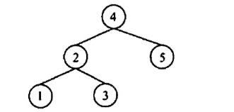

    A. {4, 2, 1, 3, 5}
    B. (4, 2, 5, 3, 1}
    C. {4, 5, 2, 1, 3}
    D. {4, 5, 1, 2, 3}

    【答案】：D

11. 含有20个结点的平衡二叉树的最大深度（）
    A. 4
    B. 5
    C. 6
    D. 7

    【答案】：C

    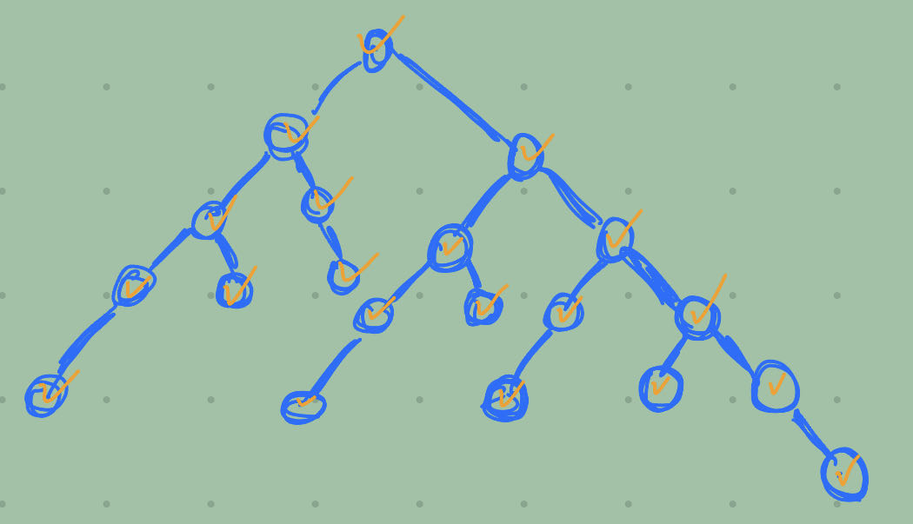

12. 具有5层结点的 AVL 至少有（）个结点
    A. 10
    B. 12
    C. 15
    D. 17

    【答案】：B

13. 下列关于红黑树的说法中，不正确的是(）
    A. **一棵含有n个结点的红黑树的高度至多为2log2(n+1）**
    B. 如果一个结点是红色的，则它的父结点和孩子结点都是黑色的
    C. 从一个结点到其子孙结点的所有路径上包含相同数量的黑结点
    D. 红黑树的查询效率一般要优于含有相同结点数的 AVL 树

    【答案】：D

14. 下列关于红黑树和 AVL 树的描述中，不正确的是（ ）。
    A. 两者都属于自平衡的二叉树
    B. 两者查找、插入、删除的时问复杂度都相同
    C. 红黑树插入和删除过程至多有2次旋转操作
    D. 红黑树的任一结点的左右子树高度之差不超过2倍

    【答案】：B -> C，递归的情况

15. 下列关于红黑树的说法中，正确的是(）。
    A. 红黑树是一种特殊的平衡二叉树
    B. 如果红黑树的所有结点都是黑色的，那么它一定是一棵满二叉树
    C. 红黑树的任何一个分支结点都有两个非空孩子结点
    D. 红黑树的子树也一定是红黑树

    【答案】：B

16. 将关键字 1,2,3,4,5,6,7依次插入初始为空的红黑树T，则了中红结点的个数是（）
    A. 1
    B. 2
    C. 3
    D. 4

    【答案】：C

    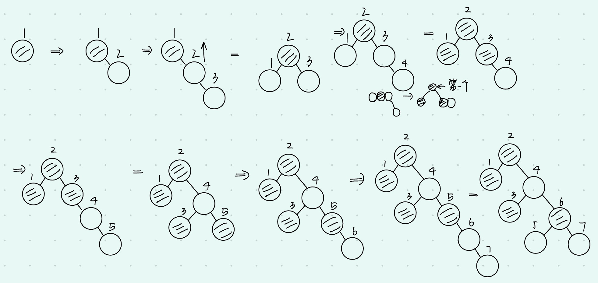

17. 将关键宇5,4,3,2,1依次插入初始为空的红黑树T，则下的最终形态是（）。

    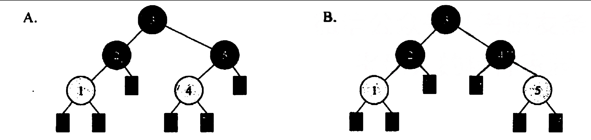

    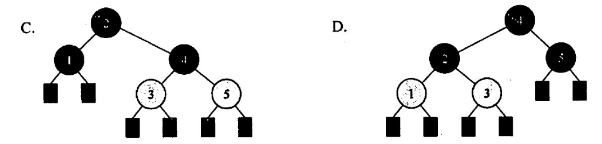

    【答案】：D

18. 【2009統考真题】下列二叉排序树中，满足平衡二叉树定义的是（ ）

    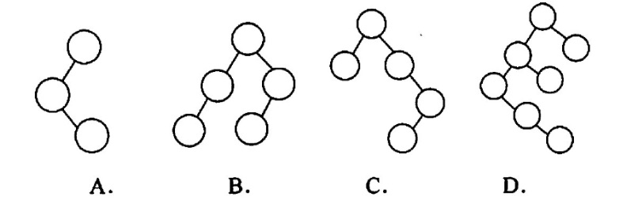

    【答案】：B

19. 【2010 统考真题】在下图所示的平衡二叉树中插入关键字 48 后得到一棵新平衡二叉树，在新平衡二叉树中，关键字 37 所在结点的左、右子结点中保存的关鍵字分别是（ ）

    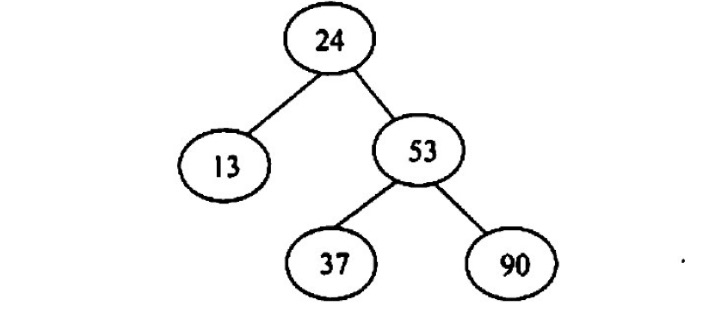

    A. 13.48
    B. 24.48
    C. 24.53
    D. 24.90

    【答案】：C

20. 【2011 统考真题】对下列关键宇序列，不可能构成某二叉排序树中一条查找路径的是（ ）。
    A. 95.22.91.24.94.71
    B. 92.20.91.34.88.35
    C. 21,89,77,29,36,38
    D. 12.25.71.68.33.34

    【答案】：A

21. 【2012 統考卖题】若平衡二叉树的高度为6，且所有非叶子结点的平衡因子均为 1，则该平衡二叉树的结点总数为（ ）。
    A. 12
    B. 20
    C. 32
    D. 33

    【答案】：B

    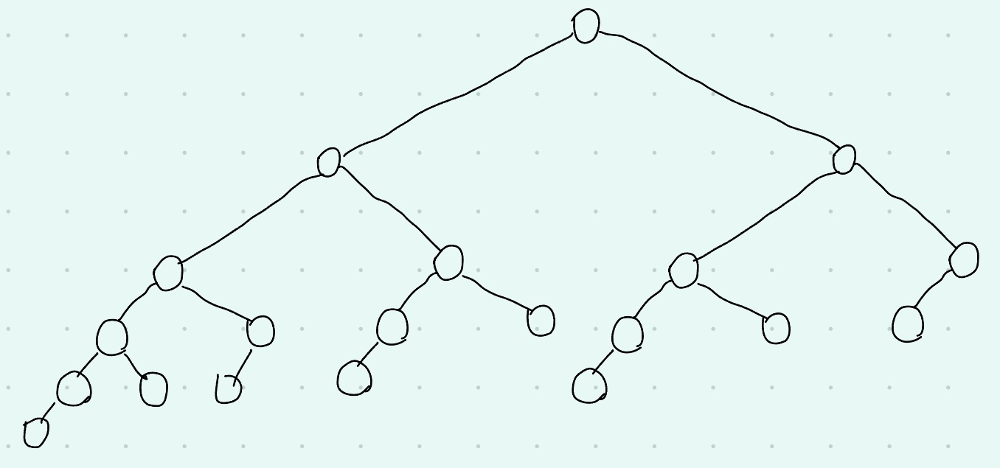

22. 【2013 统考真题】在任意一棵非空二叉排序树T1中，删除某结点v之后形成二叉排序树T2，再将v插入T2形成二叉排序树T3。下列关于T1与T3的叙述中，正确的是（ ).
    I.  若v是T1的叶结点，则T1与T3不同
    II. 若v是T1的叶结点，则T1与T3相同
    III.芳v不是T1的叶结点，则T1与T3不同
    IV. 若v不是T1的叶结点，则T1与T3相同
    A.仅I、III
    B.仅I、IV
    C.仅II、III
    D.仅II、IV

    【答案】：C

23. 【2013 統考真题】若将关键字 1,2,3,4,5,6,7依次插入初始为空的平衡二叉树T，则T中平衡因子为0的分支结点的个效结点的个数是（）
    A. 0
    B. 1
    C. 2
    D. 3

    【答案】：D

24. 【2015 统考真题】 现有一探无重复关键字的平衡二叉树(AVL树)对实进行中序遍历可得到一个降序序列。下列关于该平街二叉树的飯述中，正确的是（）。
    A. 根结点的度一定为2
    B. 树中最小元素一定是叶结
    C. 最后插入的元素一定是叶子结点
    D. 树中最大元素一定是无左子树

    【答案】：B -> D

25. 【2018 统考真题】已知二叉排序树如下图所示，元素之问应满足的大小关系是

    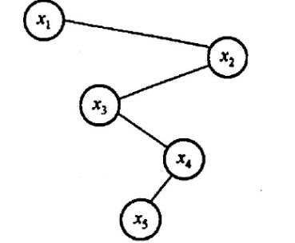

    A. x1<x2<x5
    B. x1<x4<x5
    C. x3<x5<x4
    D. x4<x3<x5

    【答案】：C

26. 【2019 统考真题】在任意一棵非空平衡二叉树（AVL树）T1中，删除某结点v之后形成平衡二叉树T2，再将v插入 T2 形成平衡二叉树T3。下列关于T1与T3的叙述中，正确的是（）
    I.若v是T1的叶结点，则T1与T3可能不相同
    II.若v不是T1的叶结点，则T1与T3一定不相同
    III.若v不是T1的叶结点，则T1与T3一定相同
    A.仅I
    B.仅II
    C.仅1II
    D.I, III

    【答案】：A

27. 【2020 统考真题】下列给定的关键宇输入序列中，不能生成右边二叉排序树的是（〉
    A. 4, 5, 2, 1, 3
    B. 4, S, 1, 2, 3
    C. 4,2,5,3,1
    D. 4,2,1.3,5

    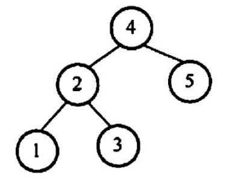

    【答案】：B

28. 【2021 统考真题】给定平街二叉树如下图所示，插入关键宇23后，根中的关键字是（，

    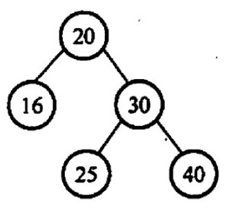

    A. 16
    B. 20
    C. 23
    D. 25

    【答案】：D

    
