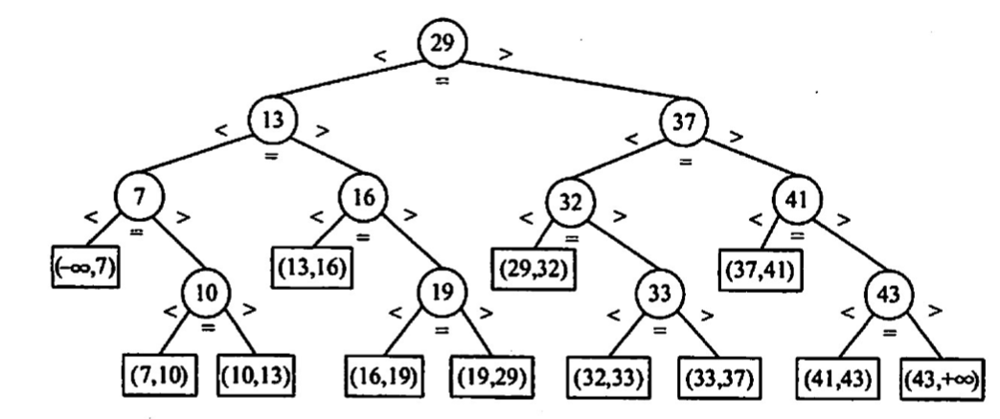
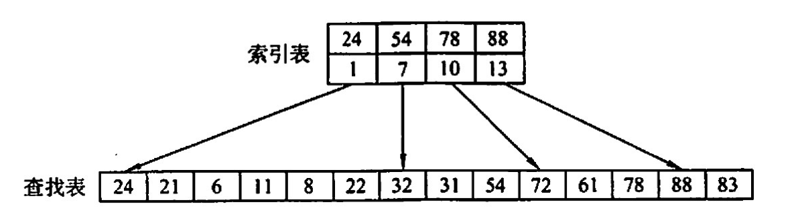
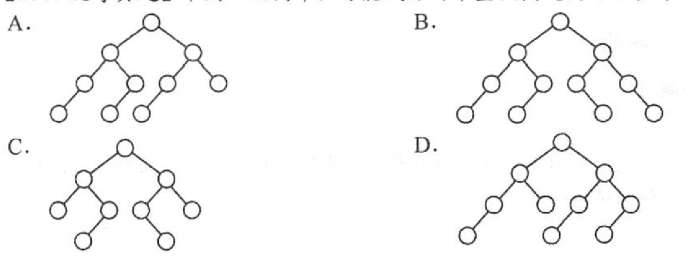

# 顺序查找和折半查找
2022.09.17

[TOC]

## 顺序查找

1. 一般线性表的顺序查找
   1. 思想：
      1. （方案1，从第一个一次对比；）
      2. 方案2(哨兵方案)，从最后一个向前查找，num[0]存放待查找的数，这样最后return 0正好代表“未找到”。
   2. $ASL_{成功}=\sum_{i=1}^n n-i+1 \to 平均ASL_{成功}=\frac{n+1}{2}$
   3. $ASL_{失败}=n+1$
2. 有序线性表的顺序查找
   1. 思想：从头到尾一个个比，注意下面这种链式存储，左边的空结点叫失败结点（是不存在的）
   2. 查找判定树
   3. $ASL_{成功}=\sum_{i=1}^n n-i+1 \to 平均ASL_{成功}=\frac{n+1}{2}$
   4. $ASL_{失败}=\frac{1+2+\cdots+n+n}{n+1}$

## 折半查找

又叫二分查找，仅用于有序存放的顺序表

1. 思路：low，mid，high分别指向最低，中间，最高。根据mid结点与查找结点的大小关系，判断下一次low，mid，high位置。

2. 折半查找的过程——判定树——平衡二叉树

   

3. $ASL_{成功}=\frac{1}{n}\sum_{i=1}^n(1\times1+2\times2+\cdots+2^h\times h)=\frac{n+1}{n}log_2 (n+1)-1$

4. $h = \lceil \log_2(n+1) \rceil$

## 分块查找

1. 思路：块间有序，块内无序。块间采用顺序查找或折半查找找到某一个块，然后对着一个块用顺序查找。

2. 

3. 设索引表和查找表长度为 $L_l$ 和 $L_s$ ：

   块间顺序查找：$ASL = \frac{b+1}{2}+\frac{s+1}{2}$，b个块，块内s个元素

   块间折半查找：$ASL = \lceil \log_2(b+1) \rceil+\frac{s+1}{2}$

4. **最理想的块长**：$\sqrt{n}$

## 例题

1. 顺序查找适合于存储结构为（）的线性表。
   A. 顺序存储结构或链式存储结构
   B. 散列存储结构
   C. 索引存储结构
   D.压缩存储结构

   【答案】：A

2. 由n个数据元素组成的两个表：一个递增有序，一个无序。采用顺序查找算法，对有序表从头开始查找，发现当前元素已不小于待查元素时，停止查找，确定查找不成功，已知查找任一元素的概率是相同的，则在两种表中成功查找（）。
   A.平均时问后者小
   B. 平均时问两者相同
   C. 平均吋间前者小
   D.无法确定

   【答案】：B

3. 对长度为n的有序单链表，若查找每个元素的概率相等，则顺序查找表中任一元素的查找成功的平均查找长度为（）。
   A. n/2
   B. (n+1)/2
   C. （n-1)/2
   D. n/4

   【答案】：B

4. 对长度为3的顺序表进行查找，若查找第一个元素的概率为 1/2，查找第二个元素的概率为1/3，查找第三个元素的概率为 1/6，则查找任一元素的平均查找长度为（）。
   A. 5/3
   B. 2
   C. 7/13
   D. 4/3

   【答案】：A

5. 下列关于二分查找的叙述中，正确的是（）。
   A. 表必须有序，表可以顺序方式存储，也可以链表方式存储
   B. 表必须有序且表中数据必须是整型、实型或宇符型
   C.表必须有序，而且只能从小到大排列
   D.表必须有序，且表只能以顺序方式存储

   【答案】：A -> D

6. 在一个顺序存储的有序线性表上查找一个数据时，既可以采用折半查找，也可以来用顺序查找，但前者比后者的查找速度（）
   A. 必然快
   C在大部分情況下要快
   B. 取决于表是递增还是递減
   D. 必然不快

   【答案】：C

7. 折半查找过程所对应的判定树是一棵（ ）。
   A.最小生成树 
   B. 平衡二叉树
   C.完全二叉树
   D.满二叉树

   【答案】：B

8. 折半查找和二叉排序树的时问性能（）。
   A. 相同
   B. 有时不相同
   C.完金不同
   D无法比较

   **【答案】**：A -> B，因为二叉排序树性能和输入时间有关

9. 在有11个元素的有序表A[1,2,..,11]中进行折半查下取整{L(low+high)/21}，查找元素A[11]时，被比较的元素下标依次是（）。
   A. 6.8.10.11
   B. 6.9.10.11
   C. 6,7,9,11
   D. 6.8.9.11

   【答案】：B

10. 已知有序表(13,18,24, 35,47,50，62，83,90，115，134)，当二分查找值为90的元素时，查找成功的比较次数为（）.
    A 1
    B2
    C4
    D6

    【答案】：B

    | 1    | 2    | 3    | 4    | 5    | 6    | 7    | 8    | 9    | 10   | 11   |
    | ---- | ---- | ---- | ---- | ---- | ---- | ---- | ---- | ---- | ---- | ---- |
    | 13   | 18   | 24   | 35   | 47   | 50   | 62   | 83   | 90   | 115  | 134  |

    (1+11)/2=6

    (7+11)/2=9

11. 对表长为n的有序表进行折半查找，其判定树的高度为（  ）。
    A. 上取整{1og2(n+1)}
    B.  下取整{1og2(n+1)}-1
    C. 上取整{1og2(n)}
    D. 下取整{1og2(n+1)}-1

    【答案】：A

12. 已知一个长度为 16的顺序表，其元素按关键宇有序排列，若来用折半查找算法查找一个不存在的元素，则比较的次数至少是（)，至多是( )。
    A. 4
    B. 5
    C. 6
    D. 7

    【答案】：AB

13. 具有12个关键字的有序表中，对每个关键字的查找概率相同，折半查找算法查找成功的平均查找长度为（ ），折半查找查找失败的平均查找长度为（ ）。
    A. 37/12
    B. 35/12
    C. 39/13
    D. 49/13

    【答案】：AD

14. 来用分块查找时，数据的组织方式为（ ）
    A数据分成若干块，每块内数据有序
    B. 数据分成若干块，每块内数据不必有序，但块间必须有序，每块内最大（或最小）的数据组成索引块
    C.数据分成若干块，每块内数据有序，每块内最大（或最小）的数据组成索引块
    D.数据分成若干块，每块(除最后一块外）中数据个数需相同

    【答案】：B

15. 对有2500个记录的索引顺序表（分块表）进行查找，最理想的块长为（）.
    A. 50
    B. 125
    C. 500
    D.上取整{log2 2500}

    **【答案】**：D -> A

16. 设顺序存储的菜线性表共有123 个元素，按分块查找的要求等分为了快。若对索引表采用顺序查找法来确定子块，且在确定的子块中也采用顺序查找法，则在等概率情况下，分块查找成功的平均查找长度为（ ）.
    A. 21
    B. 23
    C. 41
    D. 62

    【答案】：B

17. 为提高查找效率，对有65025 个元素的有序顺序表建立索引顺序结构，在最好情况下查找到表中已有元素最多需要执行（）次关键字比较。
    A. 10
    B. 14
    C. 16
    D. 21

    **【答案】**：$\sqrt{65025}=255$，上取整{log_2 255+1}=16

18. 【2010 统考真题】已知一个长度为16的顺序表工，其元泰按关键字有序排列，若采用折半查找法查找一个工中不存在的元素，则关键字的比较次数最多是(）
    A.4
    B. 5
    C. 6
    D. 7

    【答案】：B

19. 【2015 统考真题】下列选项中，不能构成折半查找中关键字比较序列的是（）.
    A. 500, 200, 450, 180
    B. 500, 450, 200, 180
    C. 180, 500, 200, 450
    D. 180, 200, 500, 450

    【答案】：A

20. 【2016 统考真题】在有n (n>1000）个元素的升序数组A中查找关键字x。查找算法的伪代码如下所示

    ```C
    k=0;
    while(k<n && A[k]<x) k += 3;
    if(k<n && A[k]==x) 查找成功;
    else if(k-1<n && A[k-1]==x) 查找成功;
    else 查找失败;
    ```

    本算法与折半查找算法相比，有可能具有更少比较次数的情形是（）
    A. 当x不在数组中
    B.当×接近数组开头处
    C.当×接近数组结尾处
    D.当x位于数组中间位置

    【答案】：B

21. 【2017 统考真题】下列二叉树中，可能成为折半查找判定树（不含外部结点）的是（）。

    

    【答案】：A

22. 【2013 统考真题】设包含4 个数据元素的集合S= {'do','for,'repeat', 'while'}，各元素的查找概率依次为p1=0.35, p2=0.15, p3=0.15, p4=0.35. 将 S保存在一个长度为4的顺序表中，来用折半查找法，查找成功时的平均查找长度为 2.2。
    1）若来用顺序存储结构保存S，且要求乎均查找长度更短，则元素应如何排列？应使用何种查找方法？查找成功时的平均查找长度是多少？
    2）若来用链式存储结构保存S，且要求平均查找长度更短，则元素应如何排列？应使用何种查找方法？查找成功时的平均查找长度是多少？

    【答案】：

    1. 原来的折半查找：

       {'do','for,'repeat', 'while'}->{'d','f','r','w'}

       0.15+0.7+0.3+1.05 = 2.2

       新的折半查找：【这个是我原创的，答案方法是顺序查找】

       {'while','do','for,'repeat'}，设每个字符串的第一个字符为`c`，通过对比`(int)c%(int)'w'`，来进行折半查找。

       0.35+0.7+0.3+0.45=1.8

    2. 如果采用顺序查找，顺序为{'do','while','for,'repeat'}，查找成功的平均查找长度为2.1【还有更好的方法：二叉排序树】