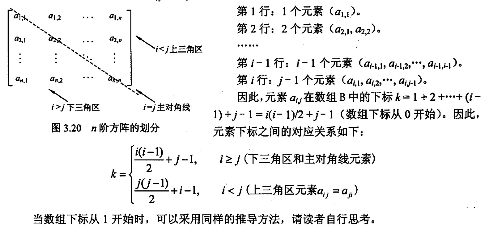
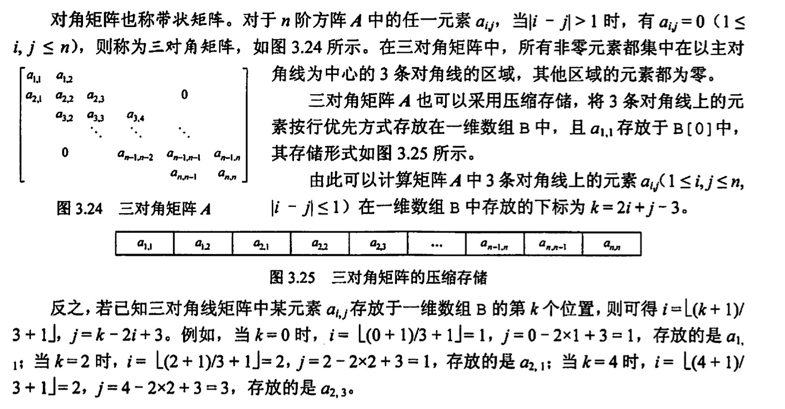
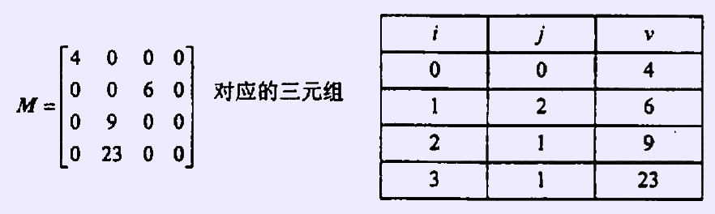

# 数组和特殊矩阵
2022.09.12

[TOC]

## 知识点

1. 对称矩阵

   

2. 三角矩阵

   

3. 三对角矩阵

   

4. 稀疏矩阵

   

## 例题

1. 对特殊矩阵来用压缩存储的主要目的是（ ）。
   A. 表达变得简单
   B. 对矩阵元素的存取变得简单
   C. 去掉矩阵中的多余元素
   D. 减少不必要的存储空间

   【答案】：D

2. 对n阶对称矩阵压缩存储时，需要表长为（ ）的顺序表。
   A. n/2
   B. nxn/2
   C. n(n + 1)/2
   D. n(n - 1)/2

   【答案】：C

3. 有一个nxn的对称矩阵 A，将其下三角部分按行存放在一维数组B中，而A\[0\]\[0\]存放于B[0]中，则第计i+1行的对角元素A\[i\]\[i\]存放于B中的（ ）处。
   A. (i+ 3)i/2
   B. (i+ 1)i/2
   C. (2n -i+ 1)i/2
   D.（2n- i- 1)i/2

   【答案】：A
   $$
   (i+2)(i+1)/2-1=(i^2+3i)/2
   $$

4. 在一个二维数组A中，假设每个数组元素的长度为3个存储单元，行下标i为 0~8，列下标j为0-9，从首地址SA开始连续存放。在这种情況下，元素A\[8\]\[5\]的起始地址为（）。
   A. SA+141
   B. SA+144
   C. SA+222
   D. SA+255

   【答案】：8\*10+6-1 = 85，85\*3 = 255，D

5. 将三对角矩阵 A\[1..100\]\[1..100\]按行优先存入一维数组B\[1..298\]中，A中元素A\[66\]\[65\]在数组B中的位置k为（ ）。
   A. 198
   B. 195
   C. 197
   D. 196

   【答案】：65\*3-1=194，B

6. 若将n阶上三角矩阵A 按列优先級压缩存放在一维数组B[1...n(n+1)/2+1]中，则存放到B\[k\]中的非零元素a\_{ij}的下标i、j与k的对应关系是( )。
   A. i(i+ 1)/2+j
   B. i(i-1)/2+j-1
   C. j(j-1)/2+i
   D. j(i- 1)/2+i-1

   【答案】：C

7. 若将么阶下三角矩阵A按列优先顺序压缩存放在一维数组B[1...n(n+1)/2+1]中，则存放到B[k]中的非零元素a\_{ij}的下标ij与k的对应关系是(）

   【答案】：k = (n + (n-j+2))(j-1)/2 + i-(j-1) = (2n+2-j)(j-1)/2 + i-j+1 

8. 【2016统考真题】有一个100阶的三对角矩阵M，其元素ms (1≤ij≤100）按行优先依次压缩存入下标从0开始的一维数组的中。元素m[30].[30] 在W中的下标是()
   A. 86
   B. 87
   C. 88
   D. 89

   【答案】：29\*3-1 = 86，B

9. 【2017 统考真题】适用于压缩存储稀疏矩阵的两种存储结构是（）
   A. 三元组表和十字链表
   B. 三元组表和邻接矩阵
   C. 十字链表和二叉链表
   D. 邻接矩阵和十字链表

   【答案】：A

10. 【2018 統考真题】设有一个 12x12的对称矩阵从，将其上三角部分的元素mij(1≤i≤j≤12）按行优先存入C语言的一维数组的中，元秦m[6].[6]在N中的下标是（）.
    A. 50
    B. 51
    C. 55
    D. 66

    【答案】：(12+8)\*5/2 +1 = 51，A

11. 【2020 统考真题】将一个 10×10对称短阵 M的上三角部分的元素 m; (1≤i≤i≤ 10）拔列优先存入C语言的一维数组 N中，元素m[7] [2]在N中的下标是（ ）

    A. 15
    B. 16
    C. 22
    D. 23

    【答案】：m[2] [7] = (1 + 6)\*6/2 + 2 = 23，C

12. 【2021 统考真题】二维数组 A 按行优先方式存储，每个元素占用1个存储单元。若元素A[O] [O]的存储地址是100，A[3] [3]的存储地址是220，则元素 A[5] [5]的存储地址是(）。
    A. 295
    B. 300
    C. 301
    D. 306

    【答案】：3n+4-1 = 3n+3 = 120 -> n=39

    5n+5 +100=  105+195 = 300，B