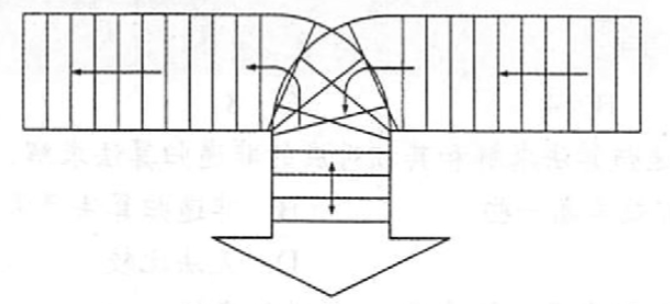

# 栈和队列的应用
2022.09.12

[TOC]

## 栈在括号匹配中的应用

```C++
#include<stdio.h>
#include<stdbool.h>
#include<string.h>
#define MaxSize 20
typedef struct{
	char data[MaxSize];
	int top;
}SqStack;

// 初始化
void InitStack(SqStack &S){
	S.top=-1;
}

// 判断栈是否为空
bool EmptyStack(SqStack S){
	return S.top==-1;
}

// 入栈
bool Push(SqStack &S, char x){
	return S.top==MaxSize-1 ? false : S.data[++S.top]=x;
}

// 出栈
bool Pop(SqStack &S,char &x){
	return S.top==-1 ? false : x=S.data[S.top--];
}

/*
考试时这样写
#define MaxSize 20
typedef struct{
	char data[MaxSize];
	int top;
}SqStack;

// 初始化栈
void InitStack(SqStack &S)

// 判断栈是否为空
bool EmptyStack(SqStack S)

// 入栈
bool Push(SqStack &S,char x)

// 出栈
bool Pop(SqStack &S,charchar &x)

*/

bool BracketCheck(char str[]){
	SqStack S;
	InitStack(S);
	char x;
	for(int i=0;i<strlen(str);i++){
		printf("%c",str[i]);
		if(str[i]=='('||str[i]=='['||str[i]=='{')
			Push(S,str[i]);
		if(str[i]==')'||str[i]==']'||str[i]=='}'){
			if(EmptyStack(S))
				return false;
			Pop(S,x);
			if(str[i]==')' && x!='(') return false;
			if(str[i]==']' && x!='[') return false;
			if(str[i]=='}' && x!='{') return false;
		}
	}
	return EmptyStack(S);
}

int main(){
	char *a;
	strcpy(a,"{}[]");
	printf("\n判断匹配: %d\n",BracketCheck(a));
	return 0;
}
```

## 栈在表达式求值中的应用

> 精要总结：
>
> 1. 中缀转前缀表达式，左优先
> 2. 中缀转后缀表达式，右优先
> 3. 后缀计算：1 2 +，看到运算符，弹出两个数计算；看到数字，压入栈中
> 4. 前缀计算：+ 1 2，看到第二个数字，弹出运算符；看到运算符，压入栈中

下面是中缀转后缀的C语言实现

```C++
int GetPriority(char c){
    switch (c) {
        case '(': return 0;
        case '+': return 1;
        case '-': return 1;
        case '*': return 2;
        case '/': return 2;
        case ')': return 3;
    }
    printf("Wrong!\n");
    return -1;
}

char* ToInversePoland(char c0[]){
	/*
	1. 遇到操作数 ->加入后缀表达式
	2. 遇到‘(’入栈, 遇到‘)’依次弹出站内运算符加入后缀表达式直到‘(’. (注意, 括号不入后缀表达式)
	3. 遇到运算符.  依次弹出运算及高于或等于当前运算符的所有运算符, 直到括号或栈空为止. 然后把当前运算符入栈. 
	4. 处理完所有字符后, 把栈中运算符依次弹出. 
	*/
    char c[64] = "(";
    strcat(c,c0);
    strcat(c,")");
    static char InversePo[64] = ""; // 后缀表达式
    int index = 0;
    LinkStack stack;
    LinkStackInit(stack);
    Element e;
    for(int i=0; i<strlen(c);i++){
        if('0'<=c[i]&&c[i]<='9'){
            InversePo[index++] = c[i];
        }else if(c[i]=='('){
            LinkStackEn(stack, ele_build((int)c[i]));
        }else if(c[i]==')'){
            while(LinkStackDe(stack,e)){
                if(ele_get_weight(e)!='(')
                    InversePo[index++] = (char)ele_get_weight(e);
                else break;
            }
        }else if(c[i]=='+'||c[i]=='-'||c[i]=='*'||c[i]=='/'){
            while(LinkStackGet(stack,e)){
                if(GetPriority((char)ele_get_weight(e))< GetPriority(c[i]))break;
                LinkStackDe(stack,e);
                if((char)ele_get_weight(e) != '(')
                    InversePo[index++] = (char)ele_get_weight(e);
            }
            LinkStackEn(stack, ele_build((int)c[i]));
        }else{
            return NULL;
        }
    }
    InversePo[index]='\0';
    return InversePo;
}

int main(){
  char s1[] = "1+(1+2)/3+(2-1)\0";
  printf("中缀转后缀 %s = %s\n",s1,ToInversePoland(s1));
  // 中缀转后缀 1+(1+2)/3+(2-1) = 112+3/+21-+
}
```


## 栈在递归中的应用

略

## 栈在层次遍历中的应用

略

## 例题

1. 栈的应用不包括（ ）。
   A. 递归
   B. 进制转换
   C. 迷宫求解
   D. 缓冲区

   【答案】：D

2. 表达式a\*(b+c)-d的后缀表达式是（ ）。
   A. abcd\*+-
   B. abc+\*d-
   C. abc\*td-
   D. -+\*abcd

   【答案】：abc+*d-，B

3. 下面（ ）用到了队列．
   A.括号匹配
   B.迷宫求解
   C.页面替换算法 
   D.递归

   【答案】：C

4. 利用栈求表达式的值时，设立运算数栈 OPEN。假设 OPEN 只有两个存储单元，则在下列表达式中，不会发生溢出的是( )。
   A. A-B\*(C-D)
   B. (A-B)\*C-D
   C. (A-B\*C) -D
   D. (A-B)\*(C-D)

   【答案】：

   A：[AB] [-*(]，溢出

   B：[{A-BC*-D-}] [] -> B

5. 执行完下列语句段后，i 的值为（ ）。
   ```C++
   int f(int x) (
     return ((x>0) ? x*f(x-1) : 2);
   }
   int i;
   i=f(f(1));
   ```

   A. 2
   B. 4
   C. 8
   D. 无限递归

   【答案】：B

   ```mermaid
   stateDiagram-v2
   f(f(1))=f(2)[4] --> f(1)[2]
   f(1)[2] --> f(0)[2]
   f(f(1))=f(2)[4] --> f(1)[2]
   ```

6. 对于一个问题的递归算法求解和其相对应的非递归算法求解，( )。
   A. 递归算法通常效率高一些
   B. 非递归算法通常效率高一些
   C. 两者相同
   D. 无法比较

   【答案】：B

7. 执行函数时，其局部变量一般来用（ ）进行存储。
   A. 树形结构
   B.静态链表
   C.栈结构
   D.队列结构

   【答案】：C

8. 执行（ ）操作时，需要使用队列作为辅助存储空间。
   A. 查找散列（哈希）表
   B. 广度优先搜索图
   C. 前序（根）遍历二叉树
   D. 深度优先搜索图

   【答案】：B

9. 下列说法中，正确的是（ ）。
   A. 消除递归不一定需要使用栈
   B. 对同一输入序列进行两组不同的合法入栈和出栈组合操作，所得的输出序列也一定相同
   C. 通常使用队列来处理函数或过程调用
   D.栈和队列都是受限的线性表。只允许在表的两边进行运算

   【答案】：A

10. 【2009 统考真题】为解決计算机主机与打印机速度不匹配的问题：通常路置一个打印数据缓冲区，主机将要输出的数据依次写入该缓沖区，而打印积则依天从该缓沖区中取出数据。该缓冲区的逻辑结构应该是（ ）。
    A. 栈
    B. 队列
    C. 树
    D. 图

    【答案】：B

11. 【2012 统考真题】已知操作符包括`+`,`-`,`*`,`/`,`(`,`)`。将中级表达式 `a+b-a*((c+d)/e-f)+g`转换为等价的后级表达式 `ab+acd+e/f-*-g+`时，用栈来存放暂时还不能确定运算次序的操作符。栈初始时为空时，转换过程中同时保存在栈中的操作符的最大个数是( )。
    A. 5
    B. 7
    C. 8
    D. 11

    【答案】：`+g`,max: 5

    []

    ab+acd+e/f-*-g+

    A

12. 【2014 统考真题】假设栈初始为空，将中缀表达式`a/b+(c*d-e*f)/g`转换为等价的后缀表达式的过程中，当扫描到f时，栈中的元素依次是( )。
    A. +(\*-
    B. +(-\*
    C. /+(\*-\*
    D. /+-\*

    【答案】：`f)/g`，B

    [+(-\*]

    ab/cd*e

13. 【2015统考真题】己知程序如下：

    ```C++
    int S(int n)
    	return (n<=0) ? 0 : s(n-1)+n;
    void main()
      cout<< S(1);
    ```

    程序运行时使用栈来保存调用过程的信息，自栈底到栈顶保存的信息依次对应的是(）。
    A. main()-s(1)-s(0)
    B. S(0) -S(1) -main()
    C. main()-s(0)-S(1)
    D. S(1) -S (0) -main ()

    【答案】：[main() - S(1) - S(0)]，A

14. 假设一个算术表达式中包含圆括号、方括号和花括号3种类型的括号，编写一个算法来判别表达式中的括号是否配对，以字符"\0" 作为算术表达式的结束符.

    ```C++
    bool valid(char c[]){
      Stack S;
      for(int i;i<strlen(c);i++){
        if(c[i]=='('||c[i]=='['||c[i]=='{')
          Push(S,c[i]);
        else if(c[i]==')')
          if(Pop(S)!='(') return false;
        else if(c[i]==']')
          if(Pop(S)!='[') return false;
        else if(c[i]=='}')
          if(Pop(S)!='{') return false;
      }
      return IsEmpty(S);
    }
    ```

    

15. 按下图所示铁道进行车厢调度（注意，两侧铁道均为单向行驶道，火车调度站有一个用于调度的“栈道”），火车调度站的入口处有n节硬座和软座车厢（分别用H和S 表示）等待调度，试编写算法，输出对这n节车厢进行调度的操作(即入栈或出栈操作）序列，以使所有的软座车厢都被调整到硬座车厢之前。

    

    ```C++
    void Transform(LinkList &L, LNode *S, LNode *H,int n){
      Stack T;
      for(int i; i<n; i++)
        if(IsH(GetItemByIndex(L,i))) 
          Push(T,PopItemByIndex(L,i);
      while(!IsEmpty(T))
        AddItemAtLast(L,Pop(T));
    }
    ```

16. 利用一个栈实现以下递归函数的非递归计算：

    Pn = 1, n=0
    Pn = 2x, n=1
    Pn = 2xP\_{n-1}(x) - 2(n-1)P\_{n-2}(x), n>1

    ```C++
    int f(n,x){
      if(n==0) return 1;
      if(n==1) return 2*x;
      return 2*f(n-1,x) - 2*(n-1)f(n-2,x);
    }
    
    typedef struct {
      int index;
      int value;
    } Element;
    
    int f(n,x){
      Stack S;
      Element e;
      int index;
      int ans1=1;
      int ans2=2*x;
      for(int i=n;i>2;i--){
        Push(S,{i:index++});
      }
      while(!IsEmpty(S)){
        e = Pop(S);
        e.value = 2*x*ans2 -(e.index - 1)*ans1;
        ans1 = ans2;
        ans2 = e.value;
      }
      if(n==0) return ans1;
      return ans2;
    }
    ```

    
