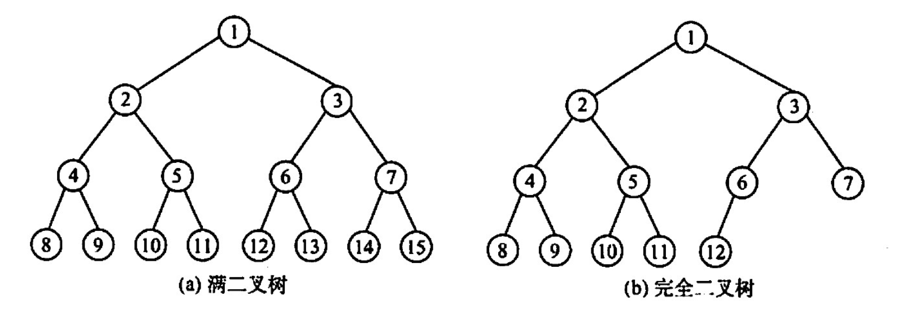

# 二叉树的概念
2022.12.10

[TOC]

## 基本概念

* 满二叉树与完全二叉树

  

  * **分支结点：$i≤\lfloor \frac{n}{2} \rfloor$**

* 二叉排序树

* 平衡二叉树：左右子树深度不超过一

* 二叉树的性质：

  * **非空二叉树叶子结点树n0 = 度为2的结点数n2 + 1**
    $$
    n_0 = n_2+1
    $$

  * 非空二叉树第k层上最多有2^k个结点

  * i的左孩子为2i

  * i的右孩子为2i+1

  * 结点i的深度 = $\lfloor \log_2i \rfloor+1$

* 二叉树的顺序存储

  * i的左孩子是2i
  * i的右孩子是2i+1
  * 不是二叉树不能用顺序存储

* 二叉树的链式存储

  * **n个结点的二叉链表有n+1个空链域** 「n+1 = 2n-(n-1)」

## 例题

1. 下列关于二叉树的说法中，正确的是（ ）
   A. 度为2的有序树就是二叉树
   B. 含有n个结点的二叉树的高度为$\lfloor \log_2n \rfloor+1$
   C. 在完全二叉树中，若一个结点没有左孩子，则它必是叶结点
   D. 在任意一棵非空二叉排序树中，删除某结点后又将其插入，则所得二叉排序树与删除前原二叉排序树相同

   【答案】：C

2. 以下说法中，正确的是（ ）。
   A. 在完全二叉树中，叶子结点的双亲的左兄弟（若存在）一定不是叶子结点
   B. 任何一棵二叉树，叶子结点个数为度为2的结点数减1，即n0=n2-1
   C. 完全二叉树不适合顺序存储结构，只有满二叉树适合顺序存储结构
   D. 结点按完全二叉树层序编号的二叉树中，第i个结点的左孩子的编号为2i

   【答案】：A

3. 具有10个叶子结点的二叉树中有（ ）个度为2的结点。
   A. 8
   B. 9
   C. 10
   D. 11

   【答案】：B

4. 设高度为h的二叉树上只有度为0和度为2的结点，则此类二叉树中所包含的结点数至少为（ ）
   A. h
   B. 2h - 1
   C. 2h+1
   D. h+1

   【答案】：B

5. 假设一棵二叉树的结点个数为 50，则它的最小高度是( )。
   A. 4
   B. 5
   C. 6
   D. 7

   【答案】：C

6. 设二叉树有2n个结点，且m＜n，则不可能存在（ ）的结点。
   A. n个度为0
   B. 2m个度为0
   C. 2m个度为1
   D. 2m个度为2

   **【答案】**：D -> C

7. 一个具有1025个结点的二叉树的高h为（）。
   A. 11
   B. 10
   C. 11~ 1025
   D. 10~1024

   【答案】：C

8. 设二叉树只有度为0和2的结点，其结点个数为 15，则该二叉树的最大深度为( )。
   A. 4
   B. 5
   C. 8
   D. 9

   【答案】：C

9. 高度为h的完全二叉树最少有（ ）个结点。
   A. 2^h
   B 2^h+1
   C 2^{h-1}
   D. 2^h-1

   【答案】：C

10. 已知一棵完全二叉树的第6层（设根为第1层）有8个叶结点，则完全二叉树的结点个数最少是（）。
    A.39
    B. 52
    C. 111
    D. 119

    【答案】：A

11. 若一棵深度为6的完全二叉树的第6层有3个叶子结点，则该二叉树共有（ ）个叶子结点
    A. 17
    B. 18
    C. 19
    D 20

    【答案】：A

12. 一颗完全二叉树上有1001个结点，其中叶结点的个数是（ ）
    A. 250
    B. 500
    C. 254
    D. 501

    【答案】：D

13. 若一颗二叉树有126个结点，在第7层（根结点在第1层）至多有（ ）个结点。
    A. 32
    B. 64
    C. 63
    D. 不存在第7层

    【答案】：C

14. 一棵有 124 个叶子结点的完全二又树，**最多**有（ ）个结点。
    A. 247
    B. 248
    C. 249
    D. 250

    **【答案】**：A -> B，因为加一个左孩子，叶子结点个数不变！

15. 一棵有n个结点的二叉树来用二叉链存储结点，其中空指针为（ ）
    A. n
    B. n+1
    C. n-1
    D. 2n

    【答案】：B

16. 在一棵完全二叉树中，其根的序号为1，（ ）可判定序号为p和q的两个结点是否在同一层。
    A.  $\lfloor \log_2p \rfloor$ =  $\lfloor \log_2q \rfloor$
    B.  $\log_2p$ =  $\log_2q$
    C. $\lfloor \log_2p\rfloor+1$ =  $\lfloor \log_2q \rfloor$
    D.  $\lfloor \log_2p\rfloor$ =  $\lfloor \log_2q \rfloor+1$

    【答案】：A

17. 假定一棵三叉树的结点数为50，則它的最小高度为（ ）。
    A. 3
    B. 4
    C. 5
    D. 6

    【答案】：C

18. 已知一採有2011 个结点的树，其叶结点个数是116，该树对应的二叉树中无右孩子的结点个数是（ ）。
    A. 115
    B. 116
    C. 1895
    D. 1896

    【答案】：D

19. 对于一棵满二叉树，共有n个结点和m个叶子结点，高度为h，则（ ）。
    A. n=h+m
    B.n+m=2h
    C.m=h-1
    D. n=2^h -1

    【答案】：D

20. **【2009 统考真题】**已知一棵完全二叉树的第6层（设根为第1层）有8个叶结点，则该完全二叉树的结点个数最多是(）
    A. 39
    B. 52
    C. 111
    D. 119

    【答案】：A -> C。第六层可以全满，然后通过接第七层，让第六层只剩8个叶子结点！

21. 【2011 統考真题】若一棵完全二叉树有768个结点，则该二叉树中叶结点的个数是(）.
    A. 257
    B. 258
    C. 384
    D. 385

    【答案】：C

22. 【2018 统考真题】设一棵非空完全二叉树T的所有叶结点均位于同一层，且每个非叶结点都有2个子结点。若T有k个叶结点，则T的结点总数是（ ）。
    A. 2k-1
    B. 2k
    C. k^2
    D. 2^k - 1

    【答案】：A

23. 【2020 统考真题】对于任意一棵高度为 5且有10个结点的二叉树，若来用顺序存储结构保存，每个结点占 1个存储单元（仅存放结点的数据信息），则存放该二叉树需要的存储单元数量至少是（）.
    A. 31
    B. 16
    C. 15 
    D. 10

    【答案】：A