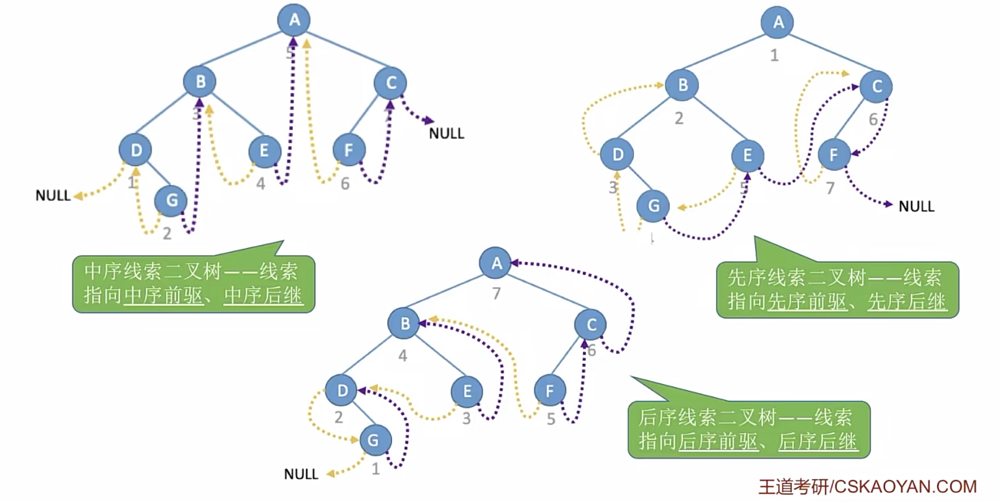
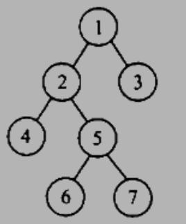
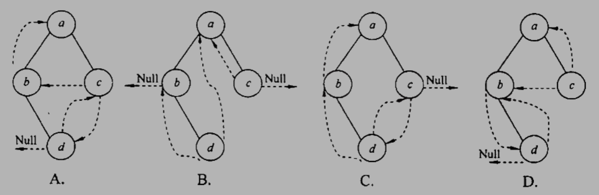
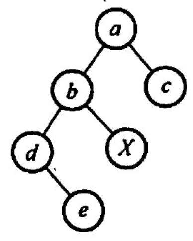
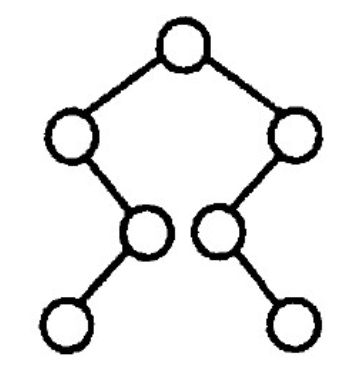
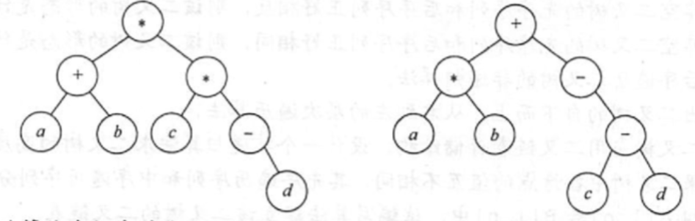

# 二叉树的遍历和线索二叉树
2022.09.14

[TOC]

## 二叉树的遍历

```C
void PreOrder(BiTree T){
   if(T!=NULL){
      visit(T);
      PreOrder(T->lchild);
      PreOrder(T->rchild);
   }
}

void MidOrder(BiTree T){
   if(T!=NULL){
      MidOrder(T->lchild);
      visit(T);
      MidOrder(T->rchild);
   }
}

void LastOrder(BiTree T){
   if(T!=NULL){
      LastOrder(T->lchild);
      LastOrder(T->rchild);
      visit(T);
   }
}

void LevelOrder(BiTree T){
    if(T==NULL) return;
    LinkQueue Q;
    LinkQueueInit(Q);
    BiTree p;
    Element e;
    LinkQueueEn(Q, ele_build((long int)T));
    while(!LinkQueueEmpty(Q)){
        // 出队
        LinkQueueDe(Q,e);
        p = (BiTree)ele_get_weight(e);
        // 访问出队结点
        visit(p);
        // 左右孩子入队
        if(p->lchild!=NULL)
            LinkQueueEn(Q, ele_build((long int)(p->lchild)));
        if(p->rchild!=NULL)
            LinkQueueEn(Q, ele_build((long int)(p->rchild)));
    }
}
```

## 线索二叉树

> 我的理解：
>
> 当遍历的时候，如果从头开始，无论是左中右都能找到，但如果从树中间某一结点遍历，有可能指向上边的结点。有左右孩子的结点的下一个一定能找到，没左右孩子的下一个会指向上边，利用线索二叉树就也能找到。



```C
#include<stdio.h>
#include<stdbool.h>
#include<stdlib.h>
typedef struct ThreadNode
{
	int data;
	struct ThreadNode *lchild,*rchild;
	bool ltag,rtag; // 左右线索标志
	struct ThreadNode *parent; // 变成了 三叉链表
}ThreadNode,*ThreadTree;

// 全局变量pre,指向当前访问结点的前驱
ThreadNode *_pre = NULL;


/**
 * Part 1
 * 
 * Construct Test Tree
 * 
 */


ThreadNode* NewNode(int data){
	ThreadNode *T = (ThreadNode*)malloc(sizeof(ThreadNode));
	if(T==NULL){
		//printf("Memory run out!");
		return NULL;
	}else{
		//printf("Put [%d] at %p\n",data,T);
	}
	T->data = data;
	T->lchild = NULL;
	T->rchild = NULL;
	T->ltag = false;
	T->rtag = false;
	T->parent=NULL;
	return T;
}

ThreadTree LeftInsert(ThreadTree T, int data){
	if(T==NULL)
		return T;
	ThreadNode *p = NewNode(data);
	T->lchild=p;
	T->lchild->parent=T;
	return T;
}

ThreadTree RightInsert(ThreadTree T, int data){
	if(T==NULL)
		return T;
	ThreadNode *p = NewNode(data);
	T->rchild=p;
	T->rchild->parent=T;
	return T;
}

ThreadTree ThreadTestInit(){
	ThreadTree T = NewNode(1);
	LeftInsert(T,2);
	RightInsert(T,3);
	LeftInsert(T->lchild,4);
	RightInsert(T->lchild,5);
	LeftInsert(T->rchild,6);
	RightInsert(T->lchild->lchild,7);
	printf("\n初始化:\n"
		"      A-1\n"
		"     /   \\\n"
		"    B-2   C-3\n"
		"   / \\     /\n"
		"  D-4 E-5 F-6\n"
		"  \\\n"
		"   G-7\n");
	return T;
}

void DeleteTree(ThreadTree &T){
	if(T!=NULL){
		if(T->ltag==0)
			DeleteTree(T->lchild);
		if(T->rtag==0)
			DeleteTree(T->rchild);
		free(T);
	}
}


/**
 * Part 2
 * 
 * Visit Function
 * 
 */


void Visit(ThreadNode *T){
	printf("%d ",T->data);
}

void TreeVisit(ThreadNode *q){
	Visit(q);
	if(q->lchild == NULL){
		q->lchild = _pre;
		q->ltag=1;
	}
	if(_pre!=NULL && _pre->rchild==NULL){
		_pre->rchild = q;
		_pre->rtag = 1;
	}
	_pre = q;
}


/**
 * Part 3
 * 
 * Pre Order Functions
 * 
 */


void PreOrder1(ThreadTree T){
	if(T!=NULL){
		Visit(T);
		if(T->ltag==0)
			PreOrder1(T->lchild);
		if(T->rtag==0)
		PreOrder1(T->rchild);
	}
}

ThreadNode *PreFirstNode(ThreadNode *p){
	return p;
}

ThreadNode *PreLastNode(ThreadNode *p){
	while(p->ltag==0 || p->rtag==0){
		if(p->rtag==0)
			p=p->rchild;
		else
			p=p->lchild;
	}
	return p;
}

ThreadNode *PreNextNode(ThreadNode *p){
	if(p->rtag==1)// 是叶子结点
		return p->rchild;
	else
		if(p->ltag==0) // 有左孩子
			return p->lchild;
		else // 有右孩子
			return p->rchild;
}

ThreadNode *PrePreNode(ThreadNode *p){
	if(p->ltag==1)
		return p->lchild;
	else{
		ThreadNode *parent = p->parent;
		if(parent==NULL) // 已经是第一个了
			return NULL;
		if(parent->lchild==p){ // p是左孩子
			return parent;
		}else if(parent->ltag==1){ // p是右孩子+无左孩子
			return parent;
		}else // p是右孩子 + 有左孩子
			return PreLastNode(parent->lchild);
	}
}

void PreOrder2(ThreadTree T){
	//for(ThreadNode *p=PreFirstNode(T);p!=NULL;p=PreNextNode(p))
	for(ThreadNode *p=T;p!=NULL;p=PreNextNode(p))
		Visit(p);
}

void PreOrder3(ThreadTree T){
	for(ThreadNode *p=PreLastNode(T);p!=NULL;p=PrePreNode(p))
		Visit(p);
}

void PreTree(ThreadTree T){
	if(T!=NULL){
		TreeVisit(T);
		if(T->ltag==0)
			PreTree(T->lchild);
		if(T->rtag==0)
			PreTree(T->rchild);
	}
}

void CreatPreTree(ThreadTree T){
	_pre = NULL;
	if(T!=NULL){
		PreTree(T);
		_pre->rchild=NULL;
		_pre->rtag = 1;
	}
}


/**
 * Part 4
 * 
 * Mid Order Functions
 * 
 */


void MidOrder1(ThreadTree T){
	if(T!=NULL){
		if(T->ltag==0)
			MidOrder1(T->lchild);
		Visit(T);
		if(T->rtag==0)
			MidOrder1(T->rchild);
	}
}

ThreadNode *MidFirstNode(ThreadNode *p){
	// 循环找到最左下结点
	while(p->ltag==0) p=p->lchild;
	return p;
}

ThreadNode *MidNextNode(ThreadNode *p){
	// 后继
	if(p->rtag==0) return MidFirstNode(p->rchild);
	else return p->rchild;
}

void MidOrder2(ThreadTree T){
	for(ThreadNode *p=MidFirstNode(T);p!=NULL;p=MidNextNode(p))
		Visit(p);
}

ThreadNode *MidLastNode(ThreadNode *p){
    // 循环找到最右下结点
    while(p->rtag==0) p=p->rchild;
    return p;
}

ThreadNode *MidPreNode(ThreadNode *p){
    // 前驱
    if(p->ltag==0) return MidLastNode(p->lchild);
    else return p->lchild;
}

void MidOrder3(ThreadTree T){
	for(ThreadNode *p=MidLastNode(T);p!=NULL;p=MidPreNode(p))
		Visit(p);
}

void MidTree(ThreadTree T){
	if(T!=NULL){
		//if(T->ltag==0)
			MidTree(T->lchild);
		TreeVisit(T);
		//if(T->rtag==0)
			MidTree(T->rchild);
	}
}

void CreatMidTree(ThreadTree T){
	_pre = NULL;
	if(T!=NULL){
		MidTree(T);
		_pre->rchild=NULL;
		_pre->rtag = 1;
	}
}

/**
 * Part 5
 * 
 * Last Order Functions
 * 
 */

void LastOrder1(ThreadTree T){
	if(T!=NULL){
		if(T->ltag==0)
			LastOrder1(T->lchild);
		if(T->rtag==0)
			LastOrder1(T->rchild);
		Visit(T);
	}
}

ThreadNode *LastFirstNode(ThreadNode *q){
	while(q->ltag==0 || q->rtag==0)
		if(q->ltag==0)
			q = q->lchild;
		else
			q = q->rchild;
	return q;
}

ThreadNode *LastLastNode(ThreadNode *q){
	return q;
}

ThreadNode *LastNextNode(ThreadNode *q){
	if(q->rtag==1)
		return q->rchild;
	ThreadNode *parent = q->parent;
	if(parent==NULL)
		return NULL;
	if(parent->rchild==q)
		return parent;
	return LastFirstNode(parent->rchild);
}

ThreadNode *LastPreNode(ThreadNode *q){
	if(q->ltag==1)
		return q->lchild;
	if(q->rtag==0)
		return q->rchild;
	else
		return q->lchild;
}

void LastOrder2(ThreadTree T){
	for(ThreadNode *q=LastFirstNode(T);q!=NULL;q=LastNextNode(q))
		Visit(q);
}

void LastOrder3(ThreadTree T){
	//for(ThreadNode *q=LastLastNode(T);q!=NULL;q=LastPreNode(q))
	for(ThreadNode *q=T;q!=NULL;q=LastPreNode(q))
		Visit(q);
}

void LastTree(ThreadTree T){
	if(T!=NULL){
		//if(T->ltag==0)
			LastTree(T->lchild);
		//if(T->rtag==0)
			LastTree(T->rchild);
		TreeVisit(T);
	}
}

void CreatLastTree(ThreadTree T){
	_pre = NULL;
	if(T!=NULL){
		LastTree(T);
		//_pre->rchild=NULL;
		//_pre->rtag = 1;
		//printf("\n[%d]\n",_pre->data);
	}
}

void test_threaded_tree(){
    printf("线索二叉树 - (仅作展示)");
	// 先序
	ThreadTree T1 = ThreadTestInit();

	printf("\n构建先序线索树:");
	CreatPreTree(T1);

	printf("\n先序遍历-O(n):");
	PreOrder1(T1);

	printf("\n先序遍历-O(1):");
	PreOrder2(T1);

	printf("\n先序遍历-O(1):");
	PreOrder3(T1);

	DeleteTree(T1);
	printf("\n");

	// 中序
	ThreadTree T2 = ThreadTestInit();

	printf("\n构建中序线索树:");
	CreatMidTree(T2);

	printf("\n中序遍历-O(n):");
	MidOrder1(T2);

	printf("\n中序遍历-O(1):");
	MidOrder2(T2);

	printf("\n中序遍历-O(1):");
	MidOrder3(T2);

	DeleteTree(T2);

	printf("\n");

	// 后序
	ThreadTree T3 = ThreadTestInit();

	printf("\n构建后序线索树:");
	CreatLastTree(T3);

	printf("\n后序遍历-O(n):");
	LastOrder1(T3);

	printf("\n后序遍历-O(1):");
	LastOrder2(T3);

	printf("\n后序遍历-O(1):");
	LastOrder3(T3);

	DeleteTree(T3);
	printf("\n");
}

```

|        | 中序 | 先序 | 后序 |
| ------ | ---- | ---- | ---- |
| 找前驱 | √    | x    | √    |
| 找后继 | √    | √    | x    |

找不到的情况需要使用从头遍历的方法。

## 例题

1. 在下列关于二叉树遍历的说法中，正确的是（ ）。
   A.若有一个结点是二叉树中某个子树的中序遍历结果序列的最后一个结点，则它一定是该子树的前序遍历结果序列的最后一个结点
   B. 若有一个结点是二叉树中某个子树的前序遍历结果序列的最后一个结点，则它一定是该子树的中序遍历结果序列的最后一个结点
   C.若有一个叶子结点是二叉树中某个子树的中序遍历结果序列的最后一个结点，则它一定是该子树的前序遍历结果序列的最后一个结点
   D.若有一个叶子结点是二叉树中某个子树的先序遍历结果序列的最后一个结点，則它一定是该子树的中序遍历结果序列的最后一个结点

   【答案】：C

2. 在任何一棵二叉树中，若结点a有左孩子b、右孩子c，则在结点的先序序列、中序序列、后序序列中，（）

   A. 结点b一定在结点a的前面
   B. 结点a一定在结点c的前面
   C.结点b一定在结点c的前面
   D.结点a一定在结点b的前面

   【答案】：C

3. 设n，m为一探二叉树上的两个结点，在中序遍历时，n在m前的条件是（)。
   A. n在m右方
   B. n是m祖先
   C.n在m左方
   D.n是m子孙

   【答案】：C

4. 设n，m为一棵二叉树上的两个结点，在后序遍历时，n在m前的条件是(）。
   A. n在m右方
   B. n是m祖先
   C n在m左方
   D.n是m子孙

   【答案】：D

5. 在二叉树中有两个结点m和n，若m是n的祖先，则使用（）可以找到从m到n的路径。
   A 先序遍历
   B.中序遍历
   C．后序遍历
   D，层次遍历

   **【答案】**：A -> C

6. 在二叉树的前序序列、中序序列和后序序列中，所有叶子结点的先后顺序（）。
   A. 都不相同
   B.完全相同
   C．前序和中序相同，而与后序不同
   D．中序和后序相同，而与前序不同

   【答案】：B

7. 对二叉树的结点从1开始进行连续编号，要求每个结点的编号大于其左、右孩子的编号，同一结点的左、右孩子中，其左孩子的编号小于其右孩子的编号，可来用（ ）次序的遍历实现编号。
   A.先序遍历
   B. 中序遍历
   C后序遍历
   D.层次遍历

   【答案】：C

8. 前序为A, B，C，后序为C,B,A的二叉树共有（）。
   A. 1棵
   B. 2棌
   C.3棵
   D. 4棵

   【答案】：D

9. 一探非空的二叉树的先序遍历序列与后序遍历序列正好相反，则该二叉树一定满足(）
   A. 所有的结点均无左孩子
   B. 所有的结点均无右孩子
   C.只有一个叶结点
   D.是任意一棵二叉树

   【答案】：C

10. 设结点X和Y是二叉树中任意的两个结点。在该二叉树的先序遍历序列中X在Y之前，而在其后序遍历序列中X在Y之后，则X和Y的关系是(）。
       A. X是Y的左兄弟
       B. X是Y的右兄弟
       C.X是Y的祖先
       D.X是Y的后裔

    【答案】：C

11. 若二叉树中结点的先序序列是..a..b…，中序序列是...b...a..., 则 ( )
       A. 结点a和结点6分别在某结点的左子树和右子树中
       B. 结点b在结点a的右子树中
       C. 结点b在结点a的左子树中
       D. 结点a和结点b分别在某结点的两採非空子树中

    【答案】：C

12. 一棵二叉树的前序遍历序列为 1234567，它的中序遍历序列可能是（ ）.
       A. 3124567
       B. 1234567
       C. 4135627
       D. 1463572

    【答案】：B

13. 下列序列中，不能唯一地确定一棵二叉树的是（）。
    A. 层次序列和中序序列
    B. 先序序列和中序序列
    C. 后序序列和中序序列
    D. 先序序列和后序序列

    【答案】：D

14. 已知一棵二叉树的后序序列为 DABEC，中序序列为 DEBAC，则先序序列为（ ）。
    A. ACBED
    B. DECAB
    C. DEABC
    D. CEDBA

    【答案】：D

15. 已知一棵二叉树的先序遍历结果为 ABCDEF，中序遍历结果为 CBAEDF，则后序遍历的结果为（ ）.
    A. CBEFDA
    B. FEDCBA
    C. CBEDFA
    D. 不确定

    【答案】：A

16. 已知一採二叉树的层次序列为 ABCDEF，中序序列为 BADCFE，则先序序列为(）。
    A. ACBEDF
    B. ABCDEF
    C. BDFECA
    D. FCEDBA

    【答案】：B

17. 引入线索二叉树的目的是（）。
    A. 加快查找结点的前驱或后继的速度 
    B．为了能在二叉树中方便插入和删除
    C.为了能方使找到双亲
    D.使二叉树的遍历结果唯一

    【答案】：A

18. 线索二叉树是一种（）结构
    A.逻辑
    B.逻辑和存储
    C物理
    D.线性

    **【答案】**：B -> C

19. n 个结点的线索二叉树上含有的线索数为（ ）。
    A. 2n
    B. n-1
    C. n+1
    D. n

    **【答案】**：B -> C，2n - (n-1) = n+1

20. 判断线索二叉树中*p结点有右孩子结点的条件是（ ）
    A. p!=NULL
    B. p->rchild!=NULL
    C. p->rtag==0
    D. p->rtag==1

    【答案】：C

21. 一颗左子树为空的二叉树在先序线索化后，其中空的链域的个数是（ ）。
    A.不确定
    B. 0个
    C. 1个
    D.2个

    【答案】：D

22. 在线索二叉树中，下列说法不正确的是（）。
    A．在中序线索树中，若某结点有右孩子，则其后继结点是它的右子树的最左下结点
    B．在中序线索树中，若莱结,点有左孩子，则其前驱结,点是它的左子树的最右下结点
    C.线索二叉树是利用二叉树的n+1个空指针来存放结,点的前驱和后继信息的
    D.每个结,点通过线索都可以直接找到它的前驱和后继

    【答案】：D

23. 二叉树在线索化后，仍不能有效求解的问题是（）。
    A.先序线索二叉树中求先序后继
    B.中序线索二叉树中求中序后继
    C中序线索二叉树中求中序前驱
    D. 后序线索二叉树中求后序后继

    【答案】：D

24. 若X是二叉中序线索树中一个有左孩子的结点，且X不为根，则X的前驱为（）。
    A. X的双亲
    B.X的右子树中最左的结点
    C.X的左子树中最右的结点
    D.X的左子树中最右的叶结点

    【答案】：C

25. （ ）的遍历仍需要栈的支持
    A.前序线索树
    B. 中序线索树
    C.后序线索树
    D.所有线索树

    【答案】：C

26. 某二叉树的先序序列和后序序列正好相反，则该二叉树一定是(）。
    A．空或只有一个结点
    B.高度等于其结点数
    C．任一结点无左孩子
    D.任一结点无右孩子

    【答案】：B

27. 【2009 统考真题】给定二叉树如右图所示。设N代表二叉树的根，L代表根结点的左子树，R代表根结点的右子树。若遍历后的结点序列是3175624，则其遍历方式是（ ）。
    A. LRN
    B. NRL
    C.RLN
    D.RNL

    

    【答案】：D

28. 【2010 统考真题】下列线索二叉树中（用虚线表示线索)，符合后序线索树定义的是()

    

    【答案】：dbca，D

29. 【2011 统考真题】一棵二叉树的前序遍历序列和后序遍历序列分别为 1,2,3,4和4,3,2,1，该二叉树的中序遍历序列不会是（ ）.
    A. 1,2,3,4
    B. 2.3.4.1
    C. 3.2.4.1
    D. 4,3,2,1

    【答案】：C

30. 【2012 统考真题】若一棵二叉树的前序遍历序列为a,e,b,d,c，后序遍历序列为b,c,d,e,a，则根结点的孩子结点（）
    A.只有e
    B. 有eb
    C有ec
    D. 无法确定

    【答案】：A

31. 【2013 统考真题】若X是后序线索二叉树中的叶结点，且子存在左兄弟结点Y，则X的右线索指向的是（）。
    A. X的父结点
    B. 以Y为根的子树的最左下结点
    C.X的左兄弟结点Y
    D.以Y为根的子树的最右下结点

    【答案】：A

32. 【2014 统考真题】若对右因所示的二叉树进行中序线索化，则结点X的左、右线索指向的结点分别是（）。
    A. eC
    B. e.a
    C dc
    D. b.a

    

    【答案】：debXac，D

33. 【2015 统考真题】先序序列为a,b,c,d的不同二叉树的个数是(）。
    A. 13
    B.14
    C. 15
    D.16

    【答案】：B

34. 【2017 统考卖题】某二叉树的树形如右图所示，其后序序列为e,a,c,b,d,g,f，树中与结点a同层的结点a是（）。
    A. c
    B. d
    C. f
    D.g

    

    【答案】：B

35. 【2017 统考真题】要使一棵非空二叉树的先序序列与中序序列相同，其所有非叶结点须满足的条件是（）。
    A. 只有左子树
    C.结点的度均为 1
    B. 只有右子树
    D.结点的度均为2

    【答案】：B

36. 【2014 统考真题】二叉树的带权路径长度（WPL）是二叉树中所有叶结点的带权路径长度之和。给定一棵二叉树T，来用二叉链表存储，结点结构为

    | Left | Weight | Right |
    | :--: | :----: | :---: |

    其中叶结点的weight 域保存该结点的非负权值。设root 为指向T的根结点的指针，请设计求T的 WPL 的算法，要求：
    1）给出算法的基本设计思想。
    2）使用C或C++语言，给出二叉树结点的数据类型定义。
    3）根据设计思想，采用C或C++语言描述算法，关键之处给出注释。

    【答案】：

    1. 采用一个全局变量保存当前的WPL，采用先序遍历的递归实现方式，递归调用时把当前权重传下去，当发现某一层是叶子结点时，计算出当前的长度，驾到全局变量中。

    2. ```C
       typedef struct LNode{
         int weight;
         LNode* left,right;
       }LNode, *LTree;
       ```

    3. ```C
       int WPL = 0;
       void calculate(LTree T,int current){
         if(T->left)
           calculate(T->left,current+T->weight);
         if(T->right)
           calculate(T->right,current+T->weight);
         if(T->left==NULL && T->right==NULL)
           WPL += current + T->weight;
       }
       int main(){
         // ....
         WPL = 0;
         calculate(T,0);
       }
       ```

37. 【2017 统考真题】请设计一个算法，将给定的表达式树（二叉树）转换为等价的中缀表达式(通过括号反映探作符的计算次序）并输出。例如，当下列两採表达式树作为算法的输入时：

    

    输出的等价中缀表达式分别为` (a+b)*(c*(-d))`和`(a*b)+（-(c-d)）`.
    二叉树结点定义如下：

    ```C
    typedef struct node{
      char data[10];
      struct node *left, *right;
    }BTree;
    ```

    要求：
    1）给出算法的基本设计思想。
    2）根据设计思想，来用C或C++语言描述算法，关键之处给出注释。

    【答案】：

    1. 利用中序遍历二叉树输出中缀表达式。判断某一个结点的高度大于二就需要在左右的非空子树输出两边加括号。

    2. ```C
       bool PrintPa(BTree T){
         if(T==NULL) return false;
         return (T->left!=NULL || T->right!=NULL);
       }
       
       void Visit(BTree T){
         if(T==NULL) return;
         printf("%c",T->data);
       }
       
       void MidVisit(BTree T){
         if(PrintPa(T->left)) printf("(");
         MidVisit(T->left);
         if(PrintPa(T->left)) printf(")");
         Visit(T);
         if(PrintPa(T->right)) printf("(");
         MidVisit(T->right);
         if(PrintPa(T->right)) printf(")");
       }
       ```

