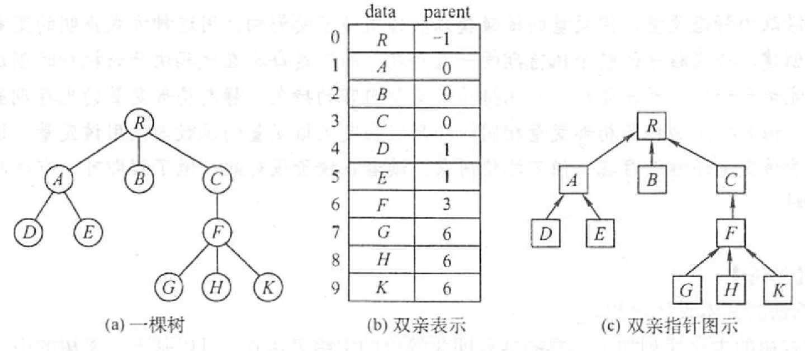
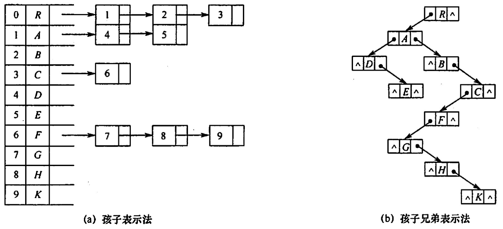

# 树、森林
2022.09.14

[TOC]

## 存储结构

1. 双亲表示法

   

   ```C
   #define MAX_TREE_SIZE 100
   typedef struct{
     ElementType data;
     int parent;
   }PTNode;
   typedef struct{
     PTNode nodes[MAX_TREE_SIZE];
     int n;
   }PTree;
   ```

2. 孩子表示法

3. 孩子兄弟表示法：左孩子右兄弟

   

   

## 树的遍历

1. 树
   1. 先根遍历——先序遍历
   2. **<u>后</u>根遍历——中序遍历**：左根右！
2. 森林
   1. 先序遍历森林
   2. 中序遍历森林

## 例题

1. 下列关于树的说法中，正确的是(）.
   I.对于有n个结点的二叉树，其高度为 log2 n
   II.完全二叉树中，若一个结点没有左孩子，则它必是叶结点
   III.高度为h（h>0）的完全二叉树对应的森林所含的树的个数一定是h
   IV.一棵树中的叶子数一定等于与其对应的二叉树的叶子数
   A. I和III
   B. IV
   C. I和II
   D. II

   【答案】：D

2. 利用二叉链表存储森林时，根结点的右指针是()。
   A．指向最左兄弟B.指向最右兄弟
   C.一定为空    D. 不一定为空

   【答案】：D

3. 设森林F中有3棵树，第一、第二．第三棵树的结点个数分别为M1，M2和M3。与森林对应的二叉树根结点的右子树上的结点个数是（）.
   A. M1
   B. M1+M2
   C. M3
   D. M2+M3

   【答案】：D

4. 设森林F对应的二叉树为B，它有m个结点，B的根为p，p的右子树结点个数为n，森林F中第一棵树的结点个数是( )。
   A. m-n
   B. m-n-1
   C. n+1
   D. 条件不足，无法确定

   【答案】：A

5. 森林T=（T1，T2，…，Tm）转化为二叉树BT的过程为：若m=0，则BT为空，若m≠0，则（)。
   A．将中间子树 Tmid (mid =（1 + m)/2）的根作为BT的根；将(T1，T2,…，Tmid-1)转专换为BT 的左子树;将(T{mid+1}，…，Tm）转换为 BT 的右子树
   B. 将子树T1的根作为 BT 的根;将T1的子树森林转换成 BT 的左子树;将(T2,T3,…，Tn)转换成 BT的右子树
   C. 将子树T1的根作为 BT 的根;将T1的左子树森林转换成 BT 的左子树;将T1的右子树森林转换为 BT 的右子树;其他以此类推
   D.将森林T的根作为 BT 的根;将(T1，T2，…，Tm)转化为该根下的结点，得到一棵树，然后将这採树再转化为二叉树 BT

   【答案】：B

6. 设F是一个森林，B是由F变换来的二叉树。若F中有n个非终端结点，则B中右指针域为空的结点有（ ）个。
   A.n-1
   B.n
   C.n+1
   D.n+2

   【答案】：A? -> C

7. 若T1是由有序树T转换而来的二叉树，则T中结点的后根序列就是T中结点的 ( ）序列。
   A.先序
   B.中序
   C.后序
   D.层序

   【答案】：B

8. 某二叉树结点的中序序列为 BDAECF，后序序列为 DBEFCA，则该二叉树对应的森林包括（ ）树。
   A. 8
   B. 2
   C. 3
   D. 4

   【答案】：C

   ​         A
   ​       /   \
   ​      B     C
   ​      \    / \
   ​       D  E   F

9. 设X是树T中的一个非根结点，B是T所对应的二叉树。在B中，x不是其双亲结点的右孩子，下列结论中正确的是(）。
   A. 在树T中，X是其双亲结点的第一个孩子
   B. 在树T中，X一定无右边兄弟
   C. 在树T中，X一定是叶子结点
   D. 在树T中，X一定有左边兄弟

   **【答案】**：C -> D

10. 在森林的二叉树表示中，结点M和结点N是同一父结点的左儿子和右儿子，则在该森林中（）。
    A. M和N有同一双亲
    B. M和N可能无公共祖先
    C. M是N的儿子
    D. M是N的左兄弟

    【答案】：B

11. 【2009 统考真题】将森林转换为对应的二叉树，若在二叉树中，结点u是结点v的父结点的父结点，则在原来的森林中，u和v可能具有的关系是(）

    I父子关系 II兄弟关系 III u的父结点v的父结点是兄弟关系

    A. 只有II
    B. I和II
    C. I和I
    D. I、II和III

    【答案】：B

12. 【2011 统考真题】已知一棵有2011 个结点的树，其叶结点个数为 116，该树对应的二叉树中无右孩子的结点个数是（）。
    A. 115
    B. 116
    C. 1895
    D. 1896

    【答案】：2011-116 = 1895，D

13. 【2014 統考真题】将森林F转换为对应的二叉树T，F中叶结点的个数等于（）.
    A.T中叶结点的个数
    B.T中度为1的结点个数
    C.T中左孩子指针为空的结点个数
    D.T中右孩子指针为空的结点个数

    【答案】：C

14. 【2016 统考真题】若森林F有15条边、25个结点，则F包含树的个数是（）.
    A. 8
    B. 9
    C. 10
    D. 11

    【答案】：10，C

15. 【2019 统考真题】若将一颗树T转化为对应的二叉树BT，则下列对 BT 的遍历中，其遍历序列与T的后根遍历序列相同的是（ ）。
    A.先序遍历
    B.中序遍历
    C.后序遍历
    D.按层遍历

    【答案】：B

16. 【2020 统考卖题】已知森林F及与之对应的二叉树T，若F的先根遍历序列是[a],b,c,d,e,f，中根遍历序列是b[,a],d,f,e,c，则**T**的后根遍历序列是（ ）。
    A. b, a, d, f, e, c
    B. b,d,f,e,c,a
    C. b,f,e,d,c,a
    D. f,e, d,c,b,a

    【答案】：A -> C，**F后根中根都对应T中序！**

    T后根就是T后序：b f e d c e

    ```mermaid
    stateDiagram-v2
    a --> b
    a --> c
    c --> d
    c --> NULL
    d --> null
    d --> e
    e --> f
    e --> x
    ```

    

17. 【2021 統考真题】某森林 F对应的二叉树为T，若T的先序遍历序列是[a],[b,d],[c,e,g,f]，中序遍历序列是[b,d],[a],[e,g,c,f]，則F中树的棵树是（ ）。
    A. 1
    B. 2
    C. 3
    D. 4

    【答案】：C

    ```mermaid
    stateDiagram-v2
    a --> b
    b --> x
    b --> d
    a --> c
    c --> e,g
    c --> f
    ```

    