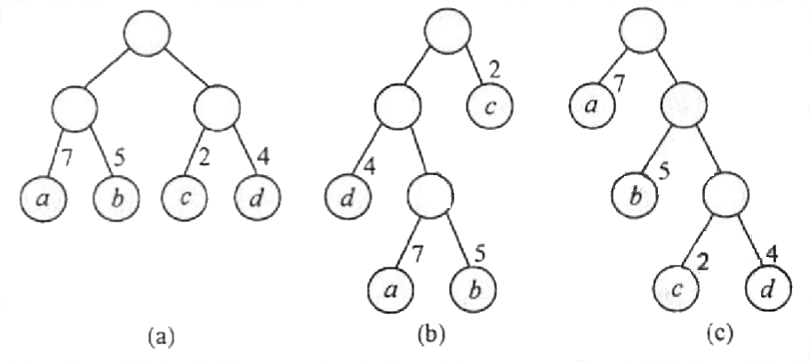
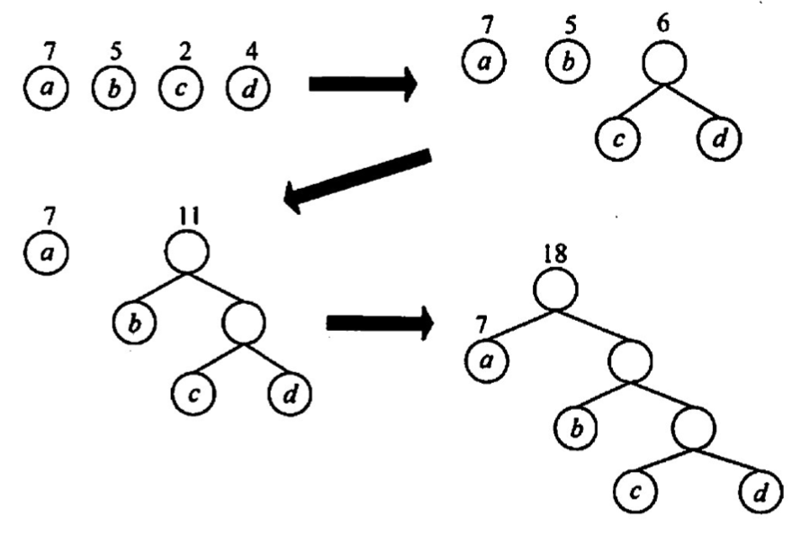
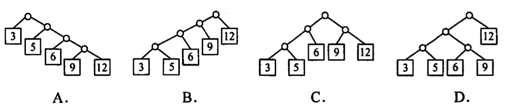
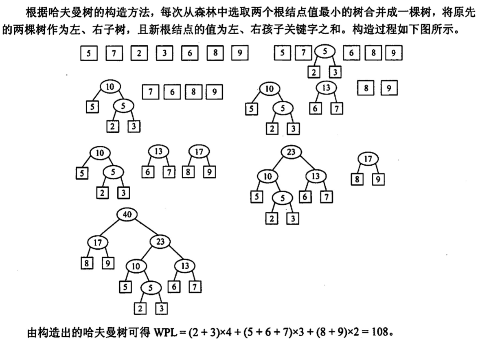

# 树与二叉树的应用
2022.09.14

[TOC]

## 哈夫曼树和哈夫曼编码

$$
WPL = \sum_{i=1}^n w_il_i
$$


$$
\begin{align}
WPL &= 7\times2+5\times2+2\times2+4\times2=36\\
WPL &= 4\times2+7\times3+5\times3+2\times1=46\\
WPL &= 7\times1+5\times2+2\times3+4\times3=35
\end{align}
$$
哈夫曼树的构造：



哈夫曼编码：


## 并查集

并查集是一种简单的**集合**表示，它支持以下3种操作：

1. Initial (s)：将集合S 中的每个元素都初始化为只有一个单元素的子集合。

2. Union(S, Root1,Root2)：把集合s 中的子集合 Root2 并入子集合 Root1。要求 Root1 和 Root2 互不相交，否则不执行合并。

3. Find (S,x)：查找集合S 中单元素× 所在的子集合，并返回该子集合的根结点。通常用树 （森林）的双亲表示作为并查集的存储结构，每个子集合以一棵树表示。所有表示子集合的树，构成表示全集合的森林，存放在双亲表示数组内。通常用数组元素的下标代表元素名，用根结点的下标代表子集合名，根结点的双亲结点为负数。
    例如，若设有一个全集合为S={0.1.2.3.4.5.6.7.8.9}，初始化时每个元素自成一个单元素子集合，每个子集合的数组值为-1。

  

  经过一段时间的计算，这些子集合合并为 3个更大的子集合S1={8.0.7.8}, S2={1.4.9}, S3={2.3.5}

  

  为了得到两个子集合的并，只需将其中一个子集合根结点的双亲指针指向另一个集合的根结点。

  

  ## 例题

  1. 在有n个叶子结点的哈夫曼树中，非叶子结点的总数：

     【答案】：n-1

  2. 给定整数集合{3，5，6，9，12}与之对应的哈夫曼树是（ ）

     

     【答案】：C

  3. 下列编码中，（ ）不是前缀码

     A.{00,01,10,11}
     B.{0,1,00,11}
     C.{0,10,110,111}
     D.{10,110,1110,1111}

     【答案】：B

  4. 设哈夫曼编码的长度不超过4，若已对两个字符编码为1和01，則还最多可对（）个字符编码。
     A.2
     B. 3
     C. 4
     D. 5

     【答案】：1，01，0000，0001，0010，0011，C

  5. 一棵哈夫曼树共有215个结点，对其进行哈夫曼编码，共能得到（ ）个不同的码字。
     A. 107
     B. 108
     C. 214
     D. 215

     【答案】：215-107=108，B

  6. 以下对于哈夫曼树的说法中，错误的是（ ）
     A. 对应一组权值构造出来的哈夫曼树一般不是唯一的
     B. 哈夫曼树具有最小的带权路径长度
     C. 哈夫曼树中没有度为1的结点
     D. 哈夫曼树中除了度为1的结点外，还有度为2的结点和叶结点

     【答案】：D

  7. 若度为m的哈夫曼树中，叶子结点个数为n，则非叶子结点的个数为（ ）.
     A. n-1
     B.下取整{n/m}-1
     C. 上取整{(n-1)/(m-1)}
     D. 上取整{n/(m-1)}-1

     **【答案】**：D -> C

     > https://blog.csdn.net/lthahaha/article/details/109269319
     >
     > 度为m的有k个，度为0的有n个
     >
     > n+k = km+1
     >
     > k = (n-1)/(m-1)
     >
     > 如果度为0的少一点，需要补充n1+n2 = n
     >
     > k = (n1+n2-1)/(m-1) = 上取整{(n1 - 1)/(m-1)}

  8. 并查集的结构是一种（）。
     A二叉链表存储的二叉树
     B.双亲表示法存储的树
     C.顺序存储的二叉树
     D.孩子表示法存储的树

     【答案】：B

  9. 并查集中最核心的两个操作是：①查找，查找两个元素是否属于同一个集合；②合并，如果两个元素不属于同一个集合，且所在的两个集合互不相交，则合并这两个集合。假设初始长度为 10（0-9）的并查集，按1-2、3-4、5-6、7-8、8-9、1-8、0-5、1-9的顺序进行查找和合并操作，最终并查集共有（）个集合。
     A. 1
     B. 2
     C. 3
     D. 4

     【答案】：
     {1 2} {3 4} {5 6} {7 8} 

     {3 4} {0 5 6} {1 2 7 8 9} ,C

  10. 下列关于并查集的叙述中，（ ）是错误的（注意，本题涉及图的考点)。
      A.并查集是用双亲表示法存储的树
      B. 并查集可用于实现克鲁斯卡尔算法
      C. 并查集可用于判断无向图的连通性
      D.在长度为n的并查集中进行查找操作的时间复杂度为O(log2n)

      【答案】：D

  11. 【2010 统考真题】n（n≥2）个权值均不相同的宇符构成哈夫曼树，关于该树的叙述中，错误的是（ ）。
      A. 该树一定是一棵完全二叉树
      B. 树中一定没有度为1的结点
      C. 树中两个权值最小的结点一定是兄弟结点
      D. 树中任一非叶结点的权值一定不小于下一层任一结点的权值

      【答案】：A

  12. 【2014 统考真题】5个字符有如下 4种编码方案，不是前缀编码的是（ ）。

      A. 01,0000,0001,001,1
      B. 011,000,001,010,1
      C. 000,001,010,011,100
      D. 0,100,110,1110,1100

      【答案】：D

  13. 【2015 统考真题】下列选项给出的是从根分别到达两个叶结点路径上的权值序列，属于同一棵哈夫受树的是（ ）。
      A. 24, 10,5和 24, 10,7
      B. 24,10,5 和24, 12, 7
      C. 24,10,10 和 24,14, 11
      D. 24,10,5和24, 14,6

      【答案】：A -> D

      [解析](https://blog.csdn.net/u011240016/article/details/53083846)

  14. 【2017 统考真题】已知宇符集{a,b,c,d,e,f,g,h}，若各字符的哈夫受编码依次是 0100,10,0000,0101,001,011,11,0001，则编码序列 0100011001001011110101 的译码结果是( ).
      A. acgabfh
      B. adbagbb
      C. afbeasd
      D. afeefgd

      【答案】：[0100] [011] [001] [001] [011] [11] [0101]

      a:0100,b:10,c:0000,d:0101,e:001,f:011,g:11,h:0001

      afeefgd，D

  15. 【2018 统考真题】已知宇符集{a,b,c,d,e,f}，若各字符出现的次数分别为6,3,8,2,10,4，则对应宇符集中各字符的哈夫曼编码可能是（ ）。
      A. 00, 1011, 01, 1010, 11, 100
      B. 00,100,110.000,0010,01
      C. 10, 1011, 11, 0011, 00, 010
      D. 0011, 10,11,0010,01,000

      【答案】：A

  16. 【2019 统考真题】对n个互不相同的符号进行哈夫曼编码。若生成的哈夫量树共有 115个结点，则n的值是(）。
      A. 56
      B. 57
      C. 58
      D. 60

      【答案】：C

  17. 【2021 统考真题】若某二叉树有5个叶结点，其权值分别为 10,12,16,21,30，则共最小的带权路径长度（WRL）是( ).
      A. 89
      B. 200
      C. 208
      D. 289

      【答案】：10,12,16,21,30，A -> B

      

  18. 设给定权集w{5,7,2,3,6,8,9}，试构造关于w的一棵哈夫曼树，并求其加权路径长度 WPL。

      

  19. 【2012 统考真题】设有5个有序表A，B，C,D,E，F，分别含有10,35,40,50,60和200个数据元素，各表中的元素按升序排列。要求通过5次两两合并，将6个表最终合并为 1个升序表，并使最坏情况下比较的总次数达到最小。请回答下列问题：
      1）给出完整的合并过程，并求出最坏情况下比较的总次数。
      2）根据你的合并过程，描述n（n≥2）个不等长升序表的合并策略，并说明理由。

      【2012年计算机考研408真题详解-哔哩哔哩】 https://b23.tv/6KRCnWC

      【答案】：

      1. 每次挑选两个最小的有序表进行合并

         ```mermaid
         stateDiagram-v2
         395 --> [200]
         395 --> 195
         195 --> 85
         195 --> 110
         110 --> [50]
         110 --> [60]
         85 --> 45
         85 -->[40]
         45 --> [10]
         45 --> [35]
         ```

         $$WLP = (200+(40+50+60)\times 3)+(10+35)\times 4=830$$

         **比较次数 = 830 - 5 = 825！**，因为每次比较n和m个元素需要最多比较m+n-1次！！⚠️

      2. 各表的合并策略是：对多个有序表进行两两合并时，若表长不同，则最坏情况下总的比较次数依赖于表的合并次序。可以借助于哈夫曼树的构造思想，依次选择最短的两个表进行合并，此时可以获得最坏情况下的最佳合并效率

  20. 【2020 统考真题】若任意一个字符的编码都不是共他宇符编码的前级，则称这种编码具有前级特性。现有菜宇符集（宇符个数≥2）的不等长编码，每个宇符的编码均为二进制的0、1序列，最长为L位，且具有前级特性。请回答下列问题：
      1）哪种数据结构适宜保存上述具有前级特性的不等长編码？
      2）基于你所设计的数据结构，简述从011 串到宇符串的译码过程。
      3）简述判定某宇符集的不等长编码是否具有前级特性的过程。

      【答案】：

      1. 哈夫曼树
      2. 从第一位到最后一位遍历，遍历的过程是查找哈夫曼树的过程。比如假设0代表左孩子，1代表右孩子。011就是哈夫曼树->lchild->rchild->rchild.
      3. 循环读入每一个编码。为所有编码构造一棵二叉树。每个编码从根节点开始，0代表左孩子，1代表右孩子，为每一个编码建立叶子结点。【1】如果某个编码的路径上有之前建立过的叶子结点，则说明不具有前级特性。【2】如果为某个编码创建叶子结点过程中，该叶子结点是之前路径上的结点，则说明不具有前级特性。如果有所结点通过验证，说明有前级特性

