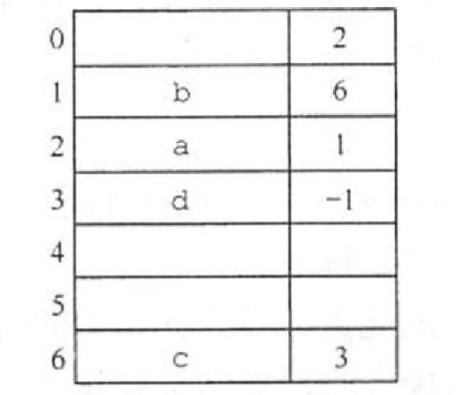
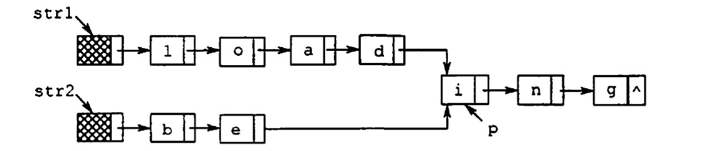
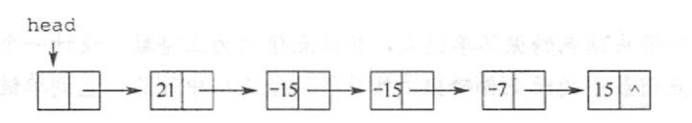
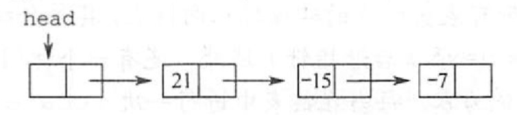

# 线性表的链式表示
2022.09.05

[TOC]

## 单链表的定义

```C++
typedef struct{
  ElemType data;
  struct Lnode *next;
}Lnode, *LinkList;
```

## 单链表上基本操作的实现

1. 头插法初始化（带头结点）

   ```C++
   bool InitList(LinkList &L){
     // 建立新结点
     LNode *L = (*LNode)malloc(sizeof(LNode));
     if(L==NULL) return false;
     // 初始化头结点
     L->next = NULL;
     return true;
   }
   
   bool InitList2(LinkList &L, int data[], int num){
     // 建立新结点
     LNode *L = (*LNode)malloc(sizeof(LNode));
     if(L==NULL) return false;
     // 初始化头结点
     L->next = NULL;
     // 头插法
     for(int i=0;i<num;i++)
       if(HeadInsert(L,data[i])==false) return false;
     return true;
   }
   ```

2. 头插法（带头结点）

   ```C++
   bool HeadInsert(LinkList &L, int data){
     // 建立新结点
     LNode *p = (*LNode)malloc(sizeof(LNode));
     if(p==NULL) return false;
     
     // 头插法
     p->data = data;
     p->next = L->next;
     L->next = p;
     return true;
   }
   ```

   单个结点插入时间：O(1)
   结点插入时间复杂度：O(n)

3. 尾插法（带头结点）

   ```C++
   bool TailInsert(LinkList &L, int data){
     // 建立新结点
     LNode *p = (*LNode)malloc(sizeof(LNode));
     if(p==NULL) return false;
     
     // 尾插法
     p->data = data;
     p->next = NULL;
     LNode *q = L;
     while(q->next!=NULL)
       q = q->next;
     q->next = p;
     return true;
   }
   ```

4. 按序查找（带头结点）

   ```C++
   bool GetByIndex(LinkList &L, int index, LinkList &node){
     int i = 0;
     Lnode *p = L->next;
     while(i<index){
       if(p==NULL) return false;
       p = p->next;
       i++;
     }
     node = p;
     return true;
   }
   ```

5. 按值查找（带头结点）

   ```C++
   bool GetByNumber(LinkList &L, int num, LinkList &node){
     Lnode *p = L->next;
     while(p!=NULL)
       if(p->data == num){
         node = p;
         return true;
       }
     return false;   
   }
   ```

6. 结点插入（带头结点）

   ```C++
   bool Insert(LinkList &L, int data, int index, int num, int type1,int type2){
     // 找到指定节点
     LNode *p = NULL;
     if(type1==0) // 按位查找
       if(GetByIndex(L,index,p)==false) return false;
     else if(type1==1) // 按值查找
       if(GetByNumber(L,num,p)==false) return false;
     else return false;
     
     // 插入
     if(type2==0) // 后插
     	if(HeadInsert(p,data)==false) return false;
     else if(type2==1) // 前插
     {
       if(HeadInsert(p,data)==false) return false;
       swap(p->data, p->next->data); // 前插采用先后插在交换数据
     }
     return true;
   }
   ```

7. 删除结点（带头结点）

   ```C++
   bool Insert(LinkList &L, int data, int index, int num, int type1){
     // 找到指定节点
     LNode *p = NULL;
     if(type1==0) // 按位查找
       if(GetByIndex(L,index,p)==false) return false;
     else if(type1==1) // 按值查找
       if(GetByNumber(L,num,p)==false) return false;
     else return false;
     
     // 删除
     LNode *q = p->next;
     if(q!=NULL){
       p->next = q->next;
       p->data = q->data;
       free(q);
     }else{
       free(p);
     }
     
     return true;
   }
   ```

## 双链表

1. 定义

   ```C++
   typedef struct DNode{
   	int data;
   	struct DNode *prior, *next;
   }DNode, *DLinkList;
   ```

2. 插入：我的理解——先把新结点造好，再连进去

   ```C++
   // p -> 插入q
   q->next = p->next;
   q->prior = p;
   p->next->prior = q;
   p->next = q;
   ```

3. 删除：我的理解——先把前后连好，再删中间

   ```C++
   // p -> 删除q
   p->next = q->next;
   q->next->prior = p;
   free(q)
   ```

## 循环链表

其实就是初始化的时候，判空的时候不太一样。

1. 循环单链表
2. 循环双链表

## 静态链表

```C++
/** 线性表 - 静态链表
 *  内容包括:
 *  静态链表的定义
 *  初始化
 */
// https://github.com/CharlesShan-hub/DataStructureNotes/blob/master/%E7%BA%BF%E6%80%A7%E8%A1%A8/%E9%9D%99%E6%80%81%E9%93%BE%E8%A1%A8.cpp

#include <stdio.h>
#include <stdlib.h>
#include <stdbool.h>

// 静态链表类型定义  
#define MaxSize 10 // 默认最大长度
typedef struct Node
{
	int data;
	int next;
}SLinkList[MaxSize];

// 初始化
bool InitList(SLinkList &L)
{
	// 去除垃圾值
	for(int i=0; i<MaxSize; i++)
		L[i].next = 0;
	// 设置第一项
	L[0].next = -1;
	return true;
}

int main(void)
{
	// 声明
	SLinkList L;

	// 初始化
	InitList(L);

	return 0;
}
```

> 操作系统里边的文件的物理结构中，链式分配的显示链接分配就是静态链表。



## 习题

1. 关于线性表的顺序存储结构和链式存储结构的描述中，正确的是（）。
   I. 线性表的顺序存储结构优于其链式存储结构
   II. 链式存储结构比顺序存储结构能更方便地表示各种逻辑结构
   III. 若频繁使用插入和删除结点操作，則顺序存储结构更优于链式存储结构
   IV. 顺序存储结构和链式存储结构都可以进行顺序存取
   A. I、II、III
   B. II、IV
   C. II、III
   D. III、IV

   【答案】：B

2. 对于一个线性表，既要求能够进行较快速地插入和删除，又要求存储结构能反映数据之间的逻拜关系，则应该用（)。
   A. 顺序存储方式 B.链式存储方式
   C. 散列存储方式 D.以上均可以

   【答案】：B

3. 对于顺序存储的线性表，其算法时间复杂度为 O(1)的运算应该是（）。
   A. 将n个元素从小到大排序
   B. 删除第i（1≤i≤n）个元素
   C. 改变第i（1≤i≤n）个元素的值
   D.在第i（1≤i≤n）个元素后插入一个新元素

   【答案】：C

4. 下列关于线性表说法中，正确的是(）。
   I. 顺序存储方式只能用于存储线性结构
   II. 取线性表的第i个元素的时间与i的大小有关
   III. 静态链表需要分配较大的连续空间，插入和删除不需要移动元素
   IV. 在一个长度为n的有序单链表中插入一个新结点并仍保持有序的时间复杂度为O(n)
   V. 若用单链表来表示队列，则应该选用带尾指针的循环链表
   A. I、II
   B. I、 III、 IV、V 
   C. IV、V
   D. III、IV、V

   【答案】：D

5. 设线性表中有2n个元素，（）在单链表上实现要比在顺序表上实现效率更高。
   A. 删除所有值为x的元素
   B. 在最后一个元素的后面插入一个新元素
   C. 顺序输出前k个元素
   D. 交换第i个元素和第2n-i-1个元素的值（i=0...,1-1）

   【答案】：A

6. 在一个单链表中，已知 q 所指结点是 p 所指结点的前驱结点，若在q和p之间插入结点S, （ ）
   A. s-›next=p-›next;p-›next=s; 
   B. p-›next=s-›next; s-›next=p;
   C. q-›next=s;s-›next=p;
   D. p-›next=s;s-›next=q;

   【答案】：D->C

7. 给定有n个元素的一维数組，建立一个有序单链表的最低时间复杂度是（ ）
   A. 0(1)
   B. O(n)
   C. O(n^2)
   D. O(nlog2 n)

   【答案】：D

8. 将长度为n的单链表链接在长度为m的单链表，其算法时间复杂度采用O形式表示应该是（）
   A. 0(1)
   B. O(n)
   C. O(m)
   D. O(n+ m)

   【答案】：C

9. 单链表中，增加一个头结点的目的是(）。
   A．使单链表至少有一个结点
   B. 标识表结点中首结点的位置
   C.方便运算的实现
   D. 说明单链表是线性表的链式存储

   【答案】：C

10. 在一个长度为n的带头结点的单链表h上，设有尾指针r，则执行（ ）操作与链表的表长有关。
    A. 删除单链表中的第一个元素
    B. 删除单链表中的最后一个元素
    C. 在单链表第一个元素前插入一个新元素
    D. 在单链表最后一个元素后插入一个新元素

    【答案】：B

11. 对于一个头指针为 head 的带头结点的单链表，判定该表为空表的条件是( )；对于不带头结点的单链表，判定空表的条件为( )
    A. head==NULL
    B. head->next==NULL
    C. head->next==head
    D. head != NULL

    【答案】：BA

12. 下西关于线性表的一些说法中，正确的是（)。
    A．对一个设有头指针和尾指针的单链表执行删除最后一个元素的操作与链表长度无关
    B. 线性表中每个元素都有一个直接前驱和一个直接后继
    C.为了方便插入和删除数据，可以使用双链表存放数据
    D.取线性表第i个元素的时间与i的大小有关

    【答案】：D->C

13. 在双链表中向 p 所指的结点之前插入一个结点 q 的操作为（ ）
    A. p-›prior=q;q-›next-pip-›prior-›next-q:q-›prior=p-›prior;
    B. q-›prior=p-›prior;p-›prior->next-q:q-›next=pip-›prior=q-›next;
    C. q-›next=p;p-›next-q;q-›prior-›nextaqiq-›next=p;
    D. p-›prior-›next=q;q-›next=p;q-›prior=p-›prior;p-›prior=q;

    【答案】：D。[q] p 

14. 在双向链表存储结构中，删除 p 所指的结点时必须修改指针（）。
    A. p-›llink-›rlink=p-›rlink;p-›rlink-›llink=p-›llink;
    B. p-›llink=p-›llink-›llink;p-›llink-›rlink=p;
    C. p-›rlink->llink=p;p-›rlinkap-›rlink-›rlink;
    D. p-›rlink=p-›llink-›llink:p->llink=p-›rlink-›rlink;

    【答案】：A

15. 在长度为n的有序单链表中插入一个新结点，并仍然保持有序的时间复杂度是( )
    A. O(1)
    B. O(n)
    C. O(n^2)
    D. O(nlog2 n)

    【答案】：B

16. 与单链表相比，双链表的优点之一是（）.
    A. 插入、删除採作更方便
    B. 可以进行随机访问
    C. 可以省略表头指针或表尾指针
    D. 访问前后相邻结点更灵活

    【答案】：D

17. 带头结点的双循环链表L为空的条件是（)。
    A. `L->prior==L && L-›next==NULL`
    B. `L-›prior==NULL && L-›next==NULL`
    C. `L->prior==NULL && L->next==L`
    D. `L->prior==L && L->nexte=L`

    【答案】：D

18. 一个链表最常用的探作是在末尾括入结点和删除结点，则选用（ ）最节省时间。
    A. 带头结点的双循环链表
    B. 单循环链表
    C. 带尾指针的单循环链表
    D. 单链表

    【答案】：A

19. 设对n(n>1）个元素的线性表的运算只有4种：删除第一个元素；删除最后一个元素；在第一个元素之前插入新元素；在最后一个元素之后插入新元素，則最好使用（）。
    A. 只有尾结点指针没有头结点指针的循环单链表
    B. 只有尾结点指针没有头结点指针的非循环双链表
    C. 只有头结点指针没有尾结点指针的循环双链表
    D. 既有头结点指针又有尾结点指针的循环单链表

    【答案】：C

20. 一个链表最常用的操作是在最后一个元素后插入一个元素和删除第一个元素，則选用（ ）最节省时间。
    A. 不带头结点的单循链表
    B. 双链表
    C. 不带头结点且有尾指针的单循环链表
    D. 单链表

    【答案】：C

21. 静态链表中指针表示的是（ ）.
    A. 下一元素的地址
    B. 内存储器地址
    C. 下一个元素在数组中的位置
    D. 左链或右链指向的元素的地址

    【答案】：C

22. 需要分配较大空间，插入和删除不需要移动元素的线性表，其存储结构为（）.
    A.单链表
    B.静态链表
    C. 順序表
    D.双链表

    【答案】：B

23. 某线性表用带头结点的循环单链表存储，头指针为 head，当 head->next->next=head 成立时，线性表长度可能是（ ）。
    A. 0
    B. 1
    C. 2
    D. 可能为0或1

    【答案】：D

24. 【2016 统考真题】已知一个带有表头结点的双向循环链表L，结点结构为 「prev」「data」「next」。其中 prev 和next分别是指向其直接前驱和直接后继结点的指针。现要删除指针p所指的结点，正确的语句序列是（ ）。
    A. p-›next-›prev=p-›prev; p-›prev-›next=p-›prev; free (p);
    B. p-›next-›prevap-›next; p-›prev-›next=p-›next; free (p) ;
    C. p-›next-›prev=p-›next; p-›prev-›next=p-›prev; free (p);
    D. p-›next-›prev=p-›prev; p-›prev-›nextap-›next; free (p) ;

    【答案】：D

25. 【2016 统考真题】已知表头元素为c的单链表在内存中的存储状态如下表所示。

    | 地址  | 元素 | 链接地址 |
    | :---: | :--: | :------: |
    | 1000H |  a   |  1010H   |
    | 1004H |  b   |  100CH   |
    | 1008H |  c   |  1000H   |
    | 100CH |  d   |   NULL   |
    | 1010H |  e   |  1004H   |
    | 1014H |      |          |

    现将f存放于1014H 处并插入单链表，若f在逻辑上位于a和e之间，则a，e，f的“链接地址”依次是（）
    A. 1010H,1014H,1004H
    B. 1010H,1004H,1014H
    C. 1014H,1010H,1004H
    D. 1014H,1004H,1010H

    【答案】：a->f->e,C->D

26. 【2021 统考真题】已知头指针h指向一个带头结点的非空单循环链表，结点结构为「data」「next」。其中 next 是指向直接后继结点的指针，p是尾指针，q是临时指针。现要删除该链表的第一个元素，正确的语句序列是（ ）
    A. h -> next = h-> next -> next; q = h -> next; free(q);
    B. q=h -> next; h -> next = h -> next -> next; free(q);
    C. q=h -> next; h -> next = q -> next; if(p != q) p = h; free(q);
    D. q=h -> next; h -> next = q -> next; if(p == q) p = h; free (q);

    【答案】：D

27. 【2009統考真题】已知一个带有表头结点的单链表，结点结构为「data」「link」。假设该链表只给出了头指针 list。在不改变链表的前提下，请设计一个尽可能高效的算法，查找链表中倒数第k个位置上的结点（*为正整数）。若查找成功，算法输出该结点的data域的值，并返回1；否则，只返回0。要求：
    1）描述算法的基本设计思想。
    2）描述算法的详细实现步骤。
    3）根据设计思想和实现步聚，来用程序设计语言描述算法（使用C、C++或 Java语言实现），关键之处请给出简要注释。

    【答案】：

    1. 采用辅助指针，先走k次。

    2. 从头开始遍历链表，如果未到第k个位置，发现链表结束了返回0，如果可以找到，这时同时从第k和头节点开始依次向后遍历，当地一个指针遍历结束时，第二个指针正好是倒数k位置，返回data内容

    3. ```C++
       int GetNKth(LinkList L){
         LNode *p = L, *q = L;
         for(int i=0;i<k;i++)
           if(L==NULL) return 0;
         	else p = p->next;
         while(p!=NULL){
           p = p->next;
           q = q->next;
         }
         return q->data;
       }
       ```

28. 【2012统考真题】假定采用带头结点的单链表保存单词，当两个单词有相同的后级时，可共享相同的后级存储空间，例如，“loading” 和“being” 的存储映像如下图所示。

    

    设str1 和str2分別指向两个单词所在单链表的头结点，链表结点结构为「data」「next」。请设计一个时间上尽可能高效的算法，找出由str1 和str2所指向两个链表共同后缀的起始位置（如图中宇符i所在结点的位置口）。要求：
    1）给出算法的基本设计思想。
    2）根据设计恩想，來用C或C++或 java实现
    3）说明你所设计算法的时间复杂度

    【答案】：

    > 轻松一下：
    >
    > 1. “平衡”是一种大智慧，规划失误是最大的浪费。我们要以长度为战略基点，对指向单词的指针进行优化调整，筑牢科学存储结构的共同基础，激活科技强国的时代伟力。
    > 2. 抓住存储空间的痛点，将两个单词进行“对齐”，以指向两单词的指针为“抓手”，进行链路整合。

    1. 首先计算两单词长度，设置指针12分别指向两单词首部，较长的一个单词的指针向后移动一定位数，然后两指针一起向后移动并判断是否下一个的字母相同。如果相同，保存本结点位置。以此类推。如果中途发现下字母不同，则放弃原来保存的位置，等到下一次字母相同。

    2. ```C++
       int length(Linklisk L){
         int i=0;
         while(L->next!=NULL){
           L = L->next;
           i++
         }
         return i;
       }
       
       bool transform(LinkLisk &L1, LinkList &L2){
         // p1指向较长的单词，p2指向较短的单词
         int l1 = length(L1);
         int l2 = length(L2);
         LNode *p1,*p2;
         if(l1>l2){
           p1 = L1;
           p2 = L2;
         }else{
           p1 = L2;
           p2 = L1;
         }
         
         // 单词对齐
         int abs = l1 > l2 ? l1 - l2 : l2 - l1
         for(int i=0;i<abs;i++)
           p1 = p1->next;
         
         // 尝试整合 - 找到个共同后缀
         LNode *q1,*q2;
         bool flag = false; // 当前是否找到潜在共同后缀
         while(p1->next){
           if(p1->next->data != p2->next->data)
             flag = false;
           if(flag==false){
             flag = true;
             q1 = p1;
             q2 = p2;
           }
         }
         
         // 尝试整合 - 回收多余空间
         if(flag==false) return false;
         LNode *r = q2->next;
         q2->next = q1->next;
         while(r->next){
           q2 = r;
           r = r->next;
           free(r);
         }
         return true;
       }
       ```

    3. 时间复杂度O(n)

29. 【2015统考真题】用单链表保存m个整数，结点的结构为「data」「link」，且|data| ≤ n（n 为正整数）。现要求设计一个时问复杂度尽可能高效的算法，对于链表中data的绝对值相等的结点，仅保留第一次出现的结点而删除其余绝对值相等的结点。例如，若给定的单链表head 如下：

    

    则刪除结点后的 head 为

    

    要求：
    1)给出算法的基本设计思想。
    2)使用C或C++语言，给出单链表结点的数据类型定义。
    3)根据设计思想，采用C或C++语言描述算法，关键之处给出注释。
    4)说明你所设计算法的时间复杂度和空间复杂度。

    【答案】

    1. 建立一个辅助数组，用来保存某个data是否出现过，数组下标与数据大小一致。送头到尾遍历单链表，如果发现将元素标记到辅助数组中，如果发现该元素已经出现过，就在链表中删除它。

    2. ```C++
       typedef struct{
         int data;
         LNode *next;
       }*LinkList, LNode;
       ```

    3. ```C++
       #include <stdbool.h>
       void deleteFirst(LinkList &L){
         LNode *p = L->next;
         L->next = p->next;
         free(p);
         return;
       }
       
       void transform(LinkList &L, int n){
         bool flag[n+1];
         for(int i=0; i<n+1;i--)
           flag[i] == false;
         for(LNode *p=L; p->next!=NULL; p=p->next)
           if(flag[p->next->data]==false) 
             flag[p->next->data]==true;
           else 
             deleteFirst(p);
         }
         return;
       }
       ```

    4. 时间复杂度O(m)，m为链表长度
       空间复杂度O(n)，n为数据范围

30. 【2019 统考真题】设线性表L=(a1,a2,...an-2,an-1,an)采用常头结点的单链表保存，链表中的结点定义如下：

    ```C++
    typedef struct node
    {
      int data;
      struct node*next:
    }NODE;
    ```

    请设计一个空问复杂度为 0(1)且时间上尽可能高效的算法，重新排列L 中的各结点，得到线性表L'=(a1,an,a2,an-1,...)。要求：
    1)给出算法的基本设计思想。
    2)根据设计思想，采用C或 C++语言描述算法，关键之处给出注释.
    3)说明你所设计的算法的时问复杂度。

    【答案】：

    1. 首先将链表通过头插法倒序，得到L1=(an, an-1, ..., a2, a1)，同时获得长度L。将后一半在进行倒叙，得到L2(an, an-1, ..., ak+1, a1, a2, ..., ak)，并保存a1位置。第三步将后一半插入到前一半得到L3(a1,an,a2,an-1,...)

    2. ```C++
       typedef NODE *LinkList;
       
       int inverse(LinkList Lstart,LinkList &Lto,int mode){
         NODE *q = NULL;
         int length = 0;
         for(NODE *p=Lstart->next; p!=NULL; length++)
           q = p;
           p = p->next;
           if(length==0 && mode==1)
             q->next = NULL;
           else
           	q->next = Lto->next;
           Lto->next = q;
         }
         return length;
       }
       
       void transform(LinkList &L){
         // 将链表倒叙，得到L2, length
         // eg. 9 8 7 6 5 4 3 2 1
         int length = inverse(L,L,0);
         
         // 找到中间节点，然后将后一半倒叙
         // eg. 9 8 7 6 5 1 2 3 4
         Lnode *mid = L;
         for(int count=0; count<length-length/2; count++)
           mid = mid->next;
         inverse(mid,mid,0);
         
         // 连接
         // eg. 1 9 2 8 3 7 4 6 5
         inverse(mid,L,1);
         return;
       }
       ```

    3. 时间复杂度O(n)

    