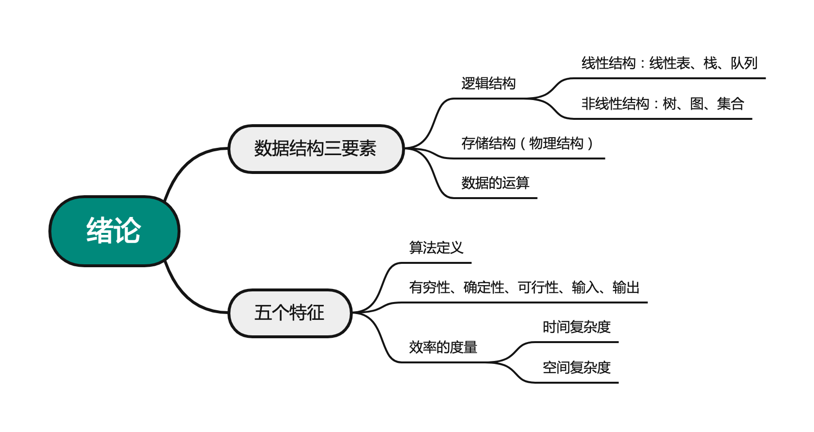

# 数据结构的基本概念
2022.05.23

[TOC]

* 数据类型：<u>原子类型</u>（不能再分），<u>结构类型</u>（可以分成若干别的类型），<u>抽象数据类型</u>（抽象数据组织以及相关操作）

* 数据结构 = 逻辑结构 + 存储结构 + 数据运算

* 例题：链式存储设计时，结点内的存储单元地址（）。
  A. 一定连续
  B. 一定不连续
  C. 不一定连续
  D. 部分连续，部分不连续

  答案：A

* 以下与数据的存储结构无关的术语是（）。
  A.循环队列
  B. 链表
  C.哈希表
  D.栈

  答案：D

  

  

  

