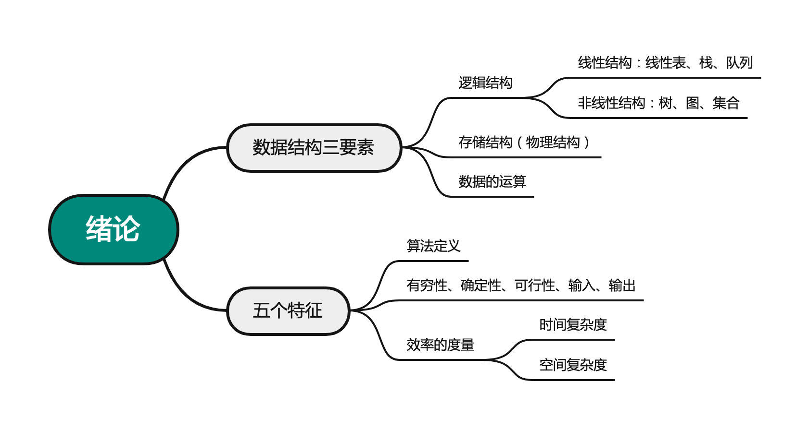

# 算法和算法评价
2022.12.10

[TOC]



* 一个算法应该是（）。
  A. 程序
  C. 要满足五个基本特性
  B. 问题求解步骤的描述
  D. A和C

  答案【B】

* 例题：下列算法中```m++```执行次数为：

  ```c
  int m=0,i,j;
  for(i=1; i<=n; i++)
    for(j=1; j<=2*i; j++)
      m++; 
  ```

  n(n+1)

* 例题(2022统考真题)：下列算法时间复杂度为

  ```C
  int sum = 0;
  for(int i=1; i<n; i*=2)
    for(int j=0; j<i; j++)
      sum++;
  ```

  O(n)。注意这里的第一个循环`i*=2`，所以`j`里边的`sum++`的运行次数是1，2，4，8，...，这样的。

  假如 $m\in [17,32]$，那么 $次数=1+2+4+8+16=31$

* 例题：某算法的时间复杂度为O(n^2)，表明该算法：

  执行时间时间与n^2成正比：√

  问题规模与n^2成正比: X

* 斐波那列数列
  $$
  F(n)=\left\{
  \begin{aligned}
   & 1, &n&=0,1\\
   & F(n-1) + F(n-2), &n&>1
  \end{aligned}
  \right.
  $$

  [斐波那列数列，求递归算法和非递归算法的时间复杂度](https://blog.csdn.net/qq_33951180/article/details/52484080)

  [另一篇文章](https://blog.csdn.net/a1456123a/article/details/48849923)

  [另一篇文章](https://zhuanlan.zhihu.com/p/56444434)