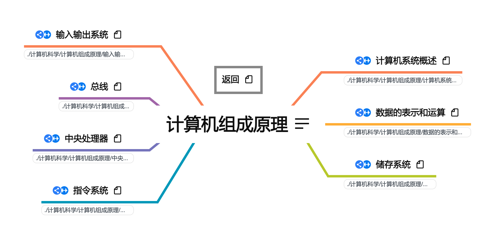

# PKM - 计算机组成原理  


* [计算机系统概述](./计算机系统概述.xmind)
* [数据的表示和运算](./数据的表示和运算.xmind)
* [存储系统](./存储系统.xmind)
* [指令系统](./指令系统.xmind)
* [中央处理器](./中央处理器.xmind)
* [总线](./总线.xmind)
* [输入输出结构](./输入输出结构.xmind)

## 介绍

计算机组成原理按照408考研辅导进行梳理。
## 资源
链接: https://pan.baidu.com/s/1BXbCQE8VyXHVfnCqWeIFWw  
提取码: qzdd  
如果资源失效请联系我

* __2022王道计算机组成原理资料__ : 2022王道配套视频与习题解答  

  ```
  1. 2022计算机组成原理知识点
  2. 2022计算机组成原理知识点课件
  3. 2022计算机组成原理知识点习题讲解
  4. 2022计算机组成原理知识点思维导图
  5. 2022计算机组成原理强化直播
  6. 2022计算机组成原理考研真题讲解
  7. 2022王道计算机组成原理.pdf（课本）
  8. 2022组成原理新增考点补充文档.pdf
  9. 22版组成原理勘误.pdf
  ```

* __2022天勤计算机组成原理.pdf__: 2022年408考研辅导教材  

* __北邮2019计算机组成原理__:课件与教材

  ```
  1. 2019年北邮计算机学院课程参考教材(计算机组成原理（第5版 立体化教材）.pdf)
  2. 2019年北邮计算机学院课程课件
  ```

* __Computer Organization__:犹他大学CS/ECE 3810: Computer Organization课程

  ```
  网站链接：http://www.cs.utah.edu/~bojnordi/classes/3810/f20/
  ```

* __计算机组成原理 by 唐朔飞 (z-lib.org).pdf__:考研计算机组成原理标准教材  

* __Computer Organization and Design The HardwareSoftware Interface 5th Edition - With all appendices and advanced material by David A. Patterson, John L. Hennessy.pdf__:国际著名教材《计算机组织与结构》  

* __ISO.IEC 646标准__ : ASCII标准  

* __IEEE754标准__

  ```
  1. ASCII标准介绍网页备份: IEEE 754 - Standard binary floating point arithmetic.html 
  2. ieee754eng.zip: IEEE 754浮点数标准工具。This is software created by http://www.softelectro.ru/program_en.html. It's used to show examples about IEEE754.  
  ```

## 外部资源

* __犹他大学公开资料计算机组成原理，体系结构，体系结构进阶__: https://www.cs.utah.edu/~bojnordi/classes/

* __四川农业大学公开资料__: http://eol.sicau.edu.cn/Courses/Default?courseid=303117

  ```
  包括完整的课件，练习，以及附加资料：个人纯手工打造CPU.pdf，	CPU是怎么制造的.pdf
  
  《计算机组成原理》是计算机科学与技术类各专业必修的一门重要学科基础课，也是信息学科各专业的学科大类基础课，是《微机接口技术》和《计算机系统结构》的前导课。该课程全面地介绍了计算机单机系统的组成原理及内部工作机制，包括计算机各大部件的结构、工作原理、逻辑实现、设计方法及其互连构成计算机整机的技术。课程的目的是通过学习和实践，帮助学生建立计算机系统的整机概念，使学生掌握计算机的工作原理,深刻理解程序在计算机硬件上被执行的过程，即计算机硬件系统各组成部件的工作原理、逻辑实现、设计思想以及它们联结成整机并协调运转的方法，为培养学生对计算机系统进行分析、设计、开发、使用的能力奠定基础。
  
  先修课程：数字逻辑、汇编语言
  ```


## 版本
### V1 2021.8.11
按照《2022年计算机组成原理考研复习指导》与相关课程进行整理，完成全部知识框架搭建  
### V2 2021.11.5
按照《2022年计算机组成原理考研复习指导》与相关课程进行整理，进行习题归纳与知识整合  

## 更新计划

1. 根据犹他大学《CS/ECE 3810: Computer Organization》课程补充细节