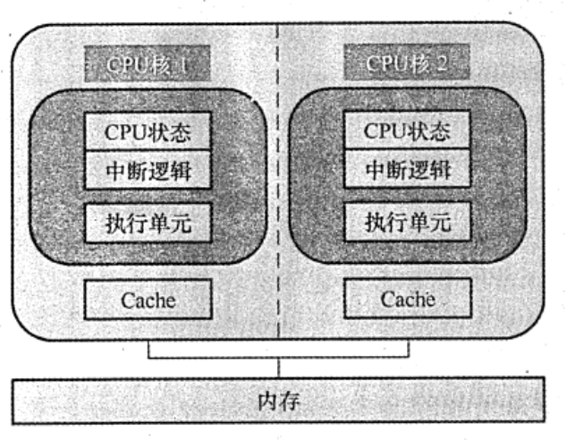

# 多处理器的基本概念
2022.08.30

[TOC]

## SISD、SIMD、MIMD 的基本概念

基于**指令流的数量和数据流的数量**，将计算机体系结构分为 SISD、SIMD、MISD 和 MIMD四类。常规的单处理器属于 SISD，而常规的多处理器属于 MIMD。
### 单指令流单数据流 (SISD）结构

SISD 是传统的**串行**计算机结构，这种计算机通常仅包含一个处理器和一个存储器，处理器在一段时间内仅执行一条指令，按指令流规定的顾序串行执行指令流中的若干条指令。为了提高速度，有些 SISD 计算机采用流水线的方式，因此，SISD 处理器有时会设置多个功能部件，并且采用**多模块交叉方式**组织存储器。本书前面介绍的内容多展于 SISD 结构。
### 单指令流多数据流 (SIMD) 结构

SIMD 是指一个指令流同时对多个数据流进行处理，一般称为**数据级并行技术**。这种结构的计算机通常由一个指令控制部件、多个处理单元组成。每个处理单元虽然执行的都是同一条指令，但是每个单元都有自己的地址寄存器，这样每个单元就都有不同的数据地址，因此，不同处理单元执行的同一条指令所处理的数据是不同的。一个顺序应用程序被编译后，可能按 SISD 组织并运行于串行硬件上，也可能按 SIMD 组织并运行于并行硬件上。

SIMD 在使用 for 循环处理数组时最有效，比如，一条分别对 16 对数据进行运算的 SIMD 指令如果在 16 个 ALU 中同时运算，则只需要一次运算时间就能完成运算。SIMD 在使用 case 或switch 语向时效率最低，此时每个执行单元必须根据不同的数据执行不同的操作。

### 多指令流单数据流 (MISD) 结构

MISD 是指同时执行多条指令，处理同一个数据，实际上**不存在**这样的计算机。

### 多指令流多数据流 (MIMD) 结构

MIMD 是指同时执行多条指令分别处理多个不同的数据，MIMD 分为多计算机系统和多处理器系统。多计算机系统中的每个计算机节点都具有各自的私有存储器，并且具有独立的主存地址空问，不能通过存取指令来访问不同节点的私有存储器，而要通过消息传递进行数据传送，也称消息传递 MIMD。多处理器系统是共享存储多处理器（SMP） 系统的简称，它具有**共享的单一地址空间**，通过存取指令来访问系统中的所有存储器，也称共享存储 MIMD。

向量处理器是 SIMD 的变体，是一种实现了直接操作一维数组（向量）指令集的 CPU, 串行处理器只能处理单一数据集。其基本理念是将从存储器中收集的一组数据按顾序放到一组向量寄存器中，然后以流水化的方式对它们依次操作，最后将结果写回寄存器。向量处理器在特定工作环境中极大地提升了性能，尤其是在数值模拟或者相似的领域中。

SIMD 和 MIMD 是两种并行计算模式，其中 SIMD 是一种数据级并行模式，而MIMD是种并行程度更高的线程级并行或线程级以上并行计算模式．

## 硬件多线程的基本概念

在传统 CPU 中，线程的切换包含一系列开销，频繁地切换会极大光响系统的性能，为了减少少线程切换过程中的开销，便诞生了硬件多线程。在支持硬件多线程的 CPU 中，必须为每个线程提供单独的通用寄存器组、单独的程序计数器等，线程的切换只需激活选中的寄存器，从而省略了与存储器数据交换的环节，大大减少了线程切换的开销。

硬件多线程有 3 种实现方式：细粒度多线程、相粒度多线程和同时多线程（SMT)。
### 细粒度多线程

<u>多个线程之间轮流交叉执行指令，多个线程之间的指令是不相关的，可以乱序并行执行.</u>

在这种方式下，处理器能在每个时钟周期切换线程。例如，在时钟周期i，将线程 A 中的多条指令发射执行， 在时钟周期i+1，将线程 B 中的多条指令发射执行。

### 粗粒度多线裡

<u>仅在一个线程出现了较大开销的阻塞时，才切换线程</u>，**如 Cache 缺失**。在这种方式下，当发生流水线阻塞时，必须清除被阻塞的流水线，新线程的指令开始执行前需要重载流水线，因此，线程切换的开销比细粒度多线程更大。

### 同时多线程

同时多线程（SMT） 是<u>上述两种多线程技术的变体</u>。它在实现指令级并行的同时，实现线程级并行，也就是说，它在同一个时钟周期中，发射多个不同线程中的多条指令执行。

下图分别是三种硬件多线程实现方式的调度示例。

Intel 处理器中的超线程（Hyper-threading）就是同时多线程 SMT，即在一个单处理器或单
个核中设置了两套线程状态部件，共享高速缓存和功能部件

## 多核处理器的基本概念

多核处理器是指将多个处理单元集成到单个 CPU 中，每个处理单元称为一个核（core)。每个核可以有自己的Cache，也可以共享同一个Cache。所有核一般都是对称的，并且共享主存储器，因此多核屆于共享存储的对称多处理器。下图是一个<u>不共享 Cache 的</u>双核 CPU 结构。

在多核计算机系统中，如要充分发挥硬件的性能，必须采用多线程（或多进程）执行，使得每个核在同一时刻都有线程在执行。与单核上的多线程不同，多核上的多个线程是在物理上并行执行的，是真正意义上的并行执行，在同一时刻有多个线程在并行执行。而单核上的多线程是一种多线程交错执行，实际上在同一时刻只有一个线程在执行。

下面通过一个例子来理解相关的概念。假设要将四颗圆石头滚到马路对面，滚动每颗石头平均需花费 1分钟。串行处理器会逐一滾动每颗石头，花费 4 分钟。拥有两个核的多核处理器让两个人去滚石头，即每人滚两颗，花费 2 分钟。向量处理器找到一根长木板，放在四颗石头后面，推动木板即可同时滚动四块石头，理论上只要力量够大，就只需要 1分钟。多核处理器相当于拥有多名工人，而向量处理器拥有一种方法，可以同时对多件事进行相同的操作。
## 共享内存多处理器的基本概念

具有共享的<u>单一物理地址空间的多处理器</u>被称为**共享内存多处理器（SMP)**。处理器通过存储器中的共享变量互相通信，所有处理器都能通过存取指令访问任何存储器的位置。注意，即使这些系统共享同一个物理地址空间，它们仍然可在自己的虚拟地址空间中单独地运行程序单一地址空间的多处理器有两种类型。<u>第一类</u>，每个处理器对所有存储单元的**访问时间是大致相同**的，即访问时间与哪个处理器提出访存请求及访问哪个字无关，这类机器被称为**统一存储访问 (UMA）多处理器**。<u>第二类</u>，<u>某些访存请求要比其他的快</u>，具体取决于哪个处理器提出了访问请求以及访问哪个字，这是由于主存被分割并分配给了同一机器上的不同处理器或内存控制器，这类机器被称为**非统一存储访问 （NUMA）多处理器**。

* **统一存储访问 (UMA) 多处理器**：根据处理器与共享存储器之间的连接方式，分为基于总线、基于交叉开关网络和基于多级交换网络连接等几种处理器。
* **非统一存储访问 (NUMA) 多处理器**：处理器中不带高速级存时，被称为 NC-NUMA；处理器中带有一致性高速级存时，被称为 CC-NUMA。

早期的计算机，内存控制器没有整合进 CPU，访存操作需要经过北桥芯片（集成了内存控制器，并与内存相進)，CPU 通过前端总线和北桥芯片相连，这就是统一存储访问 (UMA）构架。随者 CPU 性能提升由提高主烦转到增加 CPU 数量（多核、多CPU)，越来越主的 CPU 对前端总线的争用使得前端总线成为瓶颈。为了消除 UMA 架构的瓶颈，非统一存储访问(NUMA）构架诞生，内存控制器被集成到 CPU 内部，每个 CPU 都有独立的内存控制器。每个CPU 都独立连接到一部分内存，CPU 直连的这部分内存被称为本地内存。CPU之间通过 **QPI** 总线相進。CPU可以通过 QPI 总线访问其他 CPU 的远程内存。与UMA 架构不同的是，在NUMA架构下，内存的访问出现了本地和远程的区别，访问本地内存明显要快于访问远程内存。

由于可能会出现多个处理器同时访问同一共享变量的情况，在操作共享变量时然要进行同步，否则，一个处理器可能会在其他处理器尚未完成对共享变量的修改时，就开始使用该变量。常用方法是通过对共享变量加锁的方式来控制对共享变最互斥访问。在一个时刻只能有个处理器获得锁，其他要操作该共享变量的处理器必须等待，直到该处理器解锁该变量为止。

## 例题

1. 按照 Flynn 提出的计算机系統分类方法，多处理机属于（）。
   A. SISD
   B. SIMD
   C. MISD
   D. MIMD

   【答案】：D

2. 只有一个控制部件和多个处理单元的计算机系统属于（ ）结构
   A. SISD
   B. SIMD
   C. MISD
   D. MIMD

   【答案】：B

3. 下列关于超线程（HT）技术的描述中，正确的是( )。
   A. 超线程技术可以令四核的 Intel Core i7处理器变成八核
   B. 超线程是一项硬件技术，能使系统性能大幅提升，与操作系统和应用软件无关
   C. 含有超线程技术的 CPU 需要芯片組的支持才能发挥技术优势
   D. 超线程模拟出的每个 CPU 核都具有独立的资源，各自工作互不干扰

   【答案】：C

4. 双核 CPU 和超线程 CPU 的共同点是( )
   A. 都有两个内核
   C. 都包含两个CPU
   B. 都能同时执行两个运算
   D. 都不会出现争抢资源的现象

   【答案】：B

5. 下列关于双核技术的叙述中，正确的是()。
   A. 双核是指主板上有两个CPU
   B. 双核是利用超线程技术实现的
   C. 双核是指在 CPU 上集成两个运箅核心
   D. 双核 CPU 是时间并行的并行计算

   【答案】：C

6. 下列有关多核CPU 和单核CPU的描述中，错误的是( ）。
   A. 双核的频率为2.4GHZ，那么共中每个核心的频率也是 2.4GHZ
   B. 采用双核CPU 可以降低计算机系统的功耗和体积
   C. 多核CPU 共用一组内存，数据共享
   D. 所有程序在多核CPU 上运行速度都快

   【答案】：D

7. 下列关于多核CPU的描述中，正确的是( ）。
   A. 各核心完全对称，拥有各自的 Cache
   B. 任何程序都可以同时在多个核心上运行
   C. 一颗 CPU 中集成了多个完整的执行内核，可同时进行多个运算
   D. 只有使用了多核CPU 的计算机，才支持多任务操作系统

   【答案】：A->C.可以有各自的Cache也可以共用一个Cache！

8. 下列关于多处理器的说法中，正确的是（ ）。
   I. 一般采用偶数路CPU，如2路、4路、6路等
   II. NUMA 构架比UMA 构架的运算扩展性要强
   III. UMA 构架需要解决的重要问题是 Cache 一致性
   A. I
   B. I和II
   C. I和III
   D. I、II和III

   【答案】：D