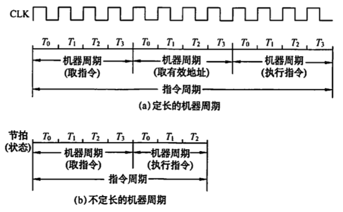
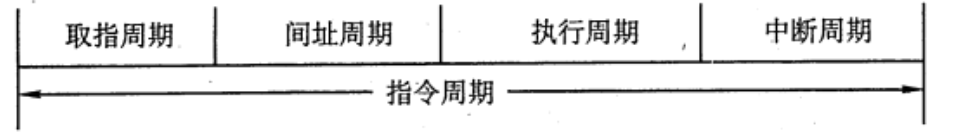
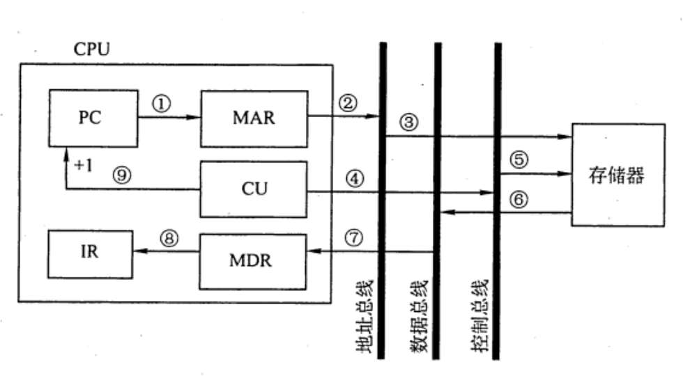
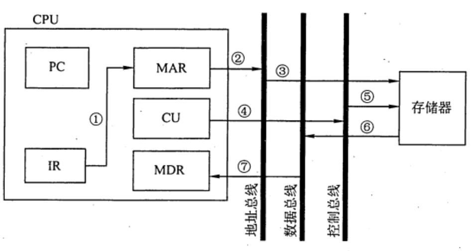
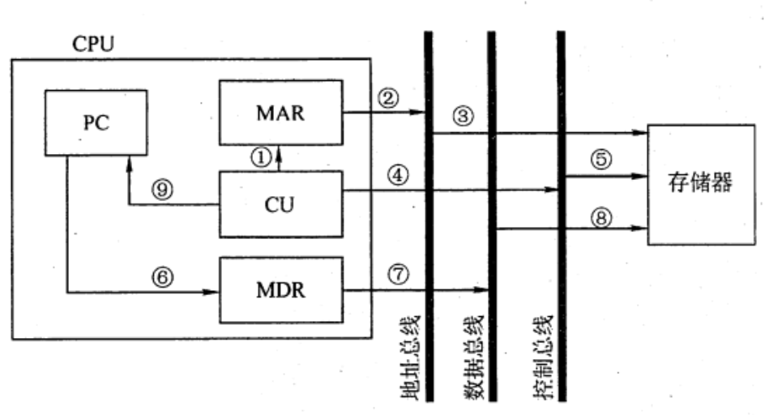

# 指令执行过程
2022.11.25

[TOC]

## 指令周期

> 1. 指令周期，机器周期，时钟周期(节拍/T周期)
> 2. 定长/不定长的机器周期
> 3. 取址、间址、执行、中断周期
> 4. FE、IND、EX、INT

CPU 从主存中<u>取出并执行</u>一条指令的时间称为**指令周期**，不同指令的指令周期可能不同。指令周期常用若干**机器周期**来表示，一个机器周期又包含者干**时钟周期**（也称**节拍或T周期**，它是 CPU 操作的最基本单位）。每个指令周期内的机器周期数可以不等，每个机器周期内的节拍数也可以不等。下图反映了上述关系。下图(a)为定长的机器周期，每个机器周期包含 4个节拍(T)；图(b)所示为不定长的机器周期，每个机器周期包含的节拍数可以为 4个，也可以为3个。

对于无条件转移指令JMP X，在执行时不需要访问主存，只包含取指阶段（包括取指和分析）和执行阶段，所以其指令周期仅包含取指周期和执行周期。

对于间接寻址的指令，为了取操作数，需要先访问一次主存，取出有效地址，然后访问主存，取出操作数，所以还需包括间址周期。间址周期介于取指周期和执行周期之间。

当 CPU 采用中断方式实现主机和 I/O 设备的信息交换时，CPU 在每条指令执行结束前，都要发中断查询信号，若有中断请求，则 CPU 进入中断响应阶段，又称中断周期。这样，一个完整的指令周期应包括**取指、间址、执行和中断**4个周期，如下图所示。

上述4个工作周期都有 CPU 访存操作，只是访存的目的不同。取指周期是为了取指令，间址周期是为了取有效地址，执行周期是为了取操作数，中断周期是为了保存程序断点，为了区别不同的工作周期，在 CPU 内设置 **4 个标志触发器FE、IND、EX 和INT**， 它们分别对应取指、间址、执行和中断周期，并以“1” 状态表示有效，分别由 1->FE、 1->IND、1->EX 和1->INT 这4个信号控制。

注意：中断周期中的进栈探作是将SP减1，这和传统意义上的进栈操作相反，原因是**计算机的堆栈中都是向低地址增加**，**所以进栈操作是减1而不是加1**.

## 指令周期的数据流

数据流是根据指令要求依次访问的数据序列。在指令执行的不同阶段，要求依次访问的数据序列是不同的。而且对于不同的指令，它们的数据流往往也是不同的。

### 取指周期

<u>取指周期的任务是根据 PC 中的内容从主存中取出指令代码并存放在IR中</u>。

取指周期的数据流如下图所示。PC 中存放的是指令的地址，根据此地址从内存单元中取出的是指令，并放在指令寄存器IR中，取指令的同时，PC加“1”。

**取指操作由硬件自动完成，无需得到相应的指令**。

取指周期的数据流向如下：

1. **PC** -(1)-> **MAR** -(2)-> **地址总线** -(3)-> **主存**
2. **CU** 发出**读命令** -(4)-> **控制总线** -(5)-> **主存**
3. **主存** -(6)-> **数据总线** -(7)-> **MDR** -(8)-> **IR**（存放指令）
4. **CU** 发出**控制信号** -(9)-> **PC** 内容**加 1**

### 间址周期

<u>间址周期的任务是取操作数有效地址</u>。以一次间址为例，将指令中的地址码送到 MAR 并送至地址总线，此后CU 向存储器发读命令，以获取有效地址并存至 MDR.

间址周期的数据流向如下：
1) **Ad(IR)（或 MDR)**  -(1)-> **MAR** -(2)-> **地址总线** -(3)-> **主存**
2) **CU** 发出**读命令** -(4)-> **控制总线** -(5)-> **主存**
3) **主存** -(6)-> **数据总线** -(7)-> **MDR**（存放有效地址）

<u>其中，Ad(R)表示取出 IR 中存放的指令字的地址字段</u>

### 执行周期

执行周期的任务是取操作数，并根据 IR 中的指令字的操作码通过 ALU 操作产生执行结果。不同指令的执行周期操作不同，因此没有统一的数据流向。

### 中断周期

<u>中断周期的任务是处理中断请求</u>。假设程序断点存入堆栈中，并用<u>**SP** 指示**栈顶地址**，而且进栈操作是先修改栈顶指针，后存入数据</u>，数据流如图所示。

中断周期的数据流向如下：(SP减1是进栈！)

1. **CU**控制将**SP减1**，**SP** -(1)-> **MAR** -(2)-> **地址总线** -(3)-> **主存**
2. **CU** 发出**写命令** -(4)-> **控制总线** -(5)-> **主存**
3. **PC** -(6)-> **MDR** -(7)-> **数据总线** -(8)-> **主存**（程序断点存入主存）
4. **CU**（中断服务程序的入口地址) -(9)-> **PC**

## 指令执行方案

一个指令周期通常要包括几个时间段（执行步骤），每个步骤完成指令的一部分功能，几个依次执行的步骤完成这条指令的全部功能。出于性能和硬件成本等考虑，可以选用3种不同的方案来安排指令的执行步骤

### 单指令周期

**对所有指令都选用相同的执行时间来完成**，称为**单指令周期方案**。此时每条指令都在固定的时钟周期内完成，指令之间**串行**执行，即下一条指令只能在前一条指令执行结束后才能启动。因此，指令周期取决于执行时间最长的指令的执行时间。对于那些本来可以在更短时间内完成的指令，要使用这个较长的周期来完成，会降低整个系统的运行速度。

### 多指令周期
**对不同类型的指令选用不同的执行步骤**，称为**多指令周期方案**。指令之间**串行**执行，即下条指令只能在前一指令执行完后才能启动。但可选用不同个数的时钟周期来完成不同指令的执行过程，指令需要几个周期就为其分配几个周期，不再要求所有指令占用相同的执行时间。

### 流水线方案

**指令之间可以并行执行的方案**，称为**流水线方案**，其追求的目标是力争在每个时钟脉冲周期完成一条指令的执行过程 （只在理想情况下才能达到该效果）。这种方案通过在每个时钟周期启动一条指令，尽量让多条指令同时运行，但各自处在不同的执行步骤中。

## 例题

1. 计算机工作的最小时间周期是（ ）
   A. 时钟周期
   B. 指令周期
   C. CPU周期
   D. 工作脉冲

   【答案】：A

2. 采用DMA 方式传递数据时，每传送一个数据就要占用（ ）
   A.指令周期
   B.时钟周期
   C.机器周期
   D.存取周期

   【答案】：D

3. 指令周期是指（）
   A. CPU从主存取出一条指令的时间
   B. CPU 执行一条指令的时间
   C. CPU从主存取出一条指令加上执行这条指令的时问
   D. 时钟周期时问

   【答案】：C

4. 指令（ ）从主存中读出
   A. 总是根据程序计数器
   B. 有时根据程序计数器，有时根据转移指令
   C. 根据地址寄存器
   D. 有时根据程序计数器，有时根据地址寄存器

   【答案】：A

5. 在一条无条件跳转指令的指令周期内，程序计数器（PC）的值被修改了（）次。
   A.1
   B.2
   C.3
   D.不能确定

   【答案】：B

6. 在取指操作后，程序计数器中存放的是(）。
   A. 当前指令的地址
   B. 程序中指令的数量
   C. 已执行的指令数量
   D.下一条指令的地址

   【答案】：A->D

7. 以下叙述中，错误的是（ ）。
   A. 指令周期的第一个操作是取指令
   B. 为了进行取指操作，控制器需要得到相应的指令
   C. 取指操作是控制器自动进行的
   D. 指令执行时有些操作是相同或相似的

   【答案】：D->B

8. 指令周期由一个到几个机器周期组成，第一个机器周期是（）.
   A. 从主存中取出指令字
   B. 从主存中取出指令操作码
   C. 从主存中取出指今地址码
   D. 从主存中取出指令的地址

   【答案】：A

9. 由于 CPU 内部操作的速度较快，而 CPU 访问一次存储器的时间较长，因此机器周期通常由（）来确定．
   A. 指令周期
   B. 存取周期
   C. 间址周期
   D. 中断周期

   【答案】：B

10. 以下有关机器周期的叙述中，错误的是( )。
    A．通常把通过一次总线事务访问一次主存或 IO 的时间定为一个机器周期
    B. 一个指令周期通常包含多个机器周期
    C. 不同的指令周期所包含的机器周期数可能不同
    D. 每个指令周期都包含一个中断响应机器周期

    【答案】：D

11. 下列说法中，合理的是().
    A.执行各条指令的机器周期数相同，各机器周期的长度均匀
    B. 执行各条指令的机器周期数相同，各机器周期的长度可变
    C.执行各条指令的机器周期数可变，各机器周期的长度均匀
    D．执行各条指令的机器周期数可变，各机器周期的长度可变

    【答案】：C->D

12. 以下关于间址周期的描述中，正确的是（）。
    A. 所有指令的间址操作都是相同的
    B. 凡是存储器间接寻址的指令，它们的操作都是相同的
    C．对于存储器间接寻址和寄存器间接寻址，它们的操作是不同的
    D. 都不对

    【答案】：D->C

13. CPU 响应中断的时间是（ ）。
    A.一条指令执行结束
    C.取指周期结束
    B. IO设备提出中断
    D.指令周期结束

    【答案】：A

14. 以下叙述中，错误的是（ ）。
    A. 取指操作是控制器固有的功能，不需要在操作码控制下完成
    B. 所有指令的取指操作是相同的
    C. 在指令长度相同的情况下，所有指令的取指操作是相同的
    D. 中断周期是在指令执行完成后出现的

    【答案】：B

15. （ ）可区分存储单元中存放的是指令还是数据。
    A. 控制器
    B.运箅器
    C.存储器
    D.数据通路

    【答案】：A

16. 下列说法中，正确的是（ ）。
    I. 指令字长等于机器字长的前提下，取指周期等于机器周期
    II. 指令字长等于存储字长的前提下，取指周期等子机器周期
    III. 指令字长和机器字长的长度没有任何关系
    IV. 为了硬件设计方便，指令字长都和存储字长一样大
    A. II、III
    B. II、III、IV
    C. I、III、IV
    D. I、IV

    【答案】：B->A。指令字长一般都取存储字长的整数倍，若指令字长等于存储字长的2倍，则需要两次访存，取指周期等于机器周期的 2 倍；若指令字长等于存储字长，则取指周期等于机器周期，因
    此I错。根据I的分析可知，II正确。指令字长取决于操作码的长度、操作数地址的长度和操作数地址的个数，与机器字长没有必然的联系。但为了硬件设计方便，指令字长一般取字节或存储字长的整数倍，因此 III 正确。根据 III 的分析可知，指令字长一般取字节或存储字长的整数倍，而不一定都和存储字长一样大，因此IV错误。综上所述，II、III正确。

17. 【2009 统考真题】冯•诺依曼计算机中指令和数据均以二进制形式存放在存储器中，CPU 区分它们的依据是（ ）。
    A.指令操作码的译码结果
    B.指令和数据的寻址方式
    C.指令周期的不同阶段
    D．指令和数据所在的存储单元

    【答案】：C

18. 【2011 统考真题】假定不采用Cache 和指令预取技术，且机器处于 “开中断状态，则在下列有关指令执行的叙述中，错误的是( )。
    A. 每个指令周期中 CPU 都至少访问内存一次
    B. 每个指令周期一定大于等于一个CPU 时钟周期
    C. 空操作指令的指令周期中任何寄存器的内容都不会被改变
    D. 当前程序在每条指令执行结束时都可能被外部中断打断

    【答案】：C