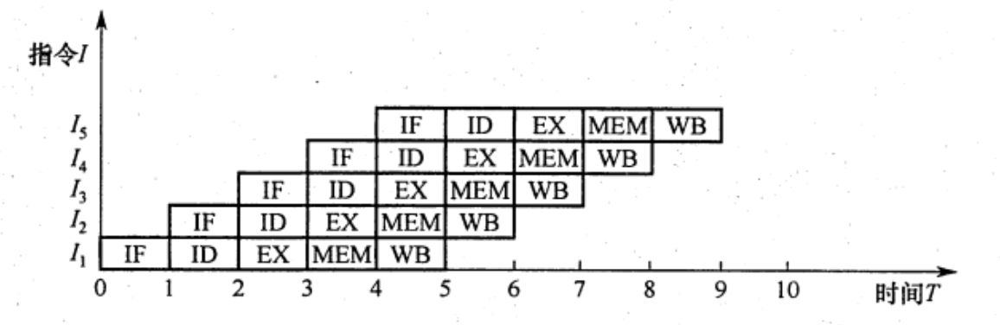

# 指令流水线
2022.08.29

[TOC]

前面介绍的指令都是在单周期处理机中采用串行方法执行的，同一时刻 CPU 中只有一条指令在执行，因此各功能部件的使用率不高。现代计算机普遍采用指令流水线技术，同一时刻有多条指令在 CPU 的不同功能部件中并发执行，大大提高了功能部件的并行性和程序的执行效率。

## 指令流水线的基本概念

可从两方面提高处理机的并行性

①**时间上的并行技术**，将一个任务分解为几个不同的子阶段，每个阶段在不同的功能部件上并行执行，以便在同一时刻能够同时执行多个任务，进而提升系统性能，这种方法被称为**流水线技术**。

②**空间上的井行技术**，在一个处理机内设置多个执行相同任务的功能部件，并让这些功能部件并行工作，这样的处理机被称为**超标量处理机**。

### 指令流水的定义

<u>一条指令的执行过程可分解为若干阶段，每个阶段由相应的功能部件完成。如果将各阶段视为相应的流水段，则指令的执行过程就构成了一条指令流水线</u>。

假设一条指令的执行过程分为如下 5个阶段（也称功能段或流水段）：

1. 取指（IF)：从指令存储器或 Cache 中取指令
2. 译码/读寄存器(ID)：操作控制器对指令进行译码，同时从寄存器堆中取操作数
3. 执行/计算地址（EX）：执行运算操作或计算地址。
4. 访存(MEM)：对存储器进行读写操作。
5. 写回 (WB)：将指令执行结果写回寄存器堆。

把k＋1条指令的取指阶段提前到第k条指令的译码阶段，从而将第k+1条指令的译码阶段与第k条指令的执行阶段同时进行，如图所示。



理想情况下，每个时钟周期都有一条指令进入流水线，每个时钟周期都有一条指令完成，每条指令的时钟周期数（即CPI）都为 1。

流水线设计的原则是，指令流水段个数以最复杂指令所用的功能段个数为准：流水段的长度以最复杂的操作所花的时间为准。假设某条指令的 5 个阶段所花的时间分别如下。①取指：200ps： ② 译码：100ps： ③ 执行：150ps; ④访存：200ps: ⑤写回：100ps，该指令的总执行时间为 750ps。按照流水线设计原则，每个流水段的长度为 200ps，所以每条指令的执行时间为1ns， 反而比串行执行时增加了 250ps。 假设某程序中有 N 条指令，单周期处理机所用的时间为Nx750ns， 而流水线处理机所用的时间为(N ＋ 4)x200ns。由此可见，流水线方式并不能缩短单条指令的执行时间，但对于整个程序来说，执行效率得到了大幅增高。

为了利于实现指令流水线，<u>指令集应具有如下特征</u>：

1. **指令长度应尽量一致**，有利于简化取指令和指令译码操作。否则，取指令所花时间长短不一，使取指部件极其复杂，且也不利于指令译码。
2. **指令格式应尽量规整**，尽量保证源寄存器的位置相同，有利于在指令未知时就可取寄存器操作数，否则须译码后才能确定指令中各寄存器编号的位置。
3. 采用 **Load/Store** 指令，其他指令都不能访问存储器，这样可把 Load/Store 指令的地址计算和运算指令的执行步骤规整在同一个周期中，有利于减少操作步骤。
4. 数据和指令在存储器中**“对齐”**存放。这样，有利于减少访存次数，使所需数据在一个流水段内就能从存储器中得到.

### 流水线的表示方法

通常用**时空图**来直观地描述流水线的执行情况。

在时空图中，横坐标表示时间，它被分割成长度相等的时间段T; 纵坐标为空间，表示当前指令所处的功能部件。在下图中，第一条指令I1 在时刻 0进入流水线，在时刻 5T 流出流水线。第二条指令 I2，在时刻下进入流水线，在时刻6T 流出流水线。以此类推，每隔一个时间T就有一条指令进入流水线，从时刻5T开始每隔一个时间下就有一条指令流出流水线。


从图中可看出，在时刻 10T 时，流水线上便有 6条指令流出。若采用串行方式执行，在时刻 10T时，只能执行2条指令，可见使用流水线方式成倍地提高了计算机的速度。只有大量连续任务不断输入流水线，才能充分发挥流水线的性能，而指令的执行正好是连续不断的，非常适合采用流水线技术。对于其他部件级流水线，如浮点运算流水线，同样也仅适合于提升浮点运算密集型应用的性能，对于单个运算是无法提升性能的。

## 流水线的基本实现

在单周期实现中，这5个功能段是串连在一起的，如图所示。将程序计数器 (PC)的值送入IF 段取指令，然后依次进入 ID、EX、MEM、WB 段。虽然不是所有指令都必须经历完整的 5 个阶段，但只能以执行速度最慢的指令作为设计其时钟周期的依据，单周期 CPU 的时钟频率取决于数据通路中的关键路径 (最长路径），因此单周期 CPU 指令执行效率不佳。


### 流水线的数据通路

> Overview:
>
> 流水寄存器中的数据传递情况

一个5段流水线数据通路如下图所示。其中：

1. IF 段包括程序计数器 (PC)、指令存储器、下条指令地址的计算逻辑
2. ID 段包括操作控制器、取操作数逻辑、立即数符号扩展模块
3. EX 段主要包括算术逻辑单元 （ALU）、分支地址计算模块
4. MEM 段主要包括数据存储器读写模块
5. WB 段主要包括寄存器写入控制模块。

每个流水段后面都需要增加一个流水寄存器，用于锁存本段处理完成的数据和控制信号，以保证本段的执行结果能在下个时钟周期给下一流水段使用，图中增加了 4 个流水寄存器，并根据其所连接的功能段来命名。各种寄存器和数据存储器均采用统一时钟 CLK 进行同步，每来一个时钟，就会有一条新的指令进入流水线 IF 段：同时流水寄存器会锁存前段加工处理完成的数据和控制信号，为下一段的功能部件提供数据输入。


不同流水寄存器锁存的数据不相同，如上图中的实线表示。IF/ID 流水寄存器需要锁存从指令存储器取出的指令字，以及PC+4的值：ID/EX 流水寄存器需要锁存从寄存器堆中取出的两个操作数 RS 和 RT（指令中两个操作数字段对应的寄存器值） 与写寄存器编号 VritcReg， 以及立即数符号扩展的值、PC ＋4等后段可能用到的操作数：EX/MEM 流水寄存器需要锁存 ALU 运算结果、数据存储器待写入数据 WriteData、写寄存器编号 WriteRcg#等数据：MEM/WB 流水寄存器话要锁存 ALU 运算结果、数据存储器读出数据、写寄存器编号 WritcReg#等数据。

### 流水线的控制信号

上节描述了数据通过流水寄存器进行传递的情况。但是在某一时刻，每个流水段执行不同指令的某个阶段，每个流水段还需要<u>正在执行指令的对应功能段的控制信号</u>。

上图中的控制信号（虚线表示）如下表所示。<u>控制信号的来源并不一致</u>，如IF段的分支转跳信号 BranchTaken 来源于 EX 段，ID段的 RegWrite 信号来源于 WB 段。其他控制信号通过控制器产生，由ID段负责译码生成控制信号，并分别在随后的各个时钟周期内使用。

|  控制信号   | 位置 | 来源 |                           功能说明                           |
| :---------: | :--: | :--: | :----------------------------------------------------------: |
| BranchTaken |  IF  |  EX  | 分支跳转信号，为1表示跳转，由EX段的Branch信号与equal标志进行逻辑与生成 |
|   RegDst    |  ID  |  ID  | 写入目的寄存器选择，为1时目的寄存器为rd寄存器，为0时为rt寄存器 |
|  RegWrite   |  ID  |  WB  | 控制寄存器推写操作，为1时数据需要写回寄存器堆中的指定寄存器  |
|   AluSre    |  EX  |  EX  | ALU的第二个输入选择控制，为0时输入寄存器rt，为1时输入扩展后的立即数 |
|    AluOp    |  EX  |  EX  |      控制ALU进行不同运算，具体取值和位宽与ALU的设计有关      |
|  MemWrite   | MEM  | MEM  |    控制数据存储器写操作，为0时进行读操作，为1时进行写操作    |
|  MemToReg   |  WB  |  WB  | 为1时将数据存储器读出数据写回寄存器堆，否则将ALU运算结果写回 |

控制器的输入主要是 IF/ID 流水寄存器锁存的指令字中的 OP 字段，输出为 7个控制信号其中 RegDst 信号在 ID 段使用，其他6个后段使用的控制信号输出到 ID/EX 流水寄存器中并依次向后传递，以供后续各流水段使用。RegWrite 信号必须传递至 WB 段后才能反馈到 ID 段的寄存器堆的写入控制段 WE；条件分支译码信号 Branch 也需要传递到EX 段，与 ALU 运算的标志 equal 信号进行逻我与操作后，反馈到ID段控制多路选择器进行分支处理。

综上所述，每个流水奇存器中保存的信息包括：①后面流水段需要用到的所有数据信息包括 PC ＋4、指令、立即数、目的寄存器、ALU 运算结果、标志信息等，它们是前面阶段在数据通路中执行的结果：②前面传递过来的后面各流水段要用到的所有控制信号。

### 流水线的执行过程

由于流水线的特殊结构，所有指令都需要完整经过流水线的各功能段，只不过某些指令在某些功能段内没有任何实质性的操作，只是等待一个时钟周期，这也就意味着单条指令的执行时间还是 5个功能段时间延迟的总和。


1. 取指（IF）

   将PC值作为地址从指令寄存器中取出第一条指令字：并计算PC +4， 送入PC 输入端，以便在下一个时钟周期取下条指令，这些功能由取指部件完成。取出的指令字通过 RD 输出端送入 I/D 流水寄存器，PC＋4也要送入IF/ID 流水寄存器，以备后续可能使用（如相对转移指令）。只要是后续功能段有可能要用到的数据和控制信号，都要向后传递。时钟到来时将更新后的 PC值和指令字锁存到IF/ID 流水奇存器中：本条指令I1进入ID段，IF段取出下条指令I2。

2. 译码/读寄存器(ID)

   由控制器根据 IF/ID 流水寄存器中的指令字生成后续各段需要的控制信号。对于 Iw 访存指令，根据指令字中的rs、rt取出寄存器堆中的值 RS 和RT；符号扩展单元会将指令字中的 16位立即数符号扩展为 32 位；多路选择器根据指令字生成指令可能的写寄存器编号 WiteReg#。时钟到来时，这些数据和控制信号，连同顺序指令地址 PC ＋4，都会锁存到 ID/EX 流水寄存器中：指令I1进入EX 段，同时下条指令I2进入ID段，下下条指令I3进入IF段。

3. 执行/计算地址 (EX)

   EX 段功能由具体指令确定，不同指令经 ID 段译码后得到不同的控制信号。对于 Iw 指令，EX 主要用来计算访存地址，将ID/EX 流水奇存器中的 RS 值与符号扩展后的立即数相加得到的访存地址送入 EX/MEM 流水奇存器。Ex 段可能还要计算分支地址，生成分支转跳信号 Branch Taken。 RT 的值可能会在 MEM 段作为写入数据使用，所以 RT 会作为写入数据 Write Data 送入 EXMEM 流水寄存器；ID/EX 流水寄存器中的写寄存器编号 WriteReg#也将直接传送给 EX/MEM 流水寄存器。时钟到来后，这些数据和后段需要的控制信号都会锁存到 EX/MEM 流水寄存器中：指令I1进入 MEM 段，后续指令I2、I3、I4分别进入区X、DD、IF段。

4. 访存 (MEM)

   MEM 段的功能也由具体指令确定。对于Iw指令，主要是根据 EX/MEM 流水寄存器中锁存的访存地址，写入数据和内存读写控制信号 Mem Write 对存储器进行读或写操作。EX/MEM 流水寄存器中的访存地址、WriteReg#、数据存储器读出的数据都会送入 MEM/WB 流水奇存器，以备后续可能使用。时钟到来后，这些数据和后段需要的控制信号都会锁存到 MEM/WB 流水寄存器中；指令I1进入WB段，后续指令分别进入MEM、EX、DD、IF段。

5. 写回(WB)

   WB 段的功能也由具体指令确定。将MEM/WB 流水奇存器中数据存储器读出的数据写回指定寄存器 WriteReg#。时钟到来时会完成数据写入寄存器，指令I1，离开流水线。此时，指令I2进入最后的WB段，后续指令分别进入 MEM、EX、ID段，指令I6进入正段。

## 流水线的冒险与处理

在指令流水线中，可能会遇到一些情况使得流水线无法正确执行后续指令而引起流水线阻塞或停顿，这种现象称为流水线冒险。根据导致冒险的原因不同主要有 3种：结构冒险（资源冲突）、数据冒险（数据冲突）和控制冒险（控制冲突）。

### 结构冒险

由于多条指令在同一时刻争用同一资源而形成的冲突，也称为**资源冲突**，即由硬件资源竞争造成的冲突，有以下两种解决办法：

1. 前一指令访存时，使后一条相关指令（以及其后续指令）**暂停一个时钟周期**。
2. **单独设置数据存储器和指令存储器**，使取数和取指令操作各自在不同的存储器中进行。事实上，现代计算机都引入了 Cache 机制，而 L1 Cache 通常采用数据 Cache 和指令Cache 分离的方式，因而也就避免了资源冲突的发生。

### 数据冒险

在一个程序中，<u>下一条指令会用到当前指令计算出的结果</u>，此时这两条指令发生数据冲突。当多系指令重叠处理时就会发生冲突，数据冒险可分为三类（结合综合题了理解）：

1. **写后读** (Read Affer Write, RAW） 相关：表示当前指令将数据写入寄存器后，下一条指令才能从该寄存器读取数据。否则，先读后写，读到的就是错误（旧）数据。
2. **读后写**(Write Afer Read, WAR)相关：表示当前指令读出数据后，下一条指令才能写该寄存器。否则，先写后读，读到的就是错误（新）数据。
3. **写后写**(Write Afier Write, WAW）相关：表示当前指令写入奇存器后，下一条指令才能写该寄存器。否则，下一条指令在当前指令之前写，将使寄存器的值不是最新值。

解决的办法有以下几种：

1. 把遇到数据相关的指令及其后线指令都**暂停**一至几个时钟周期，直到数据相关问题消失后再继续执行，可分为**硬件阻塞（stall）**和**软件插入 “NOP” 指令**两种方法，
2. 设置**相关专用通路**，即不等前一条指令把计算结果写回寄存器组，下一条指令也不再读寄存器组，而直接把前一条指令的 ALU 的计算结果作为自己的输入数据开始计算过程，使本来需要暂停的操作变得可以继续执行，这称为数据旁路技术。
3. 通过编译器对数据相关的指令**编译优化**的方法，调整指令顺序来解决数据相关。

### 控制冒险

指令通常是顺序执行的，但足在遇到改变指令执行顺序的情况，例如执行转移、调用或返回等指令时，会**改变PC值，会造成断流**，从而引起控制冒险。解决的办法有以下几种：

1. 对转移指令进行**分支预测**，尽早生成转移目标地址。分支预测分为简单（静态）预测和动态预测。静态预测总是预测条件不满足，即继续执行分支指令的后续指令。动态预测根据程序执行的历史情况，进行动态预测调整，有较高的预测准确率。
2. 预取转移成功和不成功两个控制流方向上的目标指令。
3. 加快和提前形成条件码。
4. 提高转移方向的猜准率。

注意：Cache 缺失的处理过程也会引超流水线阻塞。在不过多增加硬件成本的情況下，如何尽可能地提高指令流水线的运行效率是选用指令流水线技术必须解决的关键问题。

## 流水线的性能指标

1. 流水线的吞吐率

   流水线的吞吐率是指在单位时间内流水线所完成的任务数量，或输出结果的数量。流水线吞吐率（TP）的最基本公式为
   $$
   TP = \frac{n}{T_k}
   $$
   式中，n 是任务数，Tk 是处理完 n 个任务所用的总时间。设 k 为流水段的段数，$\Delta t$为时钟周期。在输入流水线中的任务连续的理想情况下，一条k段流水线能在k+n-1个时钟周期内完成n个任务。得出流水线的吞吐率为
   $$
   TP=\frac{n}{(k+n-1)\Delta t}
   $$
   当n趋近于无穷时，$S_{max}=k$

## 高级流水线技术

有两种增加指令级并行的策略：一种是**多发射技术**，它通过采用多个内部功能部件，使流水线功能段能同时处理多条指令，处理机一次可以发射多条指令进入流水线执行：另一种是**超流水线技术**，它通过增加流水线级数来使更多的指令同时在流水线中重登执行。

### 超标量流水线技术

超标最流水线技术也称动态多发射技术，每个时钟周期内可并发多条独立指令，以并行操作方式将两条或多条指令编译并执行，为此需配置多个功能部件。超标量技术不能调监指令的执行顺序，此通过编译优化技术，把可并行执行的指令搭配起来，挖掘更多的指令并行性。


### 超长指令字技术

超长指令字技术也称静态多发射技术，由编译程序挖掘出指令间潜在的并行性，将多条能并行操作的指令组合成一条具有多个操作码字段的超长指令字（可达几百位），为此需要采用多个处理部件。

### 超流水线技术

如图所示，流水线功能段划分得越多，时钟周期就越短，指令吞吐率也就越高，因此超流水线技术是通过提高流水线主频的方式来提升流水线性能的。但是，流水线级数越多，用于流水寄存器的开销就越大，因而流水线级数是有限制的，并不是越多越好


## 例题

1. 下列关于流水 CPU 基本概念的描述中，正确的是 （ ）。
   A. 流水CPU 是以空问并行性为原理构造的处理器
   B. 流水CPU一定是RISC 机器
   C. 流水CPU一定是多媒体 CPU
   D. 流水CPU 是一种非常经济而实用的时问并行技术

   【答案】：D

2. 下列关子超标量流水线的描述中，不正确的是（）。
   A. 在一个时钟周期内一条流水线可执行一条以上的指令
   B. 一条指令分为多段指令由不同电路单元完成
   C. 超标量通过内置多条流水线来同时执行多个处理器，共实质是以空问换取时问
   D. 超标量流水线是指运算操作并行

   【答案】：B->D

3. 下列关于动态流水线的描述中，正确的是(）。
   A. 动态流水线是指在同一时问内，当某些段正在实现某种运算时，另一些段却正在进行另一种运算，这样对提高流水线的效率很有好处，但会使流水线控制变得很复杂
   B. 动态流水线是指运算操作并行
   C. 动态流水线是指指令步骤并行
   D. 动态流水线是指程序步骤并行

   【答案】：？->A。**动态流水线**是相对于静态流水线而言的，静态流水线上下段连接方式固定，而动态流水线的连接方式是可变的。

4. 流水 CPU 是由一系列称为“段”的处理线路组成的。一个m段流水线稳定时的 CPU 的吞吐能力，与m 个并行部件的CPU 的吞吐能力相比,( )。
   A. 具有同等水平的吞吐能力
   B. 不具各同等水平的吞吐能力
   C. 吞吐能力大于前者的吞吐能力
   D. 吞吐能力小于前者的吞吐能力

   【答案】：D->A

5. 设指令由取指、分析、执行3个子部件完成，并且每个子部件的时问均为Delta t，若来用常规标号单流水线处理机（即处理机的度为 1），连续执行 12 条指令，共需（）。
   A. 12Delta t
   B. 14Delta t
   C. 16Delta t
   D. 18Delta t

   【答案】：12+3-1=14, B

6. 若来用度为4的超标量流水线处理机，连续执行上述20 条指令，只需（).
   A. 3Delta t
   B. 5Delta t
   C. 7Delta t
   D. 9Delta t

   【答案】：5+3-1=7，C

7. 设指令流水线把一条指令分为取指、分析、执行3 部分，且了部分的时间分别是t取指=2ns， t分析=2ns,t执行=1ns，則 100 条指令全部执行完毕需（）
   A. 163ns
   B. 183ns
   C. 193ns
   D. 203ns

   【答案】：2x(100+3-1)=204，D

8. 设指令由取指、分析、执行 3个子部件完成，并且每个子部件的时间均为，若采用常规标量单流水线处理机，连续执行8 条指令，則该流水线的加速比为（ ).
   A. 3
   B. 2
   C. 3.4
   D. 2.4

   【答案】：8+3-1=10，24/10=2.4，D

9. 指令流水线中出现数据相关时流水线將受阻，（）可解决数据相关问题。
   A.增加硬件资源
   B. 采用旁路技术
   C. 采用分支预测技术
   D.以上都可以

   【答案】：D->B

10. 下西有关控制相关的描述中，错误的是()
    A. 条件转移指令可能引起控制相关
    B. 在分支指令加入若千空操作可以避免控制冒险
    C．采用转发（旁路）技术，可以解决部分控制相关
    D.通过编译器调整指令执行顺序可解决部分控制冒险

    【答案】：C

11. 关于流水线技术的说法中，错误的是(）。
   A. 超标量技术需要配置多个功能部件和指令译码电路等
   B. 与超标量技术和超流水线技术相比，超长指令字技术对优化编译器要求更高，而无其他硬件要求
   C.流水线按序流动时，在RAW、 WAR 和WAW 中，只可能出现RAW 相关
   D.超流水线技术相当于将流水线再分段，从而提高每个周期内功能部件的使用次数

   【答案】：B

12. 【2009 统考真题】某计算机的指令流水线由 4 个功能段组成，指令流经各功能段的时间（忽略各功能段之问的缓存时间）分别为 9Ons、 80ns、70ns 和60ns，则该计算机的CPU周期至少是（）。
    A. 90ns
    B. 80ns
    C. 7Ons
    D. 60ns

    【答案】：A

13. 【2010 统考真题】下列不会引起指令流水线阻塞的是（）。
    A.数据旁路
    B.数据相关
    C.条件转移
    D.资源冲突

    【答案】：A

14. 【2013统考真题】某 CPU 主频为 1.03GHz，来用**4 级**指令流水线，每个流水段的执行需要1个时钟周期。假定CPU 执行了 100 条指令，在其执行过程中，没有发生任何流水线阻塞，此时流水线的吞吐率为（）。
    A. 0.25x10^9 条指令/秒
    B. 0.97x10^9条指令/秒
    C. 1.0x10^9条指令/秒
    D. 1.03x10^9 条指令/秒

    【答案】：100+4-1=103，100/103x1.03=C

15. 【2016 统考真题】在无转发机制的**五段**基本流水线（取指、译码/读寄存器、运算、访写回寄存器）中，下列指令序列存在数据冒险的指令对是（ ）
    I1: add R1, R2, R3; (R2) + (R3) ->R1
    I2: add R5. R2. R4: (R2) + (R4)->R5
    I3: add R4, R5, R3; (R5) + (R3)->R4
    I4: add R5, R2, R6: (R2) + (R6)->R5
    A. I1和I2
    B. I2和I3
    C. I2和I4
    D. I3和I4

    【答案】：B

16. 【2017 统考真题】下列关于超标量流水线特性的叙述中，正确的是（ ）
    I.能缩短流水线功能段的处理时间
    II.能在一个时钟周期内同时发射多条指令
    III. 能结合动态调度技术提高指令执行并行性
    A.仅II
    B.仅I、III
    C仅II、III
    D. I. II 和 III

    【答案】：C

17. 【2017 统考真题】下列关于指令流水线<u>数据通路</u>的叙述中，错误的是(〕
    A.包含生成控制信号的控制部件
    B. 包含算术逻拜运算部件(ALU)
    C．包含通用寄存器组和取指部件
    D.由组合逻辑电路和时序逻辑电路组合而成

    【答案】：D->A

18. 【2018 统考真题】若莱计第机最复杂指令的执行需要完成5个子功能，分别由功能部件A~E实现，各功能部件所需时问分别为 80ps、 50ps、 50ps、 70ps 和50ps， 来用流水线方式执行指令，流水段寄存器延时为20ps，则CPU 时钟周期至少为（）。
    A. 60ps
    B. 70ps
    C. 80ps
    D. 100ps

    【答案】：D

19. 【2019统考真题】在来用“取指、译码/取数、执行、访存、写回” 5段流水线的处理器中，执行如下指令序列，共中s0、s1、s2、s3 和t2表示寄存器编号
    ```c
    I1: add s2, s1, s0   //R[s2] <-R[s1] +R[s0]
    I2: load s3,0 (t2)   //R[s3] <-M[R[t2]+0]
    I3: add s2, s2, s3  //R[s2] <- R[s2] +R[s3]
    I4: store s2,0 (t2) //M[R[t2]+0] <- R[s2]
    ```

    下列指令对中，不存在数据冒险的是（ ）.
    A. I1 和I3
    B. I2和I3
    C. I2 和I4
    D. I3和14

    【答案】：C

20. 【2020 统考真题】下列给出的处理器类型中，理想情况下，CPI为1的是（）。

    I. 单周期CPU II. 多周期CPU III. 基本流水线CPU IV. 超标量流水线 CPU
    A. 仅I、II
    B. 仅I、III
    C. 仅II、IV
    D. 仅III、IV

    【答案】：D->B
