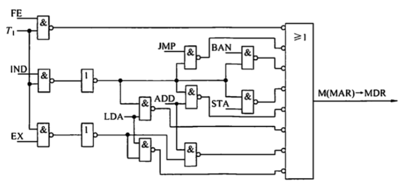

# 控制器的功能和工作原理
2022.08.28

[TOC]

## 硬布线控制器

硬布线控制器有复杂的组合逻辑门电路和一些触发器组成，又称组合逻辑控制器。

### 硬布线控制单元图

<u>指令的操作码</u>是决定控制单元发出不同操作命令（控制信号）的关键。为了简化控制单元(CU）的逻辑，将指令的<u>操作码译码和节拍发生器</u>从 CU <u>分离</u>出来，便可得到简化的控制单元图。


CU 的<u>输入信号来源</u>如下：

1. 经指令译码器**译码产生的指令信息**。现行指令的操作码决定了不同指令在执行周期所需完成的不同操作，因此指令的操作码字段是控制单元的输入信号，它与时钟配合产生不同的控制信号。
2. 时序系统产生的机器周期信号和**节拍信号**。为了使控制单元按一定的先后顺序一定的节奏发出各个控制信号，控制单元必须受时钟控制，即一个时钟脉冲使控制单元发送一个操作命令，或发送一组需要同时执行的操作命令。
3. 来自执行单元的**反馈信息**即**标志**。控制单元有时需依赖 CPU 当前所处的状态产生控制信号，如BAN 指令，控制单元要根据上条指令的结果是否为负来产生不同的控制信号。

上图中，节拍发生器产生各机器周期中的节拍信号，使不同的微操作命令 Ci(控制信号）按时间的先后发出。个别指令的操作不仅受操作码控制，还受状态标志控制，因此 CU的输入来自操作码译码电路 DD、节拍发生器及状态标志，其输出到 CPU 内部或外部控制总线上。

注意：控制单元还接收来自**系统总线**（控制总线）的控制信号，如中断请求、DMA 请求。

> 小结：
>
> 1. **操作码**是关键
> 2. **操作码译码**和**节拍发生器**从CU分离
> 3. 输入信号：**译码产生的指令信息**，**节拍信号**，**执行单元的反馈信息**，**来自系统总线(控制总线)的信号**

### 硬布线控制器的时序系统及微操作

1. **时钟周期**。用时钟信号控制节拍发生器，可以产生节拍，每个节拍的宽度正好对应一个时钟周期。在每个节拍内机器可完成<u>一个或几个需同时执行</u>的操作。

2. **机器周期**。机器周期可视为所有指令执行过程中的一个基准时间。不同指令的操作不同，指令周期也不同。<u>访问一次存储器的时间是固定的，因此通常以存取周期作为基准时间</u>，即内存中读取一个指令字的最短时间作为机器周期。在存储字长等于指令字长的
   前提下，取指周期也可视为机器周期。

   <u>在一个机器周期里可完成若干微操作</u>，每个微操作都需一定的时间，可用时钟信号来控制产生每个微操作命令。

3. **指令周期**。指令周期详见 [5.2.1节](指令执行过程.md)

4. **微操作命令分析**。控制单元具有发出各种操作命令（控制信号）序列的功能。这些命令与指令有关，而且必须按一定次序发出，才能使机器有序地工作。执行程序的过程中，对于不同的指令，控制单元需发出各种不同的微操作命令。一条指令分为了个工作周期：取指周期、间指周期和执行周期。下面分析各个子周期的微操作命令。

5. **取指周期的微操作命令**。（无论是什么指令，取指周期都需有下列微操作命令）

   `PC->MAR`, 现行指令地址->MAR
   `1->R`, 命令存储器读
   `M(MAR)->MDR`, 现行指令从存储器中读至 MDR
   `MDR->IR`, 现行指令->IR
   `OP(IR)->CU`, 指令的操作码->CU 译码
   `(PC) + 1->PC`, 形成下一条指令的地址

6. **间址周期的微操作命令**。间址周期完成取操作数地址的任务，具体微操作命令如下：
   `Ad(IR)->MAR`, 将指令字中的地址码(形式地址)->MAR
   `1->R`, 命令存储器读
   `M(MAR)->MDR`, 将有效地址从存储器读至 MDR

7. **执行周期的微操作命令**。执行周期的微操作命令视不同指令而定。

   1. **非访存指令**
      `CLA`, 清 ACC, $0\to ACC$
      `COM`, 取反, $\overline{ACC}\to ACC$
      `SHR`, 算术右移, $L(ACC)\to R(ACC_0), ACC\to ACC_0$
      `CSL`, 循环左移, $R(ACC)\to L(ACC), ACC_0\to ACC_n$
      `STP`,  停机指令, $0\to G$
   2. **访存指令**
      `ADD X`, 加法指令
      Ad(IR)->MAR, 1-> R
      M(MAR)->MDR
      (ACC) + (MDR)->ACC
      `STA X`, 存数指令
      Ad(IR)->MAR, 1->W
      ACC->MDR
      MDR->M(MAR)
      `LDA X`, 取数指令
      Ad(IR)->MAR, 1->R
      M(MAR)->MDR
      MDR->ACC
   3. **转移指令**
      `JVP X`, 无条件转移
      Ad(IR)->PC
      `BAN X`,条件转移（负则转）
      $A_0\cdot Ad(IR) + \overline{A_0} \cdot(PC)\to PC$

### CPU 的控制方式
控制单元控制一条指令执行的过程，实质上是依次执行一个确定的微操作序列的过程。由于不同指令所对应的微操作数及复杂程度不同，因此每条指令和每个微操作所需的执行时间也不同。主要有以下3种控制方式。

1. **同步控制方式**。<u>所谓同步控制方式，是指系统有一个统一的时钟，所有的控制信号均来自这个统一的时钟信号</u>。通常以<u>最长的微操作序列</u>和最烦琐的微操作作为标准，采取完全统一的、具有相同时间间隔和相同数目的节拍作为机器周期来运行不同的指令，同步控制方式的优点是控制电路简单，缺点是运行速度慢。
2. **异步控制方式**。异步控制方式不存在基准时标信号，<u>各部件按自身固有的速度工作</u>，通过<u>应答方式</u>进行联络。异步控制方式的优点是运行速度快，缺点是控制电路比较复杂。
3. **联合控制方式**。联合控制方式是介于同步、异步之间的一种折中。这种方式对各种不同的指令的微操作实行大部分采用同步控制、小部分采用异步控制的办法。

### 硬布线拉制单元设计步骤

硬布线控制单元设计步骤包括：

1. **列出微操作命令的操作时间表**。先根据微操作节拍安排，列出微操作命令的操作时间表。操作时间表中包括各个机器周期、节拍下的每条指令完成的微操作控制信号。

   下表列出了 CLA、COM、SHR 等10条机器指令微操作命令的操作时间表。表中 FE、IND 和EX为CPU 工作周期标志，T0～T2，为节拍，<u>I为间址标志</u>，在取指周期的T2时刻，若测得 I=1，则 IND 触发器置“1”，标志进入间址周期：若I=0，则EX 触发器置“1”，标志进入执行周期。同理，在间址周期的T2，时刻，若测得 IND=0（表示一次间接寻址），则EX 触发器置“1”，进入执行周期，若测得 IND=1（表示多次间接寻址），则继续间接寻址。在执行周期的 T2时刻，CPU 要向所有中断源发中断查询信号，若检测到有中断请求并满足响应条件，则 INT 触发器置“1”，标志进入中断周期。表中未列出 INT 触发器置“1” 的操作和中断周期的微操作。表中第一行对应 10 条指令的操作码，代表不同的指令。若某指令有表中所列出的微操作命令，其对应的单元格内为 1。

2. **进行微操作信号综合**。在列出微操作时间表后，即可对它们进行综合分析、归类，根据微操作时间表可写出各微操作控制信号的逻辑表达式并进行适当的简化。表达式一般包括下列因素：
   `徹操作控制信号 = 机器周期^节拍^脉冲^操作码^机器状态条件`。根据下表便可列出每个微操作命令的初始逻辑表达式，经化简、整理可获得能用现有门电路实现的微操作命令逻辑表达式。

| 周<br />期 | 节<br />拍 |    条<br />件    |          信<br />号           | C<br />L<br />A | C<br />O<br />M | S<br />H<br />R | C<br />S<br />L | S<br />T<br />P | A<br />D<br />D | S<br />T<br />A | L<br />D<br />A | J<br />M<br />P | B<br />A<br />N |
| :--------: | :--------: | :--------------: | :---------------------------: | :-------------: | :-------------: | :-------------: | :-------------: | :-------------: | :-------------: | :-------------: | :-------------: | :-------------: | :-------------: |
|     FE     |     T0     |                  |           `PC->MAR`           |        1        |        1        |        1        |        1        |        1        |        1        |        1        |        1        |        1        |        1        |
|            |            |                  |            `1->R`             |        1        |        1        |        1        |        1        |        1        |        1        |        1        |        1        |        1        |        1        |
|            |     T1     |                  |         `M(MAR)->MDR`         |        1        |        1        |        1        |        1        |        1        |        1        |        1        |        1        |        1        |        1        |
|            |            |                  |         `(PC)+1->PC`          |        1        |        1        |        1        |        1        |        1        |        1        |        1        |        1        |        1        |        1        |
|            |     T2     |                  |           `MDR->IR`           |        1        |        1        |        1        |        1        |        1        |        1        |        1        |        1        |        1        |        1        |
|            |            |                  |         `OP(IR)->ID`          |        1        |        1        |        1        |        1        |        1        |        1        |        1        |        1        |        1        |        1        |
|            |            |       $I$        |           `1->IND`            |                 |                 |                 |                 |                 |        1        |        1        |        1        |        1        |        1        |
|            |            |  $\overline{I}$  |            `1->EX`            |        1        |        1        |        1        |        1        |        1        |        1        |        1        |        1        |        1        |        1        |
|    IND     |     T0     |                  |         `Ad(IR)->MAR`         |                 |                 |                 |                 |                 |        1        |        1        |        1        |        1        |        1        |
|            |            |                  |            `1->R`             |                 |                 |                 |                 |                 |        1        |        1        |        1        |        1        |        1        |
|            |     T1     |                  |         `M(MAR)->MDR`         |                 |                 |                 |                 |                 |        1        |        1        |        1        |        1        |        1        |
|            |     T2     |                  |         `MDR->Ad(IR)`         |                 |                 |                 |                 |                 |        1        |        1        |        1        |        1        |        1        |
|            |            | $\overline{IND}$ |            `1->EX`            |                 |                 |                 |                 |                 |        1        |        1        |        1        |        1        |        1        |
|     EX     |     T0     |                  |         `Ad(IR)->MAR`         |                 |                 |                 |                 |                 |        1        |        1        |        1        |                 |                 |
|            |            |                  |            `1->R`             |                 |                 |                 |                 |                 |        1        |                 |        1        |                 |                 |
|            |            |                  |            `1->W`             |                 |                 |                 |                 |                 |                 |        1        |                 |                 |                 |
|            |     T1     |                  |         `M(MAR)->MDR`         |                 |                 |                 |                 |                 |        1        |                 |        1        |                 |                 |
|            |            |                  |           `AC->MDR`           |                 |                 |                 |                 |                 |                 |        1        |                 |                 |                 |
|            |     T2     |                  |       `(AC)+(MDR)->AC`        |                 |                 |                 |                 |                 |        1        |                 |                 |                 |                 |
|            |            |                  |         `MDR->M(MAR)`         |                 |                 |                 |                 |                 |                 |        1        |                 |                 |                 |
|            |            |                  |           `MDR->AC`           |                 |                 |                 |                 |                 |                 |                 |        1        |                 |                 |
|            |            |                  |            `0->AC`            |        1        |                 |                 |                 |                 |                 |                 |                 |                 |                 |
|            |            |                  |     $\overline{AC}\to AC$     |                 |        1        |                 |                 |                 |                 |                 |                 |                 |                 |
|            |            |                  | `L(AC)->R(AC)`<br />`AC0不变` |                 |                 |        1        |                 |                 |                 |                 |                 |                 |                 |
|            |            |                  |        $\rho^{-1}(AC)$        |                 |                 |                 |        1        |                 |                 |                 |                 |                 |                 |
|            |            |                  |         `Ad(IR)->PC`          |                 |                 |                 |                 |                 |                 |                 |                 |        1        |                 |
|            |            |      $A_0$       |         `Ad(IR)->PC`          |                 |                 |                 |                 |                 |                 |                 |                 |                 |        1        |
|            |            |                  |            `0->G`             |                 |                 |                 |                 |        1        |                 |                 |                 |                 |                 |

然后根据每个节拍的命令的逻辑表达式画出微操作命令的逻辑图。



## 微程序控制器

**微程序控制器**采用**存储逻辑**实现，也就是把微操作信号代码化，使每条机器指令转化成为一段微程序并存入一个专门的存储器（控制存储器）中，微操作控制信号由微指令产生。

### 微程序控制的基本概念

微程序设计思想就是将每条机器指令编写成一个微程序，每个微程序包含若干微指令，每条微指令对应一个或几个微操作命令。这些微程序可以存到一个控制存储器中，用寻址用户程序机器指令的办法来寻址每个微程序中的微指令。目前，大多数计算机都采用微程序设计技术。

微程序设计技术涉及的基本术语如下：

1. **微命令与微操作**。一条机器指令可以分解成一个微操作序列，这些<u>微操作</u>是计算机中<u>最基本的、不可再分解</u>的操作。在微程序控制的计算机中，将控制部件向执行部件发出的各种控制命令称为<u>微命令</u>，它是<u>构成控制序列的最小单位</u>。例如，打开或关闭某个控制门的电位信号、某个寄存器的打入脉冲等。<u>微命令和微操作是一一对应</u>的。微命令是微操作的控制信号，微操作是微命令的执行过程。

   微命令有相容性和互斥性之分。相容性微命令是指那些可以同时产生、共同完成某一些微操作的微命令；而互斥性微命令是指在机器中不允许同时出现的微命令。相容和互斥都是相对的，一个微命令可以和一些微命令相容，和另一些微命令互斥。

   注意：在组合逻辑控制器中也存在微命令与微操作这两个概念，它们并非只是微程序控制器的专有概念。

2. **微指令与微周期**。微指令是若干微命令的集合。存放微指令的控制存储器的单元地址称为微地址。一条微指令通常至少包含两大部分信息

   1. **操作控制字段**，又称微操作码字段，用于产生某一步操作所需的各种操作控制信号。
   2. **顺序控制字段**，又称微地址码字段，用于控制产生下一条要执行的微指令地址。微周期通常指从控制存储器中读取一条微指令并执行相应的微操作所需的时间。

3. **主存储器与控制存储器**。主存储器用于存放程序和数据，在CPU 外部，用RAM 实现：控制存储器（CM）用于存放微程序，在CPU 内部，用ROM实现。

4. **程序与微程序**。程序是指令的有序集合，用于完成特定的功能：微程序是微指令的有序集合，一条指令的功能由一段微程序来实现。

**微程序和程序**是两个不同的概念。微程序是由微指令组成的，用于描述机器指令。微程序实际上是机器指令的实时解释器，是由计算机设计者事先编制好并存放在控制存储器中的般不提供给用户。对于程序员来说，计算机系统中微程序的结构和功能是透明的，无须知道而程序最终由机器指令组成，是由软件设计人员事先编制好并存放在主存或辅存中的。

> 概念总结
>
> 1. 【机器指令】对应【微程序】
> 2. 【微程序】由【微操作】(执行过程)构成，每个微操作对应一个【微命令】(控制信号)
> 3. 【微指令】由【微操作】构成

读者应注意区分以下寄存器：

1. **地址寄存器（MAR）**。用于存放<u>主存的</u>读/写地址
2. **微地址寄存器（CMAR）**。用于存放<u>控制存储器</u>的读/写微指令的地址。
3. **指令寄存器（IR）**。用于存放从主存中读出的指令。
4. **微指令寄存器（CMDR 或uIR）**。用于存放从控制存储器中读出的微指令。

### 微程序控制器组成和工作过程

1. 微程序控制器的基本组成
   下图所示为一个微程序控制器的基本结构，主要画出了微程序控制器比组合逻辑控制器多出的部件，包括

   1. **控制存储器**。它是微程序控制器的核心部件，用于存放各指令对应的微程序，控制存储器可用只读存储器 ROM 构成。
   2. **微指令寄存器**。用于存放从 CM 中取出的微指令，它的位数同微指令字长相等。
   3. **微地址形成部件**。用于产生初始微地址和后继微地址，以保证微指令的连续执行。
   4. **微地址寄存器**。接收微地址形成部件送来的微地址，为在 CM 中读取微指令作准备。

   

2. 微程序控制器的工作过程

   微程序控制器的工作过程实际上就是在微程序控制器的控制下计算机执行机器指令的过程
   这个过程可以描述如下：

   1. 执行**取微指令**公共操作。具体的执行是：在机器开始运行时，自动将取指微程序的入口地址送入 CMAR，并从 CM 中读出相应的微指令送入 CMDR。取指微程序的入口地址一般为CM 的 <u>0号单元</u>，当取指微程序执行完后，从主存中取出的机器指令就已存入指令寄存器中
   2. 由机器指令的操作码字段通过微地址形成部件产生该机器指令所对应的**微程序的入口地址**，并送入 CMAR。
   3. 从CM中逐条取出对应的微指令并**执行**．
   4. 执行完对应于一条机器指令的一个微程序后，又回到取指微程序的入口地址，继续第①步，以完成取下一条机器指令的公共操作。

   以上是一条机器指令的执行过程，如此周而复始，直到整个程序执行完毕。

3. 微程序和机器指令

   通常，一条机器指令对应一个微程序。由于任何一条机器指令的取指令操作都是相同的，因此可将取指令操作的微命令统一编成一个微程序，这个微程序只负责将指令从主存单元中取出并送至指令寄存器。

   此外，<u>也可编出对应间址周期的微程序和中断周期的微程序</u>。这样，控制存储器中的微程
   序个数应为机器指令数再加上对应取指、间址和中断周期等共用的微程序数。

   注意：**若指令系统中具有n种机器指令，则控制存储器中的微程序数至少是n+1（1为公共的取指微程序）**

### 微指令的编码方式

**微指令的编码方式**又称**微指令的控制方式**，是指如何对微指令的控制字段进行编码，以形成控制信号。编码的目标是在保证速度的情况下，尽量缩短微指令字长。

1. **直接编码（直接控制）方式**
   微指令的直接编码方式如图所示。直接编码法**无须进行译码**，微指令的**微命令字段中每位都代表一个微命令**。设计微指令时，选用或不选用某个微命令，只要将表示该微命令的对应位设置成1或。即可。每个微命令对应并控制数据通路中的一个微操作。这种编码的优点是简单、直观，执行速度快，操作并行性好：缺点是微指令字长过长，n个微命令就要求微指令的操作宇段有n位，造成控制存储器容量极大。

   

2. **字段直接编码方式**
   将微指令的微命令字段分成若干小字段，把**互斥性微命令组合在同一字段**中，把相容性微命令组合在不同字段中，每个字段独立编码，每种编码代表一个微命令且各宇段编码含义单独定义，与其他字段无关，这就是字段直接编码方式，如图 5.13所示。

   

   这种方式可以缩短微指令字长，但因为要通过译码电路后再发出微命令，因此比直接编码方式慢。
   微命令字段分段的原则：

   ① 互斥性微命令分在同一段内，相容性微命令分在不同段内。
   ② 每个小段中包含的信息位不能太多，否则将增加译码线路的复杂性和译码时间。
   ③ 一般每个小段还要留出一个状态，表示本字段不发出任何微命令。因此，当某字段的长度为了位时，最多只能表示7个互斥的微命令，道常用000 表示不操作

3. **字段间接编码方式**
   <u>一个字段的某些徽命令需由另一个字段中的某些微命令来解释</u>，由于不是靠字段直接译码发出的微命令，因此称为字段间接编码，又称隐式编码。这种方式可进一步缩短微指令字长，但因削弱了微指令的并行控制能力，因此通常作为字段直接编码方式的一种辅助手段。

4. **微指令的地址形成方式**

  **后继微地址**的形成主要有以下两大基本类型

  1. **直接由微指令的下地址字段指出**。微指令格式中设置一个下地址字段，由微指令的下地址字段直接指出后继微指令的地址，这种方式又称**断定方式**。
  2. **根据机器指令的操作码形成**。机器指令取至指令寄存器后，微指令的地址由操作码经微地址形成部件形成。

  实际上，微指令序列地址的形成方式还有以下几种：

  1. 增量计数器法，即`(CMAR)+ 1->CMAR`，适用于后继微指令的地址连续的情况。
  2. 根据各种标志决定微指令分支转移的地址。
  3. 通过测试网络形成。
  4. 由硬件直接产生微程序入口地址。

  电源加电后，第一条微指令的地址可由专门的硬件电路产生，也可由外部直接向 CMAR 输入微指令的地址，这个地址即为取指周期微程序的入口地址。

### 微指令的格式

微指令格式与微指令的编码方式有关，通常分水平型微指令和垂直型微指令两种

1. **水平型徽指令**。从编码方式看，直接编码、字段直接编码、宇段间接编码和混合编码都属于水平型微指令。水平型微指令的基本指令格式如图，指令宇中的一位对应控制信号，有输出时为1，否则为0。一条水平型微指令定义并执行几种并行的基本操作。

   水平型微指令的优点是微程序短，执行速度快；锹点是微指令长，编写微程序较麻烦。

   

2. **垂直型微指令**。垂直型微指令的特点是采用类似机器指令操作码的方式，在微指令中设置微操作码字段，采用微操作码编译法，由微操作码规定微指令的功能，其基本的指令格式如图。一条垂直型微指令只能定义并执行一种基本操作。

   垂直型微指令格式的优点是微指令短、简单、规整，便于编写微程序；缺点是微程序长，执行速度慢，工作效率低。

   

3. **混合型微指令**。在垂直型的基础上增加一些不太复杂的并行操作。微指令较短，仍便于编写；微程序也不长，执行速度加快．

4. **水平型微指令和垂直型微指令的比较**如下：
   ①水平型微指令并行操作能力强、效率高、灵活性强：垂直型微指令则较差。
   ② 水平型微指令执行一条指令的时间短：垂直型微指令执行的时间长。
   ③ 由水平型微指令解释指令的微程序，具有微指令字较长但微程序短的特点：垂直型微指令则与之相反，其微指令字较短而微程序长。
   ④水平型微指令用户难以等握，而垂直型微指令与指令比较相似，相对容易学握。

### 微程序控制单元的设计步聚

微程序控制单元设计的主要任务是编写各条机器指令所对应的微程序。具体的设计步骤如下：

1. **写出对应机器指令的微操作命令及节拍安排**。无论是组合逻辑设计还是微程序设计，对应相同的 CPU 结构，两种控制单元的微操作命会和节拍安排都是极相似的。如微程序控制单元在取指阶段发出的微操作命令及节拍安排如下：

   ```c
   //T0
   PC->MAR, 1->R
   //T1
   M(MAR)->MDR, (PC)+1->PC
   //T2
   MDR->IR, OPCIR)->微地址形成部件
   ```

   与硬布线控制单元相比，只在 <u>T2 节拍内的微操作命令</u>不同。微程序控制单元在T2节拍内要将指令的操作码送至微地址形成部件，即 `OP(IR)->微地址形成部件`，以形成该条机器指令的微程序首地址。而硬布线控制单元在T2节拍内要将指令的揀作码送至指令译码器，以控制CU 发出相应的微命令，即 `OP(IR)-ID`。

   若把一个节拍 T内的微操作安排在一条微指令中完成，上述微操作对应 3条微指令。但由于微程序控制的所有控制信号都来自微指令，而微指令又存在控制存储器中，因此欲完成上述这些微操作，必须先将微指令从控制存储器中读出，即必须先给出这些微指令的地址。在取指微程序中，除第一条微指令外，其余微指令的地址：均由上一条微指令的下地址字段直接给出，因此上述每条微指令都需增加一个将微指令下地址字段送至 CMAR 的微操作，记为 `Ad(CMDR)->CMAR`。取指微程序的最后一条微指令，其后继微指令的地址是由微地址形成部件形成的，即`微地址形成部作->CMAR`。为了反映该地址与操作码有关，因此记为 `OP(IR)->微地址形成部件->CMAR`。

   综上所述，考虑到需要形成后继微指令地址，上述分析的取指操作共需6条微指令完成：

   ```C
   //T0
   PC->MAR, 1->R
   //【T1多的】
   Ad(CMDR)->CMAR
   //T2
   M(MAR)->MDR, (PC) + 1->PC
   //【T3多的】
   Ad(CMDR)->CMAR
   //T4
   MDR->IR
   //【T5多的】
   OPC(IR)->微地址形成部件->CMAR
   ```


   执行阶段的微操作命令及节拍安排，分配原则类似。与硬布线控制单元微操作命令的节拍安排相比，多了将下一条微指令地址送至CMAR 的微操作命令，即 `Ad(CMDR)->CMAR`。其余的微操作命令与硬布线控制单元相同。

   注意：这里为了理解，应将微指令和机器指令相联系，因为每执行完一条微指令后要得到下一条微指令的地址。

   > 背诵总结
   >
   > 取指周期多了两句话:
   >
   > `Ad(CMDR)->CMAR`
   >
   > `OP(IR)->CMAR`
   >
   > 执行周期多了一句话:
   >
   > `Ad(CMDR)->CMAR`

   2. **确定微指令格式**。微指令格式包括微指令的编码方式、后继微指令地址的形成方式和微指令字长等。根据微操作个数决定采用何种编码方式，以确定微指令的操作控制字段的位数。由微指令数确定微指令的顺序控制字段的位数。最后按操作控制字段位数和顺序控制字段位数就可确定微指令宁长。
   3. **编写微指令码点**。根据操作控制字段每位代表的微操作命令，编写每条微指令的码点。

### 动态微程序设计和毫微程序设计

1. **动态微程序设计**。在一台微程序控制的计算机中，假如能根据用户的要求改变微程序，则这台机器就具有动态微程序设计功能。动态微程序的设计需要可写控制寄布器的支持，否则难以改变微程序的内容。实现动态微程序设计可采用可擦除可编程只读存储器 (EPROM)。
2. **毫微程序设计**。在普通的微程序计算机中，从主存取出的每条指令是由放在控制存储器中的微程序来解释执行的，通过控制线对硬件进行直接控制。若硬件不由微程序直接控制，而是通过存放在第二级控制存储器中的毫微程序来解释的，这个第二级控制存储器就称为亮微存储器，直接控制硬件的是毫微微指令。

### 硬布线和微程序拉制器的特点

1. **硬布线控制器的特点**。硬布线控制器的优点是由于控制器的速度取决于电路延迟，所以速度快；缺点是由于将控制部件视为发门产生固定时序控州信号的逻辑电路，所以把用圾少元件和取得最高速度作为设计目标，一旦设计完成，就不可能通过其他额外修改添加新功能,
2. **微程序控制器的特点**。微程序控制器的优点是同组合巡银控制器相比，微程序控制器具有规整性、灵活性、可维护性等一系列优点：缺点是由于微程序控制器采用了存储程序原理，所以每条指令都要从控制存储器中取一次，影响速度。

|          |            微程序控制器            | 硬布线控制器 |
| :------: | :--------------------------------: | :----------: |
| 工作原理 | 控制信号以微程序形式存在控制存储器 | 组合逻辑电路 |
| 执行速度 |                 慢                 |      快      |
|  规整型  |               较规整               | 繁琐、不规整 |
| 应用场合 |              CISC CPU              |   RICS CPU   |
| 易扩充性 |             易扩充修改             |     困难     |

## 例题

1. 取指令操作（ ）
   A.受到上一条指令的操作码控制
   B.受到当前指令的操作码控制
   C.受到下一条指令的操作码控制
   D.是控制器固有的功能，不需要在操作码控制下进行

   【答案】：A->D。取指令阶段完成的任务是将现行指令从主存中取出并送至指令寄存器，这个操作是公共的操作，是每条指令都要进行的，与具体的指令无关，所以不需要操作码的控制。

2. 在组合逻辑控制器中，微操作控制信号的形成主要与（ ）信号有关。
   A.指令操作码和地址码
   B.指令译码信号和时钟
   C.操作码和条件码
   D.状态信息和条件

   【答案】：B

3. 在微程序控制器中，形成微程序入口地址的是（ ）。
   A. 机器指令的地址码字段
   B. 微指令的微地址码宇段
   C.机器指令的操作码字段
   D.微指令的微操作码字段

   【答案】：B->C

4. 下列不属于微指令结构设计所追求目标的是（ ）。
   A.提高微程序的执行速度
   B.提供微程序设计的灵活性
   C.缩短微指令的长度
   D.增大控制存储器的容量

   【答案】：A->D

5. 微程序控制器的速度比硬布线控制器慢，主要是因为（ ）。
   A.增加了从磁盛存储器读取微指令的时间
   B.增加了从主存读取微指令的时间
   C.增加了从指令安存器读取微指令的时间
   D.增加了从控制存储器读取微指令的时间

   【答案】：D

6. 微程序控制存储器属于（ ）的一部分。
   A.主存
   B.外存
   C.CPU
   D.缓存

   【答案】：C

7. 以下说法中，正确的是（ ）
   A. 采用微程序控制器是为了提高速度
   B. 控制存储器由高速 RAM 电路组成
   C. 微指令计数器决定指令执行顺序
   D. 一条微指令存放在控制器的一个控制存储器单元中

   【答案】：B->D

8. 硬布线控制器与微程序控制器相比，（ ）。
   A.硬布线控制器的时序系统比较简单
   B. 微程序控制器的时序系统比较简单
   C.两者的时序系统复杂程度相同
   D.可能是硬布线控制器的时序系统比较简单，也可能是微程序控制器的时序系统比较简单

   【答案】：C->**B**

9. 在微程序控制器中，控制部件向执行部件发出的某个控制信号称为（ ）。
   A.微程序
   B.徹指令
   C.微操作
   D.微命令

   【答案】：B->D

10. 在微程序控制器中，机器指令与微指令的关系是（ ）。
    A. 每条机器指令由一条微指令来执行
    B. 每条机器指令由若干微指令组成的徹程序来解释执行
    C. 若干机器指令组成的程序可由一个微程序来执行
    D. 每条机器指令由若干微程序执行

    【答案】：B

11. 微指今格式分为水平型和重直型，水平型微指令的位数（），用它编写的微程序()
    A.较少
    B.较多
    C.较长
    D.较短

    【答案】：B,D

12. 水平型微指令与重直型微指令相比，（）.
    A. 前者一次只能完成一个基本操作
    B. 后者一次只能完成一个基本操作
    C.两者都是一次只能完成一个基本操作
    D.两者都能一次完成多个基本操作

    【答案】：B

13. 某带中断的计算机指会系统共有101 种操作，采用微程序控制方式时，控制存储器中相应最少有（）个微程序。
    A. 101
    B. 102
    C. 103
    D. 104

    【答案】：C

14. 兼容性微命令指几个微命令( )。
    A.可以同时出现 B.可以相继出现
    C.可以相互代替 D.可以相处容错

    【答案】：A

15. 在微程序控制方式中，以下说法正确的是( )。
    1.采用微程序控制器的处理器称为微处理器
    2.每条机器指令由一段微程序来解释执行
    3.在微指令的编码中，效率最低的是直接编码方式
    4.水平型微指令能充分利用数据通路的并行结构
    A. 1,2
    B. 2,4
    C. 1,3
    D. 3,4

    【答案】：A->B。微处理器是相对于一些大型处理器而言的，与微程序控制器没有必然联系。不管是采用微程序控制器，还是采用硬布线控制器，微机的 CPU 都是微处理器，I错误。微程序的设计思想就是将每条机器指令编写成一个微程序，每个微程序包含若干条微指令，每条微指令对应一个或几个微操作命令，II正确。直接编码方式中每位代表一个微命令，不需要译码，因此执行效率最高，只是这种方式会使得微指令的位数大大增加，III错误。一条水平型微指令能定义并执行几种并行的基本操作，因此能够更充分利用数据通路的并行结构，IV正确。

16. 下列说法中，正确的是( )。
    I.微程序控制方式和硬布线方式相比较，前者可以使指令的执行速度更快
    II.若来用微程序控制方式，则可用uPC 取代PC
    III. 控制存储器可以用ROM 实现
    IV.指令周期也称CPU 周期
    A. I III
    B. II、 III
    C. 只有III
    D. I. III. IV

    【答案】：C

17. 通常情况下，一个微程序的周期对应一个（ ）
    A.指令周期
    B.主频周期
    C.机器周期
    D.工作周期

    【答案】：C->A。一条微指令包含一组实现一定操作功能的微命令。许多条微指令组成的序列构成微程序，微程序则完成对应指令的解释执行。在采用微程序控制器的 CPU 中，**一条指令对应一𠆤微程序**，一个微程序由许多微指令构成，一条微指令会发出很多不同的微命令。

18. 下列部件中属于控制部件的是（）。
    I.指令寄存器 II.操作控制器 III.程序计数器 IV.状态条件寄存器
    A. I、II、IV
    B. I. II. III
    C.I、II、IV
    D. I、II、III、IV

    【答案】：D->B，CPU 控制器主要由三个部件组成：指令寄存器、程序计数器和操作控制器。状态条件寄存器通常属于运算器的部件，保存由算术指令和逻辑指令运行或测试的结果建立的各种条件码内容，如运算结果进位标志(C、运算结果溢出标志(V）等

19. 下列部件中属于执行部件的是（ ）

    1.控制器 2.存储器 3.运算器 4.外围设备
    A. 1，3，4
    B. 2，3，4
    C. 2，4
    D. 1，2，3，4

    【答案】：C->B，一合数字计算机基本上可以划分为两大部分：控制部件和执行部件。控制器就是控制部件，而运算器、存储器、外围设备相对控制器来说就是执行部件。

20. 【2009统考真题】相对于微程序控制器，硬布线控制器的特点是（ ）.
    A. 指令执行速度慢，指令功能的修改和扩展容易
    B. 指令执行速度慢，指令功能的修政和扩展难
    C. 指令执行速度快，指令功能的修政和扩展容易
    D. 指令执行速度快，指令功能的修改和扩展难

    【答案】：D

21. 【2012统考真题】某计算机的控制器来用微程序控制方式，微指令中的操作控制字段采用宇段直接编码法，共有33 个微命令，构成5个互斥类，分别包含7、3、12、5和6个微命令，则操作控制宇段至少有（ )。
    A. 5位
    B. 6位
    C. 15位
    D. 33位

    【答案】：3+2+4+3+3=15, C

22. 【2014 统考真题】某计算机来用微程序控制器，共有32 条指令，公共的取指令微程序包含2 条微指令，各指令对应的微程序乎均由 4 条微指令组成，采用断定法（下地址字段法）确定下条微指令地址，则微指令中下地址字段的位数至少是( )。
    A. 5
    B. 6
    C. 8
    D. 9

    【答案】：32*4+2=2+2^7->8bits，C

23. 【2017 统考真题】下列关于主存储器（MM）和控制存储器（CS）的叙述，错误的是( )。
    A.MM在CPU外，CS在CPU内
    B.MM按地址访问，CS按内容访问
    C.MM 存储指令和数据，CS 存储微指令
    D.MM用RAM和ROM 实现，CS 用 ROM 实现

    【答案】：D->B。主存储器就是我们通常所说的主存，它在CPU 外，用于存储指令和数据，由 RAM 和 ROM实现。控制存储器用来存放实现指令系统的所有微指令，是一种只读型存储器，机器运行时只读不写，在CPU 的控制器内。<u>CS 按照微指令的地址访问</u>，所以 B错误。

24. 【2019统考真题】下列有关处理器时钟脉冲信号的叙述中，错误的是（ ）。
    A. 时钟脉冲信号由机器脉冲源发出的脉冲信号经整形和分频后形成
    B. 时钟脉冲信号的宽度称为时钟周期，时钟周期的倒数为机器主频
    C. 时钟周期以相邻状态单元问组合逻輯电路的最大延迟为基准确定
    D. 处理器总是在每来一个时钟脉冲信号时就开始执行一条新的指令

    【答案】：D

25. 【2019 統考真题】某指令功能为 `R[r2]<-R[r1]+ M[R[r0]]`，其两个源操作数分别来用寄存器、寄存器间接寻址方式。对于下列给定部件，该指令在取数及执行过程中需要用到的是（ ）。
    I. 通用寄存器组(GPRs)
    II. 算术逻辑单元 (ALU)
    III. 存储器(Memory)
    IV. 指令译码器（ID）
    A. 仅I、II
    B. 仅I、II、III
    C. 仅II、III、IV
    D. I. III, IV

    【答案】：B

26. 【2021 统考真题】下列寄存器中，汇编语言程序员可见的是（）.
    I.指今寄存器
    II.微指令寄存器
    III. 基址寄存器
    IV. 标志/状态寄存器
    A仅I，II
    B. 仅I，IV
    C.仅II、IV
    D. 仅 III. IV

    【答案】：D
