# 数据通路的功能和基本结构
2022.08.26

[TOC]

## 数据通路的功能
<u>数据在功能部件之问传送的路径</u>称为**数据通路**，包括数据通路上流经的部件，如 ALU、通用寄存器、状态奇存器、异常和中断处理逻辑等。数据通路描述了<u>信息从什么地方开始，中间经过哪个寄存器或多路开关，最后传送到哪个寄存器</u>，这些都需要加以控制。

数据通路**由控制部件控制**，控制部件根据每条指令功能的不同生成对数据通路的**控制信号**。数据通路的功能是<u>实现 CPU 内部的运算器与寄存器及寄存器之间的数据交换</u>．
## 数据通路的基本结构

### 三种基本结构

数据通路的基本结构主要有以下几种：

1. **CPU 内部单总线方式**。将所有寄存器的输入端和输出端都连接到一条公共通路上，这种结构比较简单，但数据传输存在较多的冲突现象，性能较低。连接各部件的总线只有一条时，称为单总线结构：CPU 中有两条或更多的总线时，构成双总线结构或多总线结构。如图所示为 CPU 内部总线的数据通路和控制信号。

   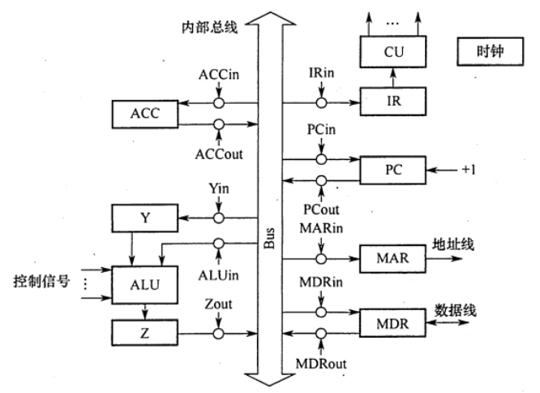

2. **CPU 内部三总线方式**。将所有寄存器的输入端和输出端都连接到多条公共通路上，相比之下单总线中一个时钟内只允许传一个数据，因为指令执行效率很低，因此采用多总线方式，同时在多个总线上传送不同的数据，提高效率。
3. **专用数据通路方式**。根据指令执行过程中的数据和地址的流动方向安排连接线路，避免使用共享的总线，性能较高，但硬件量大。

在上图中，规定各**部件**用**大写字母**表示，字母加 **“in”**表示该部件的**允许输入**控制信号；字母加**“out”**表示该部件的**允许输出**控制信号。

注意：**内部总线**是指同一部件，如CPU 内部连接各寄存器及运算部件之问的总线；**系统总线**是指同一台计算机系统的各部件，如CPU、内存、通道和各类 I/0 接口间互相连接的总线

### 寄存器之间的数据传送

奇存器之间的数据传送可通过 CPU 内部总线完成。在上图中，某寄存器 AX 的输出和输入分别由 AXout 和 AXin 控制。这里以PC 寄存器为例，把PC 内容送至 MAR，实现传送操作的
流程及控制信号为

```C
PC->Bus    // PCout有效, PC内容送总线
Bus->MAR   // MARin有效, 总线内容送MAR
```

### 主存于CPU之间的数据传送

主存与 CPU 之间的数据传送也要借助 CPU 内部总线完成。现以CPU 从主存读取指令为何说明数据在数据通路中的传送过程。实现传送操作的流程及控制信号为：

```C
PC->Bus->MAR       // PCout, MARin有效
1->R               // CU发读指令
MEM(MAR)->MDR      // MDRin有效 
MDR->Bus->IR       // MDRout, IRin有效
```

### 执行算数或逻辑运算

执行算术或逻辑操作时，由于 ALU 本身是没有内部存储功能的组合电路，因此如要执行加法运算，相加的两个数必须在 ALU 的两个输入端同时有效。上图中的暂存器 Y 即用于该目的。先将一个操作数经CPU 内部总线送入暂存器 Y 保存，Y 的内容在 ALU 的左输入端始终有效，再将另一个操作数经总线直按送到 ALU 的右输入域。这样两个操作数都送入ALU运算结果暂存在暂存器Z中。

```C
Ad(IR)->Bus->MAR   // MDRout, MARin有效
1->R               // CU发读指令
MEM->数据线->MDR  
MDR->Bus->Y        // MDRout, Yin有效
(ACC)+(Y)->Z       // ACCout, ALUin有效
Z->ACC             // Zout, ACCin有效
```

## 例题

1. 下列不属于CPU数据通路结构的是（ ）
   A. 单总线结构
   B. 多总线结构
   C. 部件内总线结构
   D. 专用数据通路结构

   【答案】：C

2. 在单总线的CPU中，（ ）
   A. ALU 的两个输入端及输出端都可与总线相连
   B. ALU的两个输入端可与总线相连，但输出端需通过晢存器与总线相连
   C. ALU的一个输入端可与总线相连，其输出端也可与总线相连
   D. ALU 只能有一个输入端可与总线相连，另一输入端需通过暂存器与总线相连

   【答案】：A->D。由于 ALU 是一个组合逻辑电路，因此其运算过程中必须保持两个输入端的内容不变。又由于 CPU 内部采用单总线结构，因此为了得到两个不同的操作数，ALU 的一个输入端与总线相连，另一个输入端需通过一个寄存器与总线相连。此外，ALU 的输出端也不能直接与内部总线相连，否则其输出又会通过总线反馈到输入端，影响运算结果，因此输出端需通过一个暂存器〔用来暂存结果的寄存器）与总线相连。

3. 采用CPU 内部总线的数据通路与不采用CPU 内部总线的数据通路相比，( )
   A. 前者性能较高
   B. 后者的数据冲突问题较严重
   C.前者的硬件量大，实现难度高
   D.以上说法都不对

   【答案】：D

4. CPU 的读/写控制信号的作用是（ ）
   A. 决定数据总线上的数据流方向
   B. 控制存储器操作的读/写类型
   C. 控制流入、流出存储器信息的方向
   D. 以上都是

   【答案】：D

5. **【2016 统考真题】**单周期处理器中所有指令的指令周期为一个时钟周期。下列关于单周期处理器的叙述中，错误的是（ ）。
   A. 可以采用单总线结构数据通路
   B. 处理器时钟频率较低
   C. 在指令执行过程中控制信号不变
   D. 每条指令的 CPI为1

   【答案】：C->A。单周期处理器是指所有指令的指令周期为一个时钟周期的处理器，D正确。因为每条指令的CPI 为1，要考虑比较慢的指令，所以处理器的时钟频率较低，B正确。单总线数据通路将所有寄存器的输入输出端都连接在一条公共通路上，一个时钟内只允许一次操作，无法完成指令的所有操作，A 错误。控制信号是CU 根据指令操作码发出的信号，对于单周期处理器来说，每条指令的执行只有一个时钟周期，而在一个时钟周期内控制信号并不会变化；若是多周期处理器，则指令的执行需要多个时钟周期，在每个时钟周期控制器不会发出不同信号。

6. **【2021 统考真题】**下列关于数据通路的叙述中，错误的是 ( )
   A. 数据通路包含 ALU 等组合逻辑（操作）元件
   B. 数据通路包含寄存器等时序逻辑（状态）元件
   C. 数据通路不包含用于异常事件检测及响应的电路
   D. 数据通路中的数据流动路径由控制信号进行控制

   【答案】：C

7. **【2009统考真题】**某计算机字长16位，采用16位定长指令字结构，部分数据通路结构如下图所示。图中所有控制信号为 1时表示有效，为0时表示无效。例如，控制信号`MDRinE` 为 1表示允许数据从DB 打入 MDR, `MDRin` 为1表示允许数据从总线打入MDR。假设MAR 的输出一直处于使能状态。加法指令 “`ADD (RI), RO`”的功能为`(R0)+((R1))->(R1)`，即将RO 中的数据与 R1 的内容所指主存单元的数据相加，并将结果送入R1的内容所指主存单元中保存。

   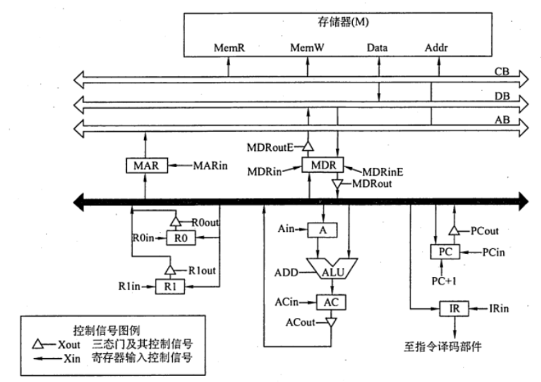

   下表给出了上述指令取指和译码阶段每个节拍（时钟周期）的功能和有效控制信号，请按表中描述方式用表格列出指令执行阶段每个节拍的功能和有效控制信号

   | 时钟 |           功能            |   有效控制信号    |
   | :--: | :-----------------------: | :---------------: |
   |  C1  |        `(PC)->MAR`        |   PCout, MARin    |
   |  C2  | `M(MAR)->MDR; (PC)+1->PC` | MemR, MDRin, PC+1 |
   |  C3  |        `(MDR)->IR`        |   MDRout, IRin    |
   |  C4  |         指令译码          |        无         |

   【答案】：

   | 时钟 |      功能      |   有效控制信号    |
   | :--: | :------------: | :---------------: |
   |  C5  |  `(R1)->MAR`   |   R1out, MARin    |
   |  C6  | `M(MAR)->MDR`  |    MemR, MDRin    |
   |  C7  |    `MDR->A`    |    MDRout, Ain    |
   |  C8  | `(R0)+(A)->AC` | R0out, Aout, ACin |
   |  C9  |   `AC->MDR`    |   ACout, MDRin    |
   | C10  | `MDR->M(MAR)`  |   MemW, MDRout    |

8. 某计算机的数据通路结构如下图所示，写出实现 `ADD R1, (R2)`的微操作序列（取指令及确定后继指令地址）。

   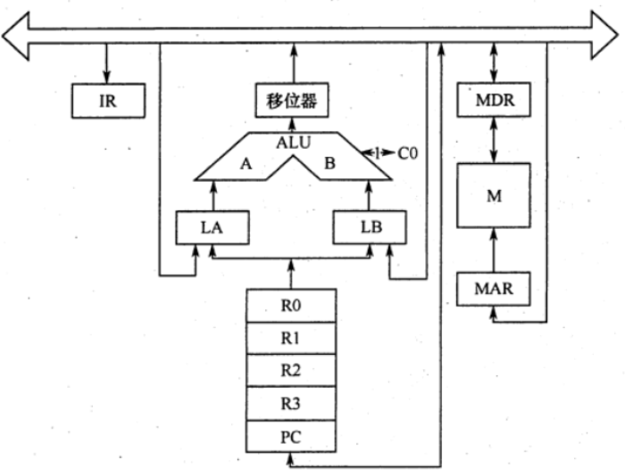

   【答案】：

   |           功能           |    有效控制信号    |
   | :----------------------: | :----------------: |
   |       `(PC)->MAR`        |    PCout, MARin    |
   | `M(MAR)->MDR;(PC)+1->PC` |  MR, MDRin, PC+1   |
   |       `(MDR)->IR`        |    MDRout, IRin    |
   |       `(R2)->MAR`        |    PCout, MARin    |
   |      `M(MAR)->MDR`       |     MR, MDRin      |
   |       `(MDR)->LA`        |    MDRout, LAin    |
   |        `(R1)->LB`        |    R1out, LBin     |
   |     `(LA)+(LB)->R1`      | +, 移位器out, R1in |

9. 设CPU 内部结构如下图所示，此外还设有B、C、D、E、H、L六个寄存器（图中未画出），它们各自的输入端和输出端都与内部总线相通，并分别受控制信号控制（如Bin 受寄存器 B 的输入控制；Bout 受寄存器 B的输出控制)，假设ALU 的结果直接送入乙 寄存器。要求从取指令开始，写出完成下列指令的微操作序列及所需的控制信号。

   ```assembly
   ADD B, C     ;(B)+(C)->B
   SUB ACC, H   ;(ACC)-(H)->ACC
   ```

   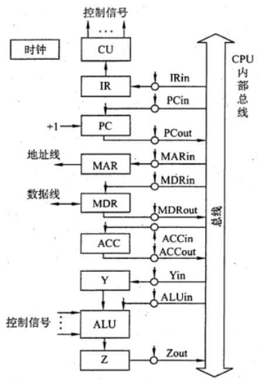

   【答案】：

   |           功能           |    有效控制信号     |
   | :----------------------: | :-----------------: |
   |         ADD B, C         |                     |
   |       `(PC)->MAR`        |    PCout, MARin     |
   | `M(MAR)->MDR;(PC)+1->PC` |   MR, MDRin, PC+1   |
   |       `(MDR)->IR`        |    MDRout, IRin     |
   |         `(B)->Y`         |      Bout, Yin      |
   |       `(Y)+(C)->Z`       | Yout, Cout, Zin, 加 |
   |         `(Z)->B`         |      Zout, Bin      |
   |        SUB ACC, H        |                     |
   |       `(PC)->MAR`        |    PCout, MARin     |
   | `M(MAR)->MDR;(PC)+1->PC` |   MR, MDRin, PC+1   |
   |       `(MDR)->IR`        |    MDRout, IRin     |
   |        `(ACC)->Y`        |     ACCout, Yin     |
   |       `(Y)-(H)->Z`       | Yout, Hout, Zin, 减 |
   |        `(Z)->ACC`        |     Zout, ACCin     |

10. 设有如下图所示的单总线结构，分析指令 `ADD (R0),R1` 的指令流程和控制信号。

    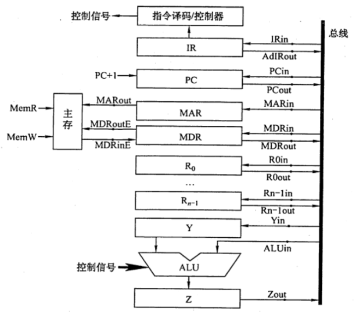

    |      功能       |      有效控制信号      |
    | :-------------: | :--------------------: |
    |  【取指周期】   |                        |
    |   `(PC)->MAR`   |      PCout, MARin      |
    |  `M(MAR)->MDR`  |  MARout, MREAD, MDRin  |
    |   `(MDR)->IR`   |      MDRout, IRin      |
    |  `(PC)+1->PC`   |           +1           |
    |  【间指周期】   |                        |
    |   `(R0)->MAR`   |      R0out, MARin      |
    |  `M(MAR)->MDR`  |  MARout, MREAD, MDRin  |
    |   `(MDR)->Y`    |      MDRout, Yin       |
    |  【执行周期】   |                        |
    |  `(Y)+(R1)->Z`  |  Yout, R1out, Zin, 加  |
    |   `(Z)->MDR`    |      Zout, MDRin       |
    | `(MDR)->M(MAR)` | MWRITE, MDRout, MARout |

11. 下图是一个简化的 CPU 与主存连接结构示意图（图中省略了所有的多路选择器）。其中有一个累加寄存器(ACC)、一个状态数据寄存器和其他 4 个寄存器：主存地址寄存器（MAR）、主存数据寄存器（MDR）、程序寄存器（PC）和指令寄存器（IR），各部件及其之问的连线表示数据通路，箭头表示信息传递方向.

    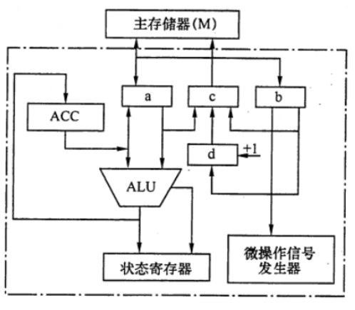

    要求

    1. 请写出图中a、b、c、d四个寄存器的名称.

       【答案】：a：MDR，b：IR，c：MAR，d：PC

    2. 简述图中取指令的数据通路

       【答案】：

       |    功能     |   有效控制信号    |
       | :---------: | :---------------: |
       |  (PC)->MAR  |   PCout, MARin    |
       | M(MAR)->MDR | MARout, MDRin, MR |
       |   MDR->IR   |   MDRout, IRin    |

    3. 简述数据在运算器和主存之间进行存/取访问的数据通路（假设地址已在MAR中）

       【答案】：

       MAR(先置数据地址), 主存M->MDR->ALU->ACC

       MAR(先置数据地址), ACC->MDR->主存M

    4. 简述完成指令LDA X的数据通路（X为主存地址，LDA的功能为`(X)->ACC`).

       【答案】：

       X->MAR->主存->MDR->ALU->ACC

    5. 简述完成指令 ADD Y的数据通路（Y为主存地址，ADD的功能为`(ACC)+(Y)->ACC`).

       【答案】：

       Y->MAR->主存->MDR->ALU->ACC

       ACC->ALU->ACC

    6. 简述完成指令 STA Z 的数据通路（Z为主存地址，STA的功能为`(ACC)->Z`)。

       【答案】:

       Z->MAR

       ACC->MDR->主存

12. 某机主要功能部件如下图所示，其中 M为主存，MDR 为主存数据寄存器，MAR 为主存地址寄存器，R 为指令寄存器，PC 为程序计数器（并假设当前指令地址在PC中），R0~R3为通用寄存器，C、D为暂存器。

    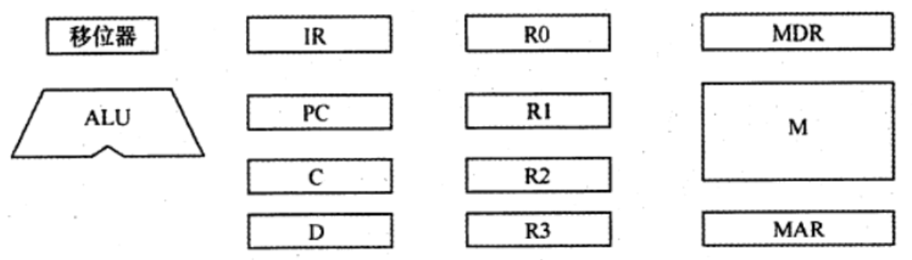

    1. 请补充各部件之间的主要连接线（总线自己画)，并注明数据流动方向。

       【答案】：

       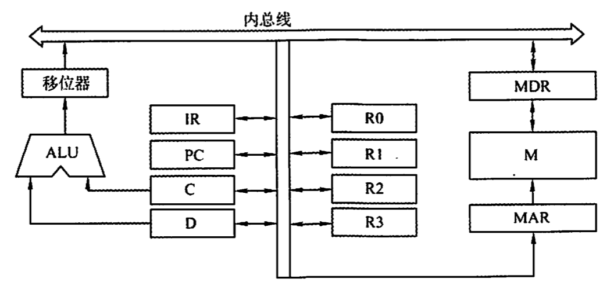

    2. 画出“`ADD (R1)，(R2)+`”指令周期流程图 “该指令的含义是进行求和运算，源操作数地址在 R1 中，<u>目标操作数寻址方式为自增型寄存器问接寻址方式</u>（先取地址后加1），并将相加结果写回R2 寄存器。

       【答案】：

       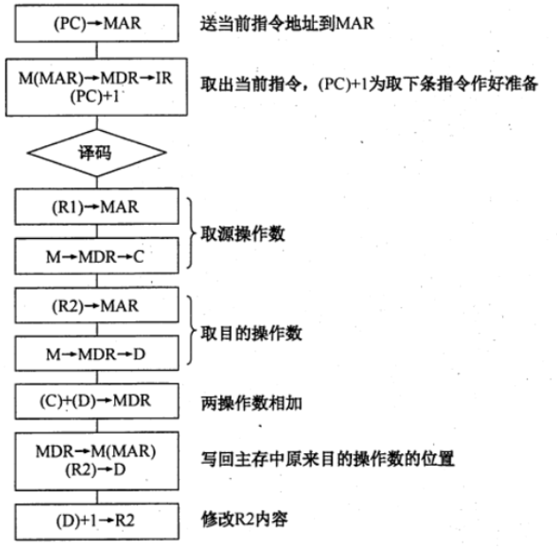

13. 已知单总线计算机结构如下图所示，其中M 为主存，XR为变址寄存器，EAR 为有效地址寄存器，LATCH 为暂存器。假设指令地址已存在于PC中，请给出`ADD X, D`指令周期信息流程和相应的控制信号。说明：

    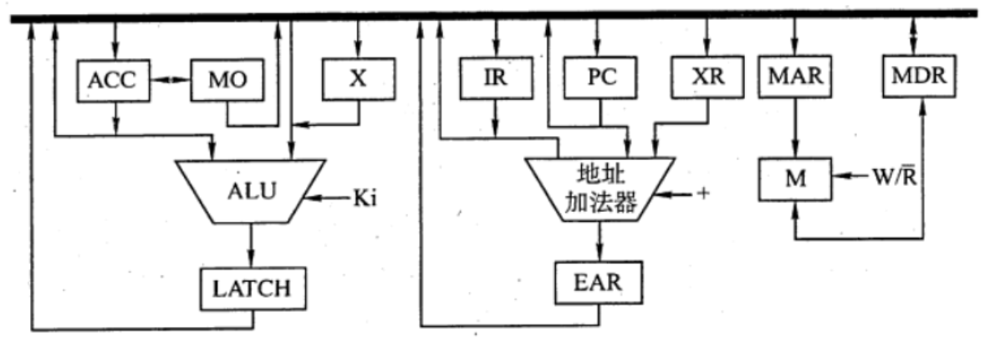

    1. ADD X,D指令字中，X为变址寄存器XR，D为形式地址
    2. 寄存器的输入/输出均采用控制信号控制，如PCi表示 PC 的输入控制信号，MDRo表示MDR 的输出控制信号。
    3. 凡需要经过总线的传送，都需要注明，如(PC)一MAR，相应的控制信号为 PC_0和 MAR_i.

    【答案】：

    |         功能         |    有效控制信号     |
    | :------------------: | :-----------------: |
    |       取指周期       |                     |
    |      (PC)->MAR       |      PCo, MARi      |
    |     M(MAR)->MDR      |   MARo, MDRi, MR    |
    |      (MDR)->IR       |      MDRo, IRi      |
    |      (PC)+1->PC      |         +1          |
    |       执行周期       |                     |
    | **(XR)+Ad(IR)->EAR** |  XRo, IRo, +, EARi  |
    |      (EAR)->MAR      |     EARo, MARi      |
    |     M(MAR)->MDR      |    R, MARo, MDRi    |
    |       (MDR)->X       |      MDRo, Xi       |
    |   (ACC)+(X)->LATCH   | ACCo, Xo, LATCHi, + |
    |     (LATCH)->ACC     |    LATCHo, ACCi     |

14. **【2015统考真题】**某16位计算机的主存按宇节编码，存取单位为16位；来用16位定长指令字格式；CPU来用单总线结构，主要部分如下图所示。图中R0-R3为通用寄存器；T为暂存器；SR为移位寄存器，可实现直送（mov)、左移一位（left）和右移一位(right）三种操作，控制信号为SRop，SR的输出由信号SRout控制； ALU可实现直送A(mova）、A加B （add）、A减B（sub）、 A与B （and )A或B（or)、非A (not )、A加1(inc）七种操作，控制信号为ALUop。
    回答下列问题：

    1. 图中哪些寄存器是程序员可见的？为何要设置暂存器T？
    2. 控制信号 ALUop 和SROp 的位数至少各是多少？
    3. 控制信号 SRout 所控制部件的名称或作用是什么？
    4. 端点①~⑨中，哪些端点须连接到控制部件的输出端？
    5. 为完善单总线数据通路，需要在端点①~⑨中相应的端点之间添加必要的连线。写出连线的起点和终点，以正确表示数据的流动方向。
    6. 为什么二路选择器 MUX 的一个输入端是 2？

    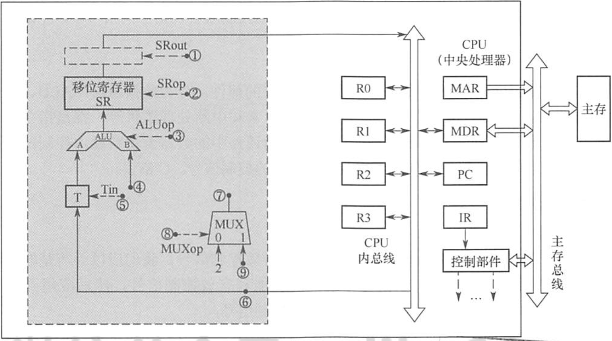

    【答案】：

    1. R0,R1,R2,R3,~~MAR,MDR~~,PC。为什么要T，因为采用了单总线结构，如果没有T，A与B会同时收到传入的数据。

    2. ALUop7种->3位；SROp4种->2位

    3. <u>信号 SRout 所控制的部件是一个**三态门**，用于控制移位器与总线之问数据通路的连接与断开</u>

    4. 1，2，3，5，8；

    5. 6->9；7->4

    6. **因为每条指令长度是16bits，按字节编址，顺序执行的时候，(PC)+2->PC，MUX一个输入为2，可便于执行(PC)+2操作**

       > 本题讲解:
       >
       > 【【408考研】历年计组大题串讲】 https://www.bilibili.com/video/BV1Lq4y167rX?p=9