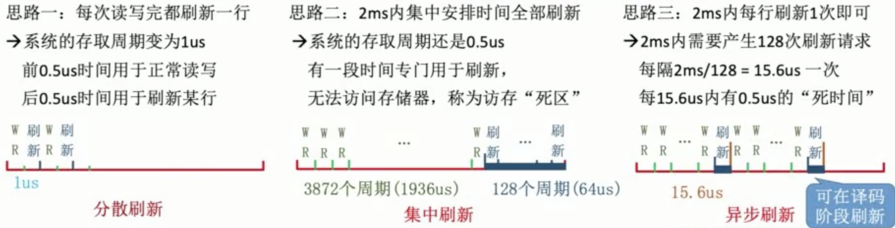
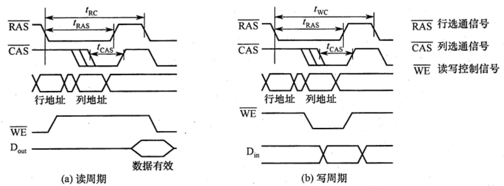
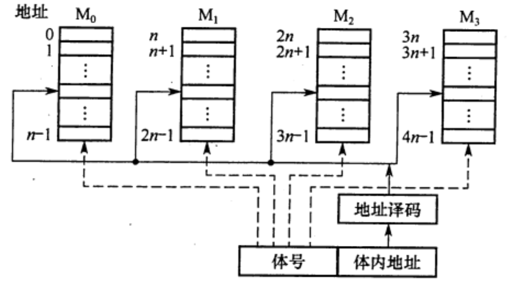

# 主存储器
2022.05.07

[TOC]

## SRAM芯片与DRAM芯片

> 内容总览：
>
> 1. SRAM概念
> 2. DRAM
>    1. 存储元、存储单元、存储体
>    2. 集中刷新、分散刷新、异步刷新

* 某计算机系统，其操作系统保存于硬盘上，其内存储器应该采用()。

  A.RAM
  B.ROM
  C.RAM和ROM
  D.均不完善
  

【答案】：C。因计算机的操作系统保存于硬盘上，所以需要 BIOS 的引导程序将操作系统引导到主存(RAM）中，而引导程序则固化于ROM中。

### SRAM原理

通常把<u>存放一个二进制位的物理器件</u>称为**存储元**，它是<u>存储器的最基本的构件</u>。<u>地址码相同的多个存储元构成</u>一个**存储单元**。<u>若干存储单元的集合构成</u>**存储体**。

静态随机存储器(SRAM)的存储元是用<u>双稳态触发器</u>（六晶体管MOS)来记忆信息的。因此即使信息被读出后，它仍保持其原状态而不需要再生（<u>非破坏性读出</u>）。

SRAM的存取速度快，但集成度低，功耗较大，价格昂贵，一般用于<u>高速缓冲存储器</u>。

### DRAM原理

#### 原理

与SRAM的存储原理不同，动态随机存储器(DRAM)是利用存储元电路中<u>栅极电容上的电荷</u>来存储信息的，DRAM的基本存储元通常<u>只使用一个晶体管</u>，所以它比SRAM的<u>密度要高</u>很多。

相对于SRAM来说，DRAM具有容易集成、位价低、容量大和功耗低等优点，但DRAM的存取速度比SRAM的**慢**，一般用于大容量的**主存**系统。

#### 刷新种类

<u>DRAM电容上的电荷一般只能维持1~2s</u>,因此即使电源不断电，信息也会自动消失。为此，每隔一定时间必须**刷新**，通常取2s，称为**刷新周期**。存储器的刷新就是对其内部所有存储芯片同时进行刷新 [1]。刷新时不能访存，刷新会等待正在进行的访存的结束 [1]。常用的刷新方式有3种：

1)**集中刷新**：<u>指在一个刷新周期内，利用一段固定的时间，依次对存储器的所有行进行逐一再生，在此期间停止对存储器的读写操作</u>，称为“**死时间**”，又称访存“**死区**”。

优点是读写操作时不受刷新工作的影响；缺点是在集中刷新期间（死区）不能访问存储器。

2)**分散刷新**：<u>把对每行的刷新分散到各个工作周期中</u>。这样，一个存储器的系统工作周期分为两部分：前半部分用于正常读、写或保持：后半部分用于刷新。这种刷新方式增加了系统的存取周期，如存储芯片的存取周期为0.5s,则系统的存取周期为1μs。优点是没有死区；缺点是加长了系统的存取周期，降低了整机的速度。

3)**异步刷新**：异步刷新是前两种方法的结合，它既可缩短“死时间”，又能充分利用最大刷新间隔为2s的特点。具体做法是将刷新周期除以行数，得到两次刷新操作之间的时间间隔t,利用逻辑电路每隔时间t产生一次刷新请求。这样可以避免使CPU连续等待过长的时间，而且减少了刷新次数，从根本上提高了整机的工作效率。

DRAM的刷新需注意以下问题：①刷新对CPU是透明的，即刷新不依赖于外部的访问；

②动态RAM的刷新单位是行，由芯片内部自行生成行地址；③刷新操作类似于读操作，但又有所不同。另外，刷新时不需要选片，即整个存储器中的所有芯片同时被刷新。

#### 刷新参数

* 信息保持时间($T_{ref}$)
* 刷新(间隔)周期($T_{rc}$, Refresh Cycle): 对同一存储位元连续两次刷新，仍能保证鉴别出原存信息的最大允许间隔时间，即在$T_{rc}$内必须对每个单元刷新一遍
* 刷新操作周期($T_{roc}$, Refresh Operating Cycle): 刷新一行存储位元即一次刷新操作所需时间。通常和存储周期trc/twc相同
* 刷新操作周期数($N_r$, Number of Refresh Operating Cycle): 存储芯片全部刷新一遍需要的刷新操作周期个数。

例：DRAM存储芯片MCM4027,其字位结构为4K×1位，存储矩阵为64行×64列。每次刷新操作刷新存储矩阵的一行，刷新操作周期数是多少？

答案：64（每次刷新一行，一共64行）

> **三种刷新方式网络资料**
>
> * [通俗易懂](https://blog.csdn.net/peng0614/article/details/120816492)
> * [课本理解](https://blog.csdn.net/qq_43610614/article/details/105660357)

> **我的总结**
>
> 1. 存储元(最基本) -[地址码相同]> 存储单元 -> 存储体
>
> 2. SRAM 非破坏性读出, 快, 贵, Cache
>
> 3. DRAM 破坏性读出, 刷新, 刷新周期(通常)T=2s
>    1. 集中刷新, 死时间(死区)
>
>       我的理解是，就像学校上课。全班统一上下课，下课时同学按学号依次去厕所。（下课时就是死时间）
> 
>    2. 分散刷新, 无死时间(把刷新容到读取操作后边)
> 
>       我的理解是，就像学校上课。自习课，没人盯着，每个同学想上厕所可以随时去。
> 
>    3. 异步刷新, 减少死时间
> 
>       我的理解是，就像学校上课。假如全班72分钟就要去一轮厕所，一共有36个同学，那么每两分钟就让一个同学去厕所，剩下同学全上课。(不用像集中刷新一样，某个同学上厕所时全班都不能上课，减少了死时间)
> 
> 4. 注意SRAM和DRAM都是易失性！DRAM用刷新，SRAM不用刷新。
> 

### DRAM芯片读写周期

> 我的总结：
>
> 1. 数据通路送**行地址**，同时**行选通信号**有效，持续$t_{RAS}$
> 2. 数据通路送**列地址**，同时**列选通信号**有效，持续$t_{CAS}$
> 3. 读周期：**读写控制信号WE**在CAS有效前变成**低电平**
> 4. 写周期：**读写控制信号WE**在CAS有效前变成**高电平**，**数据**在CAS前在数据总线上保持稳定

### SRAM与DRAM比较

|     项目     |  SRAM  |   DRAM   |
| :----------: | :----: | :------: |
|   存储信息   | 触发器 |   电容   |
|  破坏性读出  |   否   |    是    |
|   需要刷新   |   否   |    是    |
|  送行列地址  | 同时送 | 分两次送 |
|     速度     |   快   |    慢    |
|    集成度    |   低   |    高    |
|   存储成本   |   高   |    低    |
|   主要用途   | Cache  |   主存   |
| 支持随机访问 |   是   |    是    |

### 存储器芯片内部结构

1)**存储体（存储矩阵）**。存储体是存储单元的集合，它由**行选择线(X)和列选择线(Y)**来选择所访问单元，存储体的相同行、列上的位同时被读出或写入。

2)**地址译码器**。用来将地址转换为译码输出线上的高电平，以便驱动相应的读写电路。

3)**I/O控制电路**。用以控制被选中的单元的读出或写入，**具有放大信息的作用**。

4)**片选控制信号**。单个芯片容量太小，往往满足不了计算机对存储器容量的要求，因此需用一定数量的芯片进行存储器的扩展。在访问某个字时，必须“选中”该存储字所在的芯片，而其他芯片不被“选中”，因此需要有片选控制信号。

5)**读/写控制信号**。根据CPU给出的读命令或写命令，控制被选中单元进行读或写。

## 只读存储器

### ROM特点

ROM和RAM都是支持随机存取的存储器，其中SRAM和DRAM均为易失性半导体存储器。而ROM中一旦有了信息，就不能轻易改变，即使掉电也不会丢失，它在计算机系统中是算供读出的存储器。ROM器件有两个显著的优点：

1. **结构简单**，所以位密度比可读写存储器的高。
2. 具有**非易失性**，所以可靠性高。

### ROM类型

1. MROM：掩模式只读存储器。芯片生产时代码写入。
2. PROM：一次可编程只读存储器。通过编程器向芯片烧录(仅一次)。
3. EPROM：可擦除可编程只读存储器。多次改写，比RAM慢。
4. Flash：快速擦出与重写
5. SSD：固态硬盘。由flash芯片组成。

## 主存的组成

1. 主存储器，Main Memory，MM
2. 存储元件（存一个bit）
3. 存储矩阵/存储体由存储元件构成
4. 存储矩阵按字节编址
5. 地址线数量反映了地址数量
6. 案例中，地址线36位，可以使用的地址是：$[0,2^{36}-1]$
7. 数据线数量反映了数据宽度
8. 案例中，数据线64位，代表一个地址有64bits
9. 引脚复用技术：行地址列地址通过相同数据线分两次送入

> SRAM各种线（SRAM没有地址复用技术）：
>
> 1. 1024x8芯片的地址线：$2^{10}=1024\to$地址线10根（1024代表1024个存储字）
> 2. 1024x8芯片的数据线：数据线8根（8代表一个存储字有8位）
> 3. 读写控制线：1～2根，随机应变
> 4. 片选线：有几片就几根（一般1根）
>
> DRAM各种线（默认采用地址复用技术）：
>
> 1. 1024x8芯片的地址线：$2^{10}=1024\to$地址线5根（地址复用后10变成5）
> 2. 1024x8芯片的数据线：数据线8根
> 3. 读写控制线：1～2根，随机应变
> 4. 列选通线；片选线$\to$行选通线：2根
>
> 地址复用技术代表行列地址两次传入，地址线/2，DRAM一般采用地址复用技术

* 某一DRAM芯片，采用地址复用技术，其容量为1024×8位，除电源和接地端外，该芯片的引脚数最少是()（读写控制线为两根）。

  $2+2+8+10/2=17$

* 【2014统考真题】某容量为256MB的存储器由若干4M×8位的DRAM芯片构成，该DRAM芯片的地址引脚和数据引脚总数是()。

  $4M\to 2^{22}\to 22位$,默认采用地址复用技术, 11位

  11+8 = 19

## 多模块存储器

**指令：[高位<- ... ->低位]**

* 【2017统考真题】某计算机主存按字节编址，由4个64M×8位的DRAM芯片采用交叉编址方式构成，并与宽度为32位的存储器总线相连，主存每次最多读写32位数据。若double型变量x的主存地址为804001AH,则读取x需要的存储周期数是( )

  【答案】：

  1. **一个芯片8位，每次读32bit。说明是低位交叉编址**。如果是高位的连续的地址第一个字要恢复一下。
  
  2. 804001A->A->1010->后两位是10->第**三**个芯片，double是64位，要读三次：
  
     1: --xx
     2: xxxx
     3: xx--
  
     [2] [引用百度网友回答](http://zhidao.baidu.com/question/1760263514660139388/answer/3826180088)
  
  3. 答案：3

## 引用

[1]. 计算机原理(100)国防科技大学 5.2.6 DRAM的刷新. https://www.youtube.com/watch?v=ve895s6YPpw

[2]. http://zhidao.baidu.com/question/1760263514660139388/answer/3826180088