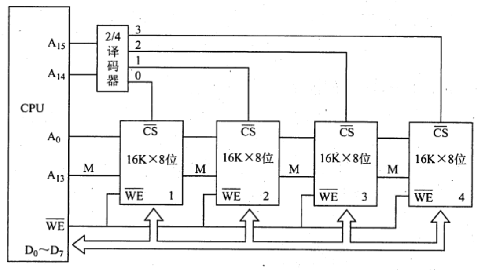

# 主存储器与CPU的连接
2022.05.07

[TOC]

## 连接原理

1）主存储器通过**数据总线**、**地址总线**和**控制总线**与 CPU 连接。
2）**数据总线的位数与工作频率的乘积**正比于**数据传输率**。
3）**地址总线的位数**决定了可寻址的最大内存空间。
4）控制总线（读/写）指出总线周期的类型和本次输入/输出操作完成的时刻。

## 主存容量的扩展

1. 位扩展法

   

2. 字扩展法

   

3. 字位同时扩展法

   

## 存储芯片的地址分配和片选

1. 线选法

   | 信号（四根线） | 对应芯片 |
   | -------------- | -------- |
   | 0001           | 0        |
   | 0010           | 1        |
   | 0100           | 2        |
   | 1000           | 3        |

2. 译码片选法

   | 信号 | 对应芯片 |
   | ---- | -------- |
   | 00   | 0        |
   | 01   | 1        |
   | 10   | 2        |
   | 11   | 3        |

3. 一般高电平有效，如果取反就是低电平有效

## 存储器与CPU的连接

略

* 地址总线$A_0$（高位）～$A_{15}$（低位），用4Kx4位的存储芯片组成16KB存储器，则产生片选信号的译码器的输入地址线应该是（）

  1. ⚠️注意$A_0$这边是高位！！
  2. 4K$=2^{11}\to$12, $A_4$~$A_{15}$, 剩下从$A_3$开始排
  3. 16KB$=2^{14}B\to$$2^{14}/2^{11}=8个芯片$
  4. 8个芯片，每两个芯片绑定成一组，一共组成4组，$2^2\to2bits$, $A_2,A_3$

* 【2010 統考真题】假定用若干 2Kx4 位的芯片组成一个 8Kx8 位的存储器，則地址0B1FH所在芯片的最小地址是（）。

  8Kx8 / 2Kx4 -> 字扩展 4, 位扩展 2

  2K $\to 2^{11}$ 

  0B1F -> 【】【3bit】【4bit】【4bit】->【---x1】【x2---】

  0B -> [x1,x2] = [0,1] -> 【0000】【1000】【0000】【0000】

* 【2018统考真题】假定DRAM芯片中存储阵列的行数为r、列数为c,对于一个2K×1位的DRAM芯片，为保证其地址引脚数最少，并尽量减少刷新开销，则r、c的取值分别是(C)

  A.2048,1

  B.64,32

  C.32,64

  D.1,2048