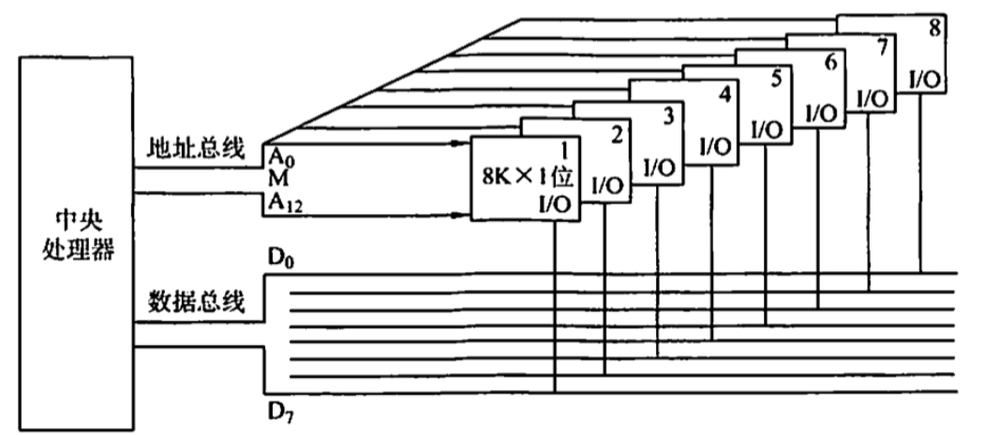

# 主存储器与CPU的连接
2022.09.01

[TOC]

## 连接原理

1. 主存储器通过**数据总线**、**地址总线**和**控制总线**与 CPU 连接。
2. **数据总线的位数与工作频率的乘积**正比于**数据传输率**。
3. **地址总线的位数**决定了可寻址的最大内存空间。
4. 控制总线（读/写）指出总线周期的类型和本次输入/输出操作完成的时刻。

## 主存容量的扩展

> 我的理解：
>
> **位**扩展对应**数据线**（比如八个一个字1bit的芯片拼成8bit一个字的芯片）
>
> **字**扩展对应**地址线**（比如增加两个最高位用来指定某个芯片）

1. **位扩展法**

   > [存储器容量的位扩展(学堂在线)](https://www.bilibili.com/video/BV1wb411L7ok)

   

2. **字扩展法**

   > [存储器容量字扩展(学堂在线)](https://www.bilibili.com/video/BV1wb411L7dT/)

   

3. **字位同时扩展法**

   

## 存储芯片的地址分配和片选

1. 线选法

   | 信号（四根线） | 对应芯片 |
   | -------------- | -------- |
   | 0001           | 0        |
   | 0010           | 1        |
   | 0100           | 2        |
   | 1000           | 3        |

2. 译码片选法

   | 信号 | 对应芯片 |
   | ---- | -------- |
   | 00   | 0        |
   | 01   | 1        |
   | 10   | 2        |
   | 11   | 3        |

3. 一般高电平有效，如果取反就是低电平有效

## 例题

1. 用存储容量为 16Kx1 位的存储器芯片来组成一个64Kx8位的存储器，则在字方向和位方向分别扩展了（ ）倍
   A. 4,2
   B. 8,4
   C. 2,4
   D. 4,8

   【答案】：D

2. 80386DX 是32位系统，以 4B 为编址单位，当在该系统中用 8KB（8Kx8位）的存储芯片构造32KB 的存储体时，应完成存储器的（ ）设计。
   A.位扩展
   B.字扩展
   C.字位扩展
   D.字位均不扩展

   【答案】：A

3. 某计算机字长为16位，存储器容量为256KB，CPU 按字寻址，其寻址范围是（ ）
   A. 0 - 2^19-1
   B. 0 - 2^20-1
   C. 0 - 2^18-1
   D. 0 - 2^17-1

   【答案】：16，256KB=2^18B，2^18B / 2B = 2^17B，D

4. 4个16Kx8位的存储芯片，可设计为（ ）容量的存储器。
   A. 32Kx16位
   B. 16K×16位
   C. 32Kx8位
   D. 8Kx16位

   【答案】：A

5. 16片 2Kx4 位的存储器可以设计为（ ）存储容量的16位存储器。
   A. 16K
   B. 32K
   C. 8K
   D. 2K

   【答案】：C

6. 设CPU地址总线有24根，数据总线有32根，用512Kx8位的RAM 芯片构成该机的主存储器，则该机主存最多需要（ ）片这样的存储芯片。
   A. 256
   B. 512
   C. 64
   D. 128

   【答案】：2^24/2^19=2^5，32/8=4，D

7. 地址总线 A0（高位）～ A15（低位），用 4Kx4 位的存储芯片组成 16KB 存储器，则产生片选信号的译码器的输入地址线应该是（ ）。
   A. A2A3
   B. A0A1
   C. A12A13
   D. A14A15

   【答案】：？C -> A！接入各芯片地址端的是地址线的低 12位！

   1. ⚠️注意$A_0$这边是高位！！
   2. 4K$=2^{11}\to$12, $A_4$~$A_{15}$, 剩下从$A_3$开始排
   3. 16KB$=2^{14}B\to$$2^{14}/2^{11}=8个芯片$
   4. 8个芯片，每两个芯片绑定成一组（位扩展），一共组成4组，$2^2\to2bits$, $A_2,A_3$

8. 若内存地址区间为 4000H~43FFH，每个存储单元可存储16位二进制数，该内存区域用4片存储器芯片构成，构成该内存所用的存储器芯片的容量是（ ）。
   A. 512×16bit
   B. 256×8bit
   C. 256×16bit
   D. 1024x8hit

   【答案】：3FFH + 1 = 2^11，2^11 * 2 = 2^12
   A. 9+2+2=13 x
   B. 8+1+2=11 x
   C. 8+2+2=12 √
   D. 10+1+2=13 x

   > 新的答案（2022.11.9）
   >
   > 4000～43FF：一共是2^10个字，每个字2B。
   >
   > C选项每个字也是2B，用四片芯片构成——1024/4=256，正确，C。
   
9. 内存按字节编址，地址从 90000H到 CFFFF H，若用存储容量为 16Kx8 位芯片构成该内存，至少需要的芯片数是（ ）。
   A. 2
   B. 4
   C. 8
   D. 16

   【答案】：16K = 2^14。C-9=1100-1001=0011，0011 FFFF=2^18，18-14=4，D

10. 若片选地址为 111 时，选定某一32Kx16位的存储芯片工作，则该芯片在存储器中的首地址和末地址分别为（ ）。
    A. 00000H，01000H
    B. 38000H，3FFFFH
    C. 3800H，3FFFH
    D. 0000H，0100H

    【答案】：111，2^15，B

11. 如下图所示，若低位地址（A0～A11）接在内存芯片地址引脚上，高位地址(A12-A19）进行片选译码（其中A14和A16未参加译码)，且片选信号低电平有效，则对图中所示的译码电路，不属于此译码空间的地址是（ ）

    

    A. AB000H ~ ABFFFH
    B. BB00OH ~ BBFFFH
    C. EFOOOH ~ EFFFFH
    D. FEOOOH ~ FEFFFH

    【答案】：

    A：AB=1010 1011 -> 101 111
    B：BB=1011 1011 -> 111 111
    C：EF=1110 1111 -> 111 111
    D：FE=1111 1110 -> 111 110
    $$
    \overline{CS}=\overline{A19 \cdot (A18+A17)\cdot A15 \cdot A13 \cdot A12}
    $$
    D

    这道题的意思是某一个芯片的片选信号是这样的译码电路，然后看看给定的信号能不能让该芯片选通

12. 【2009统考真题】某计算机主存容量为 64KB，其中ROM区为 4KB，其余为 RAM区，按字节编址。现要用2Kx8位的ROM 芯片和4Kx4 位的 RAM 芯片来设计该存储器，需要上述规格的ROM 芯片数和RAM 芯片数分别是（ )。
    A. 1, 15
    B. 2, 15
    C. 1, 30
    D. 2, 30

    【答案】：64KB = 60KB + 4KB。
    ROM：4/2=2
    RAM：60/2=30
    D

13. 【2010统考真题】假定用若干 2Kx4 位的芯片组成一个 8Kx8 位的存储器，则地址 0B1FH 所在芯片的最小地址是（ ）。
    A. 0000H
    B. 0600H
    C. 0700H
    D. 0800H

    【答案】：4，2->3位，2K=2^10，x xx00 0000 0000，B=1011，1000=8，D8Kx8 / 2Kx4 -> 字扩展 4, 位扩展 2

    2K $\to 2^{11}$ 

    0B1F -> 【】【3bit】【4bit】【4bit】->【---x1】【x2---】

    0B -> [x1,x2] = [0,1] -> 【0000】【**10**00】【0000】【0000】 -> 0800

14. 【2011 统考真题】某计算机存储器按字节编址，主存地址空间大小为 64MB，现用4Mx8 位的RAM 芯片组成32MB 的主存储器，则存储器地址寄存器MAR 的位数至少是（ ）
    A. 22位
    B. 23
    C. 25位
    D. 26

    【答案】：64MB=2^{26}B，C

15. 【2016 统考真题】某存储器容量为 64KB，按字节编址，地址 4000H~ 5FFFH 为 ROM区，其余为 RAM区。若采用8Kx4 位的 SRAM 芯片进行设计，则需要该芯片的数量是（）
    A. 7
    B. 8
    C. 14
    D. 16

    【答案】：0000 ～ 1FFF = 2^13，64-8=56，56/4=14，C

16. 【2018 统考真题】假定 DRAM 芯片中存储阵列的行数为r、列数为c，对于一个2Kx1位的DRAM 芯片，为保证其地址引脚数最少，并尽量减少刷新开销，则r、c的取值分别是（ ）。
    A. 2048, 1
    B. 64, 32
    C. 32, 64
    D. 1, 2048

    【答案】：[解析](https://www.nowcoder.com/questionTerminal/b45d2e366a154d9793da1e6aebf90cfb?orderByHotValue=0&questionTypes=110000&difficulty=00010&page=1&onlyReference=false)
    B：6+5
    C：5+6
    为了尽量少的刷新开销，C

17. 【2021 统考真题】某计算机的存储器总线中有24 位地址线和32 位数据线，按字编址，宇长为32位。如果 00 0000H~3F FFFFH 为RAM区，那么需要512Kx8位的RAM芯片数为（）
    A. 8
    B. 16
    C. 32
    D. 64

    【答案】：2^22/2^19 = 2^3，8*4=32，C