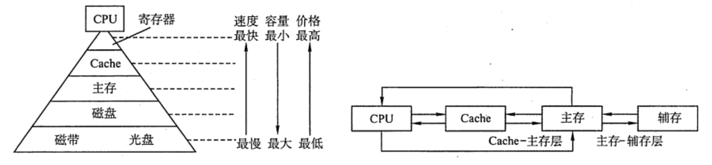

# 存储器概述
2022.04.24

[TOC]

## 存储器的分类

1. 按计算机中层次分类

   |          类别           | 容量 | 存取速度  | 价格 |
   | :---------------------: | :--: | :-------: | :--: |
   |    主存储器（主存）     |  小  |   较快    | 较高 |
   |   辅助存储器（辅存）    |  大  |    慢     |  低  |
   | 高速缓冲存储器（Cache） |  小  | 与CPU匹配 |  高  |

2. 按存储介质分类

   磁表面存储器（磁盘、磁带）

   磁芯存储器

   半导体存储器（MOS型存储器、双极型存储器）

   光存储器（光盘💿）

3. 按存取方式分类

   * 随机存储器（RAM，Random Access Memory）：读写任意位置存储单元所需的时间都相同；主要用作主存、Cache
     * 静态RAM
     * 动态RAM

   * 只读存储器（ROM，Read-Only Memory）：

     * ⚠️BIOS芯片，用于开机时装在操作系统，虽然是ROM芯片，但是也算在主存的一部分

     * ⚠️很多ROM也可以写！

     * ⚠️闪存写的速度比读的更慢

     * ⚠️很多ROM也具有“随机存储”特性！

     * MROM（掩模式只读存储器）

       厂家按照客户需求，在芯片生产过程中写入信息，之后人个人不可重写（只能读出），可靠性高、灵活性差、生产周期长、只适合批量定制

     * PROM（一次可编程只读存储器）

       用户可使用专门的PROM写入器写入信息，写入以后就不可更改

     * EPROM（可擦除可编程只读存储器）

       允许用户写入信息，之后用某种方法擦除数据，可进行多次重写

       - UVEPROM

         用紫外线照射8-20分钟，撒出所有信息

       - EEPROM

         可用“电擦出”，擦出固定的字

     * Flash Memory（如U盘、SD卡）

       有EEPROM发展而来，断电后也能保存信息，可以进行多次快速擦出重写，写比读更慢。另外闪存每个存储元只需要一个MOS管，位密度高。

     * SSD（固态硬盘）

       有控制单元+存储单元（Flash芯片）构成，可进行多次快速擦出重写，SSD速度快、功耗低、价格高。

   * [串行访问存储器](https://zhidao.baidu.com/question/2267039966084497348.html)
     * 顺序存储存储器（SAM,Sequential Access Memory）
       读写存储单元所需时间取决于存储单元所在的地理位置
     * 直接存储存储器（DAM,Direct Access Memory）
       既有随机存取特性又有顺序存取特性，比如磁盘
   * **相联存储器**（**CAM**, Associative Memory / Content Addressed Memory）: 可以按照**内容**访问的存储器，按照内容检索到储存位置进行读写，**“块表”**就是一种相联存储器
     - 内容指定方式与地址指定方式相结合

4. 按信息可保存性分类

   1. 易失性存储器，如RAM
   2. 非易失性存储器，如ROM、磁表面存储器、光存储器
   3. 破坏性读出&非破坏性读出

## 存储器性能指标

1. **存储容量**
   $$
   存储容量 = 存储字数\cdot 字长
   $$
   如：1Mx8位

2. 单位成本
   $$
   单位成本 = 总成本 / 总容量
   $$

3. 存储速度
   $$
   数据传输率(主存带宽) = 数据的宽度 / 存储周期
   $$
   存取时间：启动存储器到完成操作的时间 = 读出时间+写入时间

   存取周期：完成的一次读写操作需要的全部时间，两个独立访问存储器操作之间所需的最小时间间隔

   主存带宽：每秒从主存进出的信息的最大数量（字/秒，字节/秒，位/秒）

   对于破坏性读出的存储器：存取周期 = 存取时间+恢复时间

* 设机器字长为32位，一个容量为16MB的存储器，CPU按半字寻址，其可寻址的单元数是（)。

  【答案】:$16MB/32bit*2=2^{23}$⚠️**半字寻址**

## 多层次的存储系统

* 下列关于多级存储系统的说法中，正确的有()。

  1.多级存储系统是为了降低存储成本

  2.虚拟存储器中主存和辅存之间的数据调动对任何程序员是透明的

  3.CPU只能与Cache直接交换信息，CPU与主存交换信息也需要经过Cache

  A. 仅I

  B. 仅I和II

  C. I、II和III

  D. 仅II

  【答案】：A，主存和辅存之间的数据调动是由硬件和操作系统共同完成的，仅对应用级程序员透明。CPU与主存可直接交换信息。

* 某个两级存储器系统的平均访问时间为12ns,该存储器系统中顶层存储器的命中率为90%,访问时间是5ns,该存储器系统中底层存储器的访问时间是多少（假设采用同时访问两级存储器的方式)？

  ⚠️**同时访问两级存储器还是分别访问**！
  $$
  \begin{align}
  12 &= 0.9\cdot 5+0.1*n\\
  n &= 75
  \end{align}
  $$

* CPU执行一段程序时，Cache完成存取的次数为1900，主存完成存取的次数为100，已知Cache存取周期为50ns,主存存取周期为250ns。设主存与Cache同时访问

  1)Cache/主存系统的效率是多少；

  2)平均访问时间是多少。

  命中率：$1900/(1900+100)=0.95$

  $效率=\frac{访问Cache时间}{平均访问时间}=\frac{1\times 50}{0.95\times 50+0.05\times250}=\frac{1}{0.95+0.05\times250/50}=83.3\%$
  
  平均访问时间：50/0.833=60ns