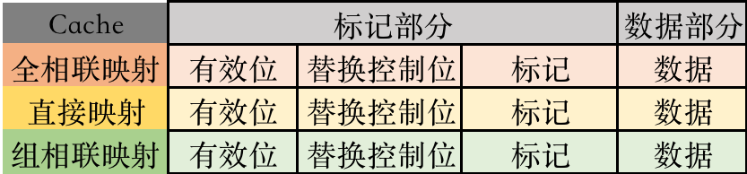

# 存储系统

2022.11.14

[toc]

> 本专题主要归纳存储系统的题型

## 计算平均访问时间

🔑[存储器概述](./存储器概述.md)

1. (计算容量：注意半字寻址还是字寻址)
2. 注意cache与主存同时访问还是先Cache后主存

## 多模块存储器

🔑[主存储器](./主存储器.md)

[高位 <- --- -> 低位]

高位交叉编址，高位的比特代表体号

低位交叉编址，低位的比特代表体号

## SRMA与DRAM概念

🔑[主存储器](./主存储器.md)

1. DRAM的集中刷新、分散刷新、异步刷新（详见上边链接里的“我的理解”）

## 计算地址线/数据线、芯片数

🔑[主存储器](./主存储器.md)

🔑[主存储器与CPU的连接](./主存储器与CPU的连接.md)

1. SRAM各种线（SRAM没有地址复用技术）：

   1. 1024x8芯片的地址线：$2^{10}=1024\to$地址线10根（1024代表1024个存储字）
   2. 1024x8芯片的数据线：数据线8根（8代表一个存储字有8位）
   3. 读写控制线：1～2根，随机应变
   4. 片选线：有几片就几根（一般1根）

2. DRAM各种线（默认采用地址复用技术）：

   1. 1024x8芯片的地址线：$2^{10}=1024\to$地址线10/2=5根
   2. 1024x8芯片的数据线：数据线8根
   3. 读写控制线：1～2根，随机应变
   4. 列选通线；片选线$\to$行选通线：2根

   地址复用技术代表行列地址两次传入，地址线/2，DRAM一般采用地址复用技术

3. 位扩展法：一个存储字变得更长。eg. 64Kx1的芯片扩展成64Kx8的芯片

4. 字扩展法：存储字数量变得更多（地址变长，扩展高位）。eg. 8Kx8的芯片扩展成64Kx8的芯片。

   字扩展之前的地址：[xxxx]，字扩展后的地址：[xxx(字扩展出来的)]\[xxxx]

## Cache的三种映射

🔑[虚拟存储器](./虚拟存储器.md)

Cache行存储内容：

主存地址的划分：

## Cache的主存块替换算法

🔑[虚拟存储器](./虚拟存储器.md)

* 随机算法（RAND）
* 先进先出（FIFO）
* 最近最少使用（LRU）
* 最不经常食用（LNU）

## Cache写策略

🔑[虚拟存储器](./虚拟存储器.md)

