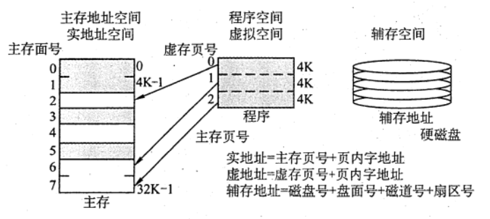
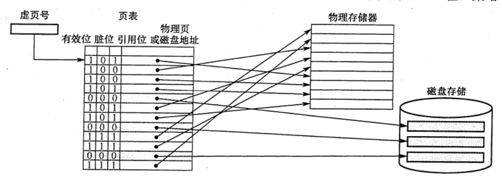
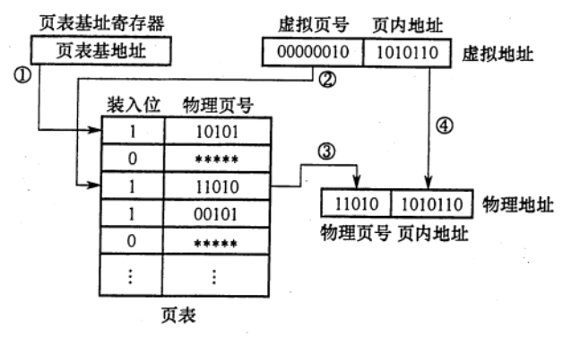
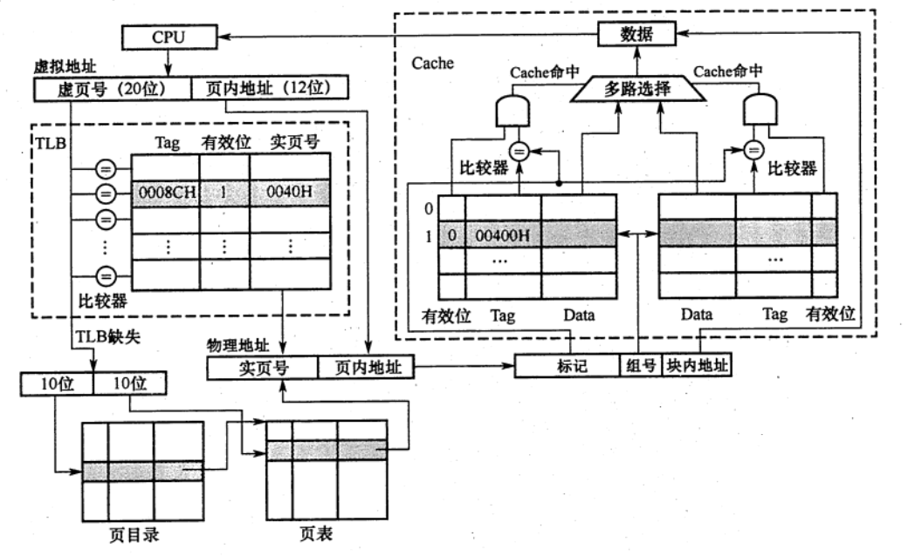
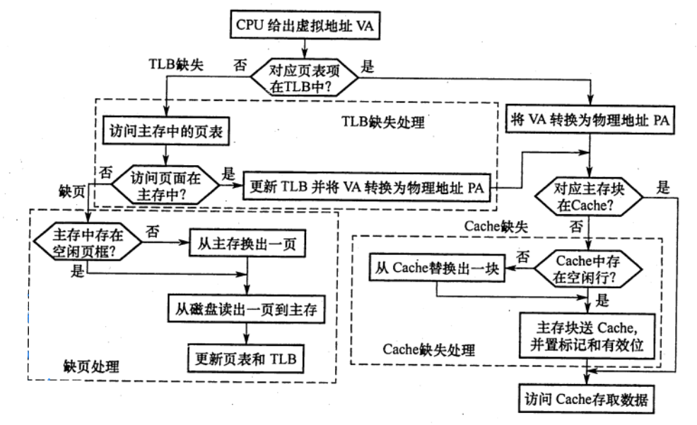
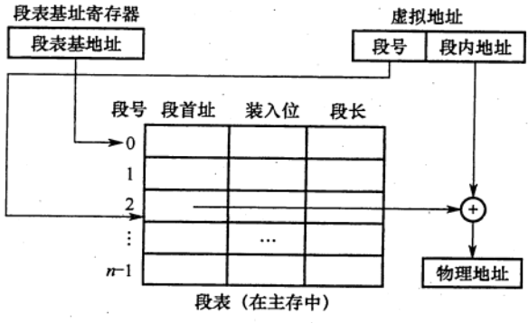
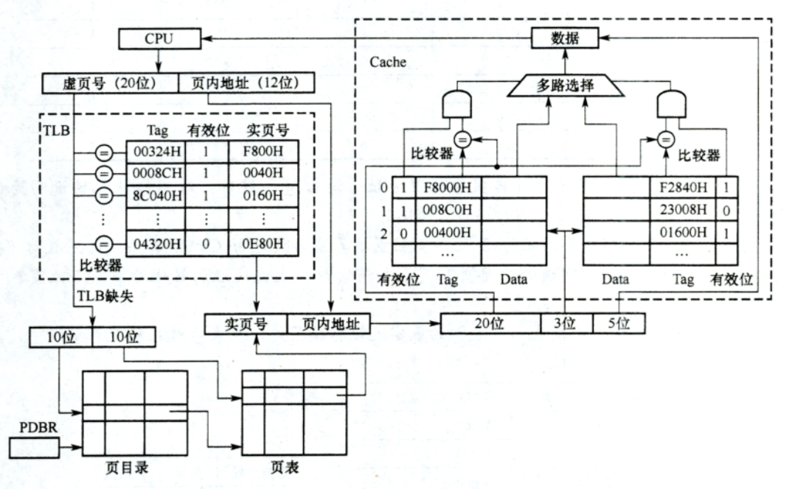

# 虚拟存储器
2022.09.04

[TOC]

主存和辅存共同构成了虚拟存储器，二者在硬件和系统软件的共同管理下工作。对于应用程序员而言，虚拟存储器是透明的。虛拟存储器具有主存的速度和辅存的容量。

## 概念

虚拟存储器将主存或辅存的地址空间统一编址，形成一个庞大的地址空间，在这个空间内，用户可以自由编程，而不必在乎实际的主存容量和程序在主存中实际的存放位置。

用户编程允许涉及的地址称为虛地址或逻辑地址，虚地址对应的存储空间称为虚拟空间或程序空间。实际的主存单元地址称为实地址或物理地址，实地址对应的是主存地址空间，也称实地址空间。虚地址比实地址要大很多。虚拟存储器的地址空间如图所示。

CPU 使用虚地址时，由辅助硬件找出虚地址和实地址之间的对应关系，并判断这个虚地址对应的存储单元内容是否已装入主存。若已在主存中，则通过地址变换，CPU 可直接访问主存指示的实际单元：若不在主存中，则把包含这个字的一页或一段调入主存后再由 CPU 访问。若主存已满，则采用替换算法置换主存中的交换块（即页面）。

虚拟存储器也采用和 Cache 类似的技术，将辅存中经常访问的数据副本存放到主存中。但是缺页（或段）而访问辅存的代价很大，提高命中率是关键，因此**虚拟存储机制采用全相联映射**，每个虚页面可以存放到对应主存区域的任何一个空闲页位置。此外，当进行**写操作**时，不能每次写操作都同时写回磁盘，因而，在处理一致性问题时，采用**回写法**。

## 页式虚拟存储器

**页式虚拟存储器**以**页为基本单位**。虚拟空间与主存空间都被划分成同样大小的页，主存的页称为实页、页框，虛存的页称为虚页。把虚拟地址分为两个字段：**虚页号和页内地址**。虚拟地址到物理地址的转换是由页表实现的。页表是一张存放在主存中的虚页号和实页号的对照表，它记录程序的虚页调入主存时被安排在主存中的位置。**页表一般长久地保存在内存中**。

### 页表

下图是一个页表示例。**有效位**也称装入位，用来表示对应页面是否在主存，若为 1，则表示该虚拟页己从外存调入主存，此时页表项存放该页的物理页号；若为 0，则表示没有调入主存，此时页表项可以存放该页的磁盘地址。**脏位**也称修改位，用来表示页面是否被修改过，虚存机制中采用**回写策略**，利用胜位可判断替换时是否需要写回磁盘。**引用位**也称使用位，用来配合**替换策略**进行设置，例如是否实现最先调入(FIFO 位）或最近最少用（LRU位）策略等。

CPU执行指令时，需要先将虚拟地址转换为主行物理地址。**页表基址奇存器**存放进程的**页表首地址**，然后根据虚拟地址**高位部分**的**虚拟页号**找到对应的页表项，若装入位为 1，则取出物理页号，和虚拟地址低位部分的页内地址拼接，形成实际物理地址：若装入位为 0，则说明缺页，需要操作索统进行缺页处理。地址变换的过程如下图所示

页式虚拟存储器的优点是，页面的长度固定，页表简单，调入方便。缺点是，由于程序不可能正好是页面的整数倍，最后一页的零头将无法利用而造成浪费，并且页不是逻辑上独立的实体，所以处理、保护和共享都不及段式虚拟存储器方便。

### 快表

由地址转换过程可知，访存时先访问一次主存去查页表，再访问主存才能取得数据。如果缺页，那么还要进行页面替换、页面修改等，因此采用虚拟存储机制后，访问主存的次数更多了。

依据程序执行的局部性原理，在一段时间内总是经常访问某些页时，若把这些页对应的页表项存放在高速缓冲器组成的快表（TLB）中，则可以明显提高效率。相应地把放在主存中的页表称为慢表（Page)。在地址转换时，首先查找快表，者命中，则无须访问主存中的页表

**快表**通常采用**全相联或组相联方式**。**每个 TLB 项由页表表项内容加上一个TLB 标记字段组成**，TLB 标记用来表示该表项取自页表中哪个虚页号对应的页表项，因此，TLB 标记的内容在全相联方式下就是该页表项对应的虚页号；组相联方式下则是对应虚页号的高位部分，而虚页号的低位部分用于选择TLB组的组索引（详细介绍见 《操作系统考研复习指导》一书的3.2.7节）。

### 具有TLB 和Cache 的多级存储系統
下图是一个具有 TLB 和 Cache 的多级存储系统，其中 Cache 采用二路组相联方式。CPU给出一个 32 位的虚拟地址，TLB 采用全相联方式，每一项都有一个比较器，查找时将<u>虚页号</u>与<u>每个 TLB 标记字段</u>同时进行比较，若有某一项相等且对应有效位为 1，则TLB 命中，此时可直接通过TLB 进行地址转换：若末命中，则TLB 缺失，需要访问主存去查页表。图中所示的是两级页表方式，虚页号被分成页目录素引和页表索引两部分，由这两部分得到对应的页表项，从而进行地址转换，并将相应表项调入 TLB，若TLB 己满，则还需要采用替换策略。完成由虚拟地址到物理地址的转换后，Cache 机构根据映射方式将物理地址划分成多个字段，然后根据映射规则找到对应的 Cache 行或组，将对应 Cache 行中的标记与物理地址中的高位部分进行比较，若相等且对应有效位为 1，则 Cache 命中，此时据块内地址取出对应的字送 CPU。

查找时，快表和慢表也可以同步进行，若快表中有此虚页号，则能很快地找到对应的实页号，并使慢表的查找作废，从而就能做到虽采用虚拟存储器但访问主存速度几乎没有下降。

在一个具有 Cache 和 TLB 的虚拟存储系统中，CPU一次访存操作可能涉及 TLB、页表、Cache、主存和磁盘的访问，访问过程如下图所示。可见，CPU 访存过程中存在三种缺失情况：

1. TLB 缺失：要访问的页面的页表项不在TLB 中
2. Cache 缺失：要访问的主存块不在Cache 中
3. Page 缺失：要访问的页面不在主存中。

这三种缺失的可能组合情况如下表所示。

| TLB  | Page | Cache |                       说明                       |
| :--: | :--: | :---: | :----------------------------------------------: |
| 命中 | 命中 | 命中  |   TLB命中Page一定命中，信息在主存，可能在Cache   |
| 命中 | 命中 | 缺失  |  TLB命中Page一定命中，信息在主存，可能不在Cache  |
| 缺失 | 命中 | 命中  |   TLB缺失Page可能命中，信息在主存，可能在Cache   |
| 缺失 | 命中 | 缺失  |  TLB缺失Page可能命中，信息在主存，可能不在Cache  |
| 缺失 | 缺失 | 缺失  | TLB缺失Page可能不命中，信息不在主存，也不在Cache |

* （全命中）最好的情况是第1种组合，此时无须访问主存；
* （找一次地址或找一次数据）第 2 种和第 3 种组合都需要访问一次主存；
* （找地址+数据）第4种组合需要访问两次主存；
* 第5种组合发生“缺页异常”，需要访问磁盘，并且至少访问两次主存。
* Cache 缺失处理由硬件完成；
* 缺页处理由软件完成，操作系统通过 “缺页异常处理程序〞来实现；
* TLB 缺失既可以用硬件又可以用软件来处理。

## 段式虚拟存储器

段式虚拟存储器中的段是按程序的逻镇结构划分的，各个段的长度因程序而异。把虚拟地址分为两部分：**段号和段内地址**。虚拟地址到实地址之问的变换是由段表来实现的。段表是程序的逻辑段和在主存中存放位置的对照表。段表的每行记录与某个段对应的**段号、装入位、段起点和段长**等信息。由于段的长度可变，所以**段表中要给出各段的起始地址与段的长度**。

CPU 根据虚拉地址访存时，首先根据段号与段表基地址拼接成对应的段表行，然后根据该段装行的装入位判断该段是否已调入主存（装入位为 “1”，表示该段己调入主存；装入位为“0”，表示该段不在主存中）。已调入主存时，从段表读出该段在主存中的起始地址，与段内地址（偏移量）相加，得到对应的主存实地址。段式盛拟存储器的地址变换过程如下图所示。

段式盛拟存储器的优点是，段的分界与程序的自然分界相对应，因而具有逻辑独立性，使得它易于编译、管理、修改和保护，下图段式虛拟存储器的地址变换过程也便于多道程序的共享；缺点是因为段长度可变，分配空间不便，容易在段间留下碎片，不好利用，造成浪费。

## 段页式虚拟存储器

把程序按逻辑结构**分段**，**每段再划分为固定大小的页**，主存空间也划分为大小相等的页，程序对主存的调入、调出仍以**页**为基本传送单位，这样的虚拟存储器称为段页式虚拟存储器。

在段页式虚拟存储器中，每个程序对应一个段表，每段对应一个页表，段的长度必须是页长的整数倍，段的起点必须是某一页的起点虚地址分为段号、段内页号、页内地址三部分。CPU 根据虚地址访存时，首先根据段号得到段表地址：然后从段表中取出该段的页表起始地址，与虛地址段内页号合成，得到页表地址，最后从页表中取出实页号，与页内地址拼接形成主存实地址。

段页式虛拟存储器的优点是，兼具页式和段式虛拟存储器的优点，可以按段实现共享和保护。缺点是在地址变换过程中需要两次查表，系统开销较大。

## 虚拟存储器与Cache的比较

1. 相同之处
   1. 最终目标都是为了提高系统性能，两者都有容量、速度、价格的梯度。
   2. 都把数据划分为小信息块，并作为基本的传递单位，虚存系统的信息块更大。
   3. 都有地址的映射、替换算法、更新策略等问题。
   4. 依据程序的局部性原理应用 “快速缓存的思想〞，将活跃的数据放在相对高速的部件中。
2. 不同之处
   1. Cache 主要解决系统速度，而虚拟存储器却是为了解决主存容量。
   2. Cache 全由硬件实现，是硬件存储器，对所有程序员透明；而虚拟存储器由 0S 和硬件共同实现，是逻辑上的存储器，对系统程序员不透明，但对应用程序员透明。
   3. 对于不命中性能影响，因为CPU 的速度约为 Cache 的 10 倍，主存的速度为硬盘的 100 倍以上，因此虚拟存储器系统不命中时对系统性能影响更大。
   4. CPU 与 Cache 和主存都建立了直接访问的通路，而辅存与 CPU 没有直接通路。也就是说在 Cache 不命中时主存能和 CPU 直接通信，同时将数据调入 Cache：而虚拟存储器系统不命中时，只能先由硬盘调入主存，而不能直接和 CPU 通信。

## 习题

1. 为使虛拟存储系统有效地发挥共预期的作用，所运行程序应具有的特性是( )。
   A. 不应含有过多的IO 操作
   B. 大小不应小于实际的内存容量
   C. 应具有较好的局部性
   D. 顺序执行的指令不应过多

   【答案】：C

2. 虚拟存储管理系统的基础是程序访问的局部性原理，此理论的基本含义是( )。
   A. 在程序的执行过程中，程序对主存的访问是不均匀的
   B. 空间局部性
   C. 时间局部性
   D. 代码的顺序执行

   【答案】：A

3. 虛拟存储器的常用管理方式有段式、页式、段页式，对于它们在与主存交换信息时的单位，以下表述正确的是（）。
   A.段式来用“页”
   C.段页式来用“段”和“页”
   B.页式采用“块”
   D.页式和段页式均仅采用“页”

   【答案】：D

4. 下列关于虚存的叙述中，正确的是（ ）。
   A.对应用程序员透明，对系统程序员不透明
   B. 对应用程序员不透明，对系统程序员透明
   C.对应用程序员、系统程序员都不透明
   D.对应用程序员、系统程序员都透明

   【答案】：A

5. 在虚拟存储器中，当程序正在执行时，由（ ）完成地址映射。
   A.程序员
   B.编译器
   C装入程序
   D.操作系统

   【答案】：D

6. 采用虛拟存储器的主要目的是（ ）。
   A. 提高主存储器的存取速度
   B. 扩大主存储器的存储空间
   C. 提高外存储器的存取速度
   D. 扩大外存储器的存储空间

   【答案】：B

7. 关于虛拟存储器，下列说法中正确的是（ ）。
   I. 虛拟存储器利用了局部性原理
   II. 页式虛拟存储器的页面若很小，主存中存放的页面数较多，导致缺页频率较低，换页次数诚少，最终可以提升操作速度
   III. 页式虛拟存储器的页面若很大，主存中存放的页面数较少，导致页面调度频率较高，换页次数增加，降低探作速度
   IV. 段式虛拟存储器中，段具有逻辑独立性，易于实现程序的编译、管理和保护，也便于多道程序共享
   A. I、III、IV
   B. I、II、III
   C. I、II、IV
   D. II、III、IV

   【答案】：A

8. 虚拟存储器中的页表有快表和慢表之分，下面关于页表的叙迷中正确的是（ ）。
   A. 快表与慢表都存储在主存中，但快表比慢表容量小
   B. 快表采用了优化的搜索算法，因此查找速度快
   C. 快表比慢表的命中率高，因此快表可以得到更多的搜索结果
   D. 快表采用相联存储器件组成，按照查找内容访问，因此比慢表查找速度快

   【答案】：D

9. 【2010 统考真题】下列命令组合的一次访存过程中，不可能发生的是（ ）。
   A. TLB未命中，Cache 未命中，Page 未命中
   B. TLB 未命中，Cache 命中，Page 命中
   C. TLB命中，Cache 未命中，Page 命中
   D. TLB命中，Cache 命中，Page 未命中

   【答案】：D

10. 【2013 统考真题】某计算机主存地址空间大小为 256 MB，按字节编址。虛拟地址空间大小为4GB，采用页式存储管理，页面大小为 4KB，TLB（快表）采用全相联映射，有4个页表项，内容如下表所示。

    | 有效位 |  标记  | 页框号 | ...  |
    | :----: | :----: | :----: | :--: |
    |   0    | FF180H | 0002H  | ...  |
    |   1    | 3FFF1H | 0035H  | ...  |
    |   0    | 02FF3H | 0351H  | ...  |
    |   1    | 03FFFH | 0153H  | ...  |

    则对虛拟地址 03FF F18OH 进行虛实地址变换的结果是（ ）。
    A. 015 3180E
    B. 003 5180H
    C. TLB缺失
    D. 缺页

    【答案】：A

11. 【2015 统考真题】假定编译器将賦值语句 “x=x+3:” 转换为指令“add xaddr， 3”，共中xaddr 是x对应的存储单元地址。若执行该指令的计算机来用页式虚拟存储管理方式，并配有相应的 TLB，且Cache 使用直写方式，则完成该指令功能需要访问主存的次数至少是（）
    A. 0
    B. 1
    C. 2
    D. 3

    【答案】：B

12. 【2015 统考真题】假定主存地址为 32 位，按宇节编址，主存和Cache 之间采用直接映射方式，主存块大小为 4个宇，每字32位，采用回写方式，则能存放4K 字数据的Cache 的，总容量的位数至少是（ ）。
    A. 146K
    B. 147K
    C.148K
    D. 158K

    【答案】：32 = [Tag(32-4-10=18bits)]\[Cache行 10bits]\[块内地址 4x32=2^4B]，18+1+1=20，20K。4K 字：4Kx32bits = 128K。128K+20K=148K。C

13. 【2019統考真题】下列关于缺页处理的叙述中，错误的是（）。
    A. 缺页是在地址转换时 CPU 检测到的一种异常
    B.缺页处理由採作系统提供的缺页处理程序来完成
    C块页处理程序根据页故障地址从外存读入所缺失的页
    D.缺页处理完成后回到发生缺页的指令的下一条指令执行

    【答案】：D

14. 【2020 統考真题】下列关子 TLB 和Cache 的叙述中，错误的是()。
    A．命中率都与程序局部性有关
    B.缺失后都需要去访问主存
    C.缺失处理都可以由硬件实现
    D. 都由 DRAM 存储器组成

    【答案】：D。Cache 由 SRAM 组成；TLB 通常由相联存储器组成，也可由 SRAM 组成。DRAM 需要不断刷新，性能偏低，不适合组成TLB 和Cache。选项A、B和C都是TLB 和 Cache 的特点。

15. 【2011 统考真题】莱计算机存储器按字节编址，虚拟（逻輯）地址空问大小为 16MB，主存（物理）地址空问大小为 1MB，页面大小为 4KB; Cache 采用直接映射方式，共8行；主存与Cache 之问交换的块大小为 32B。系统运行到某一时刻时，页表的部分内容和 Cache 的部分内容分別如下的左图和右图所示，图中页框号及标记宇段的内容为十六进制形式

    | 虚页号 | 有效位 | 页框号 | ...  |
    | :----: | :----: | :----: | :--: |
    |   0    |   1    |   06   | ...  |
    |   1    |   1    |   04   | ...  |
    |   2    |   1    |   15   | ...  |
    |   3    |   1    |   02   | ...  |
    |   4    |   0    |   -    | ...  |
    |   5    |   1    |   2B   | ...  |
    |   6    |   0    |   -    | ...  |
    |   7    |   1    |   32   | ...  |

    | 行号 | 有效位 | 标记 | ...  |
    | :--: | :----: | :--: | :--: |
    |  0   |   1    | 020  | ...  |
    |  1   |   0    |  -   | ...  |
    |  2   |   1    | 01D  | ...  |
    |  3   |   1    | 105  | ...  |
    |  4   |   1    | 064  | ...  |
    |  5   |   1    | 14D  | ...  |
    |  6   |   0    |  -   | ...  |
    |  7   |   1    | 27A  | ...  |

    回答下列问题：
    1）虚拟地址共有几位，哪几位表示虚页号？物理地址共有几位，哪几位表示页框号（物理页号）？
    2）使用物理地址访问 Cache 时，物理地址应划分成哪几个字段？要求说明每个字段的位数及在物理地址中的位置。
    3）虛拟地址 001C60F 所在的页面是否在主存中？若在主存中，则该虚拟地址对应的物理地址是什么？访问该地址时是否 Cache 命中？要求说明理由。
    4）假定为该机配置一个四路组相联的TLB，共可存放8个页表项，若其当前内容（十六进制）如下图所示，則此时虛拟地址 024BACH 所在的页面是否存在主存中？要求说明理由。

    | 组号 | 有效位 | 标记 | 页框号 | 有效位 | 标记 | 页框号 | 有效位 | 标记 | 页框号 | 有效位 | 标记 | 页框号 |
    | :--: | :----: | :--: | :----: | :----: | :--: | :----: | :----: | :--: | :----: | ------ | :--: | :----: |
    |  0   |  【0   |  -   |  0】   |  【1   | 001  |  15】  |  【0   |  -   |  -】   | 【1    | 012  |  1F】  |
    |  1   |  【1   | 013  |  2D】  |  【0   |  -   |  -】   |  【1   | 008  |  7E】  | 【0    |  -   |  -】   |

    【答案】：

    1. 16MB = 2^24B，虚拟地址共有24bits，4KB=2^12B，12～23位代表虚页号
       1MB = 2^20B，物理地址共有20bits，4KB=2^12B，12～19位代表虚页号
    2. 32B = 2^5B。块内地址：5bits，0～4位。
       8 = 2^3。Cache行数：3bits，5～7位。
       20-8=12bits，标记。8～19位。
    3. 001C60H。虚页号位001。对应页框号位04。
       物理地址：04C60H = 【0000,0100,1100】【011】【0,0000】B，011B=3，行号=105≠04C，不在，没命中
    4. 024BACH = 【0000,0010,010】【0】【1011,1010,1100】，页框号1F，TLB命中，在主存中

16. 【2018 统考真题】某计算机来用页式虚拟存储管理方式，按宇节编址。CPU 进行存储访问的过程如下图所示。根据该图回答下列问题，
    1）主存物理地址占多少位？
    2）TLB采用什么映射方式？TLB是用SRAM 还是用DRAM 实现？
    3）Cache 来用什么映射方式？若 Cache采用 LRU 替换算法和回写策略，则 Cache 每行中除数据（Data）Tag 和有效位外，还应有哪些附加位？ Cache 总容量是多少？Cache 中有效位的作用是什么？
    4）若 CPU 给出的虛拟地址为 0008 C040H，则对应的物理地址是多少？是否在 Cache中命中？说明理由。若CPU 给出的虛拟地址为 0007 C260H，则该地址所在主存块映射到的 Cache 组号是多少？

    

    【答案】：

    1. 主存地址 = 16+12 =。28bits
    2. TLB采用全相联映射，SRAM实现
    3. Cache采用二路组相连映射。脏位1bit，替换控制位1bit。每行：(1+2+20)+2^5x8 = 279bits
       行数 = 2^3 x 2 =16，总位数：16x279=4464bits，有效位作用是标记该行是否数据是否有效。
    4. 0008 C040H -> 004 0040H = 【00400H】,【100】【0,0000】，100->0组，2行，标记00400H，但有效位为0，未命中。
        0007 C260 -> ??? ?260H = 【????2H】，【011】【0，0000】，组号3

17. 【2021 统考真题】假设计算机M的主存地址为 24 位，按字节编址；采用分页存储管理方式，虛拟地址为 30位，页大小为 4KB;TLB 来用二路组相联方式和 LRU 替换第略，共8组。请回答下列问题。
    1）虚拟地址中哪几位表示虛页号？哪几位表示页内地址？
    2）已知访问TLB时虛页号高位部分用作TLB标记，低位部分用作TLB组号，M的虛拟地址中哪几位是 TLB 标记？哪几位是TLB组号？
    3）假设TLB初始时为空，访问的虛页号依次为10,12,16,7,26,4,12和20，在此过程中，哪一个虛页号对应的TLB表项被替换？说明理由。
    4）若将M中的虚拟地址位数增加到 32位，则TLB 表项的位数增加几位？

    【答案】：

    1. 4KB = 2^12B，30-12=18，12～29位代表虚页号。0～11代表页内地址。

    2. 组号3bits，12~14位代表组号，15～29代表TLB标记

    3. 10=1[010]，12=1[100]，16=10000，7=0111，26=11010，20=10100

       |      | 10   | 12   | 16   | 7    | 26   | 4    | 12   | 20   |
       | ---- | ---- | ---- | ---- | ---- | ---- | ---- | ---- | ---- |
       | 组号 | 010  | 110  | 000  | 111  | 010  | 100  | 100  | 100  |
       | 000  |      |      | 16   |      |      |      |      |      |
       | 010  | 10   |      |      |      | 26   |      |      |      |
       | 100  |      | 12   |      |      |      | 4    | 12   | 20   |
       | 110  |      |      |      |      |      |      |      |      |
       | 001  |      |      |      |      |      |      |      |      |
       | 011  |      |      |      |      |      |      |      |      |
       | 101  |      |      |      |      |      |      |      |      |
       | 111  |      |      |      | 7    |      |      |      |      |

       10和4和12会被替换

    4. 2位
