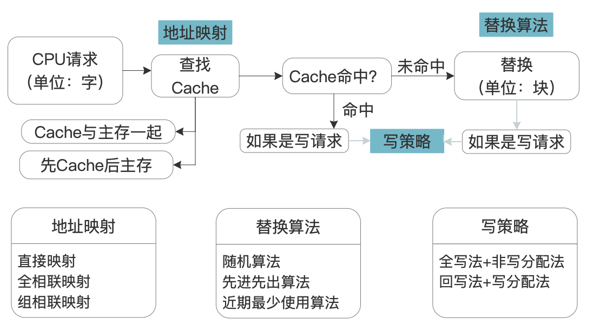
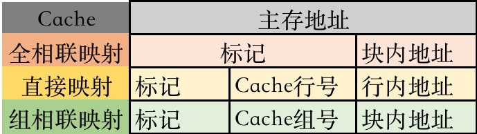
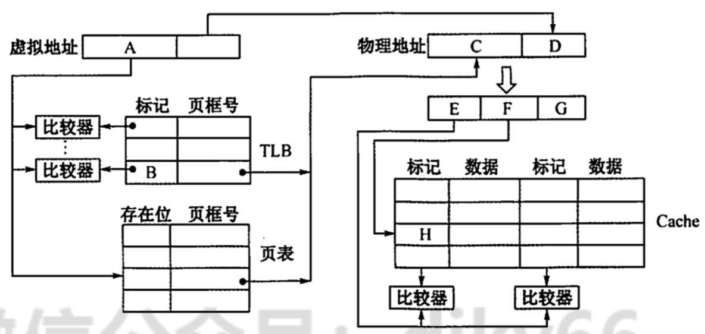

# 高速缓冲存储器
2022.09.03

[TOC]

## 程序访问的局部性原理

* 时间局部性原理：现在用的未来也用，因为程序可能有循环
* 空间局部性原理：现在用的，未来用的在附近，因为指令通常顺序执行，数据通常顺序存储

注意：C语言二维数组按照行有限存储，a\[行\]\[列\]。一行放一起。如下图：


## Cache的基本工作原理



1. Cache分成很多【Cache块/Cache行】，主存被分成很多与Cache块大小相同的【主存块】。

2. 块长 = Cache行长

3. $$
   H = \frac{N_c}{N_c+N_m}
   $$

   $H$: Cache命中率

   $N_c$: Cache命中次数

   $N_m$: 访存次数

4. $$
   T_a = 
   \begin{cases}
   H\cdot T_c + (1-H)\cdot T_m,  & \text{同时访问Cache与主存} \\
   T_c + (1-H)\cdot T_m, & \text{先访问Cache后主存}
   \end{cases}
   $$

   $T_a$: Cache主存平均访问时间

   $T_m$: 访存时间

   $T_c$: Cache时间


* 【例题】：在高速缓存系统中，主存容量为 12MB， Cache 容量为 400KB，则该存储系统的容童为
  A. 12MB + 400KB
  B. 12MB
  C. 12MB - 12MB + 400KB
  D. 12MB - 400KB

  【答案】：B

* 【例题】访问Cache 系统失效时，通常不仅主存向 CPU 传送信息，同时还需要将信息写入Cache， 在此过程中传送和写入信息的数据宽度各为（）。
  A. 块、页
  B. 字、字
  C. 字、块
  D. 块、块

  【答案】：C

* 对于由高速缓存、主存、硬盘构成的三级存储体系，CPU 访问该存储系统时发送的地址为（）
  A. 高速缓存地址
  B.虛拟地址
  C.主存物理地址
  D.磁盘地址

  【答案】：C

* 【2009 统考真题】假设某计算机的存储系统由 Cache 和主存组成，某程序执行过程中访存1000次，其中访问 Cache 缺失（未命中）50次，则Cache的命中率是（ ）。
  A. 5%
  B. 9.5%
  C. 50%
  D. 95%

  【答案】：1-50/1000 = 95%，D

* 【2014 统考真题】来用指令 Cache 与数据 Cache 分离的主要目的是（ ）。
  A. 降低Cache 的缺失损失
  B. 提高Cache 的命中率
  C. 降低CPU 平均访存时间
  D. 減少指令流水线资源冲突

  【答案】：D

* 【2017统考真题】某C语言程序段如下

  ```C
  for(i=0;i<=9;i++){
    temp=1;
    for(j=0,j<=i,j++)temp*=a[j];
  }
  sum += temp;
  ```

  下列关于数组a的访问局部性的描述中，正确的是（）.
  A. 时间局部性和空间局部性皆有
  B. 无时间局部性，有空间局部性
  C. 有时问局部性，无空间局部性
  D. 时间局部性和空间局部性皆无

  【答案】：A

  

## Cache和主存的映射方式

### 直接映射


$$
Cache行号 = 主存块号\ mod\ Cache总行数
$$
假设Cache有$2^c$行，主存有$2^m$块，主存地址前m位代表了主存块号，主存块号的后c位代表了Cache行号。剩下的m-c位作为标记，存到Cache前t位。

例子：主存大小1MB，Cache大小8KB，主存与Cahce数据传送单位512B。
$$
\begin{align}
主存块数&：1MB / 512B &= 2^{20} / 2^{9} = 2^{11}\\
Cache块数&：8KB / 512B &= 2^{13} / 2^{9} = 2^{4}\\
标记位数&：11-4=7
\end{align}
$$
若Cache为空，如何对0220CH单元进行访问？
$$
\begin{align}
0220C &= 0000,0010,0010,0000,1100\\
主存地址 &= 标记[7]+Cache行号[4]+块内地址\\
标记 &= 0000001\\
Cache行号&=0001\\
块内地址&=000001100
\end{align}
$$

> 小结：
>
> 
>
> 1. 组成：【先**左**后**右**】主存地址**左**边m位代表主存块号，主存块$2^m$个。（注：如果不知道主存块个数，也可以通过Cache行大小与“按字节寻址”，推出块内地址要的位数，剩下的就是主存块号要的位数）。主存块号**右**边n位代表Cache行号，Cache行$2^n$行。
> 2. 用主存地址变换成Cache地址：抛去最左边的m-n位标记
> 3. Cache地址寻找主存地址：Cache地址存放内容是[有效位，脏位，标记]，我们将标记放在Cache地址左边就组成了主存地址

### 全相联映射


主存的每一块可以装进任意一行。

标记 + 块内地址 = 主存地址

例子：MM大小 = 2GB = 2^{31}B，Cache大小 = 2KB = 2^{11}B。说明主存地址需要31bits，Cache地址需要11bits，标记需要31-11=20bits。

### 组相联映射


$$
Cache组号 = 主存块号\ mod\ Cache总组数
$$
n路组相连：一个组里边包含n个Cache行

### 小结

#### 视频链接

> Youtube课程推荐：
>
> [直接映射](https://www.youtube.com/watch?v=V_QS1HzJ8Bc)，[全相联映射](https://www.youtube.com/watch?v=uwnsMaH-iV0)，[组相联映射](https://www.youtube.com/watch?v=KhAh6thw_TI)
>
> 国防科技大学课程推荐：
>
> [【计算机原理-国防科技大学-直接映射】 【精准空降到 06:20】](https://www.bilibili.com/video/BV1r7411b7nW?p=104&t=381)

#### 内容总结

Cache行存储内容：


主存地址的划分：



#### 例题

1. 例题：主存大小256MB，按字节编址，Cache有8个Cache行，行长64B。不考虑Cache一致维护性和替换算法控制位。

   * 采用直接映射，Cache总大小？

     【答案】

     $\frac{256MB}{1B} = 2^{28}$, 主存地址为28位

     Cache行有8个，行号占3位

     行长$\frac{64B}{1B} = 2^6$, 块内地址占6位

     主存地址(28) = [标记(28-3-6=19), 行号(3), 块内地址(6)]

     直接映射Cache行：**[有效位(1), 标记(19), 数据(64*8=512)]**

     Cache总大小 = $8\cdot(1+19+512)=4256bit=532B$

   * 采用直接映射，主存地址3200（十进制）主存块对应的Cache行号是多少？采用二路组相联映射呢？

     【答案】

     直接映射：

     $$
     \begin{align}
     3200D &= 1100,1000,0000B\\
     块内地址 &=000000(6)\\
     行号&=010(3)= 2\\
     标记&=0000000000000000110(19)
     \end{align}
     $$
     二路组相联映射：

     $$
     \begin{align}
     主存地址(28) &= [标记(28-2-6=20), 组号(2), 块内地址(6)]\\
     Cache行&=[有效位(1), 标记(20), 数据(64\times8=512)]\\
     块内地址&=000000(6)\\
     组号&=10(2)= 2\\
     行号 &= 4或5\\
     标记&=00000000000000001100(20)
     \end{align}
     $$

   * 直接相连，简述访存过程，主存地址0123456H

     【答案】

     主存地址：0123456H =[0000,0001,0010,0011,010\]\[0,01\]\[01,0110\]B

     首先获取行号：001 = 1

     然后拿主存地址的标记与Cache的行号为1的标记对比

     如果相同，并且有效位是1，Cache命中，按照地址[010110]读出数据部分送给CPU

     否则，进行访存，并将内容所在主存块送到Cache，有效位置1

2. 有一主存-Cache层次的存储器，其主存容量1MB，Cache容量为l6KB，每块有8个字，每字32位，采用**直接地址映像方式**，Cache起始字块为第0块，若主存地址为35301H,且CPU访问Cache命中，则在Cache的第( )（十进制表示）字块中。

  【答案】
  $$
  \begin{align}
  每块大小&=8\times 32=2^{8}\\
  主存容量&=1MB = 2^{20}B\\
  Cache容量&=16KB = 2^{14}B\\
  主存块数&=2^{20}/2^{8}=2^{12}\\
  Cache块数&=2^{14}/2^{8}=2^6\\
  标记位数&=12-6=6\\
  字块内地址&=32 = 2^5\to 5bits\\
  主存地址&=[标记6][行号6][块内地址5]\\
  &[001101][010011000][00001]\\
  0,1001,1000B &= 128+16+8= 152\\
  \end{align}
  $$

  > $Cache行号 = 主存块号\ mod\ Cache总行数$
  >
  > 但这道题一个Cache行里边有8个字，算字块内地址的时候只算了一个字的，所以我感觉向组相联映射。

3. 某32位计算机的Cache容量为16KB,Cache行的大小为16B,若主存与Cache地址映像采用**直接映像方式**，则主存地址为0x1234E8F8的单元装入Cache的地址是( )。
  A. 0001001001101
  B. 01000100011010
  C. 10100011111000
  D. 11010011101000

  【答案】

  通过答案都是14位，得知，按字节编址。C
  $$
  \begin{align}
  Cache容量&=16KB = 2^{14}B\\
  行长&=16B = 2^4B (按字节编址)\to 4bits\\
  Cache行数&=\frac{2^{14}}{2^4}=2^{10}\to 行号10bits\\
  主存地址 &=[标记][行号(10)][块内地址(5)]\\
  1234E8F8 &= [0001,0010,0011,0100,1][110,1000,1111(10)],[1000(4)]\\
  Cache地址 &= 10,1000,1111,1000
  \end{align}
  $$

4. 某存储系统中，主存容量是 Cache 容量的 4096 倍，Cache 被分为64个块，当主存地址和 Cache 地址采用直接映像方式时，地址映射表的大小应为（ ）。（假设不考虑一致维护和替换算法位。）
   A. 6×4097bit
   B. 64x12bit
   C. 6×4096bit
   D. 64×13bit

   【答案】：4096 = 2^{12} -> 标记12 bits，64 = 2^6 -> Cache行号 6bits（行号不存在表里），12+1=13，-> D, 64x13bit

5. 有效容量为 128KB 的Cache，每块16B，采用8路组相联。字节地址为 1234567H 的单元调入该 Cache，则其Tag 应为（）。
   A. 1234H
   B. 2468H
   C. 048DH
   D. 12345H

   【答案】：Cache大小128KB=2^17B，每块大小2^4B，组号2^3。组数2^17B/2^4/2^3 = 2^10组。

   每块16B，块内地址4bits。n-4-10:

   1234567H = [0001 0010 0011 01] [00 0101 0110] [0111] B。00 0100 1000 1101 = 048D，C

6. 设有8页的逻辑空间，每页有1024B，它们被映射到 32 块的物理存储区中，则按字节编址逻辑地址的有效位是（），物理地址至少是（）位
   A. 10, 12
   B. 10, 15
   C. 13，15
   D. 13，12

   【答案】：1024B = 2^10。注意：块内地址和物理地址一样都有10位。C

7. 【2009 统考真题】某计算机的 Cache 共有 16 块，采用二路组相联映射方式（即每组2块)。每个主存块大小为 32B，按字节编址，主存 129 号单元所在主存块应装入的 Cache 组号是（ ）。A.
   A. 0
   B. 2
   C. 4
   D. 6

   【答案】：32B = 2^5B，块内地址5bits。组号1bit。

   129 = 【10】【0】【0 0001】。0，A

8. 

   

## Cache中主存块的替换算法

### 随机算法（RAND）

随机替换掉Cache块。命中率低，不根据局部性原理。

### 先进先出算法（FIFO）

先替换掉先进入的Cache块。最常用。**不根据局部性原理**。

### 近期最少使用算法（LRU）

替换掉近期最少使用的Cache块。为每一个Cache设置一个计数器，记录多少次没用过了。根据局部性原理。

类似宝石迷阵的风暴模式，每一列可以理解成一个计时器，不命中就都加一，命中了就把那一列清零。


抖动现象：比如一共Cache有4个块，1234512345这样的访问，会不停的置换。

### 最不经常使用算法

每一项一个计数器，记录有多少次用到它了，要替换的时候就把最不经常使用的一项（数最小的）换掉。

### 例题

1. 某虛拟存储器系统采用页式内存管理，使用LRU 页面替换算法，考虑下面的页面访问地址流（每次访问在一个时间单位中完成)：1 8 1 7 8 2 7 2 1 8 3 8 2 1 3 1 7 1 3 7 假定内存容量为4个页面，开始时是空的，则页面失效率是（）
   A. 30%
   B. 5%
   C. 1.5%
   D. 15%

   【答案】：

   | 1    | 8    | 1    | 7    | 8    | 2    | 7    | 2    | 1    | 8    | 3    | 8    | 2    | 1    | 3    | 1    | 7    | 1    | 3    | 7    |
   | ---- | ---- | ---- | ---- | ---- | ---- | ---- | ---- | ---- | ---- | ---- | ---- | ---- | ---- | ---- | ---- | ---- | ---- | ---- | ---- |
   | 1    | 1    | 1    | 1    | 1    | 1    | 1    | 1    | 1    | 1    | 1    | 1    | 1    | 1    | 1    | 1    | 1    | 1    | 1    | 1    |
   |      | 8    | 8    | 8    | 8    | 8    | 8    | 8    | 8    | 8    | 8    | 8    | 8    | 8    | 8    | 8    | 7    | 7    | 7    | 7    |
   |      |      |      | 7    | 7    | 7    | 7    | 7    | 7    | 7    | 3    | 3    | 3    | 3    | 3    | 3    | 3    | 3    | 3    | 3    |
   |      |      |      |      |      | 2    | 2    | 2    | 2    | 2    | 2    | 2    | 2    | 2    | 2    | 2    | 2    | 2    | 2    | 2    |
   | x    | x    |      | x    |      | x    |      |      |      |      | x    |      |      |      |      |      | x    |      |      |      |

   6/20=30%

2. 在 Cache 中，常用的替换策略有随机法（RAND）、先进先出法（FIFO）、近期最少使用法（LRU)，其中与局部性原理有关的是（ ）。
   A. 随机法 （RAND）
   B. 先进先出法（FIFO）
   C. 近期最少使用法 （LRU）
   D. 都不是

   【答案】：C

3. 【2021 统考真题】若计算机主存地址为 32位，按字节编址，Cache 数据区大小为32KB，主存块大小为 32B，来用直接映射方式和回写（Write Back）策略，则 Cache行的位数至少是（ ）.
   A. 275
   B. 274
   C. 258
   D. 257

   【答案】

   32KB = 2^15B。2^15 / 2^5 = 2^10块，Cache行号10bits。块内地址5bits。

   Tag：32-10-5 = 17bits。

   17 + 2 + 32*8 = 24 + 256 = 275

## Cache写策略

### 全写法与非写分配法

* Cache命中，Cache和主存一起改。增加了写操作的访存次数。
* 写缓冲：数据同时写到Cache和写缓冲，写缓冲再写到主存。
* Cache不命中，只改主存，不再写进Cache。
* （巧计1：全写vs非写）
* （巧计2：既然命中全都写，够累的了，不命中就只改主存吧）

### 回写法与写分配法

* Cache命中，只改Cache，等被替换时再写回去。减少了访存次数，增加了数据不一致性隐患。
* 脏位/修改位：Cache块是否被修改过。
* Cache不命中，替换Cache，并且只改Cache。（缺点，连续的写，需要不停的掉块）
* （巧计1：回写，回+写）
* （巧计2：只改Cache，当然是拿过来改了，要拿进Cache所以是“分配”。）

### 多级Cache与分离式Cache

分离式Cache：把指令与数据放到不同的Cache

指令Cache与数据Cache分离一般在多级Cache的L1层(离CPU最近)

L1Cahce与L2Cache之间：全写法

L2Cache与主存之间：写回法（避免频繁的写）

### 例题

1. 关于 Cache 的更新策略，下列说法中正确的是（）。
   A. 读操作时，全写法和回写法在命中时应用
   B. 写操作时，回写法和写分配法在命中时应用
   C. 读操作时，全写法和写分配法在失效时应用
   D. 写操作时，写分配法、非写分配法在失效时应用

   【答案】：D

## 综合性例题

1. 假设主存地址位数为32 位，按字节编址，主存和Cache 之问来用全相联映射方式，主存块大小为1个字，每字32位，采用回写（write back）方式和随机替换策略，则能存放 32K 字数据的Cache 的总容量至少应有（）位。
   A. 1536K
   B. 1568K
   C. 2016K
   D. 2048K

   【答案】：有脏位。每个字32位，按字节编址，2^2B，2bits行内地址，32-2=30bits Tag。1+1+(30)[Tag]+32[数据位]=64。64*32K = 2048K

2. 假设主存按字节编址，Cache 共有64行，采用四路组相联映射方式，主存块大小为 32 字节，所有编号都从0开始。则第2593号存储单元所在主存块的Cache 组号是（）.
   A. 1
   B. 17
   C. 34
   D. 81

   【答案】：64=2^6行，四路组相联，2^4组。 32字节，按字节编址，2^5。
   2593= 2048 +  512 + 32 + 1-> 101【0001】【00001】 -> 0001，组号是1

3. 假定CPU 通过存储器总线读取数据的过程为：发送地址和读命令需1个时钟周期，存储器准备一个数据需8个时钟周期，总线上每传送1个数据需 1个时钟周期。若主存和 Cache 之间交换的主存块大小为 64B，存取宽度和总线宽度都为8B，则 Cache 的一次缺失损失至少为（）个时钟周期。
   A. 64
   B. 72
   C. 80
   D. 160

   【答案】：[发送地址和读命令(2) + 存储器准备(8) ] x 总线事物个数(64/8) = C

4. 假定来用多模块交叉存储器组织方式，存储器芯片和总线支持突发估送，CPU 通过存储器总线读取数据的过程为：发送首地址和读命令需 1个时钟周期，存储器准备第一个数据需8个时钟周期，随后每一个时钟周期总线上传送1个数据，可连续传送8个数据（即突发长度为8）。若主存和Cache 之间交换的主存块大小为 64B，存取宽度和总线宽度都为 8B，则 Cache 的一次缺失损失至少为（）个时钟周期。
   A. 17
   B. 20
   C. 33
   D. 80

   【答案】：[发送地址和读命令(2) + 存储器准备(8) ] + (8-1) = 17 = A

5. 【2012 统考真题】假设某计算机按字编址，Cache有4行，Cache 和主存之间交换的块大小为 1个字。若 Cache 的内容初始为空，来用二路组相联映射方式和 LRU 替换策略，则访问的主存地址依次为0,4,8,2,0,6,8,6,4,8时，命中 Cache 的次数是（ ）。
   A. 1
   B. 2
   C. 3
   D. 4

   【答案】：第一组可以放的：01，45，89。第二组可以放的：23，67。答案C

   |  编号   | 0    | 4    | 8    | 2    | 0    | 6    | 8    | 6    | 4    | 8    |
   | :-----: | ---- | ---- | ---- | ---- | ---- | ---- | ---- | ---- | ---- | ---- |
   | 第一组1 | 0    |      | 8    |      |      |      |      |      | 4    |      |
   | 第一组2 |      | 4    |      |      | 0    |      |      |      |      |      |
   | 第二组1 |      |      |      | 2    |      |      |      |      |      |      |
   | 第二组2 |      |      |      |      |      | 6    |      |      |      |      |
   |         | x    | x    | x    | x    | x    | x    |      |      | x    |      |

6. 【2016 统考真题】有如下C语言程序段：

   ```C
   for(k=0;k<1000;k++)
   	a[k]=a[k]+32；
   ```

   若数组a和变量k均为 int 型，int 型数据占 4B，数据 Cache 采用直接映射方式，数据区大小为1KB、块大小为 16B，该程序段执行前 Cache 为空，则该程序段执行过程中访问数组a的 Cache 缺失率约为( )
   A. 1.25%
   B. 2.5%
   C. 12.5%
   D. 25%

   【答案】

   链接：https://www.nowcoder.com/questionTerminal/1a58376787834b228381ebe6f50d842a
   来源：牛客网

   首先看数组共1000个int数据，就是4000B，需要占用的主存块数是4000B/16B = 250块。Cache大小是1024B，一块是16B，因此共有64块。问题简化为250块主存块映射到64块Cache的过程。主存与Cache块的交换单位是块，也就是4个int数据。a[k] = a[k]+32  右边是读取数据，左边是写回数据。也就是对一个数据两次操作。且第一个数据读取时不命中，写Cache命中。块中剩下的三个数读写都命中，也就是一块中的4个数据的8次操作，只有一次不命中！答案C

7. 【2010 统考真题】某计算机的主存地址空间大小为 256MB，按字节编址，指令 Cache 和数据 Cache 分离，均有8个Cache行，每个Cache 行大小为 64B，数据 Cache 来用直接映射方式。现有两个功能相同的程序 A和B，其伪代码如下所示：

   程序A

   ```C
   int a[256][256];
   ···
   int sum_array1()
   {
     int i, j, sum=0;
     for(i=0;i<256;i++)
       for(j=0;j<256;j++)
         sum += a[i][j];
     return sum;
   }
   ```

   程序B

   ```C
   int a[256][256];
   ···
   int sum_array2()
   {
     int i, j, sum=0;
     for(j=0;j<256;j++)
       for(i=0;i<256;i++)
         sum += a[i][j];
     return sum;
   }
   ```

   假定 int 类型数据用32 位补码表示，程序编译时，i、j和 sum 均分配在寄存器中，数组a 按行优先方式存放，其首地址为 320（十进制数）。请回答下列问题，要求说明理由或给出计算过程。
   1）不考虑用于 Cache 一致性维护和替换算法的控制位，数据 Cache 的总容量为多少？
   2）数组元素 a[0]\[31]和a[1]\[1]各自所在的主存块对应的Cache行号是多少（Cache 行号从0开始）？
   3）程序A和B的数据访问命中率各是多少？哪个程序的执行时间更短？

   【答案】

   1. $$
      \begin{align}
      Cache行大小 &= 64B = 2^6B\\
      主存大小 &= 256MB = 2^{28}B\\
      主存块数 &= 2^{28} / 2^6 = 2^{22}\\
      Cache块数 &= 2^{3}\\
      标记 &: 2^{22}/2^{3}=2^{19}\to 19bits\\
      Cache容量&=((19+1)/8+64B)\times 8 = 532B
      \end{align}
      $$

   2. $$
      \begin{align}
      a[0][31]&\to 320+31\times 4 = 444\\
      444D &= 256+256+32 = 0101,0010,0000B\\
      0101,0010,0000B &=[...](19bits)[1,10](3bits)[11,1100](6bits)B\\
      Cache行号&=6\\\\
      
      a[1][1]&\to 320+(1+256)\times 4 = 8544\\
      8544D &= 8192+256+32 = 10,0001,0110,0000B\\
      10,0001,0110,0000B &=[...1,000](19bits)[1,01](3bits)[00,0100](6bits)B\\
      Cache行号&=5
      \end{align}
      $$

   3. 程序B
      $$
      0\%
      $$
      程序A
      $$
      64B / 4B = 16个\to 15/16 = 93.75\%
      $$
      程序A更快

8. 【2013 统考真题】某 32 位计算机，CPU 主频为 800MHz，Cache 命中时的CPI 为4，Cache 块大小为 32B；主存采用8 体交叉存储方式，每个体的存储字长为32位、存储周期为 40ns；存储器总线宽度为32位，总线时钟频率为 200MHz，支持突发传送总线事务。每次读实发传送总线事务的过程包括：送首地址和命令、存储器准备数据、传送数据。每次突发传送32B，传送地址或32 位数据均需要一个总线时钟周期。请回答下列问题，要求给出理由或计算过程。
   1）CPU 和总线的时钟周期各为多少？总线的带宽（即最大数据传输率）为多少？
   2）Cache 缺失时，需要用几个读突发传送总线事务来完成一个主存块的读取？
   3）存储器总线完成一次读突发传送总线事务所需的时问是多少？
   4）若程序 BP 执行过程中共执行了 100 条指令，平均每条指令需进行 1.2次访存，Cache 缺失率为5%，不考虑替换等开销，则BP的CPU执行时间是多少？

   【答案】：

   1. CPU时钟：1/800M = 0.00125 us = 1.25ns
      总线时钟：1/200M = 5ns
      总线带宽： 32/40x10^9=0.8GB/s=800MB/s
   2. $32B/32B=1$。1次
   3. 一次地址传送：1个总线周期 = 5ns
      一次数据传送：40+8x5 = 80ns
      85ns
   4. 100条 = 5 + 95；5x = 20-> x=4
      1.25ns x 100 x 4 = 500ns
      85ns x 1.2 x 5 = 510ns
      1.1ms

9. 【2016 统考真题】某计算机来用页式虛拟存储管理方式，按字节编址，虛拟地址为 32位，物理地址为 24位，页大小为 8KB；TLB 采用全相联映射； Cache 数据区大小为64KB，按二路组相联方式组织，主存块大小为 64B。存储访问过程的示意图如下。

   

   回答下列问题：
   1）图中字段A～G的位数各是多少？TLB 标记字段B中存放的是什么信息？
   2）将块号为 4099 的主存块装入 Cache 时，所映射的 Cache 组号是多少？对应的H字段内容是什么？
   3）是 Cache 缺失处理的时间开销大还是缺页处理的时间开销大？为什么？
   4）为什么 Cache 可以采用直写策略，而修改页面内容时总是来用回写策略？

   【答案】：

   1. 页：8KB = 2^13B
      Cache总大小：64KB = 2^16B
      Cache行大小：64B = 2^6B，块内地址6bits
      Cahce行数：2^10行，2^9组，组号9bits
      A=B：32-13=19
      D：13
      C：24-13=11
      E：5
      F：9
      G：24-9-6=9
      TLB中的B代表虚页号。
   2. 4099=4096+2+1=...【001,0000,00】【00,0011】，3，0 0100 0000
   3. 缺页带来的开销大，因为缺页需要藏问磁盘，缺块只用访问主存。
   4. 因为采用直写策略时需要同时写快速存储器和慢速存储器，而写磁盘比写主存慢很多：所以在 Cache-主存层次，Cache 可以采用直写策略，而在主存-外存（磁盘）层次，修改页面内容时总是采用回写策略。

10. 【2020统考真题】假定主存地址为32位，按字节编址，指令 Cache 和数据 Cache 与主存之问均采用8路组相联映射方式，直写(Write Through）写策略和LRU 替换算法，主存块大小为 64B，数据区容量各为 32KB。开始时 Cache 均为空。请回答下列问题.
    1）Cache 每一行中标记（Tag ）、LRU位各占几位？是否有修政位？
    2）有如下C语言程序段：

    ```C
    for(k=0; k<1024;k++）
    	s[k]=2*s[k];
    ```

    若数组s及其变量k均为int 型，int 型数据占 4B，变量k分配在寄存器中，数组s在主存中的起始地址为 0080 00COH，则在该程序段执行过程中，访问数组s的数据Cache 缺失次数为多少？
    3）若 CPU 最先开始的访问操作是读取主存单元 0001 0003H 中的指令，简要说明从Cache 中访问该指令的过程，包括 Cache 缺失处理过程。

    【答案】：

    1. 主存块：64B = 2^6B，块内地址=6bits
       块数：32KB=2^15B，15-6=9bits
       组数：9-3=6bits
       Tag：32-6-6=20bits
       LRU：1bit❌！注意！😭因为是八路组相连，LRU占3位！！
       没有修改位
    2. 0080 00COH =【 0000,0000,1000,0000,0000】【0000,11】【00,0000】
       1024x4B / 64B = 2^6次
    3. 首先提取出0001 0003H=【0000.0000.0000.0001.0000】.【0000.00】【00.0011】的0～5位为块内地址，6～11位为组号，12～31位为标记。根据组号找到对应的8个块，找到标记相等，并且确定有效位为1，说明Cache命中。因为目前Cache为空，所以Cache未命中。需要查看第零组组是否有空余的块，如果没有需要用到页面替换算法(LRU)，本组为空所以有剩余的块。利用物理地址进行访存，将物理地址所在的块写到Cache中，把地址高20位写入标记字段，有效位为1，并修改LRU位。
