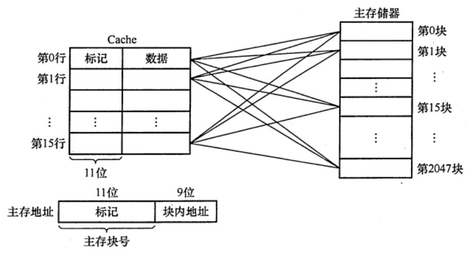
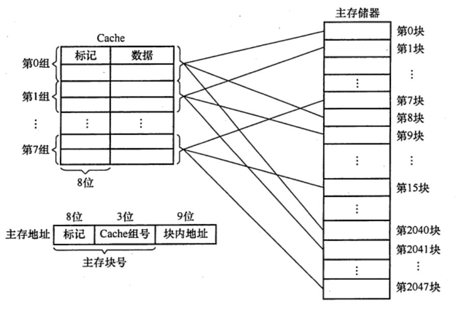

# 高速缓冲存储器
2022.09.01

[TOC]

## 程序访问的局部性原理

* 时间局部性原理：现在用的未来也用，因为程序可能有循环
* 空间局部性原理：现在用的，未来用的在附近，因为指令通常顺序执行，数据通常顺序存储

注意：C语言二维数组按照行有限存储，a\[行\]\[列\]。一行放一起。如下图：

## Cache的基本工作原理

1. Cache分成很多【Cache块/Cache行】，主存被分成很多与Cache块大小相同的【主存块】。

2. 块长 = Cache行长

3. $$
   H = \frac{N_c}{N_c+N_m}
   $$

   $H$: Cache命中率

   $N_c$: Cache命中次数

   $N_m$: 访存次数

4. $$
   T_a = 
   \begin{cases}
   H\cdot T_c + (1-H)\cdot T_m,  & \text{同时访问Cache与主存} \\
   T_c + (1-H)\cdot T_m, & \text{先访问Cache后主存}
   \end{cases}
   $$

   $T_a$: Cache主存平均访问时间

   $T_m$: 访存时间

   $T_c$: Cache时间

   

## Cache和主存的映射方式

### 直接映射

$$
Cache行号 = 主存块号\ mod\ Cache总行数
$$
假设Cache有$2^c$行，主存有$2^m$块，主存地址前m位代表了主存块号，主存块号的后c位代表了Cache行号。剩下的m-c位作为标记，存到Cache前t位。

### 全相联映射

主存的每一块可以装进任意一行。

标记 + 块内地址 = 主存地址

### 组相联映射

$$
Cache组号 = 主存块号\ mod\ Cache总组数
$$
n路组相连：一个组里边包含n个Cache行

### 小结

| 映射类型   | 0        | 1      | 2      | 3          |
| ---------- | -------- | ------ | ------ | ---------- |
| 直接映射   | [有效位] | [标记] | [行号] | [行内地址] |
| 全相联映射 | [有效位] | [标    | 记]    | [块内地址] |
| 组相联映射 | [有效位] | [标记] | [组号] | [块内地址] |

* 例题：主存大小256MB，按字节编址，Cache有8个Cache行，行长64B。不考虑Cache一致维护性和替换算法控制位。

  * 采用直接映射，Cache总大小？

    $\frac{256MB}{1B} = 2^{28}$, 主存地址为28位

    Cache行有8个，行号占3位

    行长$\frac{64B}{1B} = 2^6$, 块内地址占6位

    主存地址(28) = [标记(28-3-9=19), 行号(3), 块内地址(6)]

    全相联Cache行：[标记位(1), 标记(19), 数据(64*8=512)]

    $Cache总大小 = 8\cdot(1+19+512)=4256bit$

  * 采用直接映射，主存地址3200（十进制）主存块对应的Cache行号是多少？采用二路组相联映射呢？

    直接映射：

    3200D = 1100,1000,0000B

    块内地址：000000（6）

    行号：**010**（3）= 2

    标记：0000000000000000110（19）

    二路组相联映射：

    主存地址(28) = [标记(28-2-9=20), 组号(2), 块内地址(6)]

    Cache行：[标记位(1), 标记(20), 数据(64*8=512)]

    块内地址：000000（6）

    组号：**10**（2）= 2

    行号 = 4或5

    标记：00000000000000001100（20）

  * 直接相连，简述访存过程，主存地址0123456H

    主存地址：0123456H =[0000,0001,0010,0011,010\]\[0,01\]\[01,0110\]B

    首先获取行号：001 = 1

    然后拿主存地址的标记与Cache的行号为1的标记对比

    如果相同，并且有效位是1，Cache命中，按照地址[010110]读出数据部分送给CPU

    否则，进行访存，并将内容所在主存块送到Cache，有效位置1

  * 有一主存-Cache层次的存储器，其主存容量1MB,Cache容量为l6KB,每块有8个字，每字32位，采用**直接地址映像方式**，Cache起始字块为第0块，若主存地址为35301H,且CPU访问Cache命中，则在Cache的第()（十进制表示）字块中。

    * 主存容量:$1MB = 2^{20}B$

    * Cache容量: $16KB = 2^{14}B$

    * 行长: $8\cdot 32 = 2^{8}$

    * 主存块数: $\frac{2^{20}}{2^{8}}=2^{12}$

    * Cahce行数: $\frac{2^{14}}{2^{8}}=2^6\to$6bits

    * 字块内地址: $32 = 2^5\to$5bits

    * 直接地址映射:主存地址=\[行号]\[Tag]\[字块内地址\]

      【001101】【010011000】【00001】

    * $0,1001,1000B = 128+16+8= 152$

    > $Cache行号 = 主存块号\ mod\ Cache总行数$
    >
    > 但这道题一个Cache行里边有8个字，算字块内地址的时候只算了一个字的，所以我感觉向组相联映射。

  * 某32位计算机的Cache容量为16KB,Cache行的大小为l6B,若主存与Cache地址映像采用**直接映像方式**，则主存地址为0x1234E8F8的单元装入Cache的地址是()。

    * Cache容量: $16KB = 2^{14}B$
    * 行长: $16B = 2^4B$
    * Cache行数: $\frac{2^{14}}{2^4}=2^{10}\to$行号10bits
    * 块内地址: $32 = 2^5 \to$5bits
    * 主存地址 =【行号10bit】【Tag17】【块内地址5bit】
    * 1234E8F8 = 【0001,0010,00】11,0100,1110,1000,111【1,1000】

  * 

    

## Cache中主存块的替换算法

### 随机算法（RAND）

随机替换掉Cache块。命中率低，不根据局部性原理。

### 先进先出算法（FIFO）

先替换掉先进入的Cache块。最常用。**不根据局部性原理**。

### 近期最少使用算法（LRU）

替换掉近期最少使用的Cache块。为每一个Cache设置一个计数器，记录多少次没用过了。根据局部性原理。

类似宝石迷阵的风暴模式，每一列可以理解成一个计时器，不命中就都加一，命中了就把那一列清零。

抖动现象：比如一共Cache有4个块，1234512345这样的访问，会不停的置换。

### 最不经常使用算法

每一项一个计数器，记录有多少次用到它了，要替换的时候就把最不经常使用的一项（数最小的）换掉。

## Cache写策略

### 全写法与非写分配法

* Cache命中，Cache和主存一起改。增加了写操作的访存次数。
* 写缓冲：数据同时写到Cache和写缓冲，写缓冲再写到主存。
* Cache不命中，只改主存，不再写进Cache。
* （巧计1：全写vs非写）
* （巧计2：既然命中全都写，够累的了，不命中就只改主存吧）

### 回写法与写分配法

* Cache命中，只改Cache，等被替换时再写回去。减少了访存次数，增加了数据不一致性隐患。
* 脏位/修改位：Cache块是否被修改过。
* Cache不命中，替换Cache，并且只改Cache。（缺点，连续的写，需要不停的掉块）
* （巧计1：回写，回+写）
* （巧计2：只改Cache，当然是拿过来改了，要拿进Cache所以是“分配”。）

### 多级Cache与分离式Cache

分离式Cache：把指令与数据放到不同的Cache

指令Cache与数据Cache分离一般在多级Cache的L1层(离CPU最近)

L1Cahce与L2Cache之间：全写法

L2Cache与主存之间：写回法（避免频繁的写）
