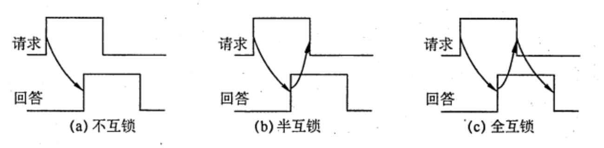

# 总线事务和定时
2022.08.22

[TOC]

总线定时是指总线在双方交换数据的过程中需要时间上配合关系的控制，这种控制称为总线定时，其实质是一种协议或规则，主要有**同步和异步**两种基本定时方式。

## 总线事物

<u>从请求总线到完成总线使用的操作序列</u>称为总线事务，它是在一个总线周期中发生的一系列活动。典型的,总线事务包括<u>请求操作、仲裁操作、地址传输、数据传输和总线释放</u>。

1. **请求阶段**。主设备（CPU或DMA）发出总线传输请求，并获得总线控制权。
2. **仲裁阶段**。总线仲裁机构决定将下一个传输周期的,总线使用权授予某个申请者。
3. **寻址阶段**。主设备通过总线给出要访问的从设备地址及有关命令，启动从模块。
4. **传输阶段**。主模块和从模块进行数据交换，可单向或双向进行数据传送。
5. **释放阶段**。主模块的有关信息均从系统总线上撤除，让出总线使用权．

在总线事务的传输阶段，主、从设备之间一般只能传输一个字长的数据，<u>突发（猝发）传送方式能够进行连续成组数据的传送</u>，其寻址阶段发送的是连续数据单元的**首地址**，在传输阶段传送多个连续单元的数据，每个时钟周期可以传送一个字长的信息，但是不释放总线，直到一组数据全部传送完毕后，再释放总线。

## 同步定时方式

所谓同步定时方式，是指**系统采用一个统一的时钟信号**来协调发送和接收双方的传送定时关系。时钟产生相等的时间间隔，每个间隔构成一个总线周期。在一个总线周期中，发送方和接收方可以进行一次数据传送。因为采用统一的时钟，每个部件或设备发送或接收信息都在固定的总线传送周期中，一个总线的传送周期结束，下一个总线的传送周期开始。

优点：传送速度快，具有较高的传输速率；总线控制逻辑简单；

缺点：主从设备属于强制性同步：不能及时进行数据通信的有效性检验，可靠性较差。

**同步通信适用于总线长度较短及总线所接部件的存取时间比较接近的系统**。

## 异步定时方式

在异步定时方式中，没有统一的时钟，也没有固定的时间问隔，完全**依靠传送双方相互制约的“握手” 信号来实现定时控制**。通常，把交换信息的两个部件或设备分为主设备和从设备，主设备提出交换信息的“请求”信号，经接口传送到从设备；从设备接到主设备的请求后，通过接口向主设备发出 “回答” 信号。

优点：总线周期长度可变，能保证两个工作速度相差很大的部件或设备之间可靠地进行信息交换，自动适应时间的配合。

缺点：比同步控制方式稍复杂一些，速度比同步定时方式慢．

根据“请求” 和“回答” 信号的撤销是否互锁，异步定时方式又分为以下了种类型。

1. **不互锁方式**。主设备发出“请求”信号后，不必等到接到从设备的 “回答”信号，而是经过一段时间便撤销“请求”信号。而从设备在接到“请求”信号后，发出“回答”信号，并经过一段时间后自动撤销 “回答”信号。双方不存在互锁关系。
2. **半互锁方式**。主设备发出“请求”信号后，必须在接到从设备的“回答” 信号后，才撤销“请求”信号，有互锁的关系。而从设备在接到“请求”信号后，发出“回答”信号，但不必等待获知主设各的“请求”信号已经撤销，而是隔一段时间后自动撤销“回答”信号，不存在互锁关系。
3. **全互锁方式**。主设备发出“请求”信号后，必须在从设备“回答”后才撤销“请求”信号：从设备发出“回答”信号后，必须在获知主设备“请求”信号已撤销后，再撤销其“回答信号。双方存在互锁关系。

## 习题

* 在不同速度的设备之问传送数据，(）.
  A. 必须采用同步控制方式
  B. 必须采用异步控制方式
  C. 可以选用同步控制方式，也可选用异步控制方式
  D. 必须采用应答方式

  【答案】：C。在不同速度的设备之间传送数据时，可采用同步方式，也可采用异步方式。异步方式主要用于在不同的设备间进行通信，两种速度不同的设备使用同一时钟进行控制时，采用同步控方式同样可以进行数据的传送，但不能发挥快速设备的高速性能。

* 某机器 IO 设备来用异步串行传送方式传送宇符信息，宇符信息格式为 1位起始位、7位数据位、1位校验位和1位停止位。若要求每秒传送 480个字符，则该设备的数据传输率为（）。
  A. 380b/s
  B. 4800B/S
  C. 480B/S
  D. 4800b/s

  【答案】：480x7/8=420B❌，480x10=4800b/s ，D

* 同步控制方式是（）。
  A. 只适用于 CPU 控制的方式
  B. 只适用于外部设备控制的方式
  C. 由统一的时序信号控制的方式
  D. 所有指令执行时问都相同的方式

  【答案】：C

* 同步通信之所以比异步通信具有较高的传输速率，是因为（）。
  A. 同步通信不需要应答信号且总线长度较短
  B. 同步通信用一个公共的时钟信号进行同步
  C. 同步通信中，各部件的存取时问较接近
  D. 以上各项因素的综合结果

  【答案】：D

* 以下各项中，（）是同步传输的特点。
  A.需要应答信号
  C.总线长度较长
  B. 各部件的存取时间比较接近
  D. 总线周期长度可变

  【答案】：B

* 在异步总线中，传送操作（ ）
  A. 由设备控制器控制
  C. 由统一时序信号控制
  B. 由CPU控制
  D. 按需分配时间

  【答案】：D

* 总线的异步通信方式是（）
  A.既不采用时钟信号，又不来用“握手”信号
  B. 只采用时钟信号，不来用“握手信号
  C.不来用时钟信号，只来用“握手”信号
  D.既来用时钟信号，又来用“握手”信号

  【答案】：C

* 在各种异步通信方式中，（）的速度最快。
  A. 全互锁
  B. 半互锁
  C. 不互锁
  D. 速度均相等

  【答案】：C

* 在手术过程中，医生将手伸出，等护士将手术刀递上，待医生握紧后，护士才松手。若把医生和护士视为两个通信模块，上述动作相当于(）
  A.同步通信
  B.异步通信的全互锁方式
  C.异步通信的半互锁方式
  D. 异步通信的不互锁方式

  【答案】：B

* 【2021 统考真题】下列关于总线的积述中，错误的是（ ）。
  A. 总线是在两个或多个部件之间进行数据交换的传输介质
  B. 同步总线由时钟信号定时，时钟频率不一定等于工作频率
  C. 异步总线由握手信号定时，一次握手过程完成一位数据交换
  D. 突发(Burst）传送总线事务可以在总线上连续传送多个数据

  【答案】：C