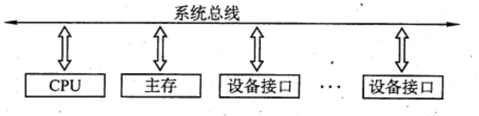
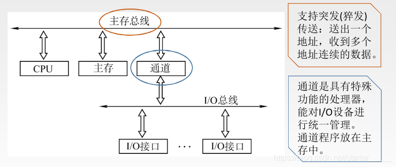
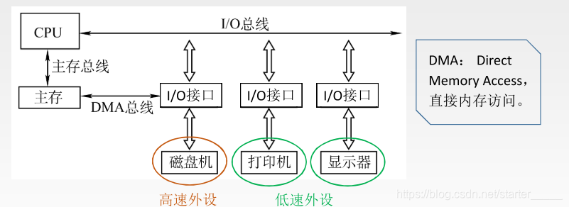

# 总线概述
2022.11.23

[TOC]

> 参考资源：
>
> * [总线 —— 总线的分类和系统总线结构](https://blog.csdn.net/starter_____/article/details/99444549)

## 总线基本概念

1. 总线定义：总线是一组能为多个部件**分时共享**的传输公共信息的线路。
2. 总线电路：通过<u>三态门</u>进行总线连接。数据总线是双向总线，地址总线是单向总线（只能从CPU到存储器或IO设备）
3. 总线事务：一对设备的一次信息交换的过程。包括两个阶段，地址阶段和数据阶段。
4. 突发传送事务：一个地址阶段+多个数据阶段。
5. 总线设备：主设备（拥有总线控制权）、从设备。
6. 总线特征：“机电功过”

## 总线分类

1. **片选总线**/片内总线：芯片内部的总线（寄存器、ALU）
2. **系统总线**/内总线：连接功能的总线（CPU、主存、IO接口）
   1. **数据总线**：双向，位数与**机器字长、存储字长**有关
   2. **地址总线**：单向，位数与**贮存地址空间大小**有关
   3. **控制总线**：包括CPU送出的控制命令与主存(或外设)返回CPU的反馈信号
3. **IO总线**：用于连接中低速的IO设备，将低速设备与高速总线分离，比如USB、PCI总线
4. **通信总线**/外总线：连接计算机系统之间的总线
5. 其他分类方式：同步异步、并行串行

* 主存通过（ ）来识别信息是地址还是数据。
  A. 总线的类型
  C. 存储器地址寄存器(MAR)
  B. 存储器数据寄存器(MDR)
  D. 控制单元(CU)

  【答案】：A

* 微机中控制总线上完整传输的信号有（ ）

  I.存储器和IO设备的地址码
  II.所有存储器和IO 设备的时序信号与控制信号
  III. 来自IO设备和存储器的响应信号
  A. 仅I
  B. II和III
  C.仅III
  D. I,II和III

  【答案】：B

* 在现代微机主板上，来用局部总线技术的作用是（ ）。
  A. 节省系统的总带宽
  B. 提高抗干扰能力
  C.抑制总线终端反射
  D.构成紧耦合系统

  【答案】：A

## 系统总线的结构

> 单总线结构：系统总线
>
> 双总线结构：系统总线 + 主存总线(主存～CPU) 或 主存总线(主存～CPU) + IO总线(需要通道)(主存～IO)
>
> 三总线结构：系统总线 + 主存总线(主存～CPU) + 系统总线(主存～IO) + DMA(IO～主存)

1. **单总线结构**

   - 结构：CPU、主存、I/O设备（通过I/O接口）都连接在一组总线上，允许I/O设备之间、I/O设备和CPU之间或I/O设备与主存之间直接交换信息。
   - 优点：结构简单，成本低，易于接入新的设备。
   - 缺点：带宽低、负载重，多个部件只能争用唯一的总线，且不支持并发传送操作。
   - <u>注意单总线不是说只有一根总线</u>，系统总线也可以分为数据总线、地址总线、控制总线

   

2. **双总线结构**

   - 结构：双总线结构有两条总线，一条是主存总线，用于CPU、主存和通道之间进行数据传送；另一条是 I/O 总线，用于多个外部设备与通道之间进行数据传送。
   - 优点：将较低速的I/O设备从单总线上分离出来，实现存储器总线和 I/O 总线分离。
   - 缺点：需要增加通道等硬件设备。

   

3. **三总线结构**

   - 结构：三总线结构是在计算机系统各部件之间采用3条各自独立的总线来构成信息通路，这3条总线分别为主存总线、I/O 总线和直接内存访问DMA总线。
   - 高速外设～北桥，低速外设～南桥
   - 优点：提高了 I/O 设备的性能，使其更快地响应命令，提高系统吞吐量。
   - 缺点：每次只能有一条总线在工作，故系统工作效率较低。
   
   

* 【2014 统考真题】一次总线事务中，主设备只需给出一个首地址，从设备就能从首地址开始的若干连续单元读出或写入多个数据。这种总线事务方式称为（）。
  A.并行传输
  B.串行传输
  C.突发传输
  D.同步传输

  【答案】：C

* **【2015 统考真题】**下列有关总线定时的叙述中，错误的是（）。
  A. 异步通信方式中，全互锁协议最慢
  B. 异步通信方式中，非互锁协议的可靠性最差
  C. 同步通信方式中，同步时钟信号可由各设备提供
  D. 半同步通信方式中，握手信号的采样由同步时钟控制

  【答案】：C

* 【2016统考真题】下列关于总线设计的叙述中，错误的是（）。
  A.并行总线传输比串行总线传输速度快
  B. 采用信号线复用技术可减少信号线数量
  C.采用突发传输方式可提高总线数据传输率
  D.来用分离事务通信方式可提高总线利用率

  【答案】：A

## 常见的总线标准

总线标准是国际上公布的互连各个模块的标准，是把各种不同的模块组成计算机系统时必须遵守的规范。典型的总线标准有 **ISA、 EISA、 VESA、 PCI、 AGP、PCI-Express、USB** 等。它们的主要区别是总线宽度、带宽、时钟频率、寻址能力、是否支持突发传送等

1. **ISA**, Industy Standard Architecture， 工业标准体系结构。是最早出现的系统总线，应用在 IBM的AT 机上。

2) **EISA**, Extended Tndustry Standard Arctiteeture， 扩展的ISA。是为配合 32 位 CPU 位CPU而设计的扩展总线，EISA 对 ISA 完全兼容。
3) **VESA**, Video Electronics Standards Association， 视频电子标准协会。是一个 32位的局部总线，是针对多媒体 PC 要求高速传送活动图像的大量数据而推出的。
4) **PCI**, Peripheral Component Interconnect， 外部设备互连。是高性能的 32 位或 64 位总线，是专为高度集成的外围部件、扩充插板和处理器/存储器系统设计的互连机制。目前常用的PCI 适配器有显卡、声卡、网卡等。PCI 总线支持即插即用。PCI 总线是一个与处理器时钟频率无关的高速外围总线，属于局部总线。
5) **AGP**, Accelerated Graphics Port，加速图形接口。是一种视频接口标淮，专用于连接主存和图形存储器，用于传输视频和三维图形数据，属于局部总线。
6) **PCI-E**, **PCI-Express**。 是最新的总线接口标准，它将全面取代现行的PCI 和 AGP。
7) **RS-232C**。是由美国电子工业协会（EIA）推荐的一种串行通信总线，是应用于串行二进制交换的数据终端设备（DTE）和数据通信设备（DCE）之间的标准接口。
8) **USB**, Universal Serial Bus， 通用串行总线。是一种连接外部设备的IO 总线，属于设备总线。具有即插即用、热插拔等优点，有很强的连接能力。
9) **PCMCIA**, Personal Computer Memory Card International Association。广泛应用于笔记本电脑的一种接口标准，是一个用于扩展功能的小型插槽。具有即插即用功能。
10) **IDE**, Integrated Drive Electronics，集成设备电路。更准确地称为 ATA，是一种IDE接口磁盘驱动器接口类型，硬盘和光驱通过 IDE 接口与主板连接。
11) **SCSI**, Small Computer System Interface，小型计算机系统接口。是一种用于计算机和智能设备之间（硬盘、软驱）系统级接口的独立处理器标准，
12) **SATA**, Serial Advanced Technology Attachment，串行高级技术附件。是一种基于行业标准的串行硬件驱动器接口，是由Intel、IBM、Dell 等公司共同提出的硬盘接口规范。

|  标准   |     类型     |  串/并   |   备注    |
| :-----: | :----------: | :------: | :-------: |
|   ISA   | **系统总线** |   并行   |   最早    |
|  EISA   |              |   并行   | 扩展上1个 |
|  VESA   |   局部总线   |          |   视频    |
|   PCI   |   局部总线   |   并行   | 设备互联  |
|   AGP   |   局部总线   |          |   视频    |
|  PCI-E  |   局部总线   | **串行** | 取代上2个 |
| RS-232C |   外部总线   |   串行   |           |
|   USB   |   外部总线   | **串行** |           |
| PCMCIA  |              |          |  笔记本   |
|   ATA   |              |          |  IDE接口  |
|  SCSI   |              |   串行   |   外设    |
|  SATA   |              |   串行   | 硬件驱动  |

> 扩展资源
>
> * [总线概述及常见总线](http://wangboxyk.cn/post/Zongxian-Bus-QPI-Memory.html)

* 下列不属于计算机局部总线的是（）
  A. VESA
  B. PCI
  C. AGP
  D. ISA

  【答案】：D

* 【2010 统考真题】下列选项中的英文缩写均为总线标准的是（ ）。
  A. PCI、 CRT、USB、 EISA
  B. ISA、 CPI、 VESA、 EISA
  C. ISA、 SCSI、 RAM、 MIPS
  D. ISA、EISA、 PCI、 PCI-Express

  【答案】：D

* 【2011 统考真题】在系统总线的数据线上，不可能传输的是（）。
  A. 指令
  B. 操作数
  C. 握手（应答）信号
  D. 中断类型号

  【答案】：C，握手（应答）信号在控制总线上

* 【2012统考真题】下列关于USB,总线特性的描述中，错误的是(）。
  A. 可实现外设的即插即用和热拔插
  B.可通过级联方式连接多台外设
  C.是一种通信总线，连接不同外设
  D.同时可传输2位数据，数据传揄率高

  【答案】：D，USB串行

* 【2013统考真题】下列选项中，用于设各和设备控制器 （I0 接口，之间互连的接口标准是(）。
  A. PCT
  B. USB
  C. AGP
  D. PCIExpres

  【答案】：B

* 【2017统考真题】下列关于多总线结构的叙述中，错误的是（）.
  A.靠近CPU的总线速度较快
  B.存储器总线可支持突发传送方式
  C.总线之间须通过桥接器相连
  D. PCI-Expressx16 来用并行传输方式

  【答案】：D，串行

## 总线的性能指标

1. **总线传输周期**。指一次总线操作所需的时间，包括申请阶段、寻址阶段、传输阶段和结束阶段。总线传输周期通常由若干<u>总线时钟周期</u>构成。

2. **总线时钟周期**。即<u>机器的时钟周期</u>。计算机有一个统一的时钟，以控制整个计算机的各个部件，总线也要受此时钟的控制。

3. **总线工作频率**。总线上各种操作的频率，为总线周期的倒数。实际上指 1秒内传送几次数据。若总线周期=N个时钟周期，则总线的工作频率=时钟频率/N。

4. **总线时钟频率**。即机器的时钟频率，它为时钟周期的倒数。

5. **总线宽度**。又称总线位宽，它是总线上同时能够传输的数据位数，通常指数据总线的根数，如32根称为 32位总线。

6. **总线带宽**。可理解为总线的最大数据传输率，即单位时间内总线上最多可传输数据的位数，通常用每秒传送信息的字节数来衡量，单位可用字节/秒（B/s）表示。总线带宽总线工作频率x（总线宽度/8）。
   注意：总线带宽和总线宽度应加以区别。

7. **总线复用**。总线复用是指一种信号线在不同的时问传输不同的信息，因此可以他使用较少的线传输更多的信息，从而节省空间和成本。

8. **信号线数**。地址总线、数据总线和控制总线 了 种总线数的总和称为信号线数。其中：总线的最主要性能指标为总线宽度、总线（工作）频率、总线带宽，总线带宽是指总线本身所能达到的最高传输速率，它是衡量总线性能的重要指标。

   三者关系．总线带宽 二总线宽度x总线频率。

   例如，总线工作频率为 22MHIz，总线宽度为 16位，则总线带宽 =22×(16/8)=44MB/s。

* 【2009统考真题】假设某系统总线在一个总线周期中并行传输4宇节信息，一个总线周期占用2个时钟周期，总线时钟频率为 10MHz，则总线带宽是（ ）。
  A. 10MB/S
  B. 20MB/s
  C. 40MB/s
  D. 80MB/s

  【答案】：10/2*4=20-> B

* 【2012 统考真题】某同步总线的时钟频率为 100MHz，宽度为 32位，地址/数据线复用，每传输一个地址或数据占用一个时钟周期。若该总线支持突发（猝发）传输方式，则一次“主存写” 总线事务传输 128位数据所需要的时间至少是（ ）
  A. 20ns
  B. 40ns
  C. 50ns
  D. 80ns

  【答案】：地址10+数据40=50ns

* 【2014 统考真题】某ß同步总线来用数据线和地址线复用方式，其中地址/数据线有 32根，总线时钟频率为 66MHz，每个时钟周期传送两次数据（上升沿和下降沿各传送次数据），该总线的最大数据传输率（总线带宽）是（ ）。
  A. 132MB/s
  B. 264MB/s
  C. 528MB/s
  D.: 1056MB/s

  【答案】：66\*2\*4=528

* 【2018 统考真题】下列选项中，可提高同步总线数据传输率的是（ ）.
  I. 增加总线宽度
  II. 提高总线工作频率
  III. 支持突发传输
  IV. 采用地址/数据线复用
  A. 仅I、II
  B. 仅I、II、III
  C. 仅I、IV
  D. I、II、III和IV

  【答案】：B，复用可以减少根本但不能提高数据传输率

* **【2019 统考真题】**假定一台计算机来用了通道存能器总线，配套的内存条型号为DDR3-1333，即内存条所接插的存储器总线的工作频率为 1333MHz，总线宽度为 64位，则存储器总线的总带宽大约是
  A. 10.66GB/s
  B. 32GB/s
  C. 64GB/s
  D. 96GB/s

  【答案】：首先总线的宽度为64bit，即8字节(Byte)，则采用<u>三通道的存储器总线</u>的总带宽为

  8×1333×3=31.992≈32GB/s

* 【2020 统考真题】QPI 总线是一种点对,点全工同步串行总线，总线上的设备可同时接收和发送信息，每个方向可同时传输20 位信息（16位数据＋4 位校验位），每个OPI 数据包有80 位信息，分2个时钟周期传送，每个时钟周期传递2次。因此，QPI 总线带宽为：每秒传送次数x2Bx2。若 QPI 时钟频率为 2.4GHz，则总线带宽为（ ）
  A. 4.8GB/s
  B. 9.6GB/s
  C. 19.2GB/s
  D. 38.4GB/s

  【答案】：每秒传送次数x2Bx2 = 2x2.4Gx2Bx2=19.2GB/s
