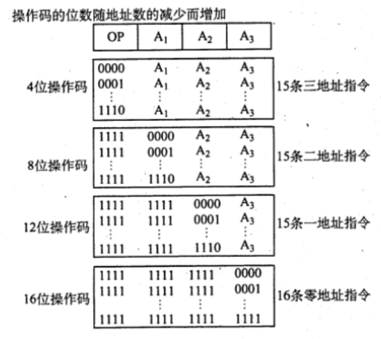

# 指令格式
2022.08.23

[TOC]

## 指令的基本格式

| 操作码字段 | 地址码字段 |
| :--------: | :--------: |

1. <u>指令字长和机器字长没有固定关系</u>

2. **单字长指令**（指令字长=机器字长），**半字长指令**（指令字长=1/2 机器字长），**双字长指令**。

3. **定长指令字结构**：所有指令字长相等。反之，**变长指令字结构**。

4. **零地址指令**

   |  OP  |
   | :--: |

   1. **不需要操作数的指令**：空操作指令、停机指令、关中断指令
   2. **零地址的运算类指令**仅用在<u>堆栈计算机</u>中。通常参与运算的两个操作数隐含地从栈顶和次栈顶弹出，送到运算器进行运算，运算结果再隐含地压入堆栈。

5. **一地址指令**

   |  OP  |  A1  |
   | :--: | :--: |

   这种指令也有两种常见的形态，要根据操作码的含义确定究竟是哪一种。

   1. **只有目的操作数的单操作数指令**，按 A， 地址读取操作数，进行 OP 操作后，结果存固原地址。
      指令含义：`OP(A1)->A1`
      如操作码含义是加 1、减1、求反、求补等。
   2. **隐含约定目的地址的双操作数指令**，按指令地址 A，可读取源操作数，指令可隐含约定另一个操作数由 ACC（累加器）提供，运算结果也将存放在 ACC中。
      指令含义：`(ACC)OP(A1)->ACC`
      若指令字长为32位，操作码占 8位，1个地址码字段占 24位，则指令操作数的直接寻址范围为 $2^{24}= 16M$.

6. **二地址指令**

   |  OP  |  A1  |  A2  |
   | :--: | :--: | :--: |

   指令含义：`(A1)OP(A2)-A1`
   对于常用的算术和逻辑运算指令，往往要求使用两个操作数，需分别给出目的操作数和源操作数的地址，其中目的操作数地址还用于保存本次的运算结果。

   若指令字长为 32 位，操作码占 8位，两个地址码字段各占 12位，则指令操作数的直接寻址范围为$2^{12}=4K$.

7. **三地址指令**

   |  OP  |  A1  |  A2  |  A3  |
   | :--: | :--: | :--: | :--: |

   指令含义：`(A1)OP(A2)->A3`
   若指令字长为 32 位，操作码占 8位，了个地址码字段各占 8位，则指令操作数的直接寻址范围为 $2^8 = 256$。若地址字段均为主存地址，则完成一条三地址需要 **4** 次访问存储器（取指令1次，取两个操作数2次，存放结果 1次）。

8. **四地址指令**

   |  OP  |  A1  |  A2  |  A3  |  A4  |
   | :--: | :--: | :--: | :--: | :--: |

   指令含义：`(A1)0P(A2)->A3`，A4是下一系将要执行指令的地址。
   若指令字长为 32 位，操作码占 8位，4 个地址码字段各占6位，则指令操作数的直接寻址范围为$2^6=64$.

## 定长操作码格式

定长操作码指令在指令字的最高位部分**分配固定**的若干位（定长），表示操作码。一般**n位**操作码字段的指令系统最大能够表示 **2^n** 条指令。定长操作码对于简化计算机硬件设计，提高指令译码和识别速度很有利。当计算机字长为 32 位或更长时，这是常规用法

## 扩展操作码指令格式

为了在指令字长有限的前提下仍保持比较丰富的指令种类，可采取可变长度操作码，即全部指令的操作码字段的位数不固定，且分散地放在指令字的不同位置上。显然，这将增加指令译码和分析的难度，使控制器的设计复杂化最常见的变长操作码方法是扩展操作码，它使**操作码的长度随地址码的减少而增加**，不同同地址数的指令可具有不同长度的操作码，从而在满足需要的前提下，有效地缩短指令字长。下图所示即为一种扩展操作码的安排方式。

> 注意：某段地址变成操作码，不能是全1！全1应被用为扩展操作码！
>
> 比如下图A1可以表示0000到1110，但是1111要留作扩展操作码！

## 指令的操作类型

1. 数据传送

   1. 传送指令通常有**寄存器之间**的传送（**MOV**）
   2. 从**内存单元**读取数据到 **CPU** 寄存器(**LOAD**）
   3. 从**CPU** 寄存器写数据到**内存单元** (**STORE**)

2. 算术和逻辑运算

   这类指令主要有加（ADD）、减（SUB）、比较（CVP）、乘（MUL）、除(DIV)、加1(INC）、减1（DEC）、与 （AND）、或（OR）、取反 （NOT)、异或 (XOR)

3. 移位操作

   移位指令主要有算法移位、逻辑移位、循环移位等。

4. 转移操作

   转移指令主要有**无条件转移（JMP）**、**条件转移（BRANCH）**、**调用(CALL）**、**返回(RET)**、**陷附（TRAP）**等。无系件转移指令在任何情况下都执行转移操作，而条件转移指令仅在特定条件满足时才执行转移操作，转移条件一般是某个标志位的值，或几个标志位的组合。

   **调用指令和转移指令的区别**：执行调用指令时必须保存下一条指令的地址（返回地址），当子程序执行结束时，根据返回地址返回到主程序继续执行；而转移指令则不返回执行。

5. 输入输出操作

   这类指令用于完成 CPU 与外部设备交换数据或传送控制命令及状态信息。

## 例题

1. 以下有关指令系统的说法中，错误的是(）。
   A.指令系统是一台机器硬件能执行的指令全体
   B.任何程序运行前都要先转换为机器语言程序
   C.指令系统是计算机软/硬件的界面
   D.指令系统和机器语言是无关的

   【答案】：D

2. 在CPU执行指令的过程中，指令的地址由（）给出。
   A.程序计数器（PC）
   B.指令的地址码宇段
   C.操作系统
   D.程序员

   【答案】：A

3. 运算型指令的寻址与转移型指令的寻址的不同点在于（）
   A. 前者取操作数，后者决定程序转移地址
   B. 后者取操作数，前者决定程序转移地址
   C. 前者是短指令，后者是长指令
   D. 前者是长指令，后者是短指令

   【答案】：D->A。运算型指令寻址的是操作数，而转移型指令寻址的是下次欲执行的指令的地址。

4. 程序控制类指令的功能是（ ）。
   A. 进行算术运算和逻輯运算
   B. 进行主存与CPU之间的数据传送
   C. 进行CPU 和IO设备之问的数据传送
   D. 改变程序执行的顺序

   【答案】：D

5. 下列指令中不属于程序控制指令的是(）。
   A.无条件转移指令
   B.条件转移指令
   C中断隐指令
   D.循环指令

   【答案】：D->C。程序控制类指令主要包括无条件转移、有条件转移、子程序调用和返回指令、循环指令等。**中断隐指令是由硬件实现的**，并不是指令系统中存在的指令，更不可能属于程序控制类指令。

6. 下列指令中应用程序不准使用的指令是(）.
   A. 循环指令
   B.转换指令
   C.特权指令
   D.条件转移指令

   【答案】：C

7. 堆栈计算机中，有些堆栈零地址的运算类指令在指令格式中不给出操作数的地址，参加的两个操作数来自（）。
   A. 累加器和寄存器
   C.堆栈的栈顶和次栈顶单元
   B. 累加器和暂存器
   D.堆栈的栈顶单元和暂存器

   【答案】：C

8. 以下叙述错误的是(）。
   A. 为了便于取指，指令的长度通常为存储宇长的整数倍
   B. 单地址指令是固定长度的指令
   C. 单字长指令可加快取指令的速度
   D. 单地址指令可能有一个操作数，也可能有两个操作数

   【答案】：C->B。指令的地址个数与指令的长度是否固定没有必然联系，即使是**单地址指令也可能由于单地址的寻址方式不同而导致指令长度不同**．

9. 能够完成两个数的算术运算的单地址指令，地址码指明一个操作数，另一个操作数来自（）方式。
   A.立即寻址
   B.隐含寻址
   C.间接寻址
   D.基址寻址

   【答案】：B

10. 设机器字长为32 位，一个容量为 16MB 的存储器，CPU 按半字寻址，其寻址单元数是
    A. 2^24
    B. 2^23
    C. 2^22
    D. 2^21

    【答案】：B

11. 某指令系统有200 条指令，对操作码来用固定长度二进制编码，最少需要用（）位。
    A. 4
    B. 8
    C. 16
    D. 32

    【答案】：B

12. 在指令格式中，采用扩展操作码设计方案的目的是(）。
    A.减少指令字长度
    B. 增加指令字长度
    C. 保持指令宇长度不变而增加指令的数量
    D.保持指令字长度不变而增加寻址空间

    【答案】：C

13. 一个计算机系统采用32位单字长指令，地址码为 12位，若定义了 250 条二地址指令，则还可以有（）条单地址指令。
    A. 4K
    B. 8K
    C. 16K
    D. 24K

    【答案】：(256-250)x2^{32-8-12}=6x2^{12}=24K

14. **【2017 统考真题】**某计算机按字节编址，指令字长固定且只有两种指令格式，其中三地址指令29条、二地址指令 107条，每个地址字段为6位，则指令字长至少应该是（）.
    A. 24位
    B. 26位
    C. 28位
    D. 32位

    【答案】：
    
    三地址：29->32=2^5
    
    二地址：(32-29)x2^6=64x3>107
    
    指令字长是8的整数倍！5+18=23->24
