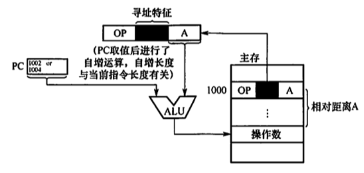

# 指定的寻址方式
2022.08.24

[TOC]

**寻址方式**是指<u>寻找指令或操作数有效地址的方式</u>，即确定本条指令的数据地址及下一条待执行指令的地址的方法。寻址方式分为**指令寻址**和**数据寻址**两大类，指令中的地址码字段并不代表操作数的真实地址，这种地址称为**形式地址(A)**。形式地址结合寻址方式，可以计算出操作数在存储器中的真实地址，这种地址称为**有效地址 (EA)**。

注意，(A)表示地址为 A 的数值，A 既可以是寄存器编号，也可以是内存地址。对应的(A)就是寄存器中的数值，或相应内存单元的数值。例如，EA=(A)意思是有效地址是地址A 中的数值。

## 指令寻址和数据寻址

寻址方式分为指令寻址和数据寻址两大类。<u>寻找下一条将要执行的指令地址</u>称为指令寻址；<u>寻找本条指令的数据地址</u>称为数据寻址。

1. **指令寻址**

   指令寻址方式有两种：一种是顺序寻址方式，另一种是跳跃寻址方式。

   1. **顺序寻址**
      通过程序计数器**PC加1**（1 个指令字长），自动形成下一条指令的地址。
   2. **跳跃寻址**
      通过**转移类指令**实现。所谓跳跃，是指下条指令的地址不由程序计数器 PC 自动给出，而由本条指令给出下条指令地址的计算方式。而是否跳跃可能受到状态寄存器和操作数的控制，跳跃的地址分为绝对地址 （由标记符直接得到）和相对地址（相对于当前指令地址的偏移量），<u>跳跃的结果是当前指令修改PC值，所以下一条指令仍然通过PC给出</u>。

2. **数据寻址**

   1. 数据寻址是指如何在指令中表示一个操作数的地址，如何用这种表示得到操作数地址或如何计算出操作数的地址。

   2. 数据寻址的方式较多，为区别名种方式，<u>通常在指令字中设一个字段，用来指明属于哪种寻址方式</u>【这就是寻址特征】，由此可得指令的格式如下所示：

      | 操作码 | 寻址特征 | 形式地址A |
      | :----: | :------: | :-------: |

## 常见的数据寻址方式

1. **隐含寻址**

   <u>这种类型的指令不明显地给出操作数的地址，而在指令中隐含操作数的地址</u>。例如，单地址的指令格式就不明显地在地址字段中指出第二操作数的地址，而规定累加器 (ACC) 作为第二操作数地址，指令格式明显指出的仅是第一操作数的地址。因此，累加器(ACC）对单地址指令格式来说是隐含寻址，如图所示。

   隐含寻址的优点是有利于缩短指令字长

   缺点是需增加存储操作数或隐含址址的硬件

   

2. **立即(数)寻址**

   这种类型的指令的地址字段指出的不是操作数的地址，而是操作数本身，又称立即数，采用**补码**表示。如图所示为立即寻址示意图，图中#表示立即寻址特征，A就是操作数。

   立即寻址的优点是指令在执行阶段不访问主存，指令执行时间最短。

   缺点是 A 的位数限制了立即数的范围。

   

3. **直接寻址**

   指令字中的形式地址 A 是操作数的真实地址EA，即EA=A

   

4. **间接寻址**

   间接寻址是相对手直接寻址而言的，指令的地址字段给出的形式地址不是操作数的真正地址，而是操作数有效地址所在的存储单元的地址，也就是操作数地址的地址，即 EA = (A)，如图所示。间接寻址可以是一次间接寻址，还可以是多次间接寻址。

   

   在上图中，**主存字第一位为1时**，表示取出的仍不是操作数的地址，即多次间址：**主存字第一位为0时**，表示取得的是操作数的地址。间接寻址的优点是可扑大寻址范围（有效地址 EA 的位数大于形式地址A 的位数），便于编制程序（用间接寻址可方便地完成子程序返回)：缺点是指令在执行阶段要多次访存（一次间接寻址需两次访存，多次间接寻址需根据存储字的最高位确定访存次数)。由于访问速度过慢，这种寻址方式并不常用。一般问到扩大寻址范用时，通常指的是寄存器间接寻址。

5. **寄存器寻址**

   寄存器寻址是指在指令字中直接给出操作数所在的寄存器编号，即EA=Ri，其操作数在由Ri,所指的寄存器内，如图所示。

   寄存器寻址的优点是指令在执行阶段不访问主存，只访问睿存器，因寄存器数量较小，对应地址码长度较小，使得指令字短且因不用访在，所以执行速度快，支持向量/5阵运算，缺点是寄存器价格昂贵，计算机中的寄存器个数有限。

   

6. **寄存器间接寻址**

   > 寄存器间接寻址寻的还是主存！

   寄存器间接寻址是指在寄存器 Ri， 中给出的不是一个操作数，而是操作数所在的地址，即EA=(Ri)

   

   寄存器间接寻址的特点是，与一般间接寻址相比速度更快，但指令的执行阶段籍要访问主存（因为操作数在主存中)。

7. **相对寻址**

   > "相对"，相对于PC（注意PC会++，可能是+1或+2）

   相对寻址是把 PC 的内容加上指令格式中的形式地址 A 而形成操作数的有效地址，即EA：(PC)+A，其中A 是相对于当前指令地址的位移量，可正可负，补码表示，如图所示。

   

   A 的位数决定操作数的寻址范围相对寻址的优点是探作数的地址不是固定的，它随PC 值的变化而变化，且与指令地址之间总是相差一个固定值，因此便于程序浮动。相对寻址广泛应用于转移指令。

   注意⚠️，对于转移指令 JMP A．当CPU 从存储器中取出一字节时，会自动执行(PC)+1->PC。若转移指令的地址为 X，<u>且占2B</u>，在取出该指令后，PC 的值会增2，即(PC)=X十2，这样在执行完该指今后，会自动跳转到X + 2 + A 的地址继续执行。

8. **基址寻址**

   > 基址寻址当然是对于“基址寄存器”（专用/通用寄存器）而言的

   基址寻址是指将 CPU 中基址寄存器(BR）的内容加上指令格式中的形式地址 A 而形成操作数的有效地址，即EA=(BR)＋A，其中基址睿存器既可采用专用寄存器，又可采用通用寄存器，如图所示。

   

9. **变址寻址**

   变址寻址是指有效地址 EA 等于指令字中的形式地址 A 与变址;寄存器 IX 的内容之和，即EA= (IX)十A，其中下IX为变址寄存器（专用），也可用通用寄存器作为变址寄存器。下图所示为采用专用省存器 IX 的变址寻址示意图

   

   变址奇存器是面向用户的，在程序执行过程中，变址寄存器的内容可由用户改变（作为偏移量），形式地址 A 不变（作为基地址）.

   变址寻址的优点是可扩大寻址范围（变址寄存器的位数大于形式地址A 的位数）；在数组处理过程中，可设定 A 为数组的首地址，不断改交杏址寄存器1 的内容，便可很容易形成数组中任一数据的地址，特別适合编制循环程序。偏移量（变址寄存器IX）的位数足以表示整个存储空间。

   显然，变址寻址与基址寻址的有效地址形成过程极为相似。但从本质上讲，两者有较大区别。**基址寻址面向系统**，主要用于为多道程序或数据分配在储空间，因此基址备存器的内容通常由操作系统或管理程序确定，在程序的执行过程中其值不可变，而指令字中的 A 是可变的；**变址寻址立足于用户**，主要用于处理数组问题，在变址寻址中，变址容存器的内容由用户设定，在程序执行过程中其值可变，而指令字中的A 是不可变的。

   > 妙计：基址一听就很基础，看来是系统用的。变址一听就很机灵，只有用户才有这么多鬼点子！

10. **堆栈寻址**

    堆栈是存储器（或专用省存器组） 中一块特定的、按后进先出 (LIFO）原则管理的存储区，该存储区中读/写单元的地址是用一个特定的寄存器给出的，该寄存器称为堆栈指针 (SP)。堆栈可分为硬堆栈与软堆栈两种。

    <u>寄存器堆栈又称硬堆栈</u>，寄存器堆栈的成木较高、不适合做大容量的堆栈．而从<u>主在中划出一段区域来做堆栈是最合算且最常用的方法，这种堆栈称为软堆栈</u>。

    在来用堆栈结构的计算机系统中，大部分指令表面上都表现为无操作数指令的形式，因为操作数地址都隐含使用了 **SP**。通常情况下，在读/写堆栈中的一个单元的前后都伴有自动完成对SP 内容的增量或减量操作。

> 小结：
>
> * 立即数寻址：[数]
> * 直接寻址：[地址]
> * 隐含寻址：[地址]+隐含
> * 间接寻址：[地址的地址]，可以是一次间接寻址也可以是多次间接寻址
> * 寄存器寻址：[寄存器编号]
> * 寄存器间接寻址：[存地址的寄存器]
> * 相对寻址：[地址偏移]，（相对PC的偏移）

|    寻址方式    |    Data    | 访存次数 |
| :------------: | :--------: | :------: |
|    隐含寻址    |    隐含    |    0     |
|   立即数寻址   |     A      |    0     |
|    直接寻址    |    (A)     |    1     |
|    间接寻址    |   ((A))    |    2     |
|   寄存器寻址   |    (R)     |    0     |
| 寄存器间接寻址 |   ((R))    |    1     |
|    相对寻址    | （(PC)+A） |    1     |
|    基址寻址    | （(BR)+A） |    1     |
|    变址寻址    |  ((IR)+A)  |    1     |

## 例题

1. 指令系统中采用不同寻址方式的目的是（ ）。
   A. 提供扩展操作码的可能并降低指令译码难度
   B. 可缩短指令字长，扩大寻址空间，提高编程的灵活性
   C. 实现程序控制
   D. 三者都正确

   【答案】：D->B

2. 直接寻址的无条件转移指令的功能是将指令中的地址码送入（ ）。
   A. 程序计数器 (PC)
   B. 累加器 (ACC)
   C. 指令寄存器 (IR)
   D. 地址寄存器 (MAR)

   【答案】：A

3. 为了缩短指令某个地址段的位数，有效的方法是来取( )
   A. 立即寻址
   B. 变址寻址
   C. 基址寻址
   D. 寄存器寻址

   【答案】：C->D

4. 简化地址结构的基本方法是尽量来用（）
   A.寄存器寻址
   B.隐地址
   C.直接寻址
   D.间接寻址

   【答案】：C->B

5. 在指令寻址的各种方式中，获取操作数最快的方式是（ ）
   A. 直接寻址
   B. 立即寻址
   C. 寄存器寻址
   D. 间按寻址

   【答案】：B

6. 假定指令中地址码所给出的是操作数的有效地址，则该指令来用（ ）。
   A.直接寻址
   B立即寻址
   C寄存器寻址
   D.间接寻址

   【答案】：A

7. 设指令中的地址码为 A，变址寄存器为 X，程序计数器为 PC，则变址**间址**寻址方式的操作数的有效地址EA是（）。
   A. ((PC)+A)
   B.((X) + A)
   C.(X)+(A)
   D.(X)+A

   【答案】：D->B

8. ( )便于处理数组问题
   A.间接寻址
   B.变址寻址
   C.相对寻址
   D.基址导址

   【答案】：B

9. 堆栈寻址方式中，设A为累加器，SP 为堆栈指示器，Msp为SP 指示的栈顶单元。若进栈操作的动作是`(A)->Msp`,`(SP)-1->SP`，则出栈操作的动作应为（）。
   A. `Msp->A`,`(SP)+1->SP`
   B. `(SP) + 1->SP`. `(Msp) ->A`
   C. `(SP) - 1->SP`. `(Msp) ->A`
   D. `Msp->A`,`(SP)-1->SP`

   【答案】：B

10. 相对寻址方式中，指令所提供的相对地址实质上是一种（ ）。
    A. 立即数
    B. 内存地址
    C. 以**本**条指令在内存中首地址为基准位置的偏移量
    D. 以**下**条指令在内存中首地址为基准位置的偏移量

    【答案】：C->D

11. 在多道程序设计中，最重要的寻址方式是（ ）。
    A. 相对寻址
    B. 间接寻址
    C. 立即寻址
    D. 按内容寻址

    【答案】：A

12. 指令寻址方式有顺序和跳跃两种，来用跳跃寻址方式可以实现（）.
    A.程序浮动
    B.程序的无条件浮动和条件浮动
    C.程序的无条件转移和条件转移
    D.程序的调用

    【答案】：C

13. 某机器指令字长为16位，主存按宇节编址，取指令时，每取一字节，PC 自动加1。当前指令地址为 2000H，指令内容为相对寻址的无条件转移指令，指令中的形式地址为40H。则取指令后及指令执行后PC的内容为（）
    A. 2000H, 2042H
    B. 2002H, 2040H
    C. 2002H, 2042H
    D. 2000H, 2040H

    【答案】：C

14. 对按字寻址的机器，程序计数器和指令寄存器的位数各取决于（ ）
    A.机器宇长，存储器的宇数
    B.存储器的字数，指令宇长
    C.指令字长，机器字长
    D.地址总线宽度，存储器的字数

    【答案】：B

15. 假设寄存器R中的数值为200，主存地址为 200和300 的地址单元中存放的内容分别是300和400则（ ）方式下访问到的操作数为 200
    A. 直接寻址 200
    B. 寄存器间接寻址（R）
    C.存储器间接寻址(200）
    D.寄存器寻址R

    【答案】：B->D

16. 假设某条指令的第一个操作数来用寄存器间接寻址方式，指令中给出的寄存器编号为8，8 号寄存器的内容为1200H，地址为 1200H 的单元中的内容为 12FCH，地址为12FCH 的单元中的内容为38D8H， 而地址为 38D81 的单元中的内容为88F9H。则该操作数的有效地址为（ ）
    A. 1200H
    B. 12FCH
    C. 38D8H
    D. 88F9H

    【答案】：A

17. 设相对寻址的转移指令占 3B，第一字节为操作码，第二、三字节为相对位移量（补码表示），而且数据在存储器中来用以低字节为字地址的存放方式。每当CpU从存储器取出一字节时，即自动完成(PC)+1->PC。若PC的当前值为240（十进制），要求转移到 290（十进制），则转移指令的第二、三字节的机器代码是（)若pC的当前值为240（十进制），要求转移到 200（十进制）。则转移指公第二、三字节的机器代码是（）
    A. 2FH、FFH
    B. D5H、00H
    C. D5H、FFH
    D. 2FH、00H

    【答案】：D，C。47=48-1=30-1=2FH，-43=-(32+11)=-101011=11010101=D5H

18. 关于指令的功能及分类，下列叙述中正确的是（ ）
    A. 算术与逻辑运算指令，通常完成算术运算或逻辑运算，都需要两个数据
    B. 移位操作指令，通常用于把指定的两个操作数向左或向右移一位
    C. 转移指令、子程序调用与返回指令，用于解决数据调用次序的需求
    D. 特权指令，通常仅用于实现系统软件，这类指令一般不提供给用户

    【答案】：C->D。算术与逻拜运算指令用于完成对一个（如自增、取反等）或两个数据的算术运算或逻辑运算，因此 A 错误。移位操作用于把一个操作数左移或右移一位或多位，因此 B 错误。转移指令，子程序调用与返回指令用于解决变动程序中指令执行次序的需求，而不是数据调用次序的需求，因此C错误。

19. 【2009统考直题】其机器字长为 16位，主存按字节编址，转移指今来用相对寻址，由2字节组成，第一字节为操作码字段，第二字节为相对位移量字段。假定取指令时，每取一字节PC 自动加1。若某转移指令所在主存地址为 2000H，相对位移量字段的内容为 06H，则该转移指令成功转移后的目标地址是（）.
    A. 2006H
    B. 2007H
    C. 2008H
    D. 2009H

    【答案】：C

20. 【2011 统考真题】偏移寻址通过将某个寄存器的内容与一个形式地址相加来生成有效地址、下列寻址方式中，不属于偏移寻址方式的是（）。
    A.间接寻址
    B.基址寻址
    C.相对寻址
    D.变址寻址

    【答案】：A

21. **【2011 统考真题】**某机器有一个标志寄存器，其中有进位/借位标志 CF、零标志 ZF、符号标志 SF 和溢出标志 OF，条件转移指令bgt（无符号整数比较大于时转移）的转移条件是（ ）
    A. CF+OF=1
    B. $\overline{SF}$+ZF=1
    C. $\overline{CF+ZF}$=1
    D. $\overline{CF+SF}$ =1

    【答案】：这里把A和B进行比较，就是把A和B进行相减。C

22. **【2013 统考真题】**假设变址寄存器R的内容为 1000H，指令中的形式地址为 2000H；地址 1000H 中的内容为2000H，地址2000H 中的内容为 3000H，地址3000H 中的内容为 4000H，则变址寻址方式下访问到的操作数是（ ）。
    A. 1000H
    B. 2000H
    C. 3000H
    D. 4000H

    【答案】：D

23. 【2014 统考真题】某计算机有 16 个通用寄存器，来用32位定长指令宇，操作码字段（含寻址方式位）为8位，Store指令的源操作数和目的操作数分别采用寄存器直接寻址和基址寻址方式。若基址寄存器可使用任一通用寄存器，且偏移量用补码表示，则Store 指令中偏移量的取值范围是（ ）
    A. -32768~+32767
    B. -32767~+32768
    C. -65536~+65535
    D. -65535~+65536

    【答案】：32 - 4 - 8 - 4 = 16。A

24. 【2016 统考真题】某指令格式如下所示

    |  OP  |  M   |  I   |  D   |
    | :--: | :--: | :--: | :--: |

    其中M 为寻址方式，I为变址寄存器编号，D 为形式地址。若采用先变址后问址的寻址方式，则操作数的有效地址是（ ）。

    A. I + D
    B. (I) + D
    C. ((I) + D)
    D. ((I)) + D

    【答案】：C

25. 【2017 统考真题】下列寻址方式中，最适合按下标顺序访问一维数组元素的是（ ）.
    A. 相对寻址
    B. 奇存器寻址
    C. 直接寻址
    D. 变址寻址

    【答案】：D

26. 【2018 统考真题】按字节编址的计算机中，某double 型数组 A 的首地址为 2000H，使用变址寻址和循环结构访问数组 A，保存数组下标的变址寄存器的初值为 0，每次循环取一个数组元素，其偏移地址为变址值乘以 sizeof (double)，取完后变址寄存器的内容自动加 1 若某次储环所取元素的地址为 2100H，则进入该次循环时变址奇存器的内容是（ ）。
    A. 25
    B. 32
    C. 64
    D. 100

    【答案】：2000 0+8n，16x16/8=32，B

27. 【2019 统考真题】莱计算机来用大端方式，按字节编址。某指令中操作数的机器数为1234 FFOOH，该操作数来用基址寻址方式，形式地址（用补码表示）为 FF12H，基址寄存器的内容为 F0000000H，则该操作数的 **LSB（最低有效宇节）**所在的地址是（ ）
    A. FO0O FF12H
    B. FO00 FF15H
    C. EFFF FF12H
    D. EFFF FF15H

    【答案】：FF12=1111111100010010=1，0000000，1110，1110=-(16*14+14)=-238，C->D

    http://t.csdn.cn/lLMP8

28. 【2020 统考真题】某计算机来用 16 位定长指令宇格式，操作码位数和导址方式位数固定，指令系统有 48 条指令，支持直接、问接、立即、相对4种寻址方式。在单地址指令中，直接寻址方式的可寻址范国是（ ）
    A. 0~255
    B. 0~1023
    C. -128~127
    D. -512~511

    【答案】：16-6=10，10-2=8，2^8=256，A