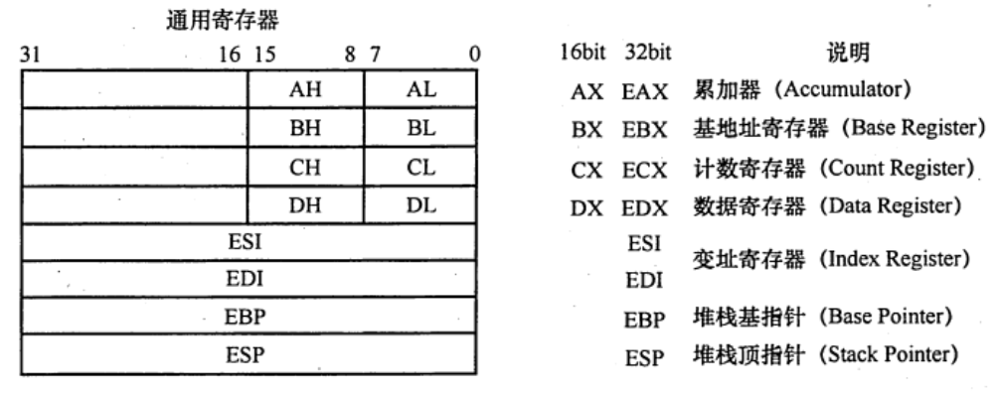
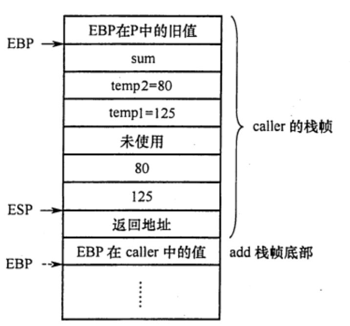
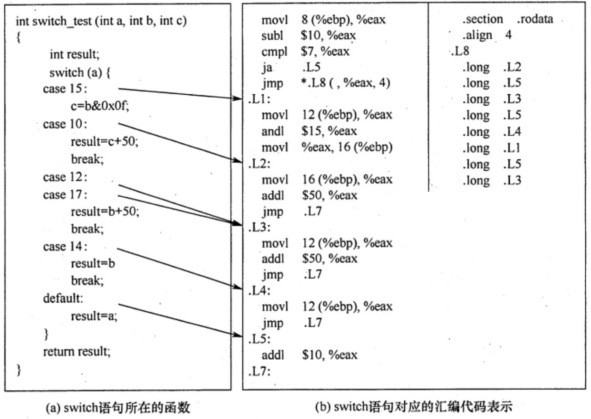
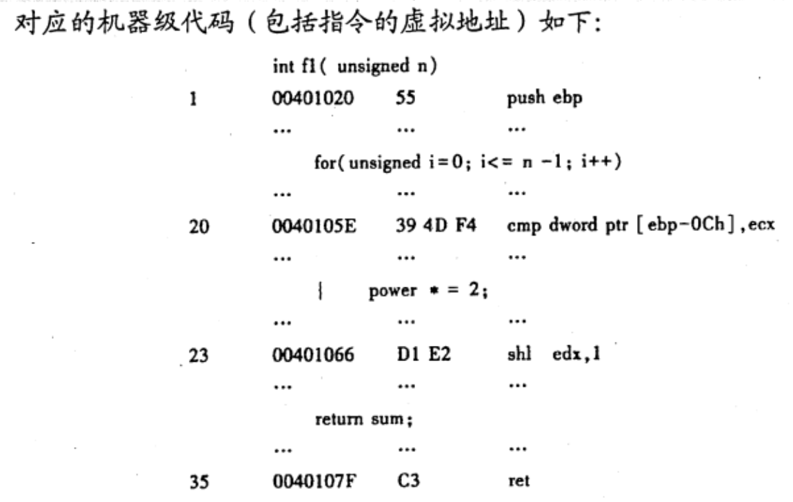
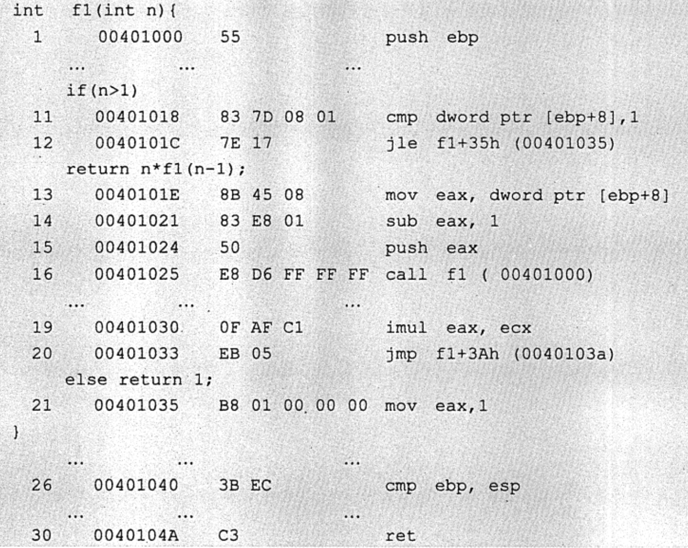

# 程序的机器级代码表示
2022.08.25

[TOC]

## 常用汇编指令介绍

### 相关寄存器

x86处理器中有8个32位的通用寄存器，个寄存器及说明如图所示。为向后兼容，EAX、EBX、ECX、EDX的高两位字节和低两位字节可以独立使用，E为Extended，表示32位寄存器。

例如，EAX的低两位字节称为AX，而AX的高低字节可分别作为两个8位寄存器，分别称为AH和AL。

寄存器名称与大小写无关，既可以用EAX，也可以用eax。



### 汇编指令格式

AT&T 和Intel两种指令格式：

| 内容         | AT&T               | Intel                                    |
| ------------ | ------------------ | ---------------------------------------- |
| 大小写       | 只能小写           | 大小写不敏感                             |
| 操作数顺序   | 源，目的           | 目的，源                                 |
| 前缀         | %寄存器，$立即数   | 无前缀                                   |
| 寻址         | ()                 | []                                       |
| 指定数据长度 | 操作码+“b”/“w”/“l” | 操作码+“byte str”/“word str”/“dword str” |

案例展示：

| 含义                          | AT&T                         | Intel                    |
| ----------------------------- | ---------------------------- | ------------------------ |
| `100->R[eax]`                 | `mov $100, %eax`             | `mov eax, 100`           |
| `R[eax]->R[ebx]`              | `mov %eax, %ebx`             | `mov ebx, eax`           |
| `R[eax]->M[R[ebx]]`           | `mov %eax, (%ebx)`           | `mov [ebx], eax`         |
| `R[eax]->M[R[ebp]-8]`         | `mov %eax, -8(%ebp)`         | `mov [ebp-8], eax`       |
| `R[edx]+R[eax]*2+8->R[eax]`   | `lea 8(%edx, %eax, 2), %eax` | `lea eax, [edx+eax*2+8]` |
| 长度为4字节的`R[eax]->R[ebx]` | `movl %eax, %ebx`            | `mov dword ptr ebx, eax` |

> * `disp(base, index, scale)`：偏移量、基址寄存器、比例因子
> * [汇编中的lea指令的作用，简单清晰明了不废话！](http://t.csdn.cn/MMApW)

### 常用指令

汇编指令分为数据传送指令、逻辑计算指令和控制流指令。

1. **寄存器、内存、常数**

   1. **寄存器**`<reg>`：表示任意寄存器，其后带有数字代表位数。`<reg32>`（eax、ebx、ecx..），`<reg16>`（ax、bx、..），`<reg8>`（ah、al、bh、bl）...
   2. **内存地址**`<mem>`：表示内存地址，`[eax]`、`[var+4]`、`dword ptr [eax+ebx]`
   3. **常数**`con`：`<con8>`、`<con16>`、`<con32>`

2. **数据传送指令**

   1. **mov指令**：把第二个操作数复制到第一个操作数那里。<u>注意⚠️不能用于直接从内存复制到内存</u>

      ```assembly
      mov <reg>, <reg>
      mov <reg>, <mem>
      mov <mem>, <reg>
      mov <reg>, <con>
      mov <mem>, <con>
      ; 举例
      mov eax, ebx
      mov byte ptr [var], 5
      ```

   2. **push指令**：将操作数押入内存栈，常用语函数调用。ESP是栈顶，压栈前先将ESP值减4，然后将操作数雅茹ESP指示的地址

      ```assembly
      push <reg32>
      push <mem>
      push <con32>
      ; 举例，占中元素固定为32位
      push eax
      push [var] ;将var值指示的内存地址的4字节值压栈
      ```

   3. **pop指令**：出栈前，先将ESP指示的地址中的内容出栈，然后将ESP值加4

      ```assembly
      pop edi
      pop [ebx]
      ```

3. **算数和逻辑运算指令**

   1. **add/sub指令**：结果保存在第一个操作数中

      ```assembly
      add <reg>, <reg>
      add <reg>, <mem>
      add <mem>, <reg>
      add <reg>, <con>
      add <mem>, <con>
      ;sub同理
      ```

   2. **inc/dec指令**：自增加1，自减少1

      ```assembly
      inc <reg>
      dec <reg>
      inc <mem>
      dec <mem>
      ```

   3. **imul指令**：带符号整数乘法指令。【1】两个操作数：两个操作数相乘，结果保存在第一个操作数里，第一个操作数必须是寄存器。【2】三个操作数：将第二个和第三个操作数相乘，结果保存在第一个操作数里，第一个操作数必须是寄存器

      ```assembly
      imul <reg32>, <reg32>
      imul <reg32>, <mum>
      imul <reg32>, <reg32>, <con>
      imul <reg32>, <mem>, <con>
      ```

   4. **idiv指令**：带符号整数除法。<u>只有一个操作数，即除数！</u>被除数为edx:eax中的内容（64位整数），操作结果有两部分：商和余数，商送到eax，余数送到edx。

      ```assembly
      idiv <reg32>
      idiv <mem>
      ```

   5. **and/or/xor指令**：分别是【逻辑与】【逻辑或】【逻辑异或】，结果放在第一个操作数里

      ```assembly
      and <reg>, <reg>
      or <reg>, <mem>
      xor <mem>, <reg>
      ```

   6. **not指令**：位反转指令，将操作数中的每一位反转（0变1，1变0）

      ```assembly
      not <reg>
      not <mem>
      ```

   7. **neg指令**：取负指令

      ```assembly
      neg <reg>
      neg <mem>
      ```

   8. **shl/shr指令**：逻辑移位指令，shl位逻辑左移，shr逻辑右移，第一个操作数表示被操作，第二个操作数指示移位的位数。

      ```assembly
      shl <reg>, <con8>
      shl <mem>, <con8>
      shl <reg>, <cl>
      shl <reg>, <cl>
      ; shr同理
      ```

4. **控制流指令**

   x86处理器维持着一个**指示当前指令的指令指针（IP）**，当一条指令执行后，此指针自动指向下一条指令。IP寄存器不能直接工作，但可以用控制流指令更新。通常用标签（label）指示程序中的指令地址，在x86汇编代码中，可在任何指令前加入标签。

   1. **jmp指令**：控制IP转移到label所指示的地址（ 从label中取出执行指令 ）

      ```assembly
      jmp <label>
      ```

   2. **jcondition指令**：条件转移指令。依据CPU状态字中的一系列条件状态转移。CPU状态字中包括指示最后一个算术运算结果是否为0，运算结果是否为负数等。

      ```assembly
      je <label> ;jump when equal
      jne <label> ;jump when not equal
      jz <label> ;jump when last result was zero
      jg <label> ;jump when greater then
      jge <label> ;jump when greater than or equal to
      jl <label> ;jump when less than
      jle <label> ;jump when less than or equal to
      ```

   3. **cmp/test指令**：cmp指令用于比较两个操作数的值，test指令对两个操作数进行逐位与运算，这两类指令都不保存操作结构，仅根据运算结果设置CPU状态字中的条件码。

      ```assembly
      cmp <reg>, <reg>
      ```

      cmp和test指令通常和jcondition指令搭配使用，举例

      ```assembly
      ;将var指示的主存地址的4字节内容，与10比较
      cpm dword ptr [var], 10
      ;如果相等则继续顺序执行，否则跳转到loop处执行
      jne loop
      ;测试eax是否为0
      test eax, eax
      ;为0则置标志ZF为1，跳转到xxxx处执行
      jz xxxx
      ```

   4. **call/ret指令**：分别用于实现子程序（过程、函数等）的调用及返回。

      ```assembly
      call <label>
      ret
      ```

## 过程调用的机器级表示

### P调用Q的步骤

1. **P**将**入口参数**（实参）放在Q能访问到的地方
2. **P**将**返回地址**存到特定的地方，然后将控制转移到Q
3. **Q保护P的现场**（通用寄存器内容），并为自己的**非静态局部变量**分配空间
4. 执行过程Q
5. **Q恢复P的现场**，将**返回结果**放到P能访问到的地方，并释放局部变量所占空间
6. Q取出返回地址，将控制转移到P

【2】是由call指令实现的，【6】是由ret指令返回到过程P。上述过程中，用户可见的寄存器数量有限，为此需要设置专门一个存储区来保存这些数据，这个存储区就是【栈】。每个过程都有自己的栈区，称为【栈帧】，帧指针寄存器EBP指示栈帧的起始位置（栈底），栈指针寄存器ESP指示栈顶，栈从高地址向低地址增长，因此当前栈帧的范围在帧指针EBP和ESP指向的区域之间。

### 案例说明

```C
int add(int x, int y){
  return x+y;
}

int caller(){
  int temp1 = 125;
  int temp2 = 80;
  int sum = add(temp1, temp2);
  return sum;
}
```

经过GCC编译后：

```assembly
push ebp
mov  ebp, esp
sub  ebp, 24
mov  [ebp]-12, 125   ; temp1 = 125
mov  [ebp]-8, 80     ; temp2 = 80
mov  eax, [ebp]-8    ; R[eax]=temp2
mov  [esp]-4, eax    ; temp2入栈
mov  eax, [ebp]-12   ; R[eax]=temp1
mov  [esp], eax      ; temp1入栈
call add
mov [ebp]-4, eax     ; add返回值送sum
mov eax, [ebp]-4     ; sum作为caller返回值
leave
ret
```




## 选择语句的机器级表示

### 条件码（标志位）

* CF：进位位。有进位或借位时时1，否则0
* ZF：零标志。最近的操作运算结果是否为0
* SF：最近的带符号运算结果的符号。如果是负则是1，否则是0
* OF：溢出标志。

### if语句

1. 通用形式

   ```C
   if(test_expr)
     then_statement
   else
     else_statement
   ```

2. goto形式

   ```C
   t = test_expr;
   if(!t)
     goto false;
   then_statement;
   goto done;
   false:
   	else_statement
   done:
   ```

3. 案例

   ```C
   int get_cont(int *p1, int *p2){
     if(p1>p2)
       return *p2;
     else
       return *p1;
   }
   ```

   ```assembly
   movl eax,[ebp+8]   ; R[eax]=p1
   movl edx,[ebp+12]  ; R[edx]=p2
   cmpl eax,edx       ; 比较p1，p2，根据结果置标志
   jbe .L1            ; 如果p1≤p2
   movl eax, [edx]    ; R[eax]=M[p2]
   jmp .L2            ; 无条件跳转到L2
   .L1:
   movl eax,[eax]     ;R[eax]=M[p1]
   .L2:
   ```

### switch语句



## 循环语句的机器级表示

### do-while语句

```C
do
	body_statement
  while(test_expr);
```

```assembly
loop:
  body_statement
  t=test_expr;
  if(t)
    goto loop;
```

### while语句

```C
while(test_expr)
	body_statemnet
```

```C
t=test_expr;
if(!t)
	goto done;
do
	body_statement;
	while(test_expr);
```

```assembly
t=test_expr;
if(!t)
	goto done;

loop:
	body_statement
	t = test_expr;
	if(t)
		goto loop;
done:
```

### for语句

```C
for(init_expr;test_expr;update_expr)
  body_statment
```

```C
init_expr;
while(test_expt){
  body_statement
  update_expt;
}
```

```assembly
init_expt;
t=test_expt;
if(!t)
	goto done;
loop:
	body_statement
	update_expt;
	t=test_expr;
	if(t)
		goto loop;
done:
```

## 例题

1. 假设`R[ax]=FFE8H`，`R[bx]=7FE6H`，执行指令`addw %bx, %ax`后，寄存器的内容和标志的变化为（ ）

   A. R[ax]=7FXEH，OF=1，SF=0，CF=0，ZF=0

   B. R[bx]=7FXEH，OF=1，SF=0，CF=0，ZF=0

   C. R[ax]=7FXEH，OF=0，SF=0，CF=1，ZF=0

   D. R[bx]=7FXEH，OF=0，SF=0，CF=1，ZF=0

   【答案】：C
   $$
   \begin{align}
   1111,1111,1110,1000&\\
   0111,1111,1110,0110&\\
   ----------&\\
   1,0111,1111,1100,1110&
   \end{align}
   $$
   

2. 假设`R[ax]=7FE6H`，`R[bx]=FFE8H`，执行指令`sub bx, ax`后，寄存器的内存和个标志的变化

   A. R[ax]=8002H，OF=0，SF=1，CF=0，ZF=0

   B. R[bx]=8002H，OF=0，SF=1，CF=0，ZF=0

   C. R[ax]=8002H，OF=1，SF=1，CF=0，ZF=0

   D. R[bx]=8002H，OF=1，SF=1，CF=0，ZF=0

   【答案】：B
   $$
   \begin{align}
   1000,1111,1110,0110=1111,0000,0001,1010&\\\\
   1111,1111,1110,1000&\\
   1111,0000,0001,1010&\\
   ----------&\\
   1,1111,0000,0000,0010&
   \end{align}
   $$

3. 假设P为调用过程，Q为被调用过程，程序在32位x86处理器上执行，以下是C语言程序中过程调用所涉及的操作：
   ①过程Q保存P的现场，并为非静态局部变量分配空问
   ②过程P将实参存放到Q能访问到的地方
   ③过程P将返回地址存放到特定处，并转跳到Q执行
   ④过程Q取出返回地址，并转跳回到过程P执行
   ⑤过程Q恢复P的现场，并释放局部变量所占空间
   ⑥执行过程Q的函数体

   【答案】：231654

4. 【2017 统考真题】在按字节编址的计算机M上，f1的部分源程序（阴影部分）如下。将f1中的int都改成float，可得到计算f(n)的另一个函数f2

   ```C
   int f1(unsigned n){
     int sum=1,power=1;
     for(unsigned i=0;i<=n-1;i++){
       power *= 2;
       sum += power;
     }
     return sum;
   }
   ```

   

   其中，机器级代码包括行号、虚拟地址、机器指令和汇编指令

   1. 计算机M是RISC还是CISC？为什么？

      【答案】：是CISC，因为指令长短不一致，不满足RICS的标准

   2. f1的机器指令代码共占多少字节？求计算过程

      【答案】：0040107F-00401020=80+15=95❌，还要加上最后ret的一个字节，答案是96B

   3. 第20条指令cmp通过i减n-1的比较。执行f1(0)的过程中，当i=0时，cmp指令执行后，借位/进位标志CF的内容是什么？要求给出计算过程

      【答案】：i=0时，i=0000,0000H和n-1=FFFF,FFFFH比较。0000,0000-FFFF,FFFF= 0000,0000+0000,0000+1=0000,0001H，输出C=0，CF=C异或1=1.CF=1

   4. 第23条指令shl通过左移实现了power\*2运算，在f2中能否用shl实现power\*2？为什么？

      【答案】：不能。因为shl把一个整数的所有有效为左移。而f2中的变量power时float型，其计其数不包含最高有效数位，但包含了阶码部分，将其作为一个整体左移不能实现乘2

5. 【2019 统考真题】已知$f(n)=n!$，计算f(n)的C语言函数f1的源程序（阴影部分）及其在32位计算机M上的部分机器及代码如下

   

   其中，机器级代码包括行号、虚拟地址、机器指令和汇编指令，计算机M按字节编址，int型数据占32位，请回答下列问题：

   1. 计算f(10)需要调用函数f1多少次？执行哪条指令会递归调用f1？

      【答案】：10次，16

   2. 上述代码中，哪条指令是条件转移指令？那几条指令一定会是程序跳转执行？

      【答案】：条件12，一定16，20，30

   3. 根据第16行的call指令，第17行指令的虚拟地址应是多少？已知第16行的call指令采用相对寻址方式，该指令中的偏移量应是多少？已知第16行的call指令的后4字节为偏移量，M是采用大端方式还是采用小端方式？

      【答案】：0040102A，-2A=1000,0000,0010,1010=1111,1111,1101,0110=FFD6->小端

   4. f(13)=6227020800，但f(13)的返回值为1932053504，为什么两者不相等？要使f1(13)返回正确结果。如何修改f1程序？

      【答案】：因为超过了int类型最大表示范围，应该换成long long int或double

6. 【2019统考真题】对于题10，若计算机 M 的主存地址为 32位，采用分页存储管理方式，页大小为4KB，则第1行的push指令和第30行的ret 指令是否在同一页中（说明理由）？若指令Cache 有64行，采用4 路组相联映射方式，主存块大小为 64B，则32位主存地址中，哪几位表示块内地址？哪几位表示 Cache组号？哪几位表示标记(tag）信息？读取第16行的call 指令时，只可能在指令 Cache 的哪一组中命中（说明理由）？

   【答案】：【再看】