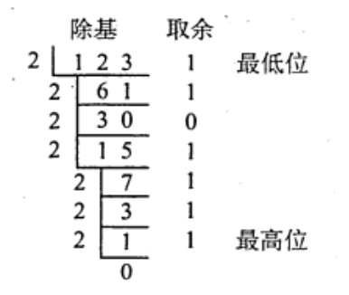
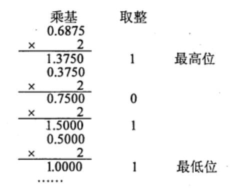

# 数制与编码
2022.04.04

[TOC]

## 进制的转换

* n进制转十进制：$\sum_{i=1}^{k}a_i\cdot n^i$

* 2、8、16进制转换：可以三个，四个二进制位为一组进行转换（小数部分也同样）

* 十进制转n进制：

  * 整数部分：辗转相除：$123_{10}=1111011_2$

    > 我的理解：
    >
    > 1. 先除出来的是经历最多2倍后剩下的，是最小的零头，所以是最低位
    > 2. 最后除法得0可以继续不停的除2，取余一直是0，在最高位才能不停补零
  
    
  
  * 小数部分：乘积取余：$0.6875_{10}=0.1011_2$
  
    > 我的理解：
    >
    > 一乘就取到整数了，说明它本来就很大，离小数点最近。
    
    
  
  
  

## 定点数的编码表示

1. 定点整数与小数

   1. 定点整数：符号位+数值+小数点
   2. 定点小数：符号位+小数点+数值

2. 原码

   1. 符号位：零正一负

   2. 数值：本身

   3. 表示范围关于原点对称：$[-(2^n-1),2^n-1]$

      > 我的理解：因为正零和负零都是零，导致所有表示的内容正好对半分。

3. 反码

   1. 符号位：和原码一样，零正一负

   2. 数值：(负数)逐位取反

   3. 表示范围关于原点对称：$[-(2^n-1),2^n-1]$

      > 我的理解：反码和原码一一对应

4. 补码

   1. 符号位：和原码一样，零正一负
   2. 数值：(负数)逐位取反(反码)+1
   3. 表示范围关于原点对称：$[-2^n,2^n-1]$
   4. X为负数，由$X_补$求$(-X)_补$，是$X_补$连同符号位一起变反，末位加一

5. 移码

6. 图像举例

   | 编码 | 000  | 001  | 010  | 011  | 100  | 101  | 110  | 111  |
   | ---- | ---- | ---- | ---- | ---- | ---- | ---- | ---- | ---- |
   | 原码 | +0   | +1   | +2   | +3   | -0   | -1   | -2   | -3   |
   | 反码 | +0   | +1   | +2   | +3   | -3   | -2   | -1   | -0   |
   | 补码 | +0   | +1   | +2   | +3   | -4   | -3   | -2   | -1   |
   | 移码 | -4   | -3   | -2   | -1   | +0   | +1   | +2   | +3   |

   > 我的理解：
   >
   > 1. 一开始，人们为了简单的表示数字，只表示数字的绝对值
   >
   > 2. 后来绝对值只能表示非负数，就在前边加一个1表示负号，诞生了【原码】
   >
   > 3. 为了解决让加法与减法都只使用加法器，诞生了【反码】，比如
   >
   >    $(+1)-(+2)=(+1)+(-2)=001_反+101_反=110_反=-1$
   >
   >    $a_原 - b_原 = a_反 + (-b)_反$
   >
   > 4. 但是反码仍然拥有两个0，我们把反码负数部分减一，就得到了【补码】，可以发现，补码仍然拥有反码的那些好处！而且还可以多表示一个数，可以理解成，原码的负零不需要了，就可以表示一个最小的数～
   >
   >    $a_原 - b_原 = a_补 + (-b)_补$
   >
   > 5. 整数补码多一个$-2^n$，小数补码多一个$-1$.
   >
   > 6. 变形补码，就是双符号位00是正，11是负
   >
   > 7. 为了比大小方便，我们把补码的符号位取反，就诞生了【移码】，这样我们就可以通过二进制大小直接确认真值的大小了了
   >
   > 8. 实际上，移码的诞生是补码加一个偏执值。本例子中，偏执值是$2^3$.

7. 8421码：有权码，结果大于9，加六修正

8. 余3码：8421码结果加$(0011)_2$

9. 2421码：0xxx表示0-4，1xxx表示5-9

10. 例题

    1. 若$[x]_补=1,x_1x_2x_3x_4x_5x_6$,其中x取0或1，若要x>-32,应当满足(C)。

       A.x1为0，其他各位任意

       B.x1为1，其他各位任意

       C.x1为1，x2-x5中至少有一位为1

       D.x1为0，x2-x5中至少有一位为1

    2. 设x为真值，x\*为其绝对值，满足$[-x*]_补=[-x]_补$,当且仅当(D)。

       A.x任意

       B.x为正数

       C.x为负数

       D.以上说法都不对

    3. 在计算机中，通常用来表示主存地址的是(D)。

       A,移码

       B.补码

       C.原码

       D.无符号数

    4. 关于模4补码，下列说法正的的是（）。
       A. 模4 补码和模2 补码不同，它更容易检查乘除运算中的溢出问题
       B. 每个模4 补码存储时只需一个符号位
       C. 存储每个模4补码需要两个符号位
       D. 模4补码，在算术与逻輯部件中为一个符号位

       答案：B. 存储模4补码需要一个符号位，ALU使用模4补码需要两个符号位