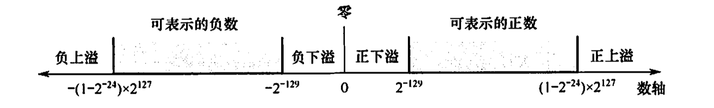
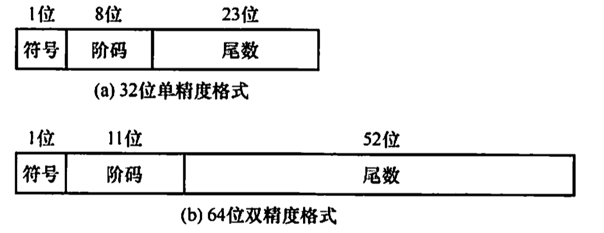

# 浮点数的表示与运算
2022.04.23

[TOC]

## 浮点数的表示

### 浮点数的表示格式

$$
N = (-1)^S\cdot M\cdot R^E
$$

* S: 代表N符号，0正1负
* M: 尾数，原码。二进制定点小数
* E: 阶码/指数，移码。二进制定点整数
* R: 基数(隐含)，可以是2、4、16

32位浮点数格式（基数默认为2）：

| 数符(0) | 阶码(1-7) | 尾数(8-31) |
| :-----: | :-------: | :--------: |

### 浮点数的表示范围

正数（0.1xxxx）：最大值0.1111···1，最小值0.100···0，范围$0\cup[2^{-1}\cdot 2^{-128},(1-2^{-24})\cdot 2^{127}]$

负数（1.1xxxx）：最小值1.1111···1，最大值1.100···0，范围$[-(1-2^{-24})\cdot 2^{127}	,-2^{-1}\cdot 2^{-128}]\cup 0$

上溢：进行中断处理

下溢：当作0处理



### 浮点数的规格化

左规：出现$\pm$0.000···0时，尾数左移n位，阶码减n

右规：尾数有效位进位到小数点前边，尾数右移1位，阶码加1

**基数为2时，原码规格化形式的尾数最高位是1**

**基数为4时，原码规格化形式的尾数最高两位不全为0**

* 若浮点数的尾数用补码表示，则下列(D)中的尾数是规格化数形式。

  A.1.11000

  B.0.01110

  C.0.01010

  D.1.00010

* 浮点数的基数为4，尾数用原码表示，则以下(C)是规格化的数。

  A.1.001101

  B.0.001101

  C.1.011011

  D.0.000010

* 什么是浮点数的溢出？什么情况下发生上溢出？什么情况下发生下溢出？

  ①**阶码上溢出**。一个正指数超过了最大允许值时，浮点数发生上溢出（即向**∞方向溢出**)。若结果是正数，则发生正上溢出（有的机器把值置为+∞）；若结果是负数，则发生负上溢出（有的机器把值置为-∞）。这种情况为软件故障，通常要引入**溢出故障**处理程序来处理。

  ②**阶码下溢出**。一个负指数比最小允许值还小时，浮点数发生下溢出。一般机器把下溢出

  时的值置为0(**+0或-0**)。**不发生溢出故障**。

  ③**尾数溢出**。当尾数最高有效位有进位时，发生尾数溢出。此时，**进行“右规”操作**：尾数右移一位，阶码加1，直到尾数不溢出为止。此时，只要阶码不发生上溢出，浮点数就不会溢出。

  ④**非规格化尾数**。当数值部分高位不是一个有效值时（如原码时为0或补码时与符号位相同)，尾数为非规格化形式。此时，**进行“左规”操作**：尾数左移一位，阶码减1，直到尾数为规格化形式为止。

### IEEE754标准



阶码：原码数值+偏执值

尾数：带隐藏位的原码

| 类型       | 数符 | 阶码 | 尾数数值 | 总位数 | 偏执值       |
| ---------- | ---- | ---- | -------- | ------ | ------------ |
| 短浮点数   | 1    | 8    | 23       | 32     | 7FH(127)     |
| 长浮点数   | 1    | 11   | 52       | 64     | 3FFH(1023)   |
| 临时浮点数 | 1    | 15   | 64       | 80     | 3FFFH(16383) |

> 记忆方案：
>
> Float 32 -> 8 + (1+23)
>
> Double 64 -> 11 + 52 + 1, **“一生一世我爱你”**
>
> 临时浮点数 80 -> (1+15) + 64
>
> 8 11 15，**“八十一是我，王氏一是你”**
>
> 23 52 64 **饿(Er)死(San)闻(Wu Er)拉(Liu)屎(Si)**

$$
(-1)^S\cdot 1.M \cdot 2^{E-127}\\
(-1)^S\cdot 1.M \cdot 2^{E-1023}\\
(-1)^S\cdot 1.M \cdot 2^{E-16383}
$$


小结：

|   内容   |    阶码     |       尾数       |
| :------: | :---------: | :--------------: |
|  浮点数  |    原码     |       移码       |
| IEEE 754 | 原码+偏置值 | 原码（带隐藏位） |

例题：

* 在EEE754标准规定的64位浮点数格式中，符号位为1位，阶码为11位，尾数为52位，则它所能表示的最小规格化负数为（)

  | 符号位(1) |  阶码(11)   |  尾数(52)  |
  | :-------: | :---------: | :--------: |
  |     1     | 11111111111 | 111...1111 |

  $$
  \begin{align}
  &-1.111...111(52个1)\cdot 2^{11111111111(11个1)-1023(偏执值)}\\
  &= -(2-2^{-52})\cdot 2^{1023}
  \end{align}
  $$

  ⚠️注意隐藏位是小数点前哦～

* 现有一计算机字长32位(D31~D0),数符位是第31位。

  对于二进制10001111111011111100000000000000，

  1)表示一个补码整数，其十进制值是多少？
  $$
  \begin{align}
  &1111,0000,0001,0000,0100,0000,0000,0000\\
  =&-(2^{14}+2^{20}+2^{28}+2^{29}+2^{30})
  \end{align}
  $$
  2)表示一个无符号整数，其十进制值是多少？
  $$
  \begin{align}
  &1000,1111,1110,1111,1100,0000,0000,0000\\
  =&2^{14}+2^{15}+2^{16}+2^{17}+2^{18}+2^{19}+2^{21}+2^{22}+2^{23}+2^{24}+2^{25}+2^{26}+2^{27}+2^{31}\\
  =&2^{20}-2^{14}+2^{32}-2^{21}
  \end{align}
  $$
  3)表示一个IEEE754标准的单精度浮点数，其值是多少？
  $$
  \begin{align}
  &1,0001 1111,1101 1111 1000 0000 0000 000\\
  =&-2^{-96}\cdot (2-2^{-3}-2^{-9})
  \end{align}
  $$

* 假定变量i是一个32位的int型整数，f和d分别为float型（32位)和double型(64位)实数。X、Y、Z是float型(32位)或double型(32位)实数.分析各布尔表达式，说明结果是否在任何情况下都是“true”。

  1)i=(int)((double)i)

  是的

  2)f=(float)((int)f)

  不是

  3)f=(float)((double)f)

  是的

  4)d=(double)((float)d)

  不是

* 已知两个实数x=-68,y=-8.25,它们在C语言中定义为float型变量，分别存放在寄存器A和B中。另外，还有两个寄存器C和D。A、B、C、D都是32位的寄存器。请问（要求用十六进制表示二进制序列）：

  1)寄存器A和B中的内容分别是什么？
  $$
  \begin{align}
  &-68\\
  =&-1000100H\cdot2^{0}\\
  =&-1.000100H\cdot2^{6}\\
  =&1,1000 0101(6+127),0001\\
  =&C2880000
  \end{align}
  $$

  $$
  \begin{align}
  &-8.25\\
  =&-1000.01H\cdot2^{0}\\
  =&-1.00001H\cdot2^{3}\\
  =&1,1000 0010(3+127),00001\\
  =&C1040000
  \end{align}
  $$

  
  2)X和Y相加后的结果存放在C寄存器中，寄存器C中的内容是什么？
  $$
  \begin{align}
  &-(1.000100H\cdot2^{6}+1.00001H\cdot2^{3})\\
  =&-(1.000100H\cdot2^{6}+0.00100001H\cdot2^{6})\\
  =&-(1.00110001H\cdot2^{6})\\
  =&1,1000 0101(6+127),00110001\\
  =&C2988000
  \end{align}
  $$
  3)X和Y相减后的结果存放在D寄存器中，寄存器D中的内容是什么？
  $$
  \begin{align}
  &1.00001H\cdot2^{3}-1.000100H\cdot2^{6}\\
  =&0.00100001H\cdot2^{6}-1.000100H\cdot2^{6}\\
  =&-(1.00010000H\cdot2^{6}-0.00100001H\cdot2^{6})\\
  =&-(0.11101111H\cdot2^{6})\\
  =&-(1.1101111H\cdot2^{5})\\
  =&1,1000 0100(5+127),1101111\\
  =&C26F0000
  \end{align}
  $$

* 【2017统考真题】已知$f(n)=\sum_{i=0}^{n}2^i=2^{n+1}-1=11...1B$，计算f(n)的C语言函数f1如下：

  ```c
  int f1(unsigned n){
    int sum=1, power=1;
    for(unsigned i=0;i<n-1;i++){
      power *= 2;
      sum += power;
    }
    return sum;
  }
  ```

  将f1中的int都改为float,可得到计算f(n)的另一个函数f2。假设unsigned和int型数据都占32位，float采用IEEE754单精度标准。请回答下列问题：

  1)当n=0时，f1会出现死循环，为什么？若将f1中的变量i和n都定义为int型，则f1是否还会出现死循环？为什么？

  【答案】：因为n=0时，n=0000..000，n为无符号数，n-1=111...111，变成了最大的数。改成int就不会了，因为int可以表示负数。

  

  2)f1(23)和f2(23)的返回值是否相等？机器数各是什么（用十六进制表示)？

  【答案】

  f1(23): 0000,0000,1111,1111,1111,1111,1111,1111（24个1）

  f1(23): $00FFFFFFH$

  f2(23): 0,10010110(23+127=149=128+16+4+2),11111111111111111111111(23个1)

  f2(23): $4B7FFFFFH$

  

  3)f1(24)和f2(24)的返回值分别为33554431和33554432.0，为什么不相等？

  【答案】

  f1(23): 0000,0001,1111,1111,1111,1111,1111,1111（25个1）

  f1(23): $00FFFFFFH$

  f2(23): 0,10010110(24+127=149=128+16+4+2+1),11111111111111111111111(24个1)

  **尾数只有23位，需要舍入一位，这里是入**

  f2(23): 0,10010110(25+127=149=128+16+8),0

  

  4)f(31)=$2^{32}-1$,而f1(31)的返回值却为-1，为什么？若使f1(n)的返回值与f(n)相等，则最大的n是多少？

  【答案】

  f1(31) = 111..111(32个1)

  计算机采用补码存储int，兑换成原码是1,000..0001，代表-1

  最大的n是**30**

  

  5)f2(127)的机器数为7F800000H,对应的值是什么？若使f2(n)的结果不溢出，则最大的n是多少？若使f2(n)的结果精确（无舍入），则最大的n是多少？

  【答案】
  $$
  \begin{align}
  &7F800000\\
  =&0111,1111,1000,0\\
  =&+\infty
  \end{align}
  $$
  1.111..1111小数点后23个1。一共24个1，n最大为23

### 定点、浮点表示的区别

(1)数值的表示范围

若定点数和浮点数的字长相同，则浮点表示法所能表示的数值范围远大于定点表示法。

(2)精度

对于字长相同的定点数和浮点数来说，浮点数虽然扩大了数的表示范围，但精度降低了。

(3)数的运算

浮点数包括阶码和尾数两部分，运算时不仅要做尾数的运算，还要做阶码的运算，而且运算结果要求规格化，所以浮点运算比定点运算复杂。

(4)溢出问题

在定点运算中，当运算结果超出数的表示范围时，发生溢出；浮点运算中，运算结果超出尾数表示范围却不一定溢出，只有规格化后阶码超出所能表示的范围时，才发生溢出。

## 浮点数的加减运算

1. 对阶

   对阶的目的是使两个操作数的小数点位置对齐，即使得两个数的阶码相等。为此，先求阶差，然后以**小阶向大阶看齐的原则**，将阶码小的尾数右移一位（基数为2），阶加1，直到两个数的阶码相等为止。尾数右移时，舍弃掉有效位会产生误差，影响精度。

2. 尾数求和

   将对阶后的尾数按定点数加（减）运算规则运算。运算后的尾数不一定是规格化的，因此，浮点数的加减运算需要进一步进行规格化处理。

3. 规格化

   IEEE754规格化尾数的形式为**±1.×...×**。尾数相加减后会得到各种可能结果，例如：

   1.×...×+1.×...×=±1×,×...×

   1.×...×-1.×...×=±0.0...01×...×

   1)右规：当结果为±1×.×…×时，需要进行右规。尾数右移一位，阶码加1。尾数右移时，最高位1被移到小数点前一位作为隐藏位，最后一位移出时，要考虑舍入。

   2)左规：当结果为士0.0…01×…×时，需要进行左规。尾数每左移一位，阶码减1。.可能需要左规多次，直到将第一位1移到小数点左边。

   注意：①左规一次相当于乘2，右规一次相当于除2；②需要右归时，只需进行一次

4. 舍入

   在对阶和尾数右规时，可能会对尾数进行右移，为保证运算精度，一般将低位移出的两位保留下来，参加中间过程的运算，最后将运算结果进行舍入，还原表示成IEEE754格式。

   常见的舍入方法有：**0舍1入法**、**恒置1法**和**截断法（恒舍法）**。

   1. **0含1入法**：类似于十进制的“四合五入”法。运算结果保留位的最高数位为0，则舍去；最高数位为1，则在尾数的末尾+1。这样可能有导致溢出，需要再次右归。
   2. **恒置1法**：只要因移位而丢失的位中有1，就把尾数末位置1，而不管原来是0，还是1
   3. **截断法**：直接截取所需位数，丢弃后面的所有位，这种舍入处理最简单。

5. 溢出判断

   在尾数规格化和尾数舍入时，可能会对阶码执行加/减运算。因此，必须考虑指数溢出的问题。若一个正指数超过了最大允许值（127或1023)，则发生指数上溢，产生异常。若一个负指数超过了最小允许值(-149或-1074)，则发生指数下溢，通常把结果按机器零处理。

   1)右规和尾数舍入。数值很大的尾数舍入时，可能因为末位加1而发生尾数溢出，此时需要通过右规来调整尾数和阶。右规时阶加1，导致阶增大，因此需要判断是否发生了指数上溢。当调整前的阶码为11111110时，加1后，会变成11111111而发生指数上溢。

   2)左规。左规时阶减1，导致阶减小，因此需要判断是否发生了指数下溢。其判断规则与指数上溢类似，左规一次，阶码减1，然后判断阶码是否为全0来确定是否指数下溢。由此可见，浮点数的溢出并不是以尾数溢出来判断的，尾数溢出可以通过右规操作得到纠正。运算结果是否溢出主要看结果的指数是否发生了上溢，因此是由指数上溢来判断的。

   注意：某些题目可能会**指定尾数或阶码采用补码**表示。通常采用**双符号位**，当尾数求和结果溢出（如尾数为10.×…×或01.××…×）时，需右规一次；当结果出现00.0××…×或11.1××…×时，需要左规，直到尾数变为00.1××…×或11.0××…×。
   
6. 例题

   * 下列关于对阶操作说法正确的是()。

     A. 在浮点加减运算的对阶操作中，若阶码减小，则尾数左移

     B. 在浮点加减运算的对阶操作中，若阶码增大，则尾数右移；若阶码减小，则尾数左移

     C. 在浮点加减运算的对阶操作中，若阶码增大，则尾数右移

     D. 以上都不对

     答案：C。⚠️这道题说的是浮点数对阶操作中！小阶向大阶对齐

   * 设浮点数共12位。其中阶码含1位阶符共4位，以2为底，补码表示；尾数含1位数符共8位，补码表示，规格化。则该浮点数所能表示的最大正数是()。

     答案：$2^7\cdot(1-2^{-7})=2^7-1$。⚠️只有IEEE754才有隐藏位呢！阶码最大：$2^3-1=7$；尾数最大：$0.1111111=1-2^{-7}$

   * 采用规格化的浮点数最主要是为了(D)。

     A.增加数据的表示范围.

     B.方便浮点运算

     C.防止运算时数据溢出

     D.增加数据的表示精度

   * 下列关于舍入的说法，正确的是()。

     Ⅰ.不仅仅只有浮点数需要舍入，定点数在运算时也可能要舍入

     Ⅱ.在浮点数舍入中，只有左规格化时可能要舍入

     Ⅲ.在浮点数舍入中，只有右规格化时可能要舍入

     Ⅳ.在浮点数舍入中，左、右规格化均可能要舍入

     V.舍入不一定产生误差

     答案：只有V：只有浮点数有舍入的概念。舍入的两种情况：对阶&规格化

   * 【2011统考真题】float型数据通常用IEEE754单精度格式表示。若编译器将float型变量x分配在一个32位浮点寄存器FR1中，且X=-8.25,则FR1的内容是（)。

     A.C1040000H

     B.C2420000H

     C.C1840000H

     D.C1C20000H

     答案：A。⚠️要化成1.xxx才是规格化！不是0.1xxx。。
     $$
     \begin{align}
     &-8.25\\
     &=[1][阶码][8.25]\\
     &=[1][阶码][1000.01]\\
     &=[1][127+3][1.00001]\\
     &=[1][10000010][00001]\\
     &=1100|0001|0000|0100|...\\
     &=C1040000H
     \end{align}
     $$

   * 【2012统考真题】float类型（IEEE754单精度浮点数）能表示的最大整数是？

     答案：⚠️阶码全是1，尾数全是零的时候代表正负无穷！代表普通的数字需要阶码<全是1的情况
     $$
     \begin{align}
     &0[11111110][1111...111]\\
     \to&11111110=254-127=127\\
     \to&2^{127}\cdot 1.111...111\\
     &=2^{127}\cdot(2-2^{-23})\\
     &=2^{128}-2^{104}
     \end{align}
     $$

   * 【2013统考真题】某数采用IEEE754单精度浮点数格式表示为C6400000H,该数的值是：

     答案：
     $$
     \begin{align}
     &C6400000\\
     &=1100,0110,0100,0000,0000,0000,0000,0000\\
     &=-2^{10001100_B-127}\cdot 1.10000000000000000000000_B\\
     &=-1.5\cdot2^{13}
     \end{align}
     $$

   * 【2014统考真题】float型数据常用IEEE754单精度浮点格式表示。假设两个float型变量x和y分别存放在32位寄存器f1和f2中，若(f1)=CC90 0000H,(f2)=B0C0 0000H,则x和y之间的关系为()。

     A.x<y且符号相同

     B.x<y且符号不同

     C.x>y且符号相同

     D.x>y且符号不同
     $$
     CC900000H\\
     1100 1100 1001 0000 0000 0000 0000 0000\\
     -2^{26}\cdot 1.125\\
     B0C00000H\\
     1011 0000 1001 0000 0000 0000 0000 0000\\
     -2^{-30}\cdot 1.125\\
     $$
     答案：A

   * 【2015统考真题】下列有关浮点数加减运算的叙述中，正确的是()。

     I.对阶操作不会引起阶码上溢或下溢

     Ⅱ.右规和尾数舍入都可能引起阶码上溢

     Ⅲ.左规时可能引起阶码下溢

     IV.尾数溢出时结果不一定溢出

     A.仅Ⅱ、II

     B.仅I、Ⅱ、V

     C.仅I、Ⅲ、V

     D.I、Ⅱ、Ⅲ、IV

     答案：对阶是较小的阶码对齐至较大的阶码，I正确。右规和尾数舍入过程，阶码加1而可能上

     溢，Ⅱ正确，同理Ⅱ也正确。尾数溢出时可能仅产生误差，结果不一定溢出，V正确。D

   * 【2018统考真题】IEEE754单精度浮点格式表示的数中，最小的规格化正数是()。

     A.$1.0×2^{-126}$

     B.$1.0×2^{-127}$

     C.$1.0×2^{-128}$

     D.$1.0×2^{-149}$

     答案：A

     阶码:$00000001 = 1-127 = -126$

   * 【2020统考真题】已知带符号整数用**补码**表示，float型数据用**IEEE754**标准表示，假

     定变量x的类型只可能是int或float,当x的机器数为C8000000H时，x的值可能是()

     A.$-7×2^{27}$

     B.$-2^{16}$

     C.$2^{17}$

     D.$25×2^{27}$

     答案：A
     $$
     \begin{align}
     &C8000000_{int}\\
     =&1100 1000 0000 0000 0000 0000 0000 0000_{补码}\\
     =&1011 1000 0000 0000 0000 0000 0000 0000_{原码}\\
     =&- 7 \cdot 2^{27}
     &C8000000_{float}\\
     =&1100 1000 0000 0000 0000 0000 0000 0000\\
     =&1,1001 0000,0\\
     =&-2^{17}
     \end{align}
     $$

   * 【2021统考真题】下列数值中，不能用IEEE754浮点格式精确表示的是()。

     A.1.2

     B.1.25

     C.2.0

     D.2.5

     答案：A

     

     
