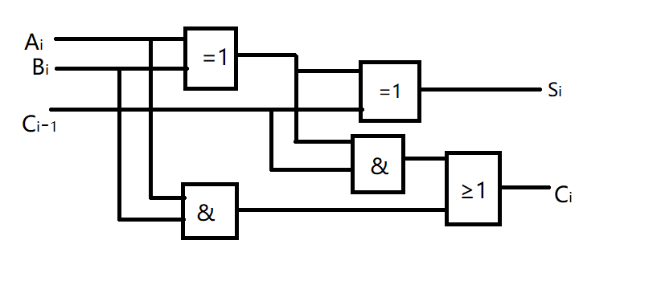
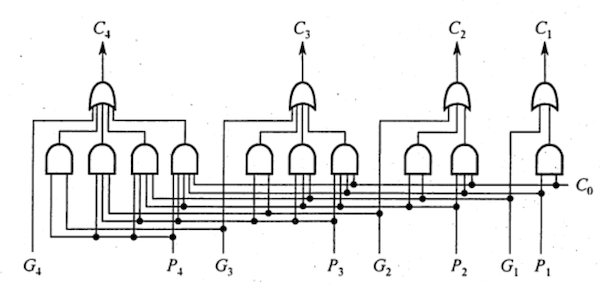
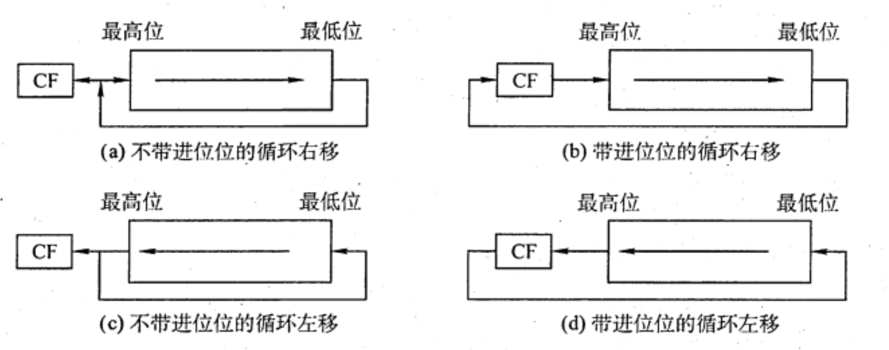
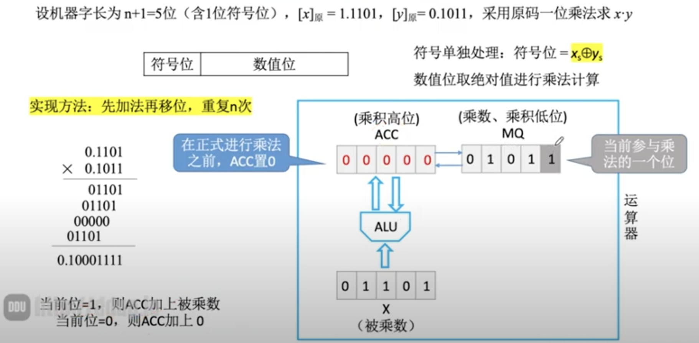
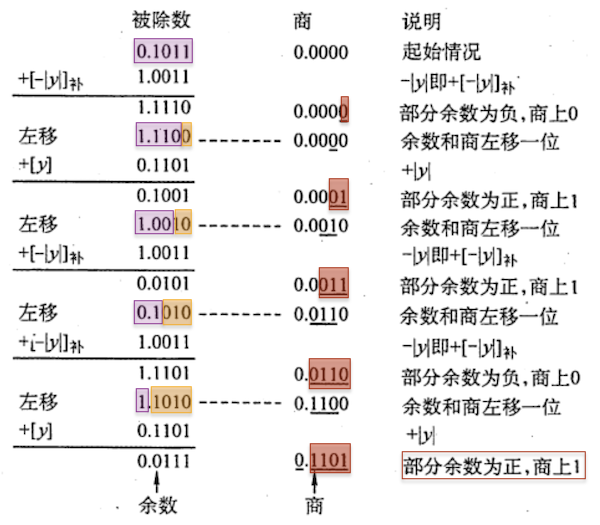
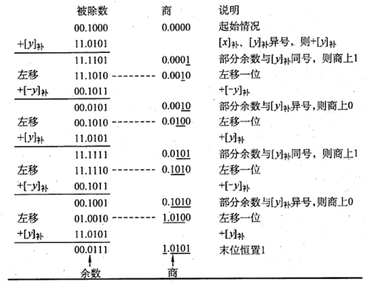
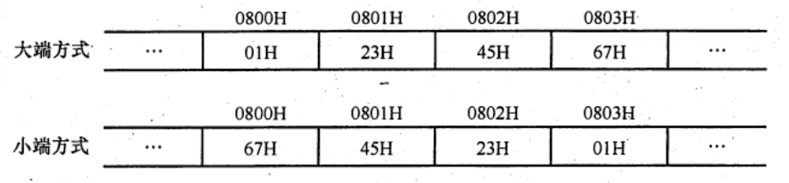
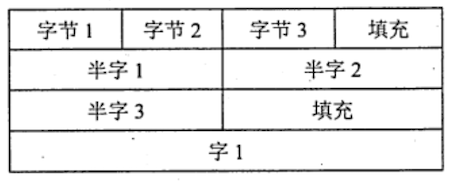

# 运算方法和运算电路
2022.08.21

[TOC]

## 基本运算部件

> Overview：
>
> 注意本节不是重点！
>
> 1. 一位全加器：通过两个加数和上一位进位位，计算出本次的结果和进位位
> 2. 串行全加器：一个结果计算出来下一位再计算，速度慢
> 3. 并行全加器：利用公式把串行全加器结果算出来，这样一下就计算出来了
> 4. 带标志加法器：

### 一位全加器

和表达式：$S_i= A_i\oplus B_i\oplus C_{i-1}$

进位表达式：$C_i = A_iB_i+(A_i\oplus B_i)C_{i-1}$



> 我的理解：
>
> 1. 和表达式：两个加数和上一位进位位，依次相加，这里的相加用的是异或
> 2. 进位表达式：两种情况，AB都是1，或，AB有一个是1一个是0同时上一位有进位

* 例题：加法器中每位的进位生成信号g为：$X_iY_i$，在设计多位加法器时，为了加快运算速度而采用了快速进位链，即对加法器的每位都生成两个信号：

  进位信号g：$X_iY_i$

  进位传递信号p：$X_i\oplus Y_i$

### 串行进位加法器


缺点：时间慢

### 并行进位加法器



$\begin{align}C_i &= A_iB_i+(A_i\oplus B_i)C_{i-1} \\&= G_i+P_iC_{i-1} = 自己两个1+自己一个1上一位有个进位\end{align}$

$C_1 = G_1+P_1C_0$

$C_2 = G_2+P_2C_1 = G_2 + P_2G_1 + P_2P_1C_0$

$C_3 = G_3+P_3C_2 = G_3 + P_3G_2 + P_3P_2G_1 + P_3P_2P_1C_0$

$C_4 = G_4+P_4C_3 = G_4 + P_4G_3 + P_4P_3G_2 + P_4P_3P_2G_1 + P_4P_3P_2P_1C_0$

### 带标志加法器


溢出OF**（有符号数看OF）**：$C_i\oplus C_{i-1}$

符号SF：$F_{n-1}$

零标志ZF=1：当所有F=0

进位/借位CF**（无符号数看CF）**：$C_{out}\oplus C_{in}$，（加法CF=0，减法CF=1）

> 强烈推荐课程：
>
> * [聊聊运算状态标志位CF_OF_SF_ZF的底层实现](https://www.bilibili.com/video/BV1SU4y1f79y)
> * [Youtube：精讲18 第二章数据的表示和运算12 标志位的生成](https://www.youtube.com/watch?v=LbEWpHzZLEI&list=PLjAs5kw1NNs0x3sxuX4V9Lc48FMt6_A6a&index=18)

## 定点数的移位运算

### 算术移位

正数全加零，负数原码全加零，负数反码全加一，负数补码左移加0，右移加1

|      |       码制       | 填补代码 |
| :--: | :--------------: | :------: |
| 正数 | 原码、补码、反码 |    0     |
| 负数 |       原码       |    0     |
| 负数 |       补码       | 左移添0  |
| 负数 |       补码       | 右移添1  |
| 负数 |       反码       |    1     |

### 逻辑移位

溢出部分丢弃，左右都补零

### 循环移位




* 一个8位寄存器内的数值为 11001010，进位标志寄存器C为0，若将此 8位寄存器循环左移（**不带进位位**）1位则该8位寄存器和标志寄存器内的数值分别为（）。

  A. 1001 0100，1

  B. 1001 0101，0

  C. 1001 0101，1

  D. 1001 0100，0

  【答案】：C

  [CF, 11001010]

  [CF(1), 10010101]，注意，最左边的1也会同时移动到CF里边！

* 【2018统考真题】整数x的机器数为11011000，分别对x进行逻辑右移1位和算术右移1位操作，得到的机器数各是()。

  A.11101100、11101100

  B.01101100、11101100

  C.11101100、01101100

  D.01101100、01101100

  【答案】：B

## 定点数的加减运算

* $[x+y]_补 = [x]_补+[y]_补$

  $[x-y]_补 = [x]_补+[-y]_补$

* 符号位参与运算；最高位进位丢弃

* 例题：A=15，B=24，求$[A+B]_补$，$[A-B]_补$
  $$
  \begin{align}
  A = 15 &= [0,00001111]_补\\
  B = 24 &= [0,00011000]_补\\
  -B = -24 &= [1,11101000]_补\\
  A+B &= [0,00100111]_补\\
  A-B = -24 &= [1,11110111]_补\\
  \end{align}
  $$

* 溢出判断：只有符号相同的数加减才会溢出

  ($A_s$：A的符号位，$B_s$：B的符号位，$S_s$：结果的符号位)

  * **一位符号位**：$V = A_sB_s\overline{S_s}+\overline{A_s}\cdot \overline{B_s}S_s$

    > 我的理解：
    >
    > ~~就是符号位001或110的时候，V的两项一定是000+111，最后得一。如果符号不同AsBs就会得到零让V得到零~~
    >
    > 1. 无论加减法都会加法器实现的，所以我们把加减法都考虑为加法
    > 2. 两个正数相加为负数，或两个负数相加为正数，说明溢出
    > 3. 正数与负数相加永远不会溢出

  * 双符号位

    * $$
      \begin{align}
      正数未溢出：S_{s1}S_{s2}&=00\\
      正数溢出：S_{s1}S_{s2}&=01\\
      负数溢出：S_{s1}S_{s2}&=10\\
      负数未溢出：S_{s1}S_{s2}&=11\\
      \end{align}
      $$
      
    * $$
      V = S_{si}\oplus S_{s2}
      $$

* 例题：计算机字长为8位，CPU有一个8位加法器。无符号数x=69， y=38，如果在该加法器中计算x-y，则加法器的两个输入端信息和输入的地位进位信息分别为（ ）
  $$
  \begin{align}
  x = 69 = 64+4+1 &= 0100,0101\\
  y = 38 = 32+4+2 &= 0010,0110\\
  [x]_补 &= 0100,0101\\
  [-y]_补 &= 1101,1010
  \end{align}
  $$
  不管是补码减法，还是无符号数减法，都是用被减数加上减数的负数的补码来实现的。根据求补码公式，减数y的负数的补码为$[-y]_补=\overline{Y}+1$，因此，在加法器的Y'输入端用一个反向器实现，并用控制端Sub控制多路选择器是否将y的各位取反后，输入Y'端，同时将Sub作为低位进位送到加法器。

  当**Sub为1时，做减法，当Sub为0时，做加法**。69的二进制数为01000101；38的进制数为00100110，各位取反11011001。【这里注意，这道题重点是ALU内部电路实现，所以求$\overline{Y}$。至于$\overline{Y}+1$，是后边继续做的事了】。做减法时，低位进位为Sub,即为1。

  答案：0100 0101、1101 1001、1

* 例题：某计算机中有一个8位加法器，带符号整数x和y的机器数用补码表示，[x]补=F5H, [y]补=7EH,如果在该加法器中计算x-y,则加法器的低位进位输入信息和运算后的溢出标志OF分别是()。

  A.1、1

  B.1、0

  C.0、1

  D.0、0

  $[x]_补 = F5H = 1111,0101$

  $[y]_补 = 7EH = 0111,1110$

  $[-y]_补 = 1000,0010$

  $[x]_补+[-y]_补 = 0111,1111$

  【答案】：A。加法器的低位进位输入信息就是sub，加法sub为0，减法sub为1.	

* 【2010统考真题】假定有4个整数用8位补码分别表示：$r_1=FEH$，$r_2=F2H$，$r_3=90H$，$r_4=F8H$，若将运算结果存放在一个8位寄存器中，则下列运算会溢出的是？

  A. $r_1\times r_2$

  B. $r_2\times r_3$

  C. $r_1\times r_4$

  D. $r_2\times r_4$

  【答案】B
  $$
  \begin{align}
  r_1 &= 1,111\ 11|10_补 = 1,000\ 0010_原 = -2\\
  r_2 &= 1,111\ 00|10_补 = 1,000\ 1110_原 = 14\\
  r_3 &= 1,00|1\ 0000_补 = 1,111\ 0000_原 = 114\\
  r_4 &= 1,111\ |1000_补 = 1,000\ 1000_原 = 8\\
  
  \end{align}
  $$
  

* 【2018统考真题】减法指令“subR1,R2,R3”的功能为“(R1)-(R2)→R3”，该指令执行后将进行生成进位/借位标志CF和溢出标志OF,若(R1)=FFFF FFFF H, (R2) = FFFF FFF0 H, 则该减法指令执行后，CF与OF分别为()。

  A.CF=0,OF=0

  B.CF=1,OF=0

  C.CF=0,OF=1

  D.CF=1,OF=1

  答案：R1<R2 所以借位CF=0，没有溢出OF=0，A
  $$
  \begin{align}
  [R_1]_补 &= FFFF,FFFF\\
  [R_2]_补 &= FFFF,FFF0\\
  [R_1 - R_2]_补&=FFFF,FFFF
  \end{align}
  $$

## 定点数的乘除运算

注意定点小数的除法也是用定点数来表示的，表示不了大于1的小数，所以定点小数除法中，被除数一定要小于除数！

|         算法          |  符号位  | 移动 |                   累加                   |
| :-------------------: | :------: | :--: | :--------------------------------------: |
|     原码一位乘法      | 单独运算 |  n   |                    n                     |
| 补码一位乘法（Booth） | 参与运算 |  n   |                   n+1                    |
| 原码除法（恢复余数）  | 单独运算 |  n   |                   n+k                    |
| 原码除法（加减交替）  | 单独运算 |  n   | 最后余数为正: n+1<br />最后余数为负: n+2 |
| 补码除法（加减交替）  | 参与运算 |  n   |                   n+1                    |

### 原码一位乘法

> SUMMARY: 移一次，加一次

1. 符号单独运算
2. 举例：$[x]_原=1,1101, [y]_原=0,1011$




符号位：$P_s = x_s\oplus y_s = 1$

结果：$[x\cdot y]_原 = 1,10001111$

> 推荐网课：
>
> * [Youtube: 精讲20 第二章数据的表示和运算14 原码的乘法运算](https://www.youtube.com/watch?v=iCoMSLIMiSA&list=PLjAs5kw1NNs0x3sxuX4V9Lc48FMt6_A6a&index=20)

### 补码一位乘法(Booth算法)

> SUMMARY：移一次加一次，最后多加一次

1. 符号参与运算

2. 运算规则

3. | $y_n$ | $y_{n-1}$(辅助位) |                 操作                 |
   | :---: | :---------------: | :----------------------------------: |
   |   0   |         0         |            部分积右移一位            |
   |   0   |         1         |      部分积右移一位，加$[y]_补$      |
   |   1   |         0         |     部分积右移一位，加$[-y]_补$      |
   |   1   |         1         |            部分积右移一位            |
   |   a   |         b         | 部分右移一位，加$[(a-b)\times y]_补$ |

   例题

   

4. 原理

   > [知乎问题链接](https://www.zhihu.com/question/37637775)
   >
   > [原理讲解(By SlieKongroo)](https://www.zhihu.com/question/37637775/answer/2375504267)
   >
   > [怎么理解Booth算法? - 坤坤的回答 - 知乎 ](https://www.zhihu.com/question/37637775/answer/109195751)
   >
   > 我的理解：
   >
   > **如果每次加法都是加1移位，比如$101111\times x$，可以把一些连续的1合并起来进而减少加法次数：$101111\times x = 110000\times x - 1\times x$**
   >
   > “丢失位(右)”减去“最后一位(左)”是-1，说明处于连串的1要开始了，先减一个小的。
   >
   > “丢失位(右)”减去“最后一位(左)”是0，说明处于连串的1或0之间，不做运算。
   >
   > “丢失位(右)”减去“最后一位(左)”是1，说明处于连串的1结束了，加一个大的。

### 原码除法（恢复余数法）

1. 符号单独运算

2. 例题：$[x]_原=0,1101, [y]_原=0,1011$

   

   符号位：$P_s = x_s\oplus y_s = 0$

   结果：$[x\cdot y]_原 = 0,1101$

> 资源推荐：
>
> [计组之数据运算：7、定点数原码除法运算(恢复余数法、加减交替法)](https://blog.csdn.net/qq_41587740/article/details/108729064)

### 原码除法（加减交替法）

1. 符号单独运算

2. 加减次数：最后余数为正 n+1次，最后余数为负n+2次

3. 左移次数：n次，最后一轮不需要移动

4. 例题：$[x]_原=0,1101, [y]_原=0,1011$

   

   符号位：$P_s = x_s\oplus y_s = 0$

   结果：$[x\cdot y]_原 = 0,1101$
   
   > 我的理解：
   >
   > * <u>恢复余数如何变成加减交替</u>：之前的不恢复余数法太慢了，如果商1后结果是负数，原来的做法是把除数加回去左移再商1，现在这一步可以被简化成左移再加$[+|y|]_补$
   > * <u>最后一轮</u>没办法用上述方法了，所以变成了恢复余数法，如果余数为正，商1，如果余数为负，商0，然后恢复余数。

### 补码除法（加减交替法）

1. 补码一位除法的特点是，符号位与数值位一起参加运算，商符自然形成。除法第一步根据<u>被除数和除数的符号</u>决定是做加法还是减法；上商的原则根据<u>余数和除数的符号位</u>共同决定，同号上商“1”，异号上商“0”；最后一步商恒置“1”。

   加减交替法的规则如下：

   ①符号位参加运算，除数与被除数均用补码表示，商和余数也用补码表示。

   ②若被除数与除数同号，则被除数减去除数；若被除数与除数异号，则被除数加上除数。

   ③若余数与除数同号，则商上1，余数左移一位减去除数：若余数与除数异号，则商上0,余数左移一位加上除数。

   ④重复执行第③步操作n次。

   ⑤若对商的精度没有特殊要求，则一般采用“末位恒置1”法。

2. 例题：
   $$
   [x]_原=0,1101, [y]_原=1,1011\\
   [x]_补 = 0,1101\\
   [y]_补 = 1,0101\\
   [-y]_补 = 0,1011\\
   $$
   
   
3. 补码不恢复余数法，够减商0，不够减商1

## C语言整数类型与类型转换

### 有符号数与无符号数

一般机器采用补码进行存储，下面是同样的内容通过short和unsigned short解释的结果：

| 变量            | 真值  | 15   | 14   | 13   | 12   | 11   | 10   | 9    | 8    | 7    | 6    | 5    | 4    | 3    | 2    | 1    | 0    |
| --------------- | ----- | ---- | ---- | ---- | ---- | ---- | ---- | ---- | ---- | ---- | ---- | ---- | ---- | ---- | ---- | ---- | ---- |
| short x         | -4321 | 1    | 1    | 1    | 0    | 1    | 1    | 1    | 1    | 0    | 0    | 0    | 1    | 1    | 1    | 1    | 1    |
| usigned short y | 61215 | 1    | 1    | 1    | 0    | 1    | 1    | 1    | 1    | 0    | 0    | 0    | 1    | 1    | 1    | 1    | 1    |

案例：

```c
#include <stdio.h>
int main(){
	unsigned short x = 65535;
	short y = (short)x;
	printf("x=%u, y=%d\n",x,y);
	// x=65535, y=-1
	return 0;
}
```

### 不同字长的整数转换

多出的部分截断，少的位数补“零”

案例：

```c
#include <stdio.h>
int main(){
	int x = 165537, u = -34991;       // int 占用4B
	short y = (short)x, v = (short)u; // short 占用2B
	printf("x=%d, y=%d\n",x,y);
	printf("u=%d, v=%d\n",u,v);
	// x=165537, y=-31071
	// u=-34991, v=30545
	return 0;
}
```

## 数据的存储与排列

### 大端字节序与小端字节序

`int i = 01234567H;`



### “边界对齐”

假设32位计算机：

边界对齐：



边界不对齐：


边界对齐方式相对边界不对齐方式是一种空间换时间的思想。精简指令系统计算机通常采用边界对齐方式，因为对齐方式取指令时间相同，因此能适应指令流水线。

* 【2012统考真题】某计算机存储器按**字节编址**，采用**小端**方式存放数据。假定编译器规定int和short型长度分别为32位和16位，并且**数据按边界对齐存储**。某C语言程序段如下：

  ```c
  strcut{
  	int a;
    char b;
    short c;
  }record;
  record.a = 273;
  ```

  若record变量的首地址为0xC008，地址0xC008中的内容及record.c的地址分别为（ ）
  A. 0×00, 0xC00D 
  B. 0x00, 0xC00E
  C. 0x11, 0xC00D
  D. 0x11. 0xC00E
  【答案】：注意，char类型是8bit。答案D
  $$
  \begin{align}
  1:\ &C008&&C009&&C00A&&C00B\\
  1:\ &a_4&&a_3&&a_2&&a_1\\
  2:\ &C00&&C00D&&C00E&&C00F\\
  2:\ &b&&c_2&&c_1&&/\\
  \end{align}
  $$

  $$
  a = 273 = 256+16+1=00..01,0001,0001=00,00,00,11H
  $$

* 【2009 统考真题】一个C语言程序在一台32 位机器上运行。程序中定义了三个变量x、y、z，其中x和z为int型，y为short 型。当x=127、y=一9时，执行赋值语句z = x + y 后, x、y、z分别为
  A. x=0000007FH, y=FFF9H, z=00000076H
  B. x=0000007FH, y=FFF9H, z=FFFF0076H
  C. x=0000007FH, y=FFF7H, z=FFFF0076H
  D. x=0000007FH, y=FFF7H, z=00000076H
  $$
  \begin{align}
    x &= 127 = 01111111_原 = 0000007F_补\\
    y &= -9 = 1,0000\ 1001_原 = 1,1111\ 0111_补=FFF7_补\\
    z &= 0000007F_补+FFF7_补 = 00000076_补
  \end{align}
  $$

* 【2021统考真题】嘉定编译器规定int和short类型长度分别为32位和16位，执行下列C语言语句：

  ```
  unsigned short x = 65530;
  unsigned int y = x;
  ```

  得到的机器数是（ ）

  【答案】：B
  $$
  \begin{align}
  65535-65530&=5\\
  65530 &= 1111,1111,1111,1010=FFFA\\
  \end{align}
  $$

* **【2013统考真题】**某字长位8位的计算机中，已知整形变量x，y的机器数分别为$[x]_补=11110100$，$[y]_补=10110000$。整形变量$z=2x+\frac{y}{2}$，z的机器数：

  【答案】：两个进位位异或为0！无溢出
  $$
  \begin{align}
  x&=1,111,0100\\
  y&=1,011,0000\\
  2x&=1,110,1000\\
  y/2&=1,101,1000\\
  2x+y/2&=11,100,0000=1,100,0000
  \end{align}
  $$

* 【2018统考真题】某32位计算机按字节编址，采用小端方式。若语句`int=0;`对应指令的机器代码为“C745FC00000000”,则语句`int i = -64;`对应指令的机器代码是()。

  A.C7 45 FC C0 FF FF FF

  B.C7 45 FC 0C FF FF FF

  C.C7 45 FC FF FF FF C0

  D.C7 45 FC FF FF FF 0C

  答案：注意！小端字节序！A

* 【2011统考真题】假定在一个8位字长的计算机中运行如下C程序段：

  ```c
  unsigned int x = 134;
  unsigned int y = 246;
  int m = x;
  int n = y;
  unsigned int z1 = x - y;
  unsigned int z2 = x + y;
  int k1 = m - n;
  int k2 = m + n;
  ```

  若编译器编译时将8个8位寄存器R1～R8分别分配给变量x、y、m、n、z1、z2、k1和k2，回答下列问题（有符号整数用补码表示）：

  1. 执行上述程序段后，寄存器R1和R5和R6的内容？（用16进制表示）
     $$
     \begin{align}
     m=x &= 10000110\\
     n=y &= 11110110\\
     R_5=z_1-z_2&=10010000=90H\\
     R_6=z_1+z_2&=01111100=7CH\\
     R_1 &= 86H\\
     
     \end{align}
     $$

  2. 执行上述程序段后，变量m和k1的值（用10进制表示）？
     $$
     \begin{align}
     m &=11111010=-122\\
     k_1&=11110000=-112
     \end{align}
     $$

  3. 上述程序段涉及有符号整数加减、无符号整数加减运算，这四种运算能否利用同一个加法器辅助电路实现？说明理由

     能。n位加法器实现的是模$2^n$无符号数的整数加法运算。对于无符号数a和b，a+b可以直接用加法器实现，而a-b可用a加b的补数实现，即a-b=a+[-b]补，所以n位无毒好整数加减运算都可在n位加法器中实现。

  4. 计算机内容内部如何判断有符号整数加减运算的结果是否发生了溢出？上述程序段中，哪些有符号整数运算语句执行结果会发生溢出？

     输入的两个数的符号相同，但与输出结果符号不同。最后一条会溢出。