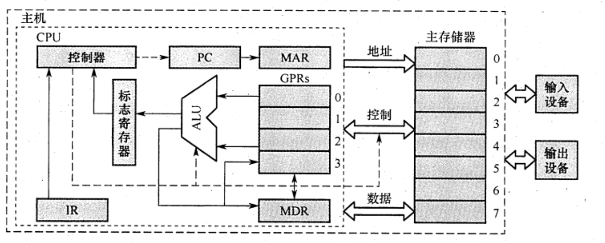
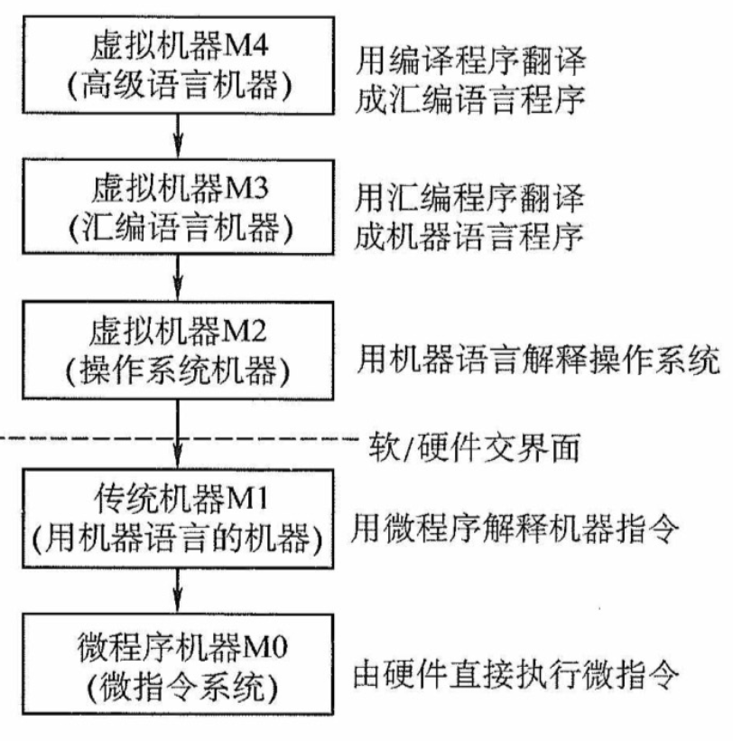
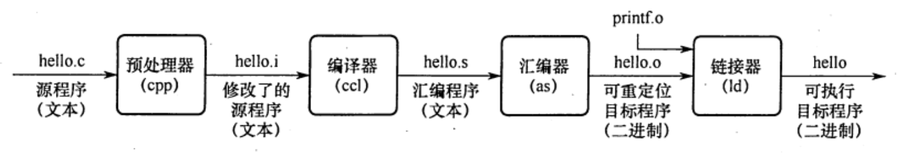

# 计算机系统层次结构
2022.12.16

[TOC]

## 总论

1. 计算机系统=**软件**(硬件上运行的程序和相关数据与文档)**+硬件**(有型的物理设备)

2. 软硬件实现功能逻辑上等效，用硬件解决问题效率高，成本低

3. 完整的计算机系统应包括（）
   A. 运算器、存儲器、挖制器
   B. 外部设备和主机
   C. 主机和应用程序
   D. 配套的硬件设备和软件系统

   【答案】：D。计算机=软件+硬件

## 计算机硬件

### 冯诺伊曼机基本思想

* 四个基本特征
  1. **“存储程序”工作方式**：将事先编好的程序与程序送入主存后执行，程序一旦开始就无需人工干预，计算机自动执行指令。
  2. 运算器、存储器、控制器、输入设备、输出设备
  3. **指令和数据同等地位**存储在存储器中
  4. 指令和数据用二进制代码表示

> 早期的冯诺依曼机是以**运算器**为中心的，现在是以**存储器**为中心！

* 图为冯·诺依曼结构的模型机。CPU包含**ALU**、通用寄存器组**GPRs**、**标志寄存器**、**控制器**、**指令寄存器IR**、程序计数器**PC**、存储器地址寄存器**MAR**和存储器数据寄存器**MDR**。图中从控制器送出的虚线就是控制信号，可以控制如何修改PC以得到下一条指令的地址，可以控制ALU执行什么运算，可以控制主存是进行读操作还是写操作（读/写控制信号）。

* 

* 冯·诺伊曼机的基本工作方式是（）
  A. 控制流驱动方式
  B. 多指令多数据流方式
  C. 堆栈操作
  D. 存储器按内容选择地址

  【答案】：A

* 【2009 统考真题】冯•诺依曼计算机中指令和数据均以二进制形式存放在存储器中，CPU 区分它们的依据是( )。
  A. 指令操作码的译码结果
  B. 指令和数据的寻址方式
  C. 指令周期的不同阶段
  D. 指令和数据所在的存储单元

  【答案】：C

* 【2019统考真题】下列关于冯 • 诺依曼计算机基本思想的叙述中，错误的（）
  A. 程序的功能都通过中央处理器执行指今实现
  B. 指令和数据都用二进制数表示，形式上无差别
  C. 指令按地址访问，数据都在指令中直接给出
  D. 程序执行前，指令和数据需预先存放在存储器中
  【答案】：C

### 计算机功能部件

1. <u>输入设备</u>

2. <u>输出设备</u>

3. <u>存储器</u>

   1. 存储器种类：主存(CPU直接访问)，辅存(属于IO设备)

   2. 主存组成

      1. 存储体M

         **存储体**包含**存储单元**，存储单元包含**存储元件**，每个存储元件存储一个0或1，存储单元存储一串二进制代码，叫做**存储字**，存储字的长度叫**存储字长**。存储字长可以是n字节。

      2. 地址寄存器MAR

         **MAR**二进制位数反映了**存储单元数量**

      3. 数据寄存器MDR

         **MDR**二进制位数反映了**存储字长**

      4. 时序逻辑

   3. 存取方式:按地址存取

   4. MAR与MDR之前在主存中，现在通常在CPU内

4. <u>运算器</u>

   1. 算术运算、逻辑运算
   2. 组成：算术逻辑单元ALU，各种寄存器（**ACC累加器、MQ乘商寄存器、操作数寄存器X是必须的**。其他的有，变址寄存器IX，基址寄存器BR，程序状态寄存器/标志寄存器PSW）

5. <u>控制器</u>

   1. **程序计数器PC**
   2. **指令寄存器IR**
   3. **控制单元CU**

> ✨数据通路：
>
> https://bj.wendu.com/zixun/zhuanyeke/25328.html
>
> 通常将指令执行过程中数据所经过的路径，包括路径上的部件称为数据通路。ALU、通用寄存器、状态寄存器、cache、MMU、浮点运算逻辑、异常和中断处理逻辑等都是指令执行过程中数据流经的部件，都属于数据通路的一部分。通常把数据通路中专门进行数据运算的部件称为执行部件或功能部件。数据通路由控制部件进行控制。控制部件根据每条指令功能的不同生成对数据通路的控制信号，并正确控制指令的执行流程。
>
> **控制器不属于数据通路**
>
> 时序逻辑属于数据通路

| 存储器 | 运算器 | 控制器 |
| :----: | :----: | :----: |
|   M    |  ALU   |   PC   |
|  MAR   |  ACC   |   IR   |
|  MDR   |   MQ   |   CU   |
|        |   X    |        |
|        |   IX   |        |
|        |   BR   |        |
|        |  PSW   |        |

1. CPU不包括()。

   A.地址寄存器

   B.指令寄存器(IR)

   C.地址译码器

   D.通用寄存器

   【答案】：C

2. 关于相联存储器，下列说法中正确的是（C)。

   A.只可以按地址寻址

   B.只可以按内容寻址

   C.既可按地址寻址又可按内容寻址

   D.以上说法均不完善

## 计算机软件

1. 系统软件：操作系统OS、数据库<u>管理</u>系统DBMS、语言处理程序、分布式软件系统、网络软件系统、标准库程序、服务性程序等。
2. 应用软件：为解决某个应用领域中的各类问题而编制的程序，如各种科学计算类程序、工业设计类程序、数据统计与处理程序等。

3. 机器语言，汇编语言，高级语言

4. 汇编程序(汇编->机器语言)；解释程序；编译程序

5. 下列()不属于系统软件。

   A.数据库系统

   B.操作系统

   C.编译程序

   D.以上3种都属于系统程序

   【答案】：A，数据库系统是指在计算机系统中引入数据库后的系统，一般由数据库、数据库管理系统、应用系统、数据库管理员构成，其中<u>数据库管理系统是系统程序</u>。

6. 【2016统考真题】将高级语言源程序转换为机器级目标代码文件的程序是（)。

   A.汇编程序

   B.链接程序

   C.编译程序

   D.解释程序

   翻译程序是指把高级语言源程序转换成机器语言程序（目标代码）的软件。翻译程序有两种：一种是编译程序，它将高级语言源程序一次全部翻译成目标程序。另一种是解释程序，它将源程序的一条语句翻译成对应的机器目标代码，并立即执行，翻译一句执行一句，并且不会生成目标程序。汇编程序也是一种翻译程序，它把汇编语言源程序翻译为机器语言程序。->C

## 计算机系统的层次结构

## 计算机系统的工作原理

1. 存储程序工作方式

   1. 程序执行前，指令与数据送入主存
   2. 程序执行过程：取指、译码、计算下条指令地址、取数并执行、结果送回存储器

2. **从源程序到可执行程序**

   

   * 预处理阶段：比如`#include`命令后边的.h内容插入程序文件
   * 编译阶段：生成汇编程序
   * 汇编阶段：汇编程序转换为机器指令
   * 链接阶段：各种.o程序合并，比如hello.o+printf.o->hello

3. **指令执行过程的描述**

   1. 取指令：`(PC)->MAR->M->MDR->IR;(PC)+1->PC`
   2. 分析指令：`OP(IR)->CU`
   3. 执行指令(比如取数操作)：`CU->MAR->M->MDR->ACC`

4. 例题：

   1. 【2016统考真题】将高级语言源程序转换为机器级目标代码**文件**的程序是（）。
      A. 汇編程序
      B. 链接程序
      C. 编译程序
      D. 解释程序

      【答案】：C

   2. 【2015统考真题】计算机硬件能够直接执行的是（）。
      I. 机器语言程序 
      II. 汇编语言程序 
      III. 硬件描述语言程序

      【答案】：I
