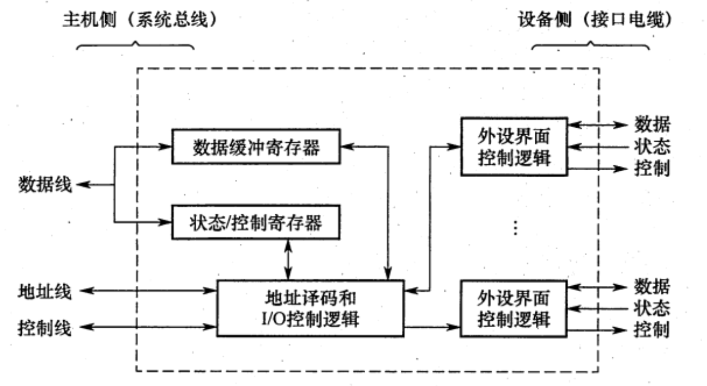

# IO接口
2022.08.22

[TOC]

## IO接口的功能

* 数据缓冲:通过数据缓冲寄存器(DBR)达到主机和外设工作速度的匹配
* 错误或状态监测:通过状态寄存器反馈设备的各种错误、状态信息，供CPU查用
* 控制和定时:接收从控制总线发来的控制信号、时钟信号
* 数据格式转换:串-并、并-串等格式转换
* 与主机和设备通信:实现主机—I/O接口—I/O设备之间的通信

## IO接口的基本结构

I/O 接口是由半导体介质构成的逻辑电路，它作为一个转换器，保证外部设备用计算机系统特性所要求的形式发送或接收信息。为了与 CPU 交互信息的方便，在接口内部一般要设置一些可以被 CPU 直接访问的寄存器。这些寄存器称为**端口(Port)**。

* 接口内用于接收来自 CPU 等主控设备的控制命令的寄存器称为**命令端口**，简称命令口
* 接口内向 CPU 报告 I/O 设备的工作状态的寄存器称为**状态端口**或状态口
* 接口内在外设和总线间交换数据的缓冲寄存器称为**数据端口**或数据口。

为便于 CPU 访问端口，也需对端口安排地址。通常有两种不同的编址方式。

* **统一编址方式**:输入/输出设备接口中的控制寄存器、数据寄存器、状态寄存器等和内存单元一样看待，它们和内存单元联合在一起编排地址。这样就可用访问内存的指令(读、写指令) 去访问 I/O 设备接口内的某个寄存器，因而不需要专门的 I/O 指令组。
* **I/O 独立编址方式**:内存地址和 I/O 设备地址是分开的，访问内存和访问 I/O 设备使用不同的指令，即访问 I/O 设备有专门的 I/O 指令组。

## IO操作的一般过程

由于接口与 CPU 的速度大致相当，仅从 CPU 读写接口内寄存器的角度看，CPU 读写端口的方式与 CPU 读写内存单元是相似的。但是，内存单元的功能是存储数据，而端口的功能则是辅助 CPU 与外设交互，故端口中的数据并不是静态的，而是动态变化的。CPU 写入控制口的信息要由接口内的逻辑电路转换成相关控制信号发送给外设，外设的状态信息则由接口的逻辑电路转换成状态字存入状态口供 CPU 读取。CPU 写入输出数据口的信息要由外设取走。外设发送给 CPU 的数据则通过输入数据口缓冲。外设状态信息可能是时刻变化的，给外设的控制命令也往往会不断改变，CPU 与外设交互数据一般情况下也是成批连续进行的。因此，对端口的连续访问必须确保信息的有效性。

首先我们看看输入/输出设备同 CPU 交换数据的一般过程。 如果是输入过程，一般需要以下三个步骤:
 (1)CPU 把一个地址值放在地址总线上，选择某一输入设备; (2)CPU 等候输入设备的数据成为有效;

(3)CPU 从数据总线读入数据，并放在一个相应的寄存器中。 如果是输出过程，一般需要以下三个步骤:
 (1)CPU 把一个地址值放在地址总线上，选择一个输出设备;
 (2)CPU 把数据放在数据总线上;
 (3)输出设备认为数据有效，从而把数据取走。 从上述输入/输出过程看出，问题的关键就在于:究竟什么时候数据才成为有效? 事实

上，各种外围设备的数据传输速率相差甚大。如果把高速工作的处理器同按照不同速度工 作的外围设备相连接，那么首先遇到的一个问题，就是如何保证处理器与外围设备在时间 上同步? 这就是我们要讨论的外围设备的定时问题。很显然，由于输入/输出设备本身的速 度差异很大，因此，对于不同速度的外围设备，需要有不同的定时方式。

一个计算机系统，即使 CPU 有极高的速度，如果忽略 I/O 速度的提升，对整个系统的 性能仍然影响极大。下面通过一个例子说明 I/O 对系统性能的影响。

## 例题

### 端口的编址

* 在统一编址的方式下，区分存储单元和IO设备是靠（）.
  A. 不同的地址码
  B. 不同的地址线
  C. 不同的控制线
  D. 不同的数据线

  【答案】：A

* 下列关于IO端口和接口的说法中，正确的是（ ）。
  A. 按照不同的数据传送格式，可将接口分为同步传送接口和异步传送接口
  B. 在统一编址方式下，存储单元和I/O设备是靠不同的地址线来区分的
  C. 在独立编址方式下，存储单元和I/O设备是靠不同的地址线来区分的
  D. 在独立编址方式下，CPU 需要设置专门的输入/输出指令访问端口

  【答案】：D。注意B，考地址码！不是地址线！

* I/O 的编址方式采用统一编址方式时，进行输入/输出的操作的指令是（ ）.
  A. 控制指令
  B. 访存指令
  C. 输入/输出指令 
  D. 都不对

  【答案】：B

* 下列叙述中，正确的是()。
  A. 只有I/O指令可以访问I/O 设备
  B. 在统一编址下，不能直接访问I/O设备
  C. 访问存储器的指令一定不能访问I/O设备
  D. 只有在具有专门I/O 指令的计算机中，I/O设备才可以单独编址

  【答案】：D

* 在统一编址情况下，就IO 设备而言，其对应的IO 地址说法错误的是()。
  A. 要求固定在地址高端
  B. 要求固定在地址低端
  C. 要求相对固定在地址的某部分
  D. 可以随意在地址的任何地方

  【答案】：D

### IO接口功能与结构

* 下列功能中，属于I/0接口的功能的是（）。
  I. 数据格式的转换
  II.I/O过程中错误与状态检测
  III. I/O操作的控制与定时
  IV. 与主机和外设通信
  A. I、 IV
  B. I、III、 IV
  C. I、II、IV
  D. I、II、III、IV

  【答案】：D

### IO操作的一般过程

* 磁盘驱动器向盘片磁道记录数据时采用（ ）方式写入．
  A.并行
  B.串行
  C.并行-串行
  D.串行-并行

  **【答案】：B**，磁盘驱动器向盘片磁道记录数据时采用串行方式写入。

* 程序员进行系统调用访问设备使用的是（）
  A.逻辑地址
  B.物理地址
  C.主设备地址
  D.从设备地址

  【答案】：A

* 【2012统考真题】下列选项中，在IO总线的**数据线**上传输的信息包括（ ）。
  I. IO接口中的命令字
  II. IO接口中的状态字
  III. 中断类型号
  A.仅II
  B.仅I、III
  C.仅II、III
  D. I、II、III

  【答案】：D。总线分为三类：数据线、控制线和地址线。**数据缓冲寄存器和命令/状态寄存器的内容都是通过数据线来传送的；地址线用以传送与 CPU 交换数据的端口地址；而控制线用以给 I/O 端口发送读/写信号，只是用来对端口进行读/写控制的**。因此1，2，3均正确。

* 【2014 统考真题】下列有关IO接口的叙述中，错误的是（）.
  A.**状态端口和控制端口可以合用同一个寄存器**（对！）
  B. IO接口中 CPU 可访问的寄存器称为IO 端口
  C.采用独立编址方式时，I/0端口地址和主存地址可能相同
  D.采用统一编址方式时，CPU 不能用访存指令访问IO 端口

  【答案】：D

* **【2017 统考真题】**IO 指令实现的数据传送通常发生在（）
  A. IO设备和IO端口之间
  B. 通用寄存器和IO设备之间
  C. IO端口和IO端口之间
  D.通用寄存器和I0端口之间

  【答案】：D

* 【2021 统考真题】下列选项中，不属于IO接口的是（）。
  A磁盘驱动器
  B.打印机适配器
  C.网络控制器
  D可编程中断控制器

  【答案】：D。磁盘驱动器在磁盘中！！