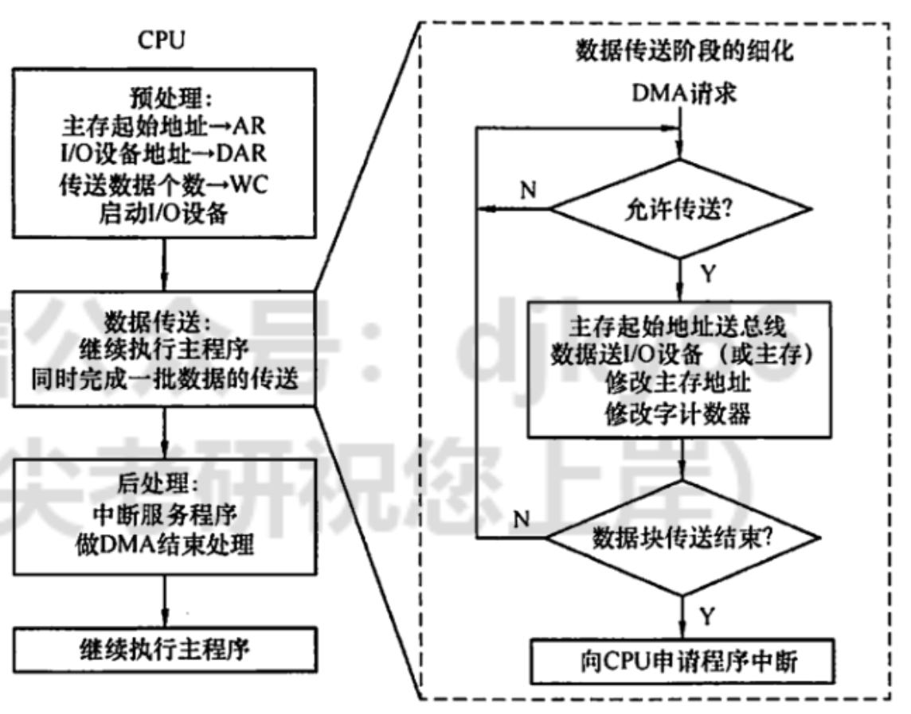

# IO方式
2022.08.23

[TOC]

## 程序查询方式

### 摘要

> （省时间看这个总结+最后一个例题）重点：
>
> 1. CPU一旦启动I/O，必须停止现行程序的运行，并在现行程序中插入一段程序。
> 2. 主要特点:CPU有“踏步”等待现象，CPU与I/O串行工作。
> 3. 优点:接口设计简单、设备量少
> 4. 缺点：CPU在信息传送过程中要花费很多时间用于查询和等待，而且如果采用独占查询， 则在一段时间内只能和一台外设交换信息，效率大大降低
> 5. 独占查询:CPU 100%的时间都在查询I/O状态，完全串行
> 6. 定时查询:在保证数据不丢失的情况下，每隔一段时间CPU就查询一次I/O状态。查询的
>    间隔内CPU可以执行其他程序

程序查询方式又称为程序控制 I/O 方式。在这种方式中，数据在 CPU 和外围设备之间 的传送完全靠计算机程序控制，是在 CPU 主动控制下进行的。当需要输入/输出时，CPU 暂停执行主程序，转去执行设备输入/输出的服务程序，根据服务程序中的 I/O 指令进行数 据传送。这是一种最简单、最经济的输入/输出方式，只需要很少的硬件。

### 输入/输出指令

当用程序实现输入/输出传送时，I/O 指令一般具有如下功能: 

1. 置“1”或置“0”，I/O 接口的某些控制触发器，用于控制设备进行某些动作，如启动、关闭设备等。
2. 测试设备的某些状态，如“忙”“准备就绪”等，以便决定下一步的操作。
3. 传送数据，当输入数据时，将 I/O 接口中数据寄存器的内容送到 CPU 某一寄存器；当输出数据时，将 CPU 中某一寄存器的内容送到 I/O 接口的数据寄存器。

### 程序查询方式的接口

图中用1~6表示了 CPU 从外设输入一个字的过程。

1. **设备选择电路** 接到总线上的每个设备预先都给定了设备地址码。CPU 执行 I/O 指 令时需要把指令中的设备地址送到地址总线上，用以指示 CPU 要选择的设备。每个设备接 口电路都包含一个设备选择电路，用它判别地址总线上呼叫的设备是不是本设备。如果是， 本设备就进入工作状态，否则不予理睬。**<u>设备选择电路实际上是设备地址的译码器</u>**。
2. **数据缓冲寄存器** 当输入操作时，用数据缓冲寄存器来存放从外部设备读出的数据，然后送往 CPU;当输出操作时，用数据缓冲寄存器来存放 CPU 送来的数据，以便送给外部设备输出。
3. **设备状态标志** 是接口中的标志触发器，如“忙”“准备就绪”“错误”等，用来标志设备的工作状态，以便接口对外设动作进行监视。一旦 CPU 用程序询问外部设备时，将状态标志信息取至 CPU 进行分析。

### 程序查询输入/输出方式

**案例**：在程序查询方式的输入/输出系统中，假设不考虑处理时间，每一个查询操作需要**100**个时钟周期CPu的时钟频率为**50MHz**。现有鼠标和硬盘两个设备，而且CPU必须每秒对鼠标进行**30**次查询，硬盘以**32位字长**为单位传输数据，即**每32位被CPU查询一次**(这就是程序查询方式)，传输率$2×2^{20}B/s$。求CPU对这两个设备查询所花费的时间比率，由此可得出什么结论？

* 时间的角度

  一个时钟周期为 1/50MHz =20ns
  一个查询操作耗时 100 x 20ns = 2000ns
  1）鼠标
  每秒查询鼠标耗时 30 × 2000ns =60000ns
  查询鼠标所花费的时间比率 =$60000ns/1s =0.006\%$
  对鼠标的查询基本不影响CPU的性能
  2）硬盘
  每32位需要查询一次，每秒传送$2×2^{20}$B
  每秒需要查询$(2×2^{20}B)/4B=219$次
  查询硬盘耗时$ 2^{19}× 2000ns = 512 × 1024 × 2000ns = 1.05× 109ns$
  查询硬盘所花费的时间比率=$(1.05× 10^9ns)/1s= 105%$
  CPU将全部时间都用于对硬盘的查询也不能满足磁盘传输的要求

* 频率的角度：

  CPU的时钟频率为50MHz，即每秒$50× 10^6$个时钟周期
  1）鼠标
  每秒查询鼠标占用的时钟周期数 30 × 100 =3000
  查询鼠标所花费的时间比率 =(3000/50× 109)=0.006%
  对鼠标的查询基本不影响CPU的性能
  2)硬楹
  每秒需要查询$(2×2^{20}B)/4B=219$次
  每秒查询硬盘占用的时钟周期数 $2^{19}\times 100= 5.24×107$
  查询硬盘所花费的时间比率=$(5.24× 10^7 )/(50× 105)=105\%$
  CPU将全部时间都用于对硬盘的查询也不能满足磁盘传输的要求

### 例题

* 【2011 统考真题】某计算机处理器主频为 50MHz，采用定时查询方式控制设备A的I/O，查询程序运行一次所用的时钟周期数至少为 500。在设备A 工作期问，为保证数据不丢失，每秒需对其查询至少200次，则CPU 用于设备A的I/0的时间占整个CPU时间的百分比至少是（ ）。
  A. 0.02%
  B. 0.05%
  C. 0.20%
  D. 0.50%

  【答案】：$200\times 500/50000000=0.2\%$

## 程序中断方式

### 摘要

### 程序中断的基本概念

1. 中断技术的功能

   ①并性工作：实现 CPU 与IO 设备的并行工作。
   ②处理错误：处理硬件故障和软件错误。
   ③人机交互：实现人机交互，用户干预机器需要用到中断系统。
   ④多道程序：实现多道程序、分时操作，多道程序的切换需借助于中断系统。
   ⑤快速响应：实时处理需要借助中断系统来实现快速响应。
   ⑥软中断：实现应用程序和操作系统(管态程序）的切换，称为“软中断”。
   ⑦处理器间交流：多处理器系统中各处理器之间的信息交流和任务切换。

2. 程序中断方式的思想

   CPU在程序中安排好在某个时机启动某台外设，然后 CPU 继续执行当前的程序，不需要像查询方式那样一直等待外设准备就绪。一旦外设完成数据传送的准备工作，就主动向 CPU 发出中断请求，请求 CPU 为自己服务。在可以响应中断的条件下,CPU暂时中止正在执行的程序，转去执行中断服务程序为外设服务，在中断服务程序中完成一次主机与外设之间的数据传送，传送完成后，CPU 返回原来的程序。

   > 摘要：
   >
   > CPU找外设，外设忙CPU就得一直等着。现在CPU通知外设一声，外设好了来找CPU。

3. 程序中断流程

   1. **中断请求**

      1. **中断源**是请求 CPU 中断的设备或事件，一台计算机允许有多个中断源。每个中断源向 CPU 发出中断请求的时间是随机的。
      2. 为记录中断事件并区分不同的中断源，中断系统需对每个中断源设置中断请求标记触发器，当其状态为 “1”时，表示中断源有请求。这些触发器可组成**中断请求标记寄存器**，该寄存器可集中在CPU 中，也可分散在各个中断源中。
      3. 通过 **INTR** 线发出的是**可屏蔽中断**，通过 **NMI** 线发出的是**不可屏蔽中断**。可屏蔽中断的优先级最低，在关中断模式下不会被响应。不可屏蔽中断用于处理紧急和重要的事件，如时钟中断、电源掉电等，其优先级最高，其次是内部异常，即使在关中断模式下也会被响应。

   2. **中断响应判优**

      1. **中断响应优先级**是指 CPU 响应中断请求的先后顺序。由于许多中断源提出中断请求的时间都是随机的，因此当多个中断源同时提出请求时，需通过中断判优逻辑来确定响应哪个中断源的请求。
      2. 中断响应的判优通常是通过**硬件排队器**实现的。
      3. 一般决说，
         1. 不可屏蔽中断 ＞ 内部异常 ＞可屏蔽中断
         2. 内部异常中，硬件故障 ＞软件中断
         3. DMA 中断请求优先于 I/O 设备传送的中断请求
         4. 在 I/0 传送类中断请求中，高速设备优先于底速设备，输入设备优先于输出设备，实时设备优先于普通设备。
      4. 中断优先级包括**响应优先级**和**处理优先级**，响应优先级在硬件线路上是固定的，不便改动，处理优先级可利用中断屏蔽技术动态调整，以实现多重中断，具体在后文中介绍。

   3. **CPU 响应中断的条件**

      1. CPU 在满足一定的条件下响应中断源发出的中断请求，并经过一些特定的操作，转去执行中断服务程序。CPU 响应中断必须满足以下 3个条件：
         * 中断源有中断请求。
         * CPU 允许中断及开中断（异常和不可屏蔽中断不受此限制）。
         * 一条指令执行完毕（异常不受此限制），且没有更紧迫的任务。
      2. 注意：I/O 设备的就绪时间是随机的，而 CPU 在统一的时刻即每条指令执行阶段结束前向接口发出中断查询信号，以获取 I/O 的中断请求，也就是说，CPU 响应中断的时间是在每条指令执行阶段的结束时刻。这里说的中断仅指I/O中断，内部异常不属于此类情况。

   4. **中断响应过程**

      CPU 响应中断后，经过某些操作，转去执行中断服务程序。这些操作是由硬件直接实现的，我们将它称为中断隐指令。中断隐指令并不是指令系统中的一条真正的指令，只是一种虚拟的说法，本质上是硬件的一系列自动操作。它所完成的操作如下：

      1. **关中断**。CPU 响应中断后，首先要保护程序的断点和现场信息，<u>在保护断点和现场的过程中，CPU 不能响应更高级中断源的中断请求</u>。否则，若断点或现场保存不完整，在中断服务程序结束后，就不能正确地恢复并继续执行现行程序。

      2. **保存断点**。为保证在中断服务程序执行完后能正确地返回到原来的程序，必须将原程序的断点(指令无法直接读取的PC 和PSW 的内容）保存在栈或特定奇存器中。

         **注意异常和中断的差异**：<u>异常指令通常并没有执行成功，异常处理后要重新执行，所以其断点是当前指令的地址。中断的断点则是下一条指令的地址</u>。

      3. **引出中断服务程序**。识别中断源，将对应的服务程序入口地址送入程序计数器 PC。有两种方法识别中断源：**硬件向量法**和**软件查询法**。本节主要讨论比较常用的向量中断。

   5. **中断向量**

      1. 中断识别分为**向量中断**和**非向量中断**两种。非向量中断即软件查询法，第5章已介绍。
      2. 每个中断都有一个唯一的**(中断)类型号**，每个中断类型号都对应一个**中断服务程序**，每个中断服务程序都有一个<u>入口地址，CPU 必须找到入口地址，即**中断向量**</u>。把系统中的全部中断向量集中存放到存储器的某个区域内，这个存放中断向量的存储区就称为**中断向量表**。
      3. CPU 响应中断后，通过识别中断源获得中断类型号，然后据此计算出对应中断向量的地址：再根据该地址从中断向量表中取出中断服务程序的入口地址，并送入程序计数器 PC，以转而执行中断服务程序，这种方法被称为中断向量法，采用中断向量法的中断被称为向量中断。
   
   6. **中断处理过程**
      不同计算机的中断处理过程各具特色，就其多数而论，中断处理流程如图所示。
      中断处理流程如下：
   
      1. 关中断。
   
      2. 保存断点。
   
      3. 中断服务程序寻址。
   
      4. 保存现场和屏蔽字。进入中断服务程序后首先要保存现场和中断屏蔽字，现场信息是指用户可见的工作寄存器的内容，它存放着程序执行到断点处的现行值。
   
         注意：**现场和断点**，这<u>两类信息都不能被中断服务程序破坏</u>。<u>现场信息</u>因为用指令可直接访问，所以通常在中断服务程序中通过指令把它们保存到栈中，即由<u>软件实现</u>；而<u>断点信息</u>由 CPU 在中断响应时自动保存到栈或指定的寄存器中，即由<u>硬件实现</u>。
   
      5. 开中断。允许更高级中断请求得到响应，实现中断嵌套。
   
      6. 执行中断服务程序。这是中断请求的目的。
   
      7. 关中断。保证在恢复现场和屏蔽字时不被中断。
   
      8. 恢复现场和屏蔽字。将现场和屏蔽字恢复到原来的状态。
   
      9. 开中断、中断返回。 中断服务程序的最后一条指令通常是一条中断返回指令，使其返回到原程序的断点处，以便继续执行原程序。
   
      其中，①～③由中断隐指令（硬件自动）完成；④～⑨由中断服务程序完成。
   
      
   
   7. **多重中断和中断屏蔽技术**
   
      若 CPU 在执行中断服务程序的过程中，又出现了新的更高优先级的中断请求，而 CPU 对新的中断请求不予响应，则这种中断称为单重中断。若 CPU 暂停现行的中断服务程序，转去处理新的中断请求，则这种中断称为多重中断，又称中断联套。
   
      CPU 要具备多重中断的功能，必须满足下列条件：
   
      1. 在中断服务程序中提前设置开中断指令。
      2. 优先级别高的中断源有权中断优先级别低的中断源。
   
      中断处理优先级是指多重中断的实际优先级处理次序，可以利用中断屏蔽技术动态调整，从而可以灵活地调整中断服务程序的优先级，使中断处理更加灵活。如果不使用中断屏蔽技术，则处理优先级和响应优先级相同。现代计算机一般使用中断屏蔽技术，每个中断源都有一个屏蔽触发器，1表示屏蔽该中断源的请求，0表示可以正常申请，所有屏蔽触发器组合在一起便构成一个屏蔽字寄存器，屏蔽字寄存器的内容称为屏蔽字。
   
      关于中断屏蔽字的设置及多重中断程序执行的轨迹，下面通过实例说明。
   
   8. 例子
   
      设某机有4个中断源A、B、C、D，其硬件排队优先次序为 A＞B＞C＞D，现要求将中断处理次序改为D>A>C>B。
      1）写出每个中断源对应的屏蔽字。
      2）按图所示的时间轴给出的4 个中断源的请求时刻，画出 CPU 执行程序的轨迹。设每个中断源的中断服务程序时间均为 20us。
   
      
   
      | 中断源 | 屏蔽字A | 屏蔽字B | 屏蔽字C | 屏蔽字D |
      | :----: | :-----: | :-----: | :-----: | :-----: |
      |   A    |    1    |    1    |    1    |    0    |
      |   B    |    0    |    1    |    0    |    0    |
      |   C    |    0    |    1    |    1    |    0    |
      |   D    |    1    |    1    |    1    |    1    |
   
      

### 例题

* 设置中断**排队**判优逻辑的目的是（）
  A. 产生中断源编码
  B. 使同时提出的请求中的优先级别最高者得到及时响应
  C. 使CPU 能方便地转入中断服务子程序
  D. 提高中断响应速度

  【答案】：B

* 中断判优逻辑和总线仲裁方式相类似，下列说法中正确的是（）。
  I. 在总线仲裁方式中，独立请求方式响应时间最快，是以增加控制线数为代价的
  II.在总线仲裁方式中，计数器定时查询方式有一根总线请求（BR）和一根设各地址线，若每次计数都从0开始，则设备号小的优先级高
  III. 总线仲裁方式一般是指 I0 设备爭用总线的判优方式，而中断判优方式一般是指IO设备争用CPU 的判优方式
  IV. 中断判优逻辑既可以通过硬件实现，又可以通过软件实现
  A. I、III
  B. I、III、IV
  C. I、II、IV
  D. I、IV

  【答案】：B。II需要log_2 n的地址线

* 以下说法中，错误的是（），
  A. 中断服务程序一般是操作系统模块
  B. 中断向量方法可提高中断源的识别速度
  C. 中断向量地址是中断服务程序的入口地址
  D. 重叠处理中断的现象称为中断嵌套

  【答案】：C。<u>中断向量</u>是中断服务程序的入口地址，<u>中断向量的地址</u>不是。

* 当有中断源发出请求时，CPU 可执行相应的中断服务程序，可以提出中断的有（）。
  I.外部事件
  II. Cache
  III. 虚拟存储器失效
  IV. 浮点数运算下溢
  V. 浮点数运算上溢
  A. I、III、IV
  B. I和V
  C. I、II和V
  D. I.、III & V

  【答案】：D。Cache完全由硬件实现，不会涉及到中断。虚拟存储器失效，缺页，属于内中断。

* 中断响应由高到低的优先次序宜用（ ）。
  A. 访管一>程序性一>机器故障
  B. 访管一>程序性一>重新启动
  C. 外部一>访管一>程序性
  D. 程序性一>IO一>访管

  【答案】：B。防管是硬件中断，优先级高于硬件中断。

* 在具有中断向量表的计算机中，中断向量地址是（ ）。
  A. 子程序入口地址
  B. 中断服务程序的入口地址
  C. 中断服务程序入口地址的地址
  D. 中断程序断点

  【答案】：C

* 中断响应是在（ ）
  A. 一条指令执行开始
  B. 一条指令执行中问
  C. 一条指令执行之末
  D. 一条指令执行的任何时刻

  【答案】：C

* 在下列情况下，可能不发生中断请求的是（）
  A. DMA 操作结束
  B. 一条指令执行完毕
  C. 机器出现故障
  D. 执行“软中断”指令

  【答案】：B。指令执行完毕可能会响应中断请求，但不会产生中断请求

* 在配有通道的计算机系统中，用户程序需要输入/输出时，引起的中断是（）.
  A.访管中断
  B. IO中断
  C．程序性中断
  D.外中断

  【答案】：A

* 某计算机有4级中断，优先级从高到低为 1->2->3->4。若将优先级顺序修改，改后1级中断的屏蔽宇为 1101，2级中断的屏蔽宇为 0100，3 级中断的屏蔽宇为 1111，4级中断的屏藏宇为0101，则修改后的优先顺序从高到低为( ).
  A. 1->2->3->4
  B. 3->1->4->2
  C. 1->3->4->2
  D. 2->1->3->4

  【答案】：B

* 下列不属于程序控制指令的是（）。
  A. 无条件转移指令
  B 有条件转移指令
  C.中断隐指令
  D.循环指令

  【答案】：C。中断隐指令并不是一条由程序员安排的真正的指令，因此不可能把它预先编入程序中，只能在响应中断时由硬件直接控制执行。中断隐指令不在指令系统中，因此不属于程序控制指令。

* 在中断响应周期中，CPU 主要完成的工作是（ ）。
  A. 关中断，保护断点，发中断响应信号并形成向量地址
  B. 开中断，保护断点，发中断响应信号并形成向量地址
  C. 关中断，执行中断服务程序
  D. 开中断，执行中断服务程序

  【答案】：A

* 在中断响应周期中，由（ ）将允许中断触发器置0。
  A. 关中断指令
  B. 中断隐指令
  C. 开中断指令
  D. 中断服务程序

  【答案】：B。允许中断触发器置 0表示关中断，由中断隐指令完成，即由硬件自动完成。

* CPU 响应中断时最先完成的步骤是(）.
  A. 开中断
  B.保存断点
  C.关中断
  D.转入中断服务程序

  【答案】：C

* 设置中断屏蔽标志可以改变（）。
  A.多个中断源的中断请求优先级
  B. CPU对多个中断请求**响应**的优先次序
  C. 多个中断服务程序开始执行的顺序 
  D. 多个中断服务程序**执行**完的次序

  【答案】：D。注意⚠️，响应是硬件决定的。

* 在CPU响应中断时，保护两个关键的硬件状态是(）。
  A. PC和RR
  B. PC和PSW
  C. AR和RR
  D.AR和PSW

  【答案】：B

* 关于外中断（故障除外）和DMA，下列说法中正确的是（）。
  A. DMA 请求和中断请求同时发生时，响应 DMA 请求
  B. DMA 请求、非屏蔽中断、可屏蔽中断都要在当前指令结束之后才能被响应
  C. 非屏蔽中断请求优先級最高，可屏蔽中新请求优先级最低
  D. 若不开中断，所有中断请求就不能响应

  【答案】：A。不是开中断，内中断和非屏蔽中断仍可相应。

* 中断发生时，程序计数器内容的保护和更新是由（）完成的。
  A. 硬件自动
  B.进栈指令和转移指令
  C.访存指令
  D.中断服务程序

  【答案】：**A**

* 【2009 统考真題】下列选项中，能引起外部中断的事件是（)。
  A.键盘输入
  B.除数为0
  C.浮点运算下溢 
  D.访存缺页

  【答案】：A。外部中断是指 CPU 执行指令以外的事件产生的中断，通常指来自 CPU 与内存以外的中断。A 中键密输入属于外部事件，每次键盘输入 CPU 都需要执行中断以读入输入数据，所以能引起外部中断。B 中除数为 0属于异常，也就是内中断，发生在CPU 内部。C中浮点运算下溢将按机器零处理，不会产生中断。而D访存缺页属于 CPU 执行指令时产生的中断，也不属于外部中断。所以能产生外部中断的只能是输入设备键盘

* 【2010 统考真题】单级中断系统中，中断服务程序内的执行顺序是（）。
  I保护现场
  II开中断
  III关中断
  IV保存断点
  V中断事件处理
  VI恢复现场
  VII中断返回
  A. I-V-VI-II-VII
  B. III-I-V-VII
  C. III-IV-V-VI-VII
  D. IV-I-VI-VII

  【答案】：A

* 【2011 统考真题】某计算机有五级中断L4～L0，中断屏蔽字为 M4M3M2M1M0, Mi = 1,(0≤i≤4）表示对Li级中断进行屏蔽。若中断响应优先级从高到低的顺序是L4->L0->L2->L1->L3，则L1的中断处理程序中设置的中断屏蔽字是（）。
  A. 11110
  B. 01101
  C. 00011
  D. 01010

  【答案】：D

* **【2012 统考真题】**响应外部中断的过程中，**中断隐指令**完成的操作，除保护断点外，还包括（ ）
  I. 关中断
  II. 保存通用奇存器的内容
  III. 形成中断服务程序入口地址并送PC
  A. I、II
  B. I、III
  C. II、III
  D. I、II、III

  【答案】：B。没有II！，II是由中断处理程序完成的，不是硬件完成的。

* 【2013 统考真题】下列关于中断IO 方式和DMA 方式比较的叙述中，错误的是(）。
  A. 中断IO方式请求的是CPU处理时间，DMA 方式请求的是总线使用权
  B. 中断响应发生在一条指令执行结束后，DMA 响应发生在一个总线事务完成后
  C. 中断IO 方式下数据传送通过软件完成，DMA 方式下数据传送由硬件完成
  D. 中断IO方式适用于所有外部设备，DMA 方式仅适用于快速外部设备

  【答案】：D。中断IO不适用于快速的外部设备。

* **【2014 统考真题】**若某设备中断请求的响应和处理时间为 100ns，每400ns 发出一次中断请求，中断响应所允许的最长延迟时间为 50ns，则在该设备持续工作过程中，CPU用于该设备的 I/O 时间占整个CPU 时问的百分比至少是().
  A. 12.5%
  B. 25%
  C. 37.5%
  D. 50%

  【答案】：B

* **【2015 统考真题】**在采用中断IO方式控制打印输出的情况下，CPU和打印控制接口中的IO端口之间交换的信息不可能是（ ）。
  A. 打印字符
  B. 主存地址
  C. 设备状态
  D. 控制命令

  【答案】：B

* 【2017 统考真题】下列关于多重中断系统的叙述中，错误的是()。
  A. 在一条指令执行结束时响应中断
  B. 中断处理期间 CPU 处于关中断状态
  C. 中断请求的产生与当前指令的执行无关
  D. CPU 通过采样中断请求信号检測中断请求

  【答案】：B

* 【2018 统考真题】下列关于外部110中断的叙述中，正确的是()。
  A. 中断控制器按所接收中断请求的先后次序进行中断优先级排队
  B. CPU 响应中断时，通过执行中断隐指令完成通用寄存器的保护
  C. CPU只有在处于中断允许状态时，才能响应外部设备的中断请求
  D. 有中断请求时，CPU 立即暂停当前指令执行，转去执行中断服务程序

  【答案】：C

* 【2019 统考真题】某设备以中断方式与CPU 进行数据交换，CPU 主频为 1GHz，设备接口中的数据缓冲寄存器为 32位，设备的数据传输率为 50kB/s。若每次中断开销（包括中断响应和中断处理）为 1000 个时钟周期，则 CPU 用于该设备输入/输出的时问占整个CPU时问的百分比最多是(）。
  A. 1.25%
  B. 2.5%
  C. 5%
  D. 12.5%

  【答案】：$\frac{50k/4\times1000}{1GHz}=\frac{12.5\times 10^6}{10^9}$，A

* 【2020 统考真题】下列事件中，属于外部中断事件的是(）。
  I.访存时缺页
  II.定时器到时
  III.网络数据包到达
  A.仅I、II
  B. 仅I、III
  C.仅 II、III
  D. I、II和III

  【答案】：C

* 【2020统考真题】外部中断包括不可屏蔽中断（NMI）和可屏蔽中断，下列关于外部中断的叙述中，错误的是（）.
  A. CPU 处于关中断状态时，也能响应 NMI 请求
  B.一旦可屏蔽中断请求信号有效，CPU 将立即响应
  C.不可屏蔽中断的优先级比可屏蔽中断的优光级高
  D.可通过中断屏蔽宇改变可屏蔽中断的处理优先级

  【答案】：B

* 【2021 统考真题】下列是关于多重中断系统中CPU 响应中断的叙述，错误的是（）.
  A．仅在用户态(执行用户程序）下，CPU 才能检测和响应中断
  B. CPU 只有在检测到中断请求信号后，才会进入中断响应周期
  C.进入中断响应周期时，CPU一定处于中断允许（开中断）状态
  D.若CPU检测到中断请求信号，則一定存在未被屏蔽的中断源请求信号

  【答案】：A

## DMA方式

### 概述

DMA 方式是一种**完全由硬件**进行成组信息传送的控制方式，它具有程序中断方式的优点，即在数据准备阶段，CPU 与外设并行工作。DMA 方式在外设与内存之间开辟一条 “直接数据通道”，信息传送不再经过CPU，降低了CPU 在传送数据时的开销，因此称为直接存储器存取方式。

由于数据传送不经过 CPU，也就不需要保护、恢复 CPU 现场等烦琐操作。这种方式适用于磁盘、显卡、声卡、网卡等高速设备大批量数据的传送，它的硬件开销比大。在DMA 方式中，中断的作用仅限于故障和正常传送结束时的处理。

### DMA的特点

主存和 DMA 接口之问有一条直接数据通路。由于 DMA 方式传送数据不需要经过 CPU,因此不必中断现行程序，IO与主机并行工作，程序和传送并行工作。
DMA 方式具有下列特点：

1. 它使主存与 CPU 的固定联系脱钩，主存既可被 CPU 访问，又可被外设访问。
2. 在数据块传送时，主存地址的确定、传送数据的计数等都由硬件电路直接实现。
3. 主存中要开辟专用缓冲区，及时供给和接收外设的数据。
4. DMA 传送速度快，CPU 和外设并行工作，提高了系统效率。
5. DMA 在传送开始前要通过程序进行预处理，结束后要通过中断方式进行后处理。

### DMA控制器的组成

在 DMA 方式中，对数据传送过程进行控制的硬件称为 **DMA控制器** （DMA 接口）。当IO设备需要进行数据传送时，通过 DMA 控制器向 CPU 提出 DMA 传送请求，CPU 响应之后将让出系统总线，由 DMA 控制器接管 总线进行数据传送。其主要功能如下

1. 接受外设发出的DMA 请求，并向CPU 发出总线请求。
2. CPU相应此总线请求，发出总线响应信号，接管总线控制权，进入DMA操作周期。
3. 确定传送数据的主存单元地址及长度，并自动修改主存地址计数和传送长度计数。
4. 规定数据在主存和外设间的传送方向，发出读写等控制信号，执行数据传送操作
5. 向CPU 报告 DMA 操作结束，

下图给出了一个简单的 DMA 控制器。

* 主存地址计数器：存放要交换数据的主存地址。
* 传送长度计数器：记录传送数据的长度，计数溢出时，数据即传送完毕，自动发中断请求信号
* 数据缓冲寄存器：暂存每次传送的数据。
* DMA 请求触发器：每当IO 设备准备好数据后，给出一个控制信号，使 DMA 请求触发器置位。
* “控制/状态” 逻辑：由控制和时序电路及状态标志组成，用于指定传送方向，修改传送参数，并对DMA 请求信号、CPU 响应信号进行协调和同步
* 中断机构：<u>当一个数据块传送完后</u>触发中断机构，向CPU 提出中断请求。

在DMA传送过程中，DMA 控控制器将接管CPU 的地地址总线、数据总线和控制总线，CPU的主存控制信号被禁止使用。而当 DMA 传送结束后，将恢复 CPU 的一切权利并开始执行其操作。由此可见，DMA 控制器必须具有控制系统总线的能力。

### DMA的传送方式

主存和 I0 设备之间交换信息时，不通过 CPU。但当 I/O 设备和 CPU 同时访问主存时，可能发生冲突，为了有效地使用主存，DMA 控制器与 CPU 通常采用以下3种方式**使用主存**：

1. **停止CPU 访存**。当IO 设备有DMA 请求时，由 DMA 控制器向 CPU 发送一个停止信号，使 CPU 脱离总线，停止访问主存，直到 DMA 传送一块数据结束。数据传送结束后，DMA 控制器通知CPU 可以使用主存，并把总线控制权交还给 CPU
2. **周期挪用（或周期窃取）**。当 IO 设备有DMA 请求时，会遇到 3种情況：
   1. 此时CPU 不在访存（如CPU 正在执行乘法指令），因此 IO 的访存请求与 CPU 未发生冲突;
   2. CPU 正在访存，此时必须待存取周期结束后，CPU 再将总线占有权让出;
   3. <u>IO 和CPU 同时请求访存，出现访存冲突</u>，此时 CPU 要暂时放弃总线占有权。<u>IO访存优先级高于CPU 访存</u>，因为IO不立即访存就可能丢失数据，此时由 I/0 设备挪用会一个或几个存取周期，传送完一个数据后立即释放总线，是一种单字传送方式。
3. **DMA 与CPU 交替访存**。这种方式适用于 CPU 的工作周期比主存存取周期长的情况。例如，若 CPU 的工作周期是 1.2uS，主存的存取周期小于 0.6uS，则可将一个CPU 周期分别为C1和 C2两个周期，其中C1专供DMA 访存，C2专供 CPU 访存。这种方式不需要总线使用权的申请、建立和归还过程，总线使用权是通过C1和C2分时控制的。

### DMA的传送过程

DMA 的数据传送过程分为**预处理**、**数据传送**和**后处理**3个阶段：

1. **预处理**。由 CPU 完成一些必要的准备工作。首先，CPU 执行几条 I/O 指令，用以测试IO 设备状态，向 DMA 控制器的有关寄存器置初值、设置传送方向、启动该设备等。然后，CPU 继续执行原来的程序，直到 IO 设备准备好发送的数据（输入情况） 或接收的数据（输出情况）时，IO 设备向 DMA 控制器发送 DMA 请求，再由 DMA 控制器向CPU 发送总线请求 （有时将这两个过程统称为 DMA 请求)，用以传输数据
2. **数据传送**。DMA 的数据传输可以以**单字节（或字）**为基本单位，也可以以**数据块**为基本单位。对于以数据块为单位的传送（如硬盘），DMA 占用总线后的数据输入和输出操作都是通过循环来实现的。需要指出的是，这一循环也是由 DMA 控制器（而非通过CPU 执行程序）实现的，即数据传送阶段完全由 DMA（硬件）控制。
3. **后处理**。DMA 控制器向 CPU 发送中断请求，CPU 执行中断服务程序做 DMA 结束处理，包括校验送入主存的数据是否正确、测试传送过程中是否出错（错误则转诊断程序）及决定是否继续使用 DMA 传送其他数据等。DMA 的传送流程如图所示

### DMA方式和中断方式的区别
DMA 方式和中断方式的重要区别如下：
①中断方式是程序的切换，需要保护和恢复现场：而DMA 方式除了预处理和后处理，其他时候不占用 CPU 的任何资源。
② 对中断请求的响应只能发生在每条指令执行完牛时（即指令的执行周期后)；而对 DMA请求的响应可以发生在每个机器周期结束时（在取指周期、间址周期、执行周期后均可)，只要 CPU 不占用总线就可被响应。
③ 中断传送过程需要 CPU 的干预；而DMA 传送过程不需要 CPU 的干预，因此数据传输率非常高，适合于高速外设的成组数据传送。
④ DMA 请求的优先级高于中断请求。
⑤ 中断方式具有对异常事件的处理能力，而DMA 方式仅局限于传送数据块的I/O 操作。
⑥ 从数据传送来看，中断方式靠程序传送，DMA 方式靠硬件传送。

### 例题

* 关于程序中断方式和 DMA 方式的叙述，错误的是（）。

  I. DMA的优先级比程序中断的优先级要高
  II. 程序中断方式需要保护现场，DMA 方式不需要保护现场
  III. 程序中断方式的中断请求是为了报告 CPU 数据的传输结束，而DMA 方式的中断请求完全是为了传送数据
  A. 仅I
  B. II、III
  C仅III
  D. I、III

  【答案】：C(说反了)

* 下列说法中，错误的是（）
  I. 程序中断过程是由硬件和中断服务程序共同完成的
  II. 在每条指令的执行过程中，每个总线周期要检查一次有无中断请求
  III. 检测有无 DMA 请求，一般安排在一条指令执行过程的末尾
  IV.中断服务程序的最后指令是无条件转移指令
  A. III、IV
  B. II、 III、IV
  C. II、IV
  D. I. II, III, IV

  【答案】：B。程序中断过程是由硬件执行的中断隐指令和中桥服务程序共同完成的，因此工正确。**每条指令周期结束后**，CPU 会统一扫描各个中断源，然后进行判优来决定响应哪个中断源，而不是在**每条指令的执行过程**中这样做，因此 II错误。CPU 会在每个存储周期结束后检查是否有 DMA请求，而不是在指令执行过程的末尾这样做，因此 III 错误。中断服务程序的最后指令通常是中断返回指令，与无条件转移指令不同的是，它不仪要修改 PC 值，而且要将 CPU 中的所有寄存器都恢复到中断前的状态，因此IV错误．

* 能产生DMA 请求的总线部件是（ ）
  I. 高速外设
  II. 需要与主机批量交换数据的外设
  III. 具有DMA 接口的设备

  A. I
  B. III
  C. I、III
  D. II、III

  【答案】：B。必须要有DMA接口！

* 在各种I0方式中，中断方式的特点是（），DMA 方式的特点是（），
  A. CPU 与外设串行工作，传送与主程序串行工作
  B. CPU与外设并行工作，传送与主程序串行工作
  C. CPU 与外设串行工作，传送与主程序并行工作
  D. CPU 与外设并行工作，传送与主程序并行工作

  【答案】：B、D

* 在DMA 传送方式中，由（ ）发出DMA 请求，在传送期间总线控制权由（ ）掌握。
  A. 外部设备、CPU
  B. DMA 控制器、DMA 控制器
  C. 外部设备、DMA 控制器
  D. DMA控制器、内存

  【答案】：C

* 下列叙述中，（ ）是正确的。
  A. 程序中断方式和DMA 方式中实现数据传送都需要中断请求
  B. 程序中断方式中有中断请求，DMA 方式中没有中断请求
  C. 程序中断方式和DMA 方式中都有中断请求，但目的不同
  D. DMA 要等指令周期结束时才可以进行周期窃取

  【答案】：C

* 以下关于 DMA方式进行I/O的描述中，正确的是（ ）。
  A. 一个完整的DMA 过程，部分由DMA 控制器控制，部分由CPU 控制
  B. 一个完整的DMA 过程，完全由CPU 控制
  C. 一个完整的DMA 过程，完全由DMA 控制器控制，CPU 不介入任何控制
  D. 一个完整的DMA 过程，完全由 CPU 采用周期揶用法控制

  【答案】：D

* CPU 响应 DMA 请求的条件是当前（ ）执行完。
  A. 机器周期
  B. 总线周期
  C. 机器周期和总线周期
  D. 指令周期

  【答案】：A。每个机器周期结束后，CPU 就可以响应 DMA 请求。注意区别：DMA 在与主存交互数据时
  通过周期窃取方式，窃取的是存取周期。

* 以下有关DMA 方式的叙述中，错误的是（)。
  A在DMA方式下，DMA控制器向CPU 请求的是总线使用权
  B. DMA 方式可用于键盘和鼠标的数据输入
  C.在数据传输阶段，不需要 CPU 介入，完全由 DMA 控制器控制
  D. DMA 方式要用到中断处理

  【答案】：B

* 在主机和外设的信息传送中，（ ）不是一种程序控制方式。
  A. 直接程序传送
  B. 程序中断
  C.直接存储器存取(DMA）
  D.通道控制

  【答案】：C

* 在DMA 方式传送数据的过程中，由于没有破坏（）的内容，所以 CPU 可以正常工作（访存除外）.
  A.程序计数器
  B.程序计数器和寄存器
  C.指令奇存器
  D.堆栈奇存器

  【答案】：B

* 在DMA 方式下，数据从内存传送到外设经过的路径是(）。
  A. 内存一数据总线一数据通路一外设 B.内存一数据总线一DMA一外设
  C.内存一数据通路一数据总线一外设 D.内存一CPU一外设

  【答案】：B

* 【2019 统考真题】下列关于 DMA 方式的叙述中，正确的是（）。
  I. DMA 传送前由设备驱动程序设置传送参数
  II. 数据传送前由 DMA 控制器请求总线使用权
  III. 数据传送由 DMA 控制器直接控制总线完成
  IV. DMA 传送结束后的处理由中断服务程序完成
  A.1,2
  B.1,3,4
  C.2,3,4
  D.1,2,3,4

  【答案】：D

* **【2020 统考真题】**若设备采用周期揶用 DMA 方式进行输入和输出，每次DMA 传送的数据块大小为 512 字节，相应的 IO 接口中有一个32位数据缓冲寄存器。对于数据输入过程，下列叙述中，错误的是(）。
  A. 每准备好 32位数据，DMA 拉制器就发出一次总线请求
  B. 相对于CPU，DMA 拉制器的总线使用权的优先级更高
  C. 在整个数据块的传送过程中，CPU 不可以访问主存储器
  D. 数据块传送结束时，会产生"DMA 传送结束” 中断请求

  【答案】：C