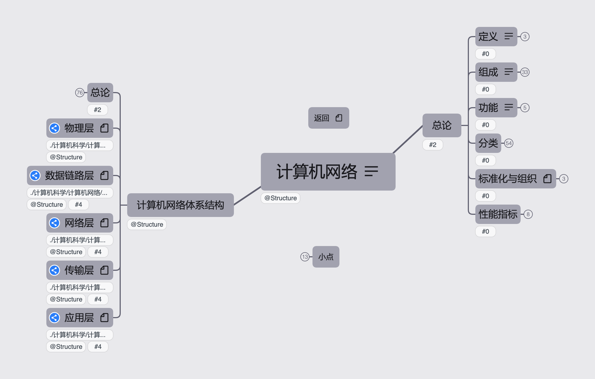

# PKM - 计算机网络 

## 介绍
计算机网络按照408考研辅导进行梳理。
## 资源
链接: https://pan.baidu.com/s/1M34LB98BsKdHGby2eMC_Qw  
提取码: 1cv1  
如果资源失效请联系我

__2022王道计算机网络.pdf__ :2022年408考研辅导教材  
__2022王道计算机网络配套视频__ : 配套视频  
__1191044A_scan.pdf__ :CSAM协议总结  

## 版本
### V1 2021.8.31
按照《2022年计算机网络考研复习指导》与相关课程进行整理，完成全部知识框架搭建  
### V2
按照《2022年计算机网络考研复习指导》与相关课程进行整理，进行习题归纳与知识整合  