# TCP
2022.03.15

[TOC]

## TCP协议的特点

* TCP 是在不可靠的 IP 层之上实现的可靠的数据传输协议，它主要解决传输的可靠、有序、无丢失和不重复问题。TCP 是TCP/IP体系中非常复杂的一个协议，主要特点如下：

  1. **面向连接**：TCP 是面向连接的传输层协议，TCP 连接是一条逻辑连接。

  2. **端到端，不支持组播**：每条TCP 连接只能有两个端点，每条TCP 连接只能是端到端的（进程对进程）。

  3. **可靠有序、不丢不重**：TCP 提供可靠交付的服务，保证传送的数据无差错、不丢失、不重复且有序。

  4. **全双工$\to$接收、发送缓存**：TCP 提供全双工通信，允许通信双方的应用进程在任何时候都能发送数据，为此 TCP连接的两端都设有发送缓存和接收缓存，用来临时存放双向通信的数据。

     发送缓存用来暂时存放以下数据：①【准备发的】发送应用程序传送给发送方TCP准备发送的数据；②【发了没确认的】TCP 已发送但尚未收到确认的数据。

     接收缓存用来暂时存放以下数据：①【收了没接受的】按序到达但尚未被接收应用程序读取的数据：②【收了没按序的】不按序到达的数据。

  5. **面向字节流**：TCP 是面向字节流的，虽然应用程序和 TCP 的交互是一次一个数据块（大小不等），但TCP把应用程序交下来的数据仅视为一连串的无结构的字节流。

* TCP 和 UDP在发送报文时所采用的方式完全不同。UDP报文的长度由发送应用进程决定而TCP报文的长度则根据接收方给出的窗口值和当前网络拥塞程度来决定。如果应用进程传送到TCP 缓存的数据块太长，TCP 就把它划分得短一些再传送：如果太短，TCP 也可以等到积累足够多的字节后再构成报文段发送出去。关于TCP 报文的长度问题，后面会详细讨论。

## TCP报文段

### TCP报文段

TCP传送的数据单元称为报文段。TCP报文段既可以用来运载数据，又可以用来建立连接、释放连接和应答。一个TCP报文段分为首部和数据两部分，整个TCP报文段作为P数据报的数据部分封装在IP数据报中，如图5.6所示。其首部的前20B是固定的。**TCP首部最短为20B,后面有4N字节是根据需要而增加的选项，长度为4B的整数倍**。

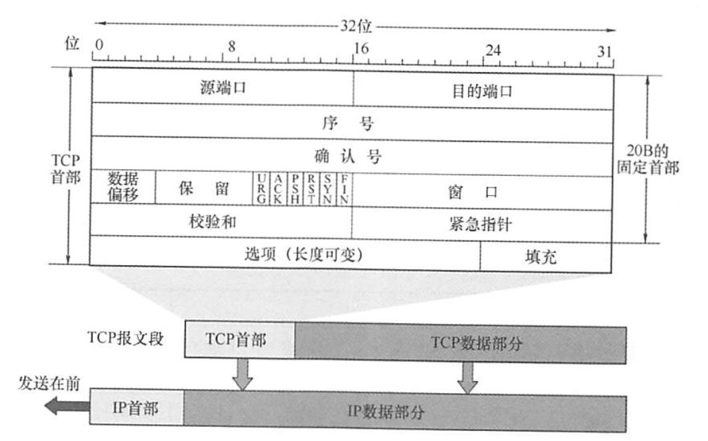

* **源端口和目的端口**。各占2B。端口是运输层与应用层的服务接口，运输层的复用和分用功能都要通过端口实现。

* **序号**。占4B,范围为0~$2^{32}$-1，共$2^{32}$个序号。TCP是面向字节流的（即TCP传送时是逐个字节传送的)，所以TCP连接传送的字节流中的**每个字节都按顺序编号**。**序号字段的值指的是本报文段所发送的数据的第一个字节的序号**。

  例如，一报文段的序号字段值是301，而携带的数据共有100B,表明本报文段的数据的最后一个字节的序号是400，因此下一个报文段的数据序号应从401开始。

* **确认号**。占4B,是**期望**收到对方下一个报文段的第一个数据字节的序号。若确认号为N,则表明到序号N-1为止的所有数据都已正确收到。

  例如，B正确收到了A发送过来的一个报文段，其序号字段是501，而数据长度是200B(序号501~700)，这表明B正确收到了A发送的到序号700为止的数据。因此B期望收到A的下一个数据序号是701，于是B在发送给A的确认报文段中把确认号置为701。

* **数据偏移(即首部长度)**。占4位，这里不是IP数据报分片的那个数据偏移，而是表示首部长度（首部中还有长度不确定的选项字段），它指出TCP报文段的数据起始处距离TCP报文段的起始处有多远。“数据偏移”的单位是32位（**以4B为计算单位**)。由于4位二进制数能表示的最大值为15，因此**TCP首部的最大长度为60B**。

* **保留**。占6位，保留为今后使用，但**目前应置为0**。

* **紧急位URG**。当URG=1时，表明紧急指针字段有效。它告诉系统此报文段中有紧急数据，应尽快传送（相当于高优先级的数据）。但URG需要和首部中紧急指针字段配合使用，即数据从第一个字节到紧急指针所指字节就是紧急数据。

* **紧急指针**。占2B。紧急指针仅在URG=1时才有意义，它指出在本报文段中<u>紧急数据共有多少字节</u>（紧急数据在报文段数据的最前面）。

* **确认位ACK**。仅当ACK=1时确认号字段才有效。当ACK=0时，确认号无效。TCP规定，<u>在连接建立后所有传送的报文段都必须把ACK置1</u>。

* **推送位PSH**(Push)。接收方TCP收到PSH=1的报文段，就<u>尽快地交付给接收应用进程</u>，而不再等到整个缓存都填满了后再向上交付。

* **复位位RST**(Rest)。当RST=1时，表明TCP连接中出现<u>严重差错</u>（如主机崩溃或其他原因)，<u>必须释放连接，然后再重新建立运输连接</u>。

* **同步位SYN**。当SYN=1时表示这是一个**连接请求或连接接受报文**。

  当**SYN=1,ACK=0**时，表明这是一个**连接请求报文**，对方若**同意建立连接**，则应在响应报文中使用**SYN=1,ACK=1**。

* **终止位FIN**(Finish)。用来释放一个连接。当FIN=1时，表明此报文段的发送方的数据已发送完毕，并要求释放运输连接。

* **窗口**。占2B,范围为0~$2^{16}$-1。它指出现在<u>允许对方发送的数据量</u>(反应是自己的接收窗口)，接收方的数据缓存空间是有限的，因此用窗口值作为接收方让发送方设置其发送窗口的依据。

  例如，设确认号是701，窗口字段是1000。这表明，从701号算起，发送此报文段的一方还有接收1000字节数据（字节序号为701~1700）的接收缓存空间。

* **校验和**。占2B。校验和字段检验的范围**包括首部和数据两部分**。在计算校验和时，和UDP一样，要在TCP报文段的前面加上12B的**伪首部**（<u>只需将UDP伪首部的第4个字段，即协议字段的17改成6，其他的和UDP一样</u>)。

* **选项**。长度可变。TCP最初只规定了一种选项，即最大报文段长度(Maximum Segment Size, MSS)。MSS是TCP报文段中的数据字段的最大长度（注意仅仅是数据字段）。

* **填充**。这是为了使整个**首部长度是4B的整数倍**。

### 例题

* 假定TCP报文段载荷是1500B,最大分组存活时间是120s,那么要使得TCP报文段的序列号不会循环回来而重叠，线路允许的最快速度是多大？（不考虑帧长限制。）

  【答案】目标在120s内最多发送2^32B(序列号为32位)，即35791394B/s的载荷。TCP报文段载荷是1500B,因此可以发送23861个报文段。TCP开销是20B,IP开销是20B,以太网开销是26B(18B的首部和尾部，7B的前同步码，1B的帧开始定界符)。这就意味着对于1500B的载荷，必须发送1566B。1566×8×23861=299Mb/s,因此允许的最快线路速率是299Mb/s。比这一速度更快时，就会冒在同一时间内不同的TCP报文段具有相同序号的风险。

## TCP连接管理

### 简介

TCP 是面向连接的协议，因此每个TCP 连接都有三个阶段：**连接建立、数据传送和连接释放**。TCP 连接的管理就是使运输连接的建立和释放都能正常进行。在TCP 连接建立的过程中，要解决以下三个问题：
1）要使每一方能够确知对方的存在
2）要允许双方协商一些参数（如最大窗口值、是否使用窗口扩大选项、时间戳选项及服务质量等）。
3）能够对运输实体资源（如缓存大小、连接表中的项目等）进行分配。
TCP 把连接作为最基本的抽象，每条TCP 连接有两个端点，TCP 连接的端点不是主机，不是主机的 IP 地址，不是应用进程，也不是传输层的协议端口。TCP 连接的端口即为套接宇(Socket)或插口，每条 TCP 连接唯一地被通信的两个端点（即两个套接字）确定TCP 连接的建立采用客户/服务器模式。主动发起连接建立的应用进程称为客户 (Client)，而被动等待连接建立的应用进程称为服务器(Server)。

### 连接建立（三次握手）

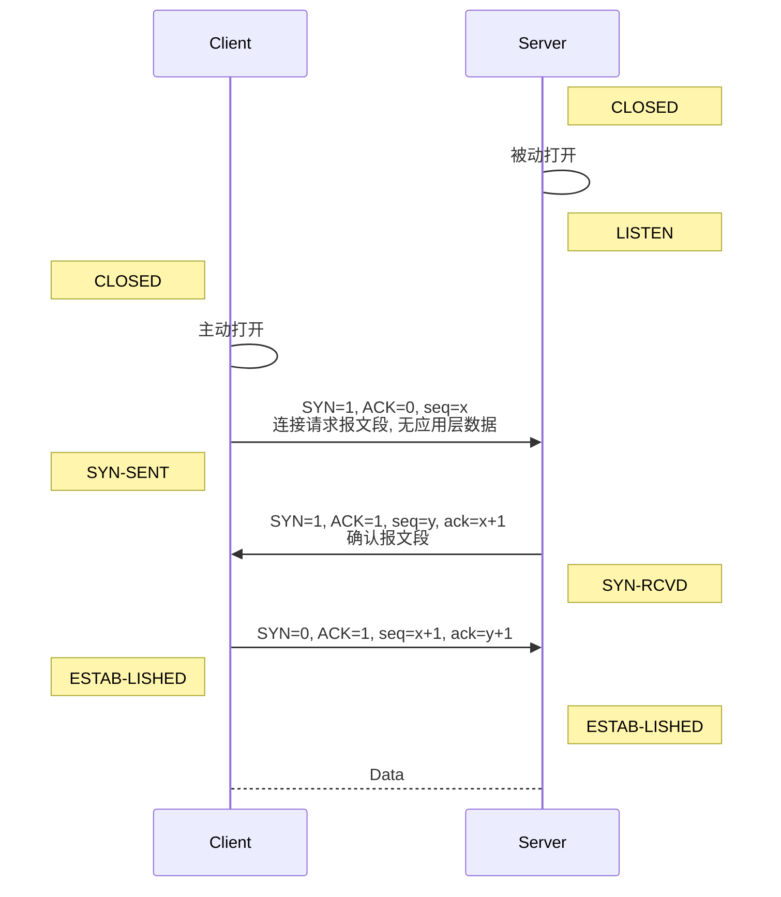

**SVN洪泛攻击**

SVN洪泛攻击发生在OSI第四层，这种方式利用TCP协议的特性，就是三次握手。攻击者发送TCP SYN,SYN是TCP三次握手中的第一个数据包，而当服务器返回ACK后，该攻击者就不对其进行再确认，那这个TCP连接就处于挂起状态，也就是所谓的半连接状态，服务器收不到再确认的话，还会重复发送ACK给攻击者。这样更加会浪费服务器的资源。攻击者就对服务器发送非常大量的这种TCP连接，由于每一个都没法完成三次握手，所以在服务器上，这些TCP连接会因为挂起状态而消耗CPU和内存，最后服务器可能死机，就无法为正常用户提供服务了

### 连接释放（四次握手）

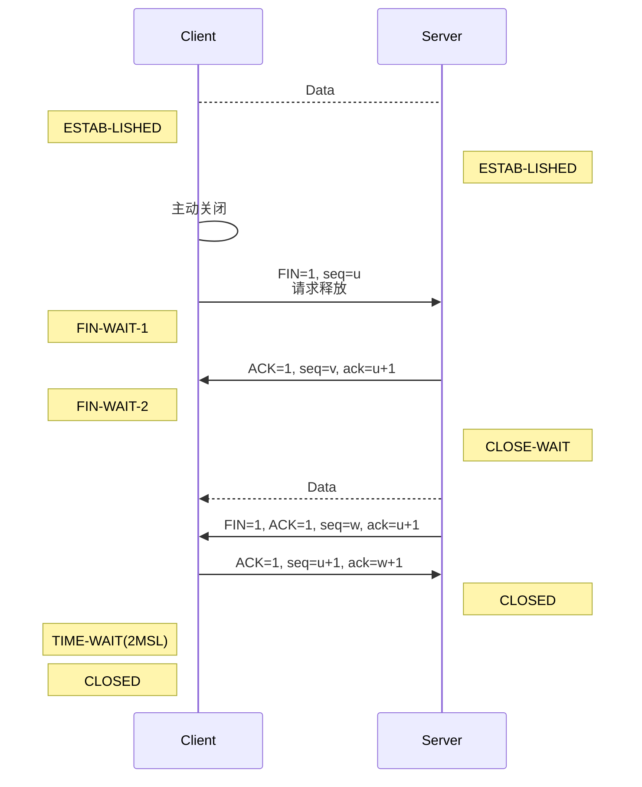

(MSL:最长报文段寿命)

### 小结

(/3是三次握手，/4是四次握手)

|        阶段         | SYN(同步) | ACK(连接) | FIN(结束) | seq  |  ack  |
| :-----------------: | :-------: | :-------: | :-------: | :--: | :---: |
|    请求建立(1/3)    |   **1**   |   **0**   |     0     |  x   |       |
|   服务器确认(2/3)   |   **1**   |   **1**   |     0     |  y   |  x+1  |
|   确认的确认(3/3)   |     0     |   **1**   |     0     | x+1  |  y+1  |
|    请求取消(1/4)    |     0     |   **1**   |   **1**   |  u   |       |
|   服务器确认(2/4)   |     0     |   **1**   |     0     |  v   |  u+1  |
|   服务器批准(3/4)   |     0     |   **1**   |   **1**   | v+k  |  u+1  |
| 客户端确认批准(4/4) |     0     |   **1**   |     0     | u+1  | v+k+1 |

可以发现

1. ACK除了请求建立连接，都是1；
2. SYN=1: 一来一回，而确认的确认SYN=0；
3. FIN=1:一来一回，两个确认FIN=0；
4. seq是自己发的第一个
5. ack是对方下一次发的第一个

> 参考链接:
>
> https://yujianxin.blog.csdn.net/article/details/45204399
>
> https://www.cnblogs.com/RichardTAO/p/12097469.html

### 例题

* 在采用TCP连接的数据传输阶段，如果发送端的发送窗口值由1000变为2000，那么发送端在收到一个确认之前可以发送：

  A. 2000个TCP报文段

  B. 2000B

  C. 1000B

  D. 1000个TCP报文段

  【答案】：B

* 为保证数据传输的可靠性，TCP采用了对()确认的机制。

  A.报文段

  B.分组

  C.字节

  D.比特

  【答案】：A，TCP是面向字节的。对每个字节进行编号，但并不是接收到每个字节都要发回确认，而是在

  发送一个报文段的字节后才发回一个确认，所以T℃P采用的是对报文段的确认机制。

* TCP中滑动窗口的值设置太大，对主机的影响是(A)。

  A.由于传送的数据过多而使路由器变得拥挤，主机可能丢失分组

  B.产生过多的ACK

  C.由于接收的数据多，而使主机的工作速度加快

  D.由于接收的数据多，而使主机的工作速度变慢

* 【2021统考真题】若客户首先向服务器发送FN段请求断开TCP连接，则当客户收到服务器发送的FN段并向服务器发送ACK段后，客户的TCP状态转换为(B)。

  A.CLOSE WAIT 

  B.TIME WAIT

  C.FIN WAIT_1

  D.FIN_WAIT_2

* 【2012统考真题】主机H通过快速以太网连接Internet,IP地址为192.168.0.8，服务器S的IP地址为211.68.71.80。H与S使用TCP通信时，在H上捕获的其中5个P分组如表1所示。

  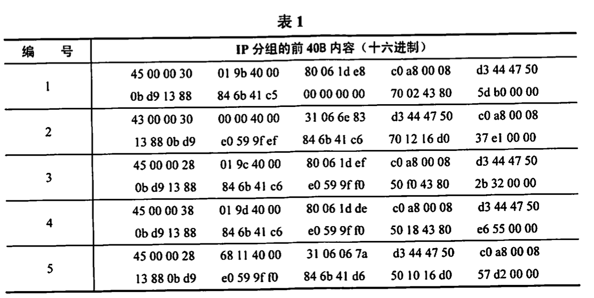回答下列问题：

  1)表1中的IP分组中，哪几个是由H发送的？哪几个完成了TCP连接建立过程？哪几个在通过快速以太网传输时进行了填充？

  2)根据表1中的IP分组，分析S已经收到的应用层数据字节数是多少。

  3)若表1中的某个IP分组在S发出时的前40B如表2所示，则该IP分组到达H时经过了多少个路由器？

  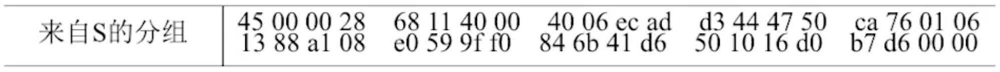

  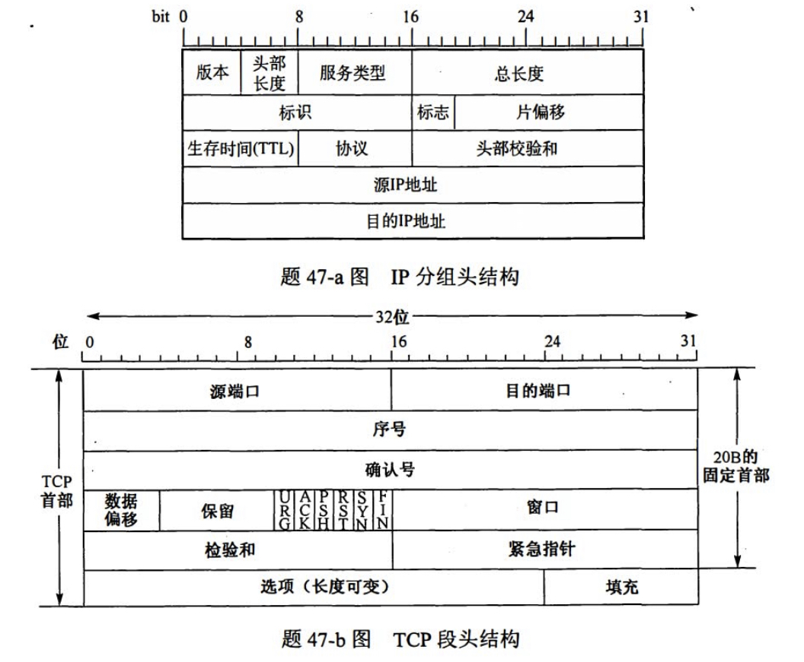

  【答案】
  
  1. 192.168.0.8->C0A80008->1，3，4； 1，2，3完成了TCP建立过程； 以太网最小帧长为46B，3，5需要填充
  2. 16B：d6-c6
  2. 40H-31H=16-1=15

## TCP可靠传输

### 序号

TCP首部的序号字段用来保证数据能有序提交给应用层，TCP把数据视为一个无结构但有序的字节流，序号建立在传送的字节流之上，而不建立在报文段之上。【一个字节一个序号】

TCP连接传送的数据流中的每个字节都编上一个序号。序号字段的值是指本报文段所发送的数据的第一个字节的序号。如图所示，假设A和B之间建立了一条TCP连接，A的发送缓存区中共有10B,序号从0开始标号，第一个报文包含第0~2个字节，则该TCP报文段的序号是0，第二个报文段的序号是3。【报文段一般根据MTU划分】

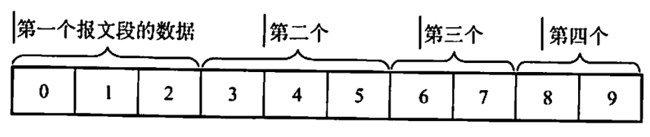

### 确认

TCP首部的确认号是期望收到对方的**下一个报文段的数据的第一个字节的序号**。在上图中，如果接收方B已收到第一个报文段，此时B希望收到的下一个报文段的数据是从第3个字节开始的，那么B发送给A的报文中的确认号字段应为3。发送方缓存区会继续存储那些已发送但未收到确认的报文段，以便在需要时重传。

TCP默认使用**累积确认**，即T℃P只确认数据流中至第一个丢失字节为止的字节。例如，在上图中，接收方B收到了A发送的包含字节0～2及字节6~7的报文段。由于某种原因，B还未收到字节3~5的报文段，此时B仍在等待字节3（和其后面的字节），因此B到A的下一个报文段将确认号字段置为3。

### 重传

有两种事件会导致TCP对报文段进行重传：超时和冗余ACK。

##### 超时

TCP每发送一个报文段，就对这个报文段设置一次计时器。计时器设置的重传时间到期但还未收到确认时，就要重传这一报文段。由于TCP的下层是一个互联网环境，IP数据报所选择的路由变化很大，因而传输层的往返时延的方差也很大。为了计算超时计时器的重传时间，TCP采用一种自适应算法，它记录一个报文段发出的时间，以及收到相应确认的时间，这两个时间之差称为报文段的往返时间(Round-Tip Time,RTT)。TCP保留了RTT的一个加权平均往返时间RTTs,它会随新测量RTT样本值的变化而变化。显然，超时计时器设置的**超时重传时间**(Retransmission Time-Out,**RTO**)应略大于RTTs,但也不能大太多，否则当报文段丢失时，TCP不能很快重传，导致数据传输时延大。
$$
新估计RTT=(1-a)×(旧RTT)+a×(新RTT)
$$

##### 冗余ACK(冗余确认)

超时触发重传存在的一个问题是超时周期往往太长。所幸的是，发送方通常可在超时事件发生之前通过注意所谓的冗余ACK来较好地检测丢包情况。冗余ACK就是再次确认某个报文段的ACK,而发送方先前已经收到过该报文段的确认。例如，发送方A发送了序号为1、2、3、4、5的TCP报文段，其中2号报文段在链路中丢失，它无法到达接收方B。因此3、4、5号报文段对于B来说就成了失序报文段。**TCP规定每当比期望序号大的失序报文段到达时，就发送一个冗余ACK**,指明下一个期待字节的序号。在本例中，3、4、5号报文到达B,但它们不是B所期望收到的下一个报文，于是B就发送3个对1号报文段的冗余ACK,表示自己期望接收2号报文段。TCP规定当发送方收到对同一个报文段的3个冗余ACK时，就可以认为跟在这个被确认报文段之后的报文段已经丢失。就前面的例子而言，当A收到对于1号报文段的**3个冗余ACK**时，它可以**认为**2号报文段**已经丢失**，这时发送方A可以立即对2号报文执行重传，这种技术通常称为**快速重传**。当然，冗余ACK还被用在拥塞控制中，这将在后面的内容中讨论。

## TCP流量控制

TCP提供流量控制服务来**消除发送方（发送速率太快）**使接收方缓存区溢出的可能性，因此可以说流量控制是一个速度匹配服务（匹配发送方的发送速率与接收方的读取速率）。

TCP提供一种基于滑动窗口协议的流量控制机制，滑动窗口的基本原理已在第3章的数据链路层介绍过，这里要介绍的是TCP如何使用窗口机制来实现流量控制。

在通信过程中，接收方根据自己接收缓存的大小，动态地调整发送方的发送窗口大小，这称为**接收窗口`rwnd`**,即调整TCP报文段首部中的“窗口”字段值，来限制发送方向网络注入报文的速率。同时，发送方根据其对当前网络拥塞程度的估计而确定的窗口值，这称为拥塞窗口`cwnd`(后面会讲到)，其大小与网络的带宽和时延密切相关。

例如，在通信中，有效数据只从A发往B，而B仅向A发送确认报文，这时B可以**通过设置确认报文段首部的窗口字段**(如果是)来将`rwmd`通知给A。`rwnd`即接收方允许连续接收的最大能力，单位是**字节**。发送方A总是根据最新收到的`rwnd`值来限制自己发送窗口的大小，从而将未确认的数据量控制在`rwmd`大小之内，保证A不会使B的接收缓存溢出。当然，A的发送窗口的实际大小取`rwnd`和`cwnd`中的最小值。

设A向B发送数据，在连接建立时，B告诉A:“我的接收窗口`rwnd`=40”。接收方主机B进行了三次流量控制，这三个报文段都设置了ACK=1,只有在ACK=1时确认号字段才有意义。第一次把窗口减小到`rwnd`=300,第二次又减到`rwnd`=100,最后减到`rwnd`=0,即不允许发送方再发送数据。这使得发送方暂停发送的状态将持续到B重新发出一个新的窗口值为止。

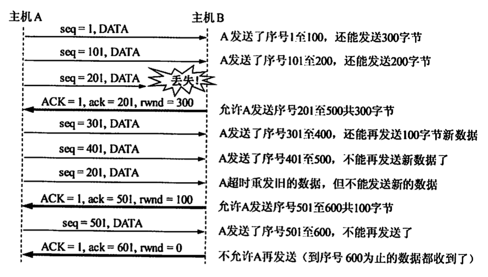

传输层和数据链路层的流量控制的区别是：<u>传输层定义端到端用户之间的流量控制，数据链路层定义两个中间的相邻结点的流量控制。另外，数据链路层的滑动窗口协议的窗口大小不能动态变化，传输层的则可以动态变化</u>。

## TCP拥塞控制

拥塞控制是指防止过多的数据注入网络，保证网络中的路由器或链路不致过载。出现拥塞时，端点并不了解拥塞发生的细节，对通信连接的端点来说，拥塞往往表现为<u>通信时延</u>的增加。

<u>拥塞控制与流量控制的区别</u>：拥塞控制是让网络能够承受现有的网络负荷，是一个<u>全局性</u>的过程，涉及所有的主机、所有的路由器，以及与降低网络传输性能有关的所有因素。相反，流量控制往往是指<u>点对点的通信量</u>的控制，是个<u>端到端</u>的问题（接收端控制发送端），它所要做的是抑制发送端发送数据的速率，以便使接收端来得及接收。

当然，<u>拥塞控制和流量控制也有相似的地方</u>，即它们都通过控制<u>发送方发送数据的速率</u>来达到控制效果。

例如，某个链路的传输速率为10Gb/s,某大型机向一台PC以1Gbs的速率传送文件，显然网络的带宽是足够大的，因而不存在拥塞问题，但如此高的发送速率将导致PC可能来不及接收，因此必须进行流量控制。但若有100万台PC在此链路上以1MG/s的速率传送文件，则现在的问题就变为网络的负载是否超过了现有网络所能承受的范围。

因特网建议标准定义了进行拥塞控制的4种算法：**慢开始**、**拥塞避免**、**快重传**和**快恢复**。发送方在确定发送报文段的速率时，既要根据接收方的接收能力，又要从全局考虑不要使网络发生拥塞。因此，TCP协议要求发送方维护以下两个窗口：

1)接收窗口`rwnd`,**接收方**根据目前接收缓存大小所许诺的最新窗口值，反映接收方的容量。由接收方根据其放在TCP报文的首部的窗口字段通知发送方。

2)拥塞窗口`cwnd`,**发送方**根据自己估算的**网络拥塞程度**而设置的窗口值，反映网络的当前容量。只要网络未出现拥塞，拥塞窗口就再增大一些，以便把更多的分组发送出去。但只要网络出现拥塞，拥塞窗口就减小一些，以减少注入网络的分组数。发送窗口的上限值应取接收窗口`rwnd`和拥塞窗口`cwmd`中较小的一个接收窗口的大小可根据TCP报文首部的窗口字段通知发送方，而发送方如何维护拥塞窗口呢？这就是下面讲解的慢开始和拥塞避免算法。

### 慢开始和拥塞避免

##### 慢开始

在TCP刚刚连接好并开始发送TCP报文段时，先令拥塞窗口`cwnd`=1,即一个最大报文段长度MSS。每收到一个对新报文段的确认后，将`cwmd`加1，即增大一个MSS。用这样的方法逐步增大发送方的`cwnd`,可使分组注入网络的速率更加合理。

例如，A向B发送数据，发送方先置拥塞窗口`cwnd`=1,A发送第一个报文段，A收到B对第一个报文段的确认后，把`cwmd`从1增大到2；于是A接着发送两个报文段，A收到B对这两个报文段的确认后，把`cwnd`从2增大到4，下次就可一次发送4个报文段。

慢开始的“慢”并不是指拥塞窗口cwd的增长速率慢，而是指在TCP开始发送报文段时先设置`cwnd`=1,使得发送方在开始时只发送一个报文段（目的是试探一下网络的拥塞情况），然后再逐渐增大`cwnd`,这对防止网络出现拥塞是一个非常有力的措施。使用慢开始算法后，每经过一个传输轮次（即往返时延RTT),`cwnd`就会加倍，即cwmd的值随传输轮次线性增长。这样，慢开始一直把cwmd增大到一个规定的慢开始门限ssthresh(阈值)，然后改用拥塞避免算法。

##### 拥塞避免

拥塞避免算法的思路是让拥塞窗口`cwmd`缓慢增大，具体做法是：每经过一个往返时延RTT就把发送方的拥塞窗口`cwnd`加1，而不是加倍，使拥塞窗口`cwnd`按线性规律缓慢增长（即加法增大），这比慢开始算法的拥塞窗口增长速率要缓慢得多。

根据`cwnd`的大小执行不同的算法，可归纳如下：

* 当cwnd<ssthresh时，使用慢开始算法。
* 当cwnd>ssthresh时，停止使用慢开始算法而改用拥塞避免算法。
* 当cwmd=ssthresh时，既可使用慢开始算法，又可使用拥塞避免算法（通常做法）。

##### 网络拥塞处理

无论在慢开始阶段还是在拥塞避免阶段，只要发送方判断网络出现拥塞（未按时收到确认），就要把**慢开始门限ssthresh设置为出现拥塞时的发送方的cwmd值的一半（但不能小于2）**。然后把拥塞窗口cwnd重新设置为1，执行慢开始算法。这样做的目的是迅速减少主机发送到网络中的分组数，使得发生拥塞的路由器有足够时间把队列中积压的分组处理完。

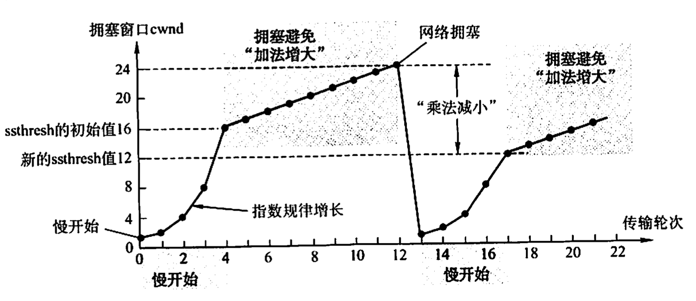

### 快重传和快恢复

##### 快重传

在上一节介绍的TCP可靠传输机制中，快重传技术使用了**冗余ACK**来检测丢包的发生。同样，冗余ACK也用于网络拥塞的检测（丢了包当然意味着网络可能出现了拥塞）。快重传并非取消重传计时器，而是在某些情况下可更早地重传丢失的报文段。

当发送方连续收到**三个重复的ACK报文**时，直接重传对方尚未收到的报文段，而不必等待那个报文段设置的重传计时器超时。

##### 快恢复

快恢复算法的原理如下：当发送方连续收到**三个冗余ACK（即重复确认)**时，**执行“乘法减小”算法**，**把慢开始门限ssthresh设置为此时发送方cwnd的一半**。这是为了预防网络发生拥塞。

但发送方现在认为网络很可能没有发生（严重）拥塞，否则就不会有几个报文段连续到达接收方，也不会连续收到重复确认。因此与慢开始不同之处是它把cwmd值设置为慢开始门限ssthresh改变后的数值，然后开始执行拥塞避免算法(“加法增大”)，使拥塞窗口缓慢地线性增大。

由于跳过了拥塞窗口cwnd从1起始的慢开始过程，所以被称为快恢复。快恢复算法的实现过程如图所示，作为对比，虚线为慢开始的处理过程。

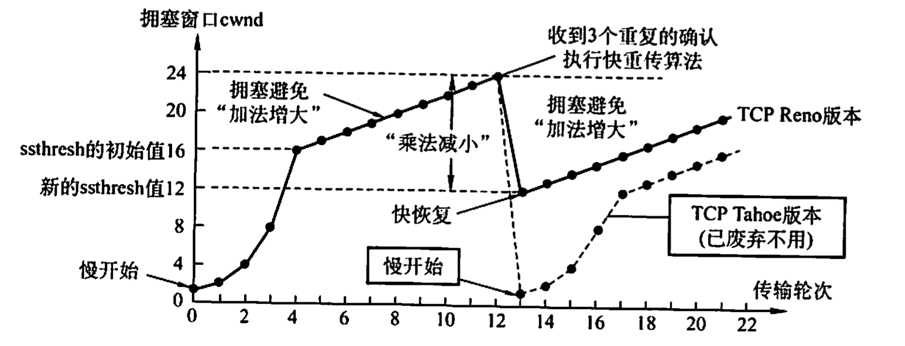

### 注意

* [MSS](https://baike.baidu.com/item/MSS/3567770), 是每一个报文段所能承载的最大数据长度。

### 例题

* 假设在没有发生拥塞的情况下，在一条往返时延RTT为10ms的线路上采用慢开始控制策略。如果接收窗口的大小为24KB,最大报文段MSS为2KB。那么发送方能发送出第一个完全窗口（也就是发送窗口达到24KB)需要的时间是(）。

  A.30ms

  B.40ms

  C.50ms

  D.60ms

  【答案】：

  | 序号 | 发送窗口大小 | 本次发送内容 | 累计发送内容 |
  | :--: | :----------: | :----------: | :----------: |
  |  1   |      1       |      2       |      2       |
  |  2   |      2       |      4       |      6       |
  |  3   |      4       |      8       |      14      |
  |  4   |      5       |      10      |      24      |

  40ms

* 【2010统考真题】主机甲和主机乙之间已建立一个TCP连接，TCP最大段长为1000B。若主机甲的当前拥塞窗口为4000B,在主机甲向主机乙连续发送两个最大段后，成功收到主机乙发送的第一个段的确认段，确认段中通告的接收窗口大小为2000B,则此时主机甲还可以向主机乙发送的最大字节数是（A)

  A.1000

  B.2000

  C.3000

  D.4000

* 已知当前TCP连接的RTT值为35ms,连续收到3个确认报文段，它们比相应的数据报文段的发送时间滞后了27ms、30ms与21s。设a=0.2。计算第三个确认报文段到达后的新的RTT估计值。
  $$
  新估计RTT=(1-a)×(旧RTT)+a×(新RTT)
  $$

  $$
  RTT_1=0.8\cdot35+0.2\cdot27=33.4ms\\
  RTT_2=0.8\cdot33.4+0.2\cdot30=32.72ms\\
  RTT_3=0.8\cdot32.72+0.2\cdot21=30.376ms\\
  $$

* 网络允许的最大报文段的长度为128B,序号用8位表示，报文段在网络中的寿命为30s。求每条TCP连接所能达到的最高数据率

  【答案】<u>具有相同编号的报文段不应同时在网络中传输，必须保证当序列号循环回来重复使用时，具有相同序列号的报文段已从网络中消失，类似于GBN原理(2^n-1)</u>。现在序号用8位表示，报文段的寿命为30s,那么在30s的时间内发送方发送的报文段的数目不能多于255个
  $$
  255\cdot 128\cdot 8b/30s=870b/s
  $$

* 【2016统考真题】假设下图中的H3访问Web服务器S时，S为新建的TCP连接分配了20KB(K=1024)的接收缓存，最大段长MSS=1KB,平均往返时间RTT=200ms。H3建立连接时的初始序号为100，且持续以MSS大小的段向S发送数据，拥塞窗口初始阈值为32KB;S对收到的每个段进行确认，并通告新的接收窗口。假定TCP连接建立完成后，S端的TCP接收缓存仅有数据存入而无数据取出。请回答下列问题：

  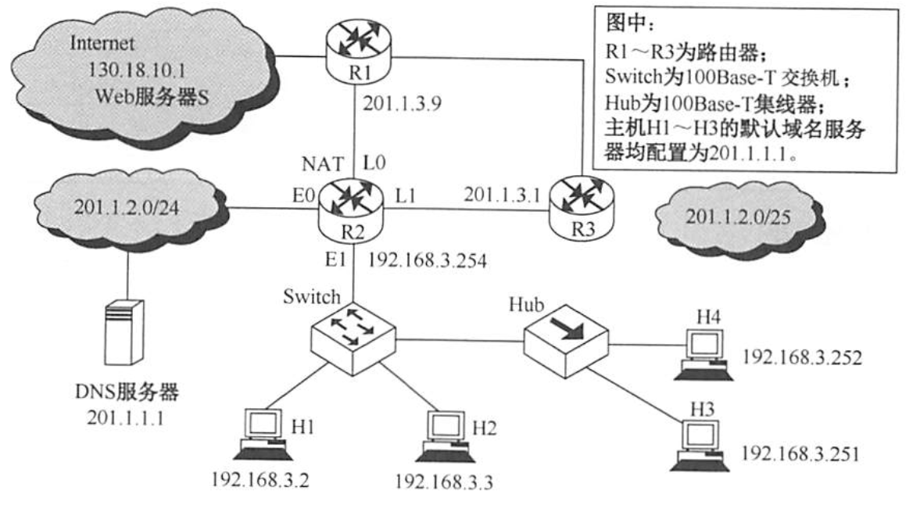

  1)在TCP连接建立过程中，H3收到的S发送过来的第二次握手TCP段的SYN和ACK标志位的值分别是多少？确认序号是多少？

  2)H3收到的**第8个确认段**所通告的接收窗口是多少？此时H3的拥塞窗口变为多少？H3的发送窗口变为多少？

  3)H3的发送窗口等于0时，下一个待发送的数据段序号是多少？H3从发送第1个数据段到发送窗口等于0时刘为止，平均数据传输速率是多少？（忽略段的传输延时。)

  4)若H3与S之间通信已经结束，在t时刻H3请求断开该连接，则从t时刻起，S释放该连接的最短时间是多少？

  【答案】

  1. SYN=1，ACK=1，ack=101

  2. 注意，这里是按照确认段进行计算，我们之前的指数递增，是把好几次合在一起算的。 比如第三次一次发四个，其实是1，2，3，4四个段，每个段会有一个ACK，这个ACK里边的拥塞窗口是递增的（不是指数的）。😭（确实有点坑），答案是12，9，9
  | 发送时间/ms | 段序号 | 拥塞窗口(返回时) | 接收窗口(返回时) | 拥塞阈值 |
  | :---------: | :----: | :--------------: | :--------------: | :------: |
  |      0      |   1    |        2         |        19        |    32    |
  |     200     |   2    |        3         |        18        |    32    |
  |     200     |   3    |        4         |        17        |    32    |
  |     400     |   4    |        5         |        16        |    32    |
  |     400     |   5    |        6         |        15        |    32    |
  |     400     |   6    |        7         |        14        |    32    |
  |     400     |   7    |        8         |        13        |    32    |
  |     600     |   8    |      **9**       |      **12**      |    32    |
  |     ...     |  ...   |                  |                  |          |

  3. 发了20KB，序号是0-20*1024-1，下一个序号是20\*1024=20480，注意⚠️100是SYN请求，所以第一个序号是101😭，答案：20581
     $$
     平均数据传输速率=\frac{20KB}{5RTT}
     $$
  
  4. H->S, S没有数据了, S->H, H->S， 一共是300ms
  
     
