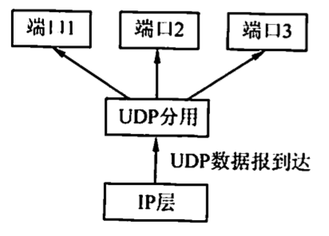
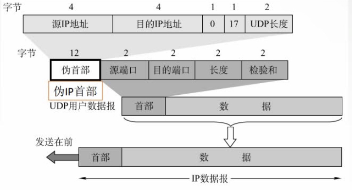
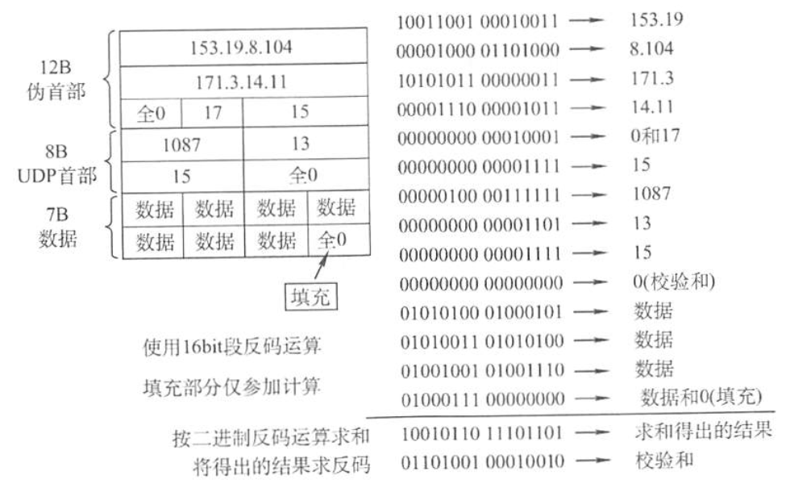

# UDP
2022.03.13

[toc]

## UDP数据报

### UDP概述

UDP仅在P的数据报服务之上增加了两个最基本的服务：**复用和分用以及差错检铡**。如果应用开发者选择UDP而非TCP,那么应用程序几乎直接与IP打交道。为什么应用开发者宁愿在UDP之上构建应用，也不选择TCP？既然TCP提供可靠的服务，而UDP不提供，那么TCP总是首选吗？答案是否定的，因为有很多应用更适合用UDP,主要因为UDP具有如下优点：

1)**UDP无须建立连接**。因此UDP不会引入建立连接的时延。试想如果DNS运行在TCP而非UDP上，那么DNS的**速度**会慢很多。HTTP使用TCP而非UDP,是因为对于基于文本数据的Web网页来说，可靠性是至关重要的。

2)**无连接状态**。TCP需要在端系统中维护连接状态。此连接状态包括接收和发送缓存、拥塞控制参数和序号与确认号的参数。而UDP不维护连接状态，也不跟踪这些参数。因此，某些专用应用服务器使用UDP时，一般都能支持**更多的活动客户机**。

3）分组**首部开销**小。**TCP有20B**的首部开销，而**UDP仅有8B**的开销。

4）应用层能更好地**控制要发送的数据和发送时间**。**UDP**没有拥塞控制，因此网络中的拥塞不会影响主机的发送效率。某些实时应用要求以**稳定的速度发送**，能容忍一些数据的丢失，但不允许有较大的时延，而 UDP 正好满足这些应用的需求。

5）**UDP 支持一对一、一对多、多对一和多对多的交互通信**。

UDP常用于一次性传输较少数据的网络应用，如DNS、SNMP等，因为对于这些应用，若采用 TCP，则将为连接创建、维护和拆除带来不小的开销。UDP 也常用于多媒体应用（如卫星电话、实时视频会议、流媒体等），显然，可靠数据传输对这些应用来说并不是最重要的，但 TCP的拥塞控制会导致数据出现较大的延迟，这是它们不可容忍的。

UDP**不保证可靠交付**，但这并**不意味着**应用对数据的要求是**不可靠**的，所有维护可靠性的工作可由用户在应用层来完成。应用开发者可根据应用的需求来灵活设计自己的可靠性机制。

UDP是**面向报文**的。发送方 UDP 对应用层交下来的报文，在添加首部后就向下交付给IP层，一次发送一个报文，既不合并，也不拆分，而是**保留这些报文的边界**；接收方UDP对IP层交上来 UDP 数据报，在去除首部后就原封不动地交付给上层应用进程，一次交付一个完整的报文。因此**报文不可分割，是UDP数据报处理的最小单位**。因此，应用程序必须选择合适大小的报文，若报文太长，UDP 把它交给 IP层后，可能会导致分片：若报文太短，UDP 把它交给IP层后，会使IP数据报的首部的相对长度太大，两者都会降低IP层的效率。

### UDP数据报格式

UDP 数据报包含两部分：UDP 首部和用户数据。UDP 首部有8B，由4个字段组成，每个字段的长度都是 2B。各字段意义如下：
1）**源端口**。源端口号。在需要对方回信时选用，不需要时可用全0。
2）**目的端口**。目的端口号。这在终点交付报文时必须使用到.
3）**长度**。UDP数据报的长度（包括首部和数据），其**最小值是8**（仅有首部)。
4）**校验和**。检测 UDP 数据报在传输中是否有错。有错就丢弃。该字段是可选的，当源主机不想计算校验和时，则直接令该宇段为全0。

当传输层从IP层收到UDP数据报时，就根据首部中的目的端口，把UDP数据报通过相应的端口上父给应用进程。

如果接收方UDP发现收到的报文中的目的端口号不正确（即不存在对应于端口号的应用进程)，那么就丢弃该报文，并由ICMP发送“端口不可达”差错报文给发送方。

## UDP检验

在计算校验和时，要在UDP数据报之前增加**12B的伪首部**，伪首部并不是UDP的真正首部。只是在计算校验和时，临时添加在UDP数据报的前面，得到一个临时的UDP数据报。校验和就是按照这个临时的UDP数据报来计算的。伪首部既不向下传送又不向上递交，而只是为了计算校验和。

在发送端：
1.填上伪首部
2.全0填充检验和字段
3.全0填充数据部分(UDP数据报要看成许多4B的字串接起来）
4.伪首部＋首部＋数据部分采用二进制**反码求和**
5.把和求**反码**填入检验和字段
6.去掉伪首部，发送

在接收端：
1.填上伪首部
2.伪首部＋首部＋数据部分采用二进制反码求和
3.结果全为1则无差错，否则丢弃数据报/交给应用层附上出差错的警告。

* 一个应用程序用UDP,到了IP层将数据报再划分为4个数据报片发送出去。结果前两个数据报片丢失，后两个到达目的站。过了一段时间应用程序重传UDP,而IP层仍然划分为4个数据报片来传送。结果这次前两个到达目的站而后两个丢失。试问：在目的站能否将这两次传输的4个数据报片组装成为完整的数据报？假定目的站第一次收到的后两个数据片仍然保存在目的站的缓存中。

  【答案】：不能，因为两次重传的IP数据包标识符不同。

* 下列关于UDP校验的描述中，（B)是错误的。

  A.**UDP校验和段的使用是可选的，若源主机不想计算校验和，则该校验和段应为全0**

  B.在计算校验和的过程中，需要生成一个伪首部，源主机需要把该伪首部发送给目的主机

  C.如果数据报在传输过程中被破坏，那么就把它丢弃

  D.UDP数据报的伪首部包含了IP地址信息

* **UDP数据报中的长度字段**(D)。

  A.不记录数据的长度

  B.只记录首部的长度

  C.只记录数据部分的长度

  D.**包括首部和数据部分的长度**

