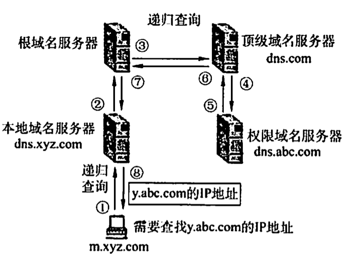
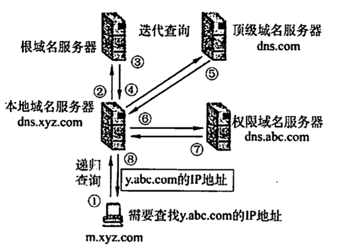
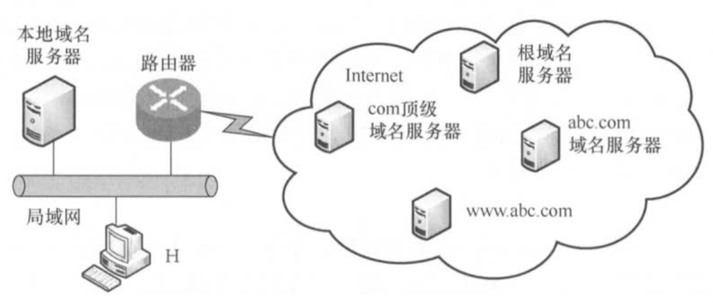

# 域名系统DNS
2022.03.16

域名系统(Domain Name System,DNS)是因特网使用的命名系统，用来把便于人们记忆的具有特定含义的主机名（如www.cskaoyan.com)转换为便于机器处理的P地址。相对于IP地址，人们更喜欢使用具有特定含义的字符串来标识因特网上的计算机。值得注意的是，DNS系统采用客户服务器模型，其协议运行在UDP之上，使用53号端口。从概念上可将DNS分为3部分：**层次域名空间**、**域名服务器**和解析器。

## 层次域名空间

因特网采用**层次树状结构**的命名方法。采用这种命名方法，任何一个连接到因特网的主机或路由器，都有一个唯一的层次结构名称，即域名(Domain Name)。域(Domain)是名字空间中一个可被管理的划分。域还可以划分为子域，而子域还可以继续划分为子域的子域，这样就形成了顶级域、二级域、三级域等。每个域名都由标号序列组成，而各标号之间用点(“.”)隔开。一个典型的例子，www.cskaoyan.com，它是王道论坛用于提供WWW服务的计算机(web服务器)的域名，它由三个标号组成，其中标号com是顶级域名，标号cskaoyan是二级域名，标号www是三级域名。

关于域名中的标号有以下几点需要注意：

1) 标号中的英文不区分大小写。
2) 标号中除连字符(-)外不能使用其他的标点符号。
3) 每个标号不超过63个字符，多标号组成的完整域名最长不超过255个字符。
4) 级别最低的域名写在最左边，级别最高的顶级域名写在最右边。

顶级域名(Top Level Domain,TLD)分为如下三大类：

1) 国家(地区)顶级域名（nTLD)。国家和某些地区的域名，如“.cn”表示中国，“us”表示美国，“uk”表示英国。
2) 通用顶级域名（gTLD)。常见的有“.com”（公司)、“.nt”(网络服务机构)、“.org”(非营利性组织)和“gv”（国家或政府部门)等。
3) 基础结构域名。这种顶级域名只有一个，即apa,用于反向域名解析，因此又称反向域名。

在域名系统中，每个域分别由不同的组织进行管理。每个组织都可以将它的域再分成一定数目的子域，并将这些子域委托给其他组织去管理。例如，管理cn域的中国将edu.cn子域授权给中国教育和科研计算机网(CERNET)来管理。

## 域名服务器

因特网的域名系统被设计成一个联机分布式的数据库系统，并采用客户/服务器模型。域名到IP地址的解析是由运行在域名服务器上的程序完成的，一个服务器所负责管辖的（或有权限的）范围称为区（不以“域”为单位），各单位根据具体情况来划分自己管辖范围的区，但在一个区中的所有结点必须是能够连通的，每个区设置相应的权限域名服务器，用来保存该区中的所有主机的域名到P地址的映射。每个域名服务器不但能够进行一些域名到P地址的解析，而且还必须具有连向其他域名服务器的信息。当自己不能进行域名到P地址的转换时，能够知道到什么地方去找其他域名服务器。

DNS使用了大量的域名服务器，它们以层次方式组织。没有一台域名服务器具有因特网上所有主机的映射，相反，该映射分布在所有的DNS上。采用分布式设计的DNS,是一个在因特网上实现分布式数据库的精彩范例。主要有4种类型的域名服务器。

### 根域名服务器

根域名服务器是最高层次的域名服务器，所有的根域名服务器都知道所有的顶级域名服务器的IP地址。根域名服务器也是最重要的域名服务器，不管是哪个本地域名服务器，若要对因特网上任何一个域名进行解析，只要自己无法解析，就首先要求助于根域名服务器。因特网上有13个根域名服务器，尽管我们将这13个根域名服务器中的每个都视为单个服务器，但每个“服务器”实际上是冗余服务器的集群，以提供安全性和可靠性。需要注意的是，根域名服务器用来管辖顶级（如.com),<u>通常它并不直接把待查询的域名直接转换成IP地址，而是告诉本地域名服务器下一步应当找哪个顶级域名服务器进行查询</u>。

### 顶级域名服务器

这些域名服务器负责管理在该顶级域名服务器注册的所有<u>二级域名</u>。收到DNS查询请求时，就给出相应的回答（可能是最后的结果，也可能是下一步应当查找的域名服务器的IP地址）。

### 授权域名服务器

每台主机都必须在授权域名服务器处登记。为了更加可靠地工作，一台主机最好至少有两个授权域名服务器。实际上，许多域名服务器都同时充当本地域名服务器和授权域名服务器。**授权域名服务器总能将其管辖的主机名转换为该主机的IP地址**。

### 本地域名服务器

本地域名服务器对域名系统非常重要。每个因特网服务提供者（SP),或一所大学，甚至一所大学中的各个系，都可以拥有一个本地域名服务器。当一台主机发出DNS查询请求时，这个查询请求报文就发送给该主机的本地域名服务器。事实上，我们在Windows系统中配置“本地连接”时，就需要填写DNS地址，这个地址就是本地DNS(域名服务器)的地址。

## 域名解析过程

域名解析是指把域名**映射成为IP地址**或把**IP地址映射成域名**的过程。前者称为**正向解析**，后者称为**反向解析**。当客户端需要域名解析时，通过本机的DNS客户端构造一个DNS请求报文，以**UDP数据报**方式发往**本地域名服务器**。

域名解析有两种方式：**递归查询**和**递归与迭代相结合的查询**。

递归查询的过程如图所示：

本地域名服务器只需向根域名服务器查询一次，后面的几次查询都是递归地在其他几个域名服务器之间进行的[步骤③~⑥]。在步骤⑦中，本地域名服务器从根域名服务器得到了所需的P地址，最后在步骤⑧中，本地域名服务器把查询结果告诉发起查询的主机。由于该方法给根域名服务造成的负载过大，所以在实际中几乎不使用。常用递归与迭代相结合的查询方式如图所示，该方式分为两个部分。

(1)主机向本地域名服务器的查询采用的是递归查询

也就是说，如果本地主机所询问的本地域名服务器不知道被查询域名的P地址，那么本地域名服务器就以DNS客户的身份，向根域名服务器继续发出查询请求报文（即替该主机继续查询)，而不是让该主机自己进行下一步的查询。两种查询方式的这一步是相同的。

(2)本地域名服务器向根域名服务器的查询采用迭代查询

当根域名服务器收到本地域名服务器发出的迭代查询请求报文时，要么给出所要查询的IP地址，要么告诉本地域名服务器：“你下一步应当向哪个顶级域名服务器进行查询”。然后让本地域名服务器向这个顶级域名服务器进行后续的查询，如图所示。同样，顶级域名服务器收到查询报文后，要么给出所要查询的IP地址，要么告诉本地域名服务器下一步应向哪个权限域名服务器查询。最后，知道所要解析的域名的IP地址后，把这个结果返回给发起查询的主机。下面举例说明域名解析的过程。假定某客户机想获知域名为y.abc.com主机的P地址，域名解析的过程（共使用了8个UDP报文）如下：

① 客户机向其本地域名服务器发出DNS请求报文（递归查询）。

② 本地域名服务器收到请求后，查询本地缓存，若没有该记录，则以DNS客户的身份向根域名服务器发出解析请求报文（迭代查询）。

③ 根域名服务器收到请求后，判断该域名属于.com域，将对应的顶级域名服务器dns.com的IP地址返回给本地域名服务器。

④ 本地域名服务器向顶级域名服务器dns.com发出解析请求报文（迭代查询)。

⑤ 顶级域名服务器dns.com收到请求后，判断该域名属于abc.com域，因此将对应的授权域名服务器dns.abc.com的IP地址返回给本地域名服务器。本地域名服务器向授权域名服务器dns.abc.com发起解析请求报文（迭代查询）。

⑦ 授权域名服务器dns.abc.com收到请求后，将查询结果返回给本地域名服务器。

⑧ 本地域名服务器将查询结果保存到本地缓存，同时返回给客户机。

为了提高DNS的查询效率，并减少因特网上的DNS查询报文数量，在域名服务器中广泛地使用了高速缓存。当一个DNS服务器接收到DNS查询结果时，它能将该DNS信息缓存在高速缓存中。这样，当另一个相同的域名查询到达该DNS服务器时，该服务器就能够直接提供所要求的IP地址，而不需要再去向其他DNS服务器询问。因为主机名和IP地址之间的映射不是永久的，所以DNS服务器将在一段时间后丢弃高速缓存中的信息。

* 【2018统考真题】下列TCPP应用层协议中，可以使用传输层无连接服务的是()。

  A.FTP

  B.DNS

  C.SMTP

  D.HTTP

  【答案】：B

* 【2020统考真题】假设下图所示网络中的本地域名服务器只提供递归查询服务，其他域名服务器均只提供迭代查询服务；局域网内主机访问Internet上各服务器的往返时间(RTT)均为l0ms,忽略其他各种时延。若主机H通过超链接http:/www.abc.com/index.html请求浏览纯文本Web页index.html,则从单击超链接开始到浏览器接收到index.html页面为止，所需的最短时间与最长时间分别是()。

  【答案】：20ms，50ms

  题中RTT均为局域网内主机（主机H、本地域名服务器）访问Internet上各服务器的往返时间，且忽略其他时延，因此主机H向本地域名服务器的查询时延忽略不计。最短时间：**本地主机中有该域名到IP地址对应的记录，因此不需要DNS查询时延**，**直接和www.abc.com服务器建立TCP连接再进行资源访问，TCP连接建立需要1个RTT**,接着发送访问请求并收到服务器资源响应需要1个RTT,共计2个RTT,即20s:最长时间：本地主机递归查询本地域名服务器（延时忽略)，本地服务器依次迭代查询**根域名服务器、com顶级域名服务器、abc.com域名服务器**（没有www.abc.com），共3个RTT,查询到IP地址后，将该映射返回给主机H,主机H和www.abc.com服务器建立TCP连接再进行资源访问，共2个RTT,因此最长时间需要3+2=5个RTT,即50s。

  

* 【2016统考真题】假设所有域名服务器均采用迭代查询方式进行域名解析。当主机访问规范域名为www.abc.Xyz.com的网站时，本地域名服务器在完成该域名解析的过程中，可能发出DNS查询的最少和最多次数分别是()。

  A.0,3

  B.1,3

  C.0,4

  D.1,4

  【答案】：最少：主机有本地DNS服务器IP，可以直接连接，所以DNS数量最少为**1次**；最多：1-abc.xyz.com, 2-xyz.com, 3-com, 4-. [本地询问1，1询问2，2询问3，3询问4], **4次**

  

* 一台具有单个DNS名称的机器可以有多个P地址吗？为什么？

  可以，P地址由网络号和主机号两部分构成。如果一台机器有两个以太网卡，那么它可以同时连到两个不同的网络上（网络号不能相同，否则会发生冲突）：如果是这样的话，那么它需要两个IP地址。

  

* 一台计算机可以有两个属于不同顶级域的DNS名字吗？如果可以，试举例说明。

  可以，例如www.cskaoyan.com和www.cskaoyan.cn属于不同的顶级域(.com和.cn),但它们可以有同样的P地址。用户输入这两个不同的DNS名字，访问的都是同一台服务器。

  

* DNS使用UDP而非TCP,如果一个DNS分组丢失，没有自动恢复，那么这会引起问题吗？如果会，应该如何解决？

  DNS使用传输层的UDP而非TCP,因为它不需要使用TCP在发生传输错误时执行的自动重传功能。实际上，对于DNS服务器的访问，多次DNS请求都返回相同的结果，即做多次和做一次的效果一样。因此DS操作可以重复执行。当一个进程做一次DNS请求时，它启动一个定时器。如果定时器计满而未收到回复，那么它就再请求一次，这样做不会有害处。