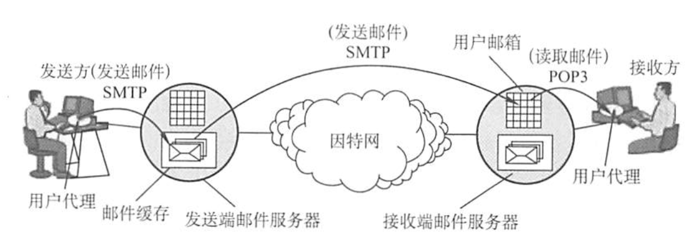
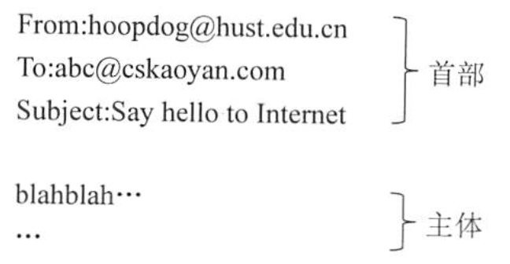

# 电子邮件E-mail
2022.03.16

## 电子邮件系统的组成结构

自从有了因特网，电子邮件就在因特网上流行起来。电子邮件是一种异步通信方式，通信时不需要双方同时在场。电子邮件把邮件发送到收件人使用的邮件服务器，并放在其中的收件人邮箱中，收件人可以随时上网到自己使用的邮件服务器进行读取。一个电子邮件系统应具有如图所示的三个最主要的组成构件，即**用户代理(User Agent)**、**邮件服务器**和**电子邮件使用的协议**，如SMTP、POP3(或IMAP)等。

**用户代理(UA)**:用户与电子邮件系统的接口。用户代理向用户提供一个很友好的接口来发送和接收邮件，用户代理至少应当具有撰写、显示和邮件处理的功能。通常情况下，用户代理就是一个运行在PC上的程序（电子邮件客户端软件），常见的有**Outlook和Foxmail**等。

**邮件服务器**：它的功能是发送和接收邮件，同时还要向发信人报告邮件传送的情况（已交付、被拒绝、丢失等)。邮件服务器采用客户/服务器方式工作，但它必须能够同时充当客户和服务器。

例如，当邮件服务器A向邮件服务器B发送邮件时，A就作为SMTP客户，而B是SMTP服务器；反之，当B向A发送邮件时，B就是SMTP客户，而A就是SMTP服务器。

**邮件发送协议和读取协议**：邮件发送协议用于用户代理向邮件服务器发送邮件或在邮件服务器之间发送邮件，如SMTP；邮件读取协议用于用户代理从邮件服务器读取邮件，如POP3。

注意，SMTP用的是“推”(Push)的通信方式，即用户代理向邮件服务器发送邮件及在邮件服务器之间发送邮件时，SMTP客户将邮件“推”送到SMTP服务器。而POP3用的是“拉”(Pul)的通信方式，即用户读取邮件时，用户代理向邮件服务器发出请求，“拉”取用户邮箱中的邮件。电子邮件的发送、接收过程可简化为如图所示。

下面简单介绍电子邮件的收发过程。

1. 发信人调用用户代理来撰写和编辑要发送的邮件。用户代理用 SMTP 把邮件传送给发送
   端邮件服务器
2. 发送端邮件服务器将邮件放入邮件缓存队列中，等待发送。
3. 运行在发送端邮件服务器的 SMTP 客户进程，发现邮件缓存中有待发送的邮件，就向运
   行在接收端邮件服务器的 SMTP 服务器进程发起建立TCP 连接。
4. TCP连接建立后，SMTP 客户进程开始向远程 SMTP 服务器进程发送邮件。当所有待发送邮件发完后，SMTP 就关闭所建立的TCP连接。
5. 运行在接收端邮件服务器中的 SMTP 服务器进程收到邮件后，将邮件放入收信人的用户邮箱，等待收信人在方便时进行读取。
6. 收信人打算收信时，调用用户代理，使用 POP3 （或 IMAP）协议将自己的邮件从接收端邮件服务器的用户邮箱中取回（如果邮箱中有来信的话）。

## 电子邮件格式语言MIME

### 电子邮件格式

一个电子邮件分为**信封和内容**两大部分，邮件内容又分为**首部和主体**两部分。RFC 822 规定了邮件的首部格式，而邮件的主体部分则让用户自由撰写。用户写好首部后，邮件系统自动地将信封所需的信息提取出来并写在信封上，用户不需要亲自填写信封上的信息邮件内容的首部包含一些首部行，每个首部行由一个关键字后跟冒号再后跟值组成。有些关键字是必需的，有些则是可选的。最重要的关键字是 **To 和 Subject**。
To 是必需的关键宇，后面填入一个或多个收件人的电子邮件地址。电子邮件地址的规定格式为：收件人**邮箱名@邮箱所在主机的域名**，如 abc@cskaoyan.com，其中收信人邮箱名即用户名，abe 在cskaoyan.com 这个邮件服务器上必须是唯一的。这也就保证了 abc@cskaoyan.com 这个邮件地址在整个因特网上是唯一的。
Subject 是可选关键字，是邮件的主题，反映了邮件的主要内容。当然，还有一个必填的关键宇是 From，但它通常由邮件系统自动填入。首部与主体之间用一个空行进行分割。典型的邮件内容如下：

## SMTP和POP3

