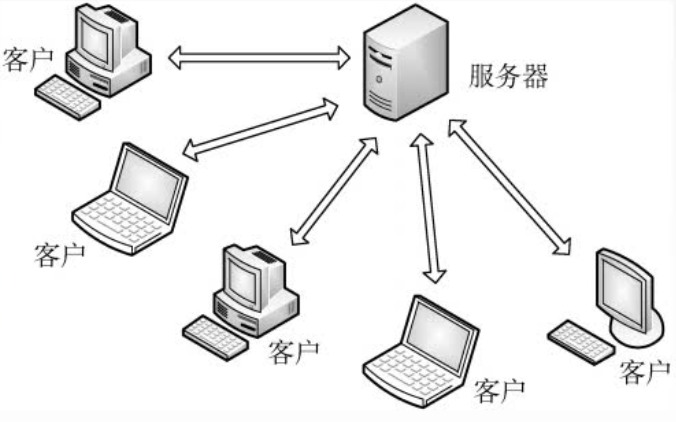
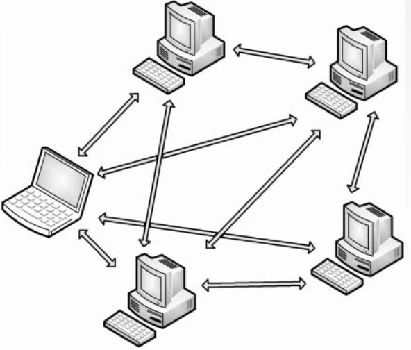

# 网络应用模型
2022.03.15

## CS模型

在客户/服务器(Client/Server,C/S)模型中，有一个总是打开的主机称为服务器，它服务于许多来自其他称为客户机的主机请求。其工作流程如下：

1) 服务器处于接收请求的状态。

2) 客户机发出服务请求，并等待接收结果。

3) 服务器收到请求后，分析请求，进行必要的处理，得到结果并发送给客户机。

客户程序必须知道服务器程序的地址，客户机上一般不需要特殊的硬件和复杂的操作系统。而服务器上运行的软件则是专门用来提供某种服务的程序，可同时处理多个远程或本地客户的要求。系统启动后即自动调用并一直不断地运行着，被动地等待并接收来自各地客户的请求。因此，服务器程序不需要知道客户程序的地址。

客户/服务器模型最主要的特征是：客户是服务请求方，服务器是服务提供方。如Web应用程序，其中，总是打开的Web服务器服务于运行在客户机上的浏览器的请求。当Web服务器接收到来自客户机对某对象的请求时，它向该客户机发送所请求的对象以做出响应。常见的使用客户服务器模型的应用包括**Web**、**文件传输协议(FTP)**、**远程登录**和**电子邮件**等。

客户/服务器模型的主要特点还有：

1) 网络中各计算机的地位不平等，服务器可以通过对用户权限的限制来达到管理客户机的目的，使它们不能随意存储/删除数据，或进行其他受限的网络活动。整个网络的管理工作由少数服务器担当，因此网络的管理非常集中和方便。

2) 客户机相互之间不直接通信。例如，在Web应用中两个浏览器并不直接通信。

3) 可扩展性不佳。受服务器硬件和网络带宽的限制，服务器支持的客户机数有限。

## P2P模型

不难看出，在C/S模型中，服务器性能的好坏决定了整个系统的性能，当大量用户请求服务时，服务器就必然成为系统的瓶颈。P2P模型的思想是整个网络中的传输内容不再被保存在中心服务器上，每个结点都同时具有下载、上传的功能，其权利和义务都是大体对等的。

在P2P模型中，各计算机没有固定的客户和服务器划分。相反，任意一对计算机一称为对等方（Per),直接相互通信。实际上，P2P模型从本质上来看仍然使用客户服务器模式，每个结点既作为客户访问其他结点的资源，也作为服务器提供资源给其他结点访问。当前比较流行的P2P应用有PPlive、Bittorrent和电驴等。

与C/S模型相比，P2P模型的优点主要体现如下：

1) 减轻了服务器的计算压力，消除了对某个服务器的完全依赖，可以将任务分配到各个结点上，因此大大提高了系统效率和资源利用率（例如，播放流媒体时对服务器的压力过大，而通过P2P模型，可以利用大量的客户机来提供服务)。

2) 多个客户机之间可以直接共享文档。

3) 可扩展性好，传统服务器有响应和带宽的限制，因此只能接受一定数量的请求。

4) 网络健壮性强，单个结点的失效不会影响其他部分的结点。

P2P模型也有缺点。在获取服务的同时，还要给其他结点提供服务，因此会占用较多的内存，影响整机速度。例如，经常进行P2P下载还会对硬盘造成较大的损伤。据某互联网调研机构统计，当前P2P程序已占互联网50%~90%的流量，使网络变得非常拥塞，因此各大ISP(互联网服务提供商，如电信、网通等)通常都对P2P应用持反对态度。