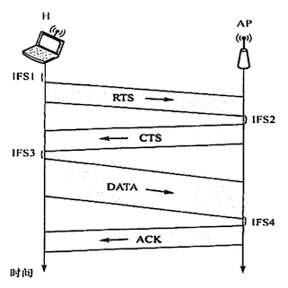

# 介质访问控制

2022.3.9

[toc]

## 信道划分介质访问控制

属于**静态划分信道**的方法

1. 频分复用FDM

2. 时分复用TDM / 同步时分复用

   * TDM所用传输介质的性质是(D)

     A.介质的带宽大于结合信号的位速率

     B.介质的带宽小于单个信号的带宽

     C.介质的位速率小于最小信号的带宽

     D.介质的位速率大于单个信号的位速率

   * 从表面上看,FDM比TDM能更好地利用信道的传输能力,但现在计算机网络更多地使用TDM而非FDM,其原因是(B)

     A.FDM实际能力更差

     B.TDM可用于数字传输而FDM不行

     C.FM技术不成熟

     D.TDM能更充分地利用带宽

3. 统计时分复用STDM / 异步时分复用

   * **STDM帧的时隙数小于集中器连接的用户数**

4. 波分复用WDM

   1. 光复用器=合波器；掺铒光纤放大器EDFA(Erbium Doped Fiber Amplifier)；光分用器=分波器
   2. 密集波分复用DWDM

5. 码分复用CDM

   1. [通俗理解CDMA](https://blog.csdn.net/dog250/article/details/6420427)

   2. 沃尔什向量

      

   3. 一个比特被分为m bit的码片(Chip)，m通常为64或128

   4. 每一个站被指派自己的码片序列(取m=8)，比如：

      |      |   编码   |            码片序列            |
      | ---- | :------: | :----------------------------: |
      | A的1 | 11110000 |   1，1，1，1，-1，-1，-1，-1   |
      | A的0 | 00001111 |   -1，-1，-1，-1，1，1，1，1   |
      | B的1 | 11111111 |     1，1，1，1，1，1，1，1     |
      | B的0 | 00000000 | -1，-1，-1，-1，-1，-1，-1，-1 |

      CSMA要求，不同编码必须正交

      发送端，A发送0，B发送1
      $$
      [-1,-1,-1,-1,+1,+1,+1,+1]\\+[+1,+1,+1,+1,+1,+1,+1,+1]\\=
      [0,0,0,0,2,2,2,2]
      $$
      A接受端
      $$
      \frac{[0,0,0,0,2,2,2,2]\cdot [1,1,1,1,-1,-1,-1,-1]}{8}=-1
      $$
      B接受端
      $$
      \frac{[0,0,0,0,2,2,2,2]\cdot [1,1,1,1,1,1,1,1]}{8}=1
      $$

   5. 扩频(Spread Specturm)

      1. 原因：一个码片有m位，原来发送比特速率为b bit/s，现在就需要扩充到mb bit/s，对应的频率域也需要扩充。
      2. 直接序列扩频（DSSS）
      3. 调频扩频（FHSS）

## 随机访问介质访问控制

属于**动态划分信道**的方法

1. ALOHA协议：不听就说

   1. **纯ALOHA协议**

      1. 发送：想发就发
      2. 冲突：等会儿再发
      3. 网络吞吐量：S是T时间内成功发送帧数，G是网络负载量

      $$
      S = G\cdot e^{-2G}\\
      S_{max}=S(0.5)=0.184
      $$

   2. **时隙ALOHA协议**

      1. 发送：时隙开始时发
      2. 冲突：下个时隙概率p重传，否则以此类推
      3. 网络吞吐量：S是T时间内成功发送帧数，G是网络负载量

      $$
      S = G\cdot e^{-G}\\
      S_{max}=S(0.5)=0.368
      $$

   * 小坑例题：10000个航空订票站在竞争使用单个时隙 ALOHA通道,各站平均每小时做18次请求,每个时隙是125μs。总通信负载约为多少?
     $$
     G=\frac{10000\cdot 18\cdot 125μs}{3600s}=0.00625 次/s
     $$

   * 例题：一组N个站点共享一个56kb/s的纯 ALOHA信道,每个站点平均每100s输出一个1000bit的帧,即使前一个帧未发送完也依旧进行。问N可取的最大值是多少?
     $$
     \begin{align}
     纯ALOHA信道利用率&=0.184\\
     信道带宽B&=0.184\cdot56kHz=10.304kHz\\
     单个站需要的带宽&=\frac{1000bit}{100s}=10Hz\\
     N_{max}&=\lfloor \frac{10304}{10}\rfloor=1030
     \end{align}
     $$
     

2. CSMA协议：先听再说——“听”：监测电压摆动值

   1. **1-坚持CSMA**

      1. 信道空闲：**立刻传输**
      2. 信道忙：忙则等待，**一直监听信道，空闲立刻传输**
      3. 发生冲突(一段时间内未收到肯定回复)：等待一个随机长的时间再监听,重复上述过程。
      4. 优点:只要媒体空闲,站点就马上发送,避免了媒体利用率的损失。
      5. 缺点:假如有两个或两个以上的站点有数据要发送,冲突就不可避免。

   2. **非坚持CSMA**

      1. 信道空闲：**立刻传输**

      2. 信道忙：忙则等待，**等待随机时间后，再监测到空闲再传输**

      3. 优点:采用随机的重发延迟时间可以减少冲突发生的可能性。

      4. 缺点:可能存在大家都在延迟等待过程中,使得媒体仍可能处于空闲状态,媒体使用率降低。

      5. 细节例题：在CSMA的非坚持协议中,当媒体忙时,则(C)直到媒体空闲。

         A.延迟一个固定的时间单位再侦听 B.继续侦听

         C.延迟一个随机的时间单位再侦听 D.放弃侦听

   1. **p-坚持CSMA**
      1. 信道空闲：**概率p传输本时间槽传输，概率1-p下一个时间槽传输**
         1. 信道忙：忙则等待，**等待随机时间后，再监测到空闲再传输**
         2. 优点：既能像非坚持算法那样减少冲突,又能像1-坚持算法那样减少媒体空闲时间的这种方案。
         3. 缺点：发生冲突后还是要坚持把数据帧发送完,造成了浪费。

   |  种类  |                   信道空闲                   |               信道忙               |
   | :----: | :------------------------------------------: | :--------------------------------: |
   | 1-坚持 |                    直接发                    |          一直监听直到空闲          |
   | 非坚持 |                    直接发                    | （改进方案）过会儿监听看看是否空闲 |
   | p-坚持 | （改进方案）概率p现在发，概率1-p下一时间槽发 |       过会儿监听看看是否空闲       |

   

3. **CSMA/CD**

   * 适用网络：**总线型或半双工**

   * 先听再说，边说边听，冲突不说，随机重说

   * 步骤

     1)适配器从网络层获得一个分组,封装成以太网帧,放入适配器的缓存,准备发送。

     2)如果适配器侦听到信道**空闲**,那么它开始**发送**该帧。如果适配器侦听到信道**忙**,那么它**持续侦听**直至信道上没有信号能量,然后开始发送该帧。

     3)在发送过程中,适配器**持续检测**信道。若一直未检测到碰撞,则顺利地把这个帧发送完毕。若检测到**碰撞**,则**中止数据的发送**,并发送一个**拥塞信号**,以让所有用户都知道

     4)在中止发送后,适配器就执行**指数退避算法**,等待一段随机时间后返回到步骤2)。

   * **争用期/冲突窗口/碰撞窗口**：2τ (端到端传播时延的二倍)

   * **最小帧长**：

     * 原因（个人理解）：争用期可能发送的最多内容是最小帧长。如果争用期时检测到碰撞，发送就会停止，接收端收到内容小于最小帧长说明没发完，直接丢弃；如果争用期时未检测到碰撞，会成功发送，帧长会大于最小帧长。

     $$
     最小帧长=总线传播时延\cdot 数据传输速率\cdot 2
     $$

     * 应用：**以太网帧最小帧长为64B**，内容少于64B的帧会用整数个字节填充。

   * 二进制指数规避算法/动态退避：

     1)确定**基本退避时间**,一般取两倍的总线端到端传播时延**2τ**(即**争用期**)。

     2)定义参数重传次数k,它等于重传次数,但k不超过1,即**k=min[重传次数,10]**。当重传次数不超过10时,k等于重传次数;当重传次数大于10时,k就不再增大而一直等于10(这个条件往往容易忽略,请读者注意)。

     3)从离散的**整数集合[0,1,..,2-1]中随机取出一个数r**,重传所需要退避的时间就是r倍的基本退避时间,即**2rτ**

     4)当重传达**16次仍不能成功**时,说明网络太拥挤,认为此帧永远无法正确发出,**抛弃此帧**并向高层报告出错(这个条件也容易忽略,请读者注意)。

   * 【2016统考真题】如下图所示,在Hub再生比特流的过程中会产生1.535s延时( Switch和Hub均为100Base-T设备),信号传播速率为200m/s,不考虑以太网帧的前导码,则H3和H4之间理论上可以相距的最远距离是(）

     

     A.200m

     B.205m

     C.359m
     
     D.512m
     $$
     100BaseT\to100Mbps\\
     以太网\to64B\\
     $$
     
     $$
     \begin{align}
     RTT=传播时延+信号再生时延&=\frac{最短帧长}{发送速率}\\
     RTT=\frac{2x}{200m/s}+2\cdot1.535\mu s&=\frac{64B}{100MBps}\\
     \frac{x}{200m/s}&=0.64\cdot8b\mu s-1.535\mu s=2.56-1.535=1.025\mu s\\
     x&=205m
     \end{align}
     $$
     
   * 【2010统考真题】某局域网采用CSMA/CD协议实现介质访问控制,数据传输速率为10Mb/s,主机甲和主机乙之间的距离是2km,信号传播速率是200000km/s。请回答下列问题,要求说明理由或写出计算过程

     1)若主机甲和主机乙发送数据时发生冲突,则从开始发送数据的时刻起,到两台主机均检测到冲突为止,最短需要经过多长时间?最长需要经过多长时间(假设主机甲和主机乙在发送数据的过程中,其他主机不发送数据)?
     $$
     t_{max}=RTT=\frac{2\cdot 2km}{200000km/s}=0.02ms\\
     t_{min}=RTT/2=\frac{2km}{200000km/s}=0.01ms
     $$
     2)若网络不存在任何冲突与差错,主机甲总是以标准的最长以太网数据帧(1518字节向主机乙发送数据,主机乙每成功收到一个数据帧后立即向主机甲发送一个64字节的确认帧,主机甲收到确认帧后方可发送一个数据帧。此时主机甲的**有效数据传输速率**是多少(**不考虑以太网的前导码**)?【坑：以太网数据帧长1500】
     $$
     \begin{align}
     【t_{数据}&=\frac{1518\cdot8}{10Mb/s}=1.2144 ms】错了！\\
     t_{数据}&=\frac{1500\cdot8}{10Mb/s}=1.2 ms\\
     t_{总}&=\frac{1518\cdot8+64\cdot8}{10Mb/s}+RTT=1.2856ms\\
     c&=\frac{1.2}{1.2856}\cdot10Mb/s=9.33Mb/s
     \end{align}
     $$
     

4. **CSMA/CA**

   * 适用网络：**无线**连接局域网（有线连接局域网——CSMA/CD）

   * 不用CSMA/CD原因：1. **碰撞检测硬件花费大**（接收信号强度低，信号强度变化范围大）2. **“隐蔽站”问题**：当A和C都检测不到信号,认为信道空闲时,同时向终端B发送数据帧,就会导致冲突。

   * 802.11规定帧间间隔**IFS**

     1)[**SIFS**](https://en.wikipedia.org/wiki/Short_Interframe_Space)(短IFS):最短的IFS,用来分隔属于一次对话的各帧,使用SIFS的帧类型有ACK帧、CTS帧、分片后的数据帧,以及所有回答AP探询的帧等。

     2)[**PIFS**](https://en.wikipedia.org/wiki/Point_coordination_function#PCF_Interframe_Space)(点协调IFS):中等长度的IFS,在PCF操作中使用。

     3)**[DIFS](https://en.wikipedia.org/wiki/Distributed_coordination_function)**(分布式协调IFS):最长的IFS,用于异步帧竞争访问的时延。

   * 【转载】IFS详解（原文链接：https://www.gdyunjie.com/news/news1371.html）

     帧间间隔(IFS)是在媒体访问控制(MAC)子层中运行的帧传输之间的等待时间段，在该子层中，使用了具有冲突避免功能的载波侦听多路访问(CSMA / CA)。这些技术用于防止基于IEEE 802.11的WLAN标准(Wi-Fi)中定义的冲突。IFS是最后一个帧的传输完成到下一帧的开始传输之间的时间段，除了可变的退避时间段。

     　　**1.缩小的帧间空间(RISF)**

     　　减少的帧间间隔是高优先级帧中使用的持续时间很短的帧间间隔，用于发送突发帧。RISF是在802.11e QoS修订版中引入的，RISF的持续时间仅为2μs。

     　　当站点需要发送多个帧时，在各个帧之间引入RISF。它确保没有其他站点找到机会占用帧突发内的信道。

     　　**2.短帧间间隔(SISF)**

     　　短帧间间隔(SIFS)是无线设备在**接收帧和响应帧之间所需的时间间隔**。它用于分布式协调功能(DCF)方案中，这是用于防止冲突的强制性技术。

     　　SIFS的持续时间等于射频(RF)，物理层收敛过程(PLCP)和MAC(介质访问控制)层的处理延迟的总和。

     　　在IEEE 802.11网络中，SIFS是在确认帧和清除发送(CTS)帧传输之前和之后保持的帧间间隔。SISF的持续时间通常为10μs。

     　　**3.PCF帧间空间(PISF)**

     　　点协调功能(PCF)是一种可选技术，用于防止集中控制的WLAN中发生冲突。PCF与强制性分布式协调功能(DCF)一起使用。

     　　集中协调通信的接入点(AP)等待PIFS持续时间来掌握信道。由于PIFS小于DIFS持续时间，因此AP始终具有优先于其他站访问信道的权限。PISF是SISF和时隙时间之和。

     　　**4.DCF帧间空间(DISF)**

     　　分布式协调功能(DCF)是一项强制性技术，用于防止基于IEEE 802.11的WLAN标准(Wi-Fi)中发生冲突。它是一种媒体访问控制(MAC)子层技术，用于使用带冲突避免的载波侦听多路访问(CSMA / CA)的区域。

     　　使用DCF技术，**站点需要先感知无线信道的状态，然后才能发出发送帧的请求**。工作站在发送其请求帧之前应等待的时间间隔称为DCF帧间间隔(DIFS)。DISF计算为SISF与时隙时间的两倍。

     　　**5.任意帧间空间(AISF)**

     　　在任意帧间间隔中，根据访问类别(即要传输的数据类型)对站点进行优先级排序。在该方案中，在该站可以发送其帧之前，缩短或扩展了无线站的等待时间(等于AISF)。较高优先级的电台被分配较短的AISF。这意味着较高优先级的站必须等待较短的时间间隔才能发送其帧。这对于延迟至关重要的传输(例如视频流或语音流)特别重要。

     　　AISF的计算公式为：AISF编号*时隙+ SISF。

     　　**6.扩展帧间空间(EISF)**

     　　扩展帧间间隔是在损坏帧的情况下除了强制DISF之外还使用的额外等待时间。

   * **CSMA/CA算法**（RTS与CTS可选）

     * **RTS**（request to send - 请求发送），发送数据前,先检测信道是否空闲。RTS包括发射端的地址、接收端的地址、下一份数据将持续发送的时间等信息;信道忙则等待。
     * 接收端收到RTS后,将响应**CTS**( clear to send)。
     * 发送端收到CTS后,开始发送数据帧(同时**预约信道**:发送方告知其他站点自己要传多久数据)
     * 接收端收到数据帧后,将用CRC来检验数据是否正确,正确则响应**ACK帧**。
     * 发送方收到ACK就可以进行下一个数据帧发送,若没有则一直重传至规定重发次数为止(采用**二进制指数退避算法**来确定随机的推迟时间)

   * **处理隐蔽站问题**

     * RTS与CTS

   * CA的CD区别

     |            | CSMA/CD            | CSMA/CA                                  |
     | ---------- | ------------------ | ---------------------------------------- |
     | 传输介质   | 总线式             | 无线局域网                               |
     | 检测方式   | 总线电压摆动值     | 能量检测ED、载波检测CS、能连载波混合检测 |
     | 效果       | 可以检测但无法避免 | 只能尽量避免                             |
     | 发送数据时 | 检测冲突           | 不检测冲突                               |
   
   * 小坑例题：【2020统考真题】在某个IEEE802.11无线局域网中,主机H与AP之间发送或接收CSMA/CA帧的过程如下图所示。在H或AP发送帧前等待的帧间间隔时间(IFS)中,最长的是()
   
     
   
     答案：IFS1。IFS1是DISF，剩下都是SIFS。
   
   * 【2018全国联考】IEEE802.11无线局域网的MAC协议CSMA/CA进行信道预约的方法是D
   
     A.发送确认帧
   
     B.采用二进制指数退避
   
     C.使用多个MAC地址
   
     D.交换RTS与CTS帧

## 轮询访问介质访问控制

**令牌传递协议**（属于**动态划分信道**的）

* 令牌（Token）

* 传数据步骤：

  1)网络**空闲**时,环路中只有令牌帧在**循环传递**。

  2)令牌传递到**有数据要发送**的站点时,该站点就**修改令牌中的一个标志位**,并在令牌中**附加**自己需要传输的**数据**,将令牌变成一个数据帧,然后将这个数据帧发送出去

  3)**数据帧(令牌)沿着环路传输**,接收到的**站点**一边转发数据,一边**查看帧的目的地址**。如果目的地址和自己的地址**相同**,那么接收站就**复制数据帧**以便进一步处理。

  4)数据帧沿着环路传输,直到到达该帧的**源站点**,源站点收到自己发出去的帧后便**不再转发**。同时,通过检验返回的帧来查看数据传输过程中**是否出错**,若有错则重传。

  5)**源站点**传送完数据后,**重新产生一个令牌**,并传递给下一站点,以交出信道控制权。

* 适用类型：负载很高的广播信道

* 物理拓扑：不一定是环
  逻辑拓扑：环

* 在令牌环网中,当所有站点都有数据帧要发送时,一个站点在最坏情况下等待获得令牌和发送数据帧的时间等于(B)

  A.所有站点传送令牌的时间总和

  B.所有站点传送令牌和发送帧的时间总和

  C.所有站点传送令牌的时间总和的一半

  D.所有站点传送令牌和发送帧的时间总和的一半

**轮询协议**