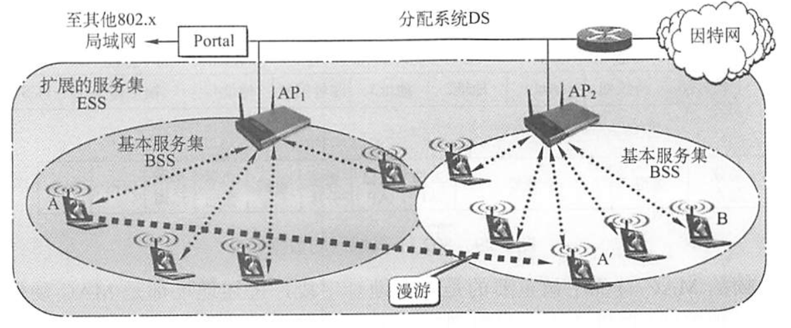
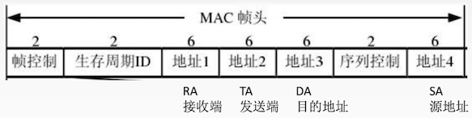
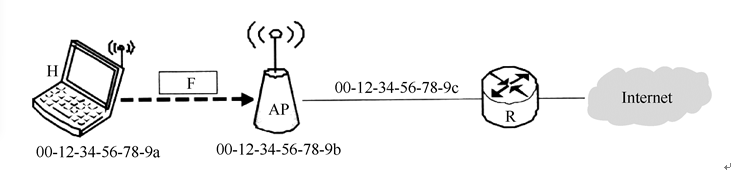

# 局域网

2023.2.15

## LAN的概念与结构

1. 拓扑结构：星型，环型，总线型，星型和总线型复合结构
2. 传输介质：双绞线（主流），同轴电缆，光纤
3. 介质访问控制方式：CSMA/CD或令牌总线——总线型局域网，令牌环——环型局域网
4. 具体网络种类：

|                           网络种类                           |  IEEE标准  |               协议                |    物理结构    | 逻辑结构 |
| :----------------------------------------------------------: | :--------: | :-------------------------------: | :------------: | :------: |
| [以太网](https://zh.wikipedia.org/wiki/%E4%BB%A5%E5%A4%AA%E7%BD%91) | IEEE 802.3 | 一般CSMA/CD 但10BASE-T就不用 | 星型或扩展星型 |  总线型  |
| [令牌环网](https://zh.wikipedia.org/wiki/%E4%BB%A4%E7%89%8C%E7%8E%AF) | IEEE 802.5 |                                   |      星型      |   环型   |
| [FDDI网](https://zh.wikipedia.org/wiki/%E5%85%89%E7%BA%A4%E5%88%86%E5%B8%83%E5%BC%8F%E6%95%B0%E6%8D%AE%E6%8E%A5%E5%8F%A3) | IEEE 802.8 |                                   |     双环型     |   环型   |

5. 数据链路层 = LLC(逻辑链路控制子层,现在已经意义不大了)+MAC(介质访问控制子层)

## 以太网与IEEE802.3

1. 特点：**无连接，不可靠服务；曼彻斯特编码**
   无连接:发送方和接收方之间无“握手过程”。 
   不可靠:**不**对发送方的数据帧**编号**，接收方**不**向发送方进行**确认**，差错帧直接丢弃，差错纠正由高层负责

2. [种类](https://zhuanlan.zhihu.com/p/139707963)

   1. **标准以太网【重要！！！】**

   |    参数    |       10BASE5        |       10BASE2        |   10BASE-T   |    10BASE-FL    |
   | :--------: | :------------------: | :------------------: | :----------: | :-------------: |
   |  传输媒体  | 基带同轴电缆（粗缆） | 频带同轴电缆（细缆） | 非屏蔽双绞线 | 光线对（850nm） |
   |    编码    |       曼彻斯特       |       曼彻斯特       |   曼彻斯特   |    曼彻斯特     |
   |  拓扑结构  |        总线型        |        总线型        |     星型     |     点对点      |
   |  最大段长  |         500m         |         185m         |     100m     |       2km       |
   | 最多节点数 |         100          |          30          |      2       |        2        |
   |  传输速率  |        10Mb/s        |        10Mb/s        |    10Mb/s    |     10Mb/s      |

   2. **高速以太网【重要！！！】**

   |   参数   |                100BASE-T                 |               吉比特以太网               | 十吉比特以太网 |
   | :------: | :--------------------------------------: | :--------------------------------------: | :------------: |
   | 传输媒体 |                  双绞线                  |               光纤或双绞线               |      光纤      |
   |   协议   | 半双工: CSMA/CD 全双工: 不用CSMA/CD | 半双工: CSMA/CD 全双工: 不用CSMA/CD |   只有全双工   |
   | 拓扑结构 |                   星型                   |                                          |                |
   | 传输速率 |                 100Mb/s                  |                  1Gb/s                   |     10Gb/s     |

   3. 以太网种类相关例题

      1. 如果使用5类UTP来设计一个覆盖范围为200m的10BASET以太网,那么需要采用的设备是()

         A.放大器

         B.中继器

         C.网桥

         D.路由器

         10BASET——100m，需要【中继器】

      2. 10BaseT以太网采用的传输介质是()。

         A.双绞线

         B.同轴电缆

         C.光纤

         D.微波

         【双绞线】

      3. IEE802.3标准规定,若采用同轴电缆作为传输介质,在无中继的情况下,传输介质的最大长度不能超过(）

         A.500m

         B.200m

         C.100m

         D.50m

         【500m】

      4. 下列关于吉比特以太网的说法中,错误的是()

         A.支持流量控制机制

         B.采用曼彻斯特编码,利用光纤进行数据传输

         C.数据的传输时间主要受线路传输延迟的制约

         D.同时支持全双工模式和半双工模式

         【B】吉比特以太网的物理层有两个标准:IEEE802.z和IEEE802.3ab,前者采用光纤通道,后者采用4对UTP5类线

      5. 【2019统考真题】100 BaseT快速以太网使用的导向传输介质是(A)

         A.双绞线B.单模光纤C.多模光纤D.同轴电缆

         

   4. 计算机与外界局域网的连接是通过主机箱内插入的一块**网络接口板**[又称**网络适配器(Adapter)**或**网络接口卡(Network Interface Card,NIC)**]实现的。全世界的每块网卡在出厂时都有一个唯一的代码,称为**介质访问控制(MAC)地址**。

   5. **MAC帧格式——DIX Ethernet V2**

      

      1. 前导码（8B）=前同步码（7B）+帧开始定界符（1B）。前同步码就像，一二一，喊口号，一起走。帧开始定界符一开始也是101010，最后两个是11，就像读课文前的“一二”。
      2. 目的地址（6B）
      3. 源地址（6B）
      4. 类型（2B）
      5. **数据（46～1500B）**。IP数据报就是在这里。以太网帧长最短64B，其中数据部分是46B，其他部分18B。以太网MTU是1500B。
      6. FCS（4B）
      7. 为什么没有结束定界符？因为以太网用曼彻斯特编码，0和1都是01或10，而没有信号的时候就是00。

   6. **MAC帧格式——IEEE802.3**

      1. 第三个字段是长度/类型

      2. 当长度/类型字段值小于0x0600时,数据字段必须装入LLC子层。

   7. 【小坑例题】网卡实现的主要功能在()

      A.物理层和数据链路层

      B.数据链路层和网络层

      C.物理层和网络层

      D.数据链路层和应用层

      答案：A，因为{网卡}对应{以太网协议}，对应物理层与链路层

   8. 【小坑例题】同一局域网中的两个设备具有相同的静态MAC地址时,会发生(C)

      A.首次引导的设备排他地使用该地址,第二个设备不能通信

      B.最后引导的设备排他地使用该地址,另一个设备不能通信

      C.在网络上的这两个设备都不能正确通信

      D.两个设备都可以通信,因为它们可以读分组的整个内容,知道哪些分组是发给它们的,而不是发给其他站的

      【王道解析】在使用静态地址的系统中,如果有重复的硬件地址,那么这两个设备都不能正常通信,原因是:第一,目的MAC地址等于本机MAC地址的帧是不会被发送到网络上去的;第二,其他设备的用户发送给一个设备的帧也会被另一个设备接收,其中必有一个设备必须处理不属于本设备的帧,浪费了资源;第三,正确实现的ARP软件都会禁止把同一个MAC地址绑定到两个不同的IP地址,这就使得具有相同MAC地址的设备上的用户在会话时都发生时断时续的现象

## IEEE802.11无线局域网

### 无线局域网的组成

无线局域网可分为两大类:有**固定基础设施的无线局域网**和**无固定基础设施的移动自组织网络**。所谓“固定基础设施”,是指预先建立的、能覆盖一定地理范围的固定基站。

1. **有固定基础设施无线局域网**

   * IEEE制定了无线局域网的**802.11**系列协议标准。802.11使用**星形拓扑**,其**中心称为接入点(Access Point,AP)**,在MAC层使用**CSMA/CA**协议。使用802.11系列协议的局域网又称**Wi-Fi**。

   * 基本服务集：802.11标准规定无线局域网的最小构件是**基本服务集**(Basic Service Set,**BSS**)。基本服务集包括一个接入点和若干移动站。

   * AP/基站：各站在本BSS内之间的通信,或与本BSS外部站的通信,都必须通过本BSS的AP。上面提到的**AP就是**基本服务集中的**基站**(base station)。

   * SSID/网络名：安装AP时,必须为该AP分配一个不超过32字节**服务集标识符**(Service Set IDentifier,SSID)和一个信道。**SSID是**指使用该AP的**无线局域网的名字**。

   * 基本服务区：一个基本服务集覆盖的地理范围称为一个**基本服务区**(Basic Service Area,BSA),无线局域的基本服务区的范围直径一般不超过100m。

   * DS与SS：一个基本服务集可以是孤立的,也可通过AP连接到一个**分配系统**( Distribution System,DS),然后再连接到另一个基本服务集,就构成了一个**扩展的服务集**(Extended Service Set,SS)。分配系统的作用就是使扩展的服务集对上层的表现就像一个基本服务集一样。

   * ESS：**ESS**还可以通过一种称为**Portal(门户)**的设备为无线用户提供到有线连接的以太网的接入。门户的作用相当于一个网桥。在下图中,移动站A如果要和另一个基本服务集中的移动站B通信,就必须经过两个接入点AP1和AP2, A→AP1→AP2→B,注意**AP1到AP2通信是使用有线**传输的。移动站A从某个基本服务集漫游到另一个基本服务集时(图3.27中的A),仍然可保持与另一个移动站B的通信。但A在不同的基本服务集使用的AP改变了。

     

2. **无固定基础设施移动自组织网络**，又称自组网络(ad hoc network)。

   * 自组网络没有上述基本服务集中的AP,而是由一些平等状态的移动站相互通信组成的临时网络。各结点之间地位平等,中间结点都转发结点,因此都具有路由器的功能。
   * 自组网络通常是这样构成的:一些可移动设备发现它们附近还有其他的可移动设备,并且要求和其他移动设备进行通信。自组网络中的每个移动站都要参与网络中其他移动站的路由的发现和维护,同时由移动站构成的网络拓扑可能随时间变化得很快,因此在固定网络中行之有效的些路由选择协议对移动自组网络已不适用,需引起特别的关注。
   * **自组网络和移动IP并不相同**。**移动IP技术**使漫游的主机可以用多种方法连接到因特网,其**核心**网络功能**仍然是基于固定网络**中一直使用的各种路由选择协议。而**自组网络**是把移动性扩展到无线领域中的自治系统,**具有自己特定的路由选择协议,并且可以不和因特网相连**。

### **802.11局域网的MAC帧**

802.11帧共有三种类型,即**数据帧、控制帧和管理帧**。数据帧的格式如图所示。

802.11数据帧由以下三大部分组成：

1. **MAC首部**,共30字节。帧的复杂性都在MAC首部。

   （RA，TA$$\to$$收发方地址；DA，SA$$\to$$目的与源头地址；**1234，收发目源**）

2. **帧主体**,即帧的数据部分,不超过2312字。它比以太网的最大长度长很多。

3. **帧检验序列FCS**是尾部,共4字节。

4. 802.11 MAC帧头格式

   [更详细的博客](https://changeself.cn/news/shownews.php?id=96)

|           功能            | To DS | From DS | Address1(RA) | Address2(SA) | Address3(DA) | Address4(SA) |
| :-----------------------: | :---: | :-----: | :----------: | :----------: | :----------: | :----------: |
|           IBSS            |   0   |    0    |      DA      |      SA      |    BSSID     |    未使用    |
|  To AP 基础结构类型  |   1   |    0    |    BSSID     |      SA      |      DA      |    未使用    |
| From AP 基础结构类型 |   0   |    1    |      DA      |    BSSID     |      SA      |    未使用    |
|  WDS 无线分布式系统  |   1   |    1    |      RA      |      TA      |      DA      |      SA      |

下面是我自己总结的一张图：

5. [例题](https://www.nowcoder.com/questionTerminal/91043687ac5f4e51a498fb7060fd86a4)【2017年统考真题】: 在下图所示的网络中，若主机H发送一个封装访问Internet的IP分组的IEEE 802.11数据帧F，则帧F的地址1、地址2和地址3分别是(B)

   

   A. 00-12-34-56-78-9a，00-12-34-56-78-9b，00-12-34-56-78-9c
   B. 00-12-34-56-78-9b，00-12-34-56-78-9a，00-12-34-56-78-9c
   C. 00-12-34-56-78-9b，00-12-34-56-78-9c，00-12-34-56-78-9a
   D. 00-12-34-56-78-9a，00-12-34-56-78-9c，00-12-34-56-78-9b

## VLAN

1. **传统局域网的局限**

   1. • **缺乏流量隔离**:即使把组流量局域化道 一个单一交换机中，广播流量仍会跨越 整个机构网络(ARP、RIP、DHCP协议)

      • **管理用户不便**:如果一个主机在不同组 间移动，必须改变物理布线，连接到新 的交换机上。

      • **路由器成本较高**:局域网内使用很多路 由器花销较

2. **VLAN基本概念**

   虚拟局域网VLAN(Virtual Local Area Network)是一种**将局域网内的设备划分成与物理位置无关的逻辑组 的技术**，这些逻辑组有某些共同的需求。每个VLAN是一个单独的广播域/不同的子网。

3. **VLAN实现**

   1. 比普通的以太网的MAC帧多了4字节VLAN标记
   2. VLAN标记的前两个字节表明是IEEE 802.1Q帧，接下来4位没用，**后面12位是VLAN标识符VID**， 唯一表示了该以太网帧属于哪个VLAN。
   3. VID的取值范围为0~4095，但0和4095都不用来表示VLAN，因此用于**表示VLAN的有效VID取值范围为1~4094**。
   4. IEEE 802.1Q帧是由**交换机来处理**的，而不是由用户主机来处理的。(即**主机和交换机之间只交换普通的以太网帧**)

4. 以下关于虚拟局域网特性的描述中，错误的是(D)。
   A.虚拟局域网是建立在局域网交换技术基础上的 
   B.虚拟局域网可以将局域网上的结点划分成若干个「逻辑工作组」，那么一个逻辑工作组就是一个虚拟网络 
   C.逻辑工作组的结点组成不受物理位置的限制 
   D.虚拟网络建立在网络交换机之上，它以硬件方式来实现逻辑工作组的划分与管理

5. 下列关于虚拟局域网(VLAN)的说法中,不正确的是(B)

   A.虚拟局域网建立在交换技术的基础上

   B.虚拟局域网通过硬件方式实现逻辑分组与管理

   C.虚拟网的划分与计算机的实际物理位置无关

   D.虚拟局域网中的计算机可以处于不同的局域网中

   可以在不同局域网！比如这个图：

   

6. 【重要】划分虚拟局域网(VLAN)有多种方式,(C)不是正确的划分方式。

   A.基于交换机端口划分

   B.基于网卡地址划分

   C.基于用户名划分

   D.基于网络层地址划分

   一般有**三种划分VLAN的方法**。①**基于端口**,将交换机的若干端口划为一个逻辑组,这种方法最简单、最有效,如果主机离开了原来的端口,那么就可能进入一个新的子网。②**基于MAC地址**,按MAC地址将一些主机划分为一个逻辑子网,当主机的物理位置从一个交换机移动到另个交换机时,它仍然属于原来的子网。③**基于IP地址**,根据网络层地址或协议划分LAN,这样VLAN就可以**跨越路由器进行扩展**,将多个局域网的主机连接在一起。

7. 下列选项中,(C)不是虚拟局域网(VLAN)的优点。

   A.有效共享网络资源

   B.简化网络管理

   C.[链路聚合](https://zh.wikipedia.org/wiki/%E9%93%BE%E8%B7%AF%E8%81%9A%E5%90%88)

   D.提高网络安全性

   选项A、B和D都是VLAN的优点。**链路聚合是解决交换机之间的宽带瓶颈问题的技术**。
