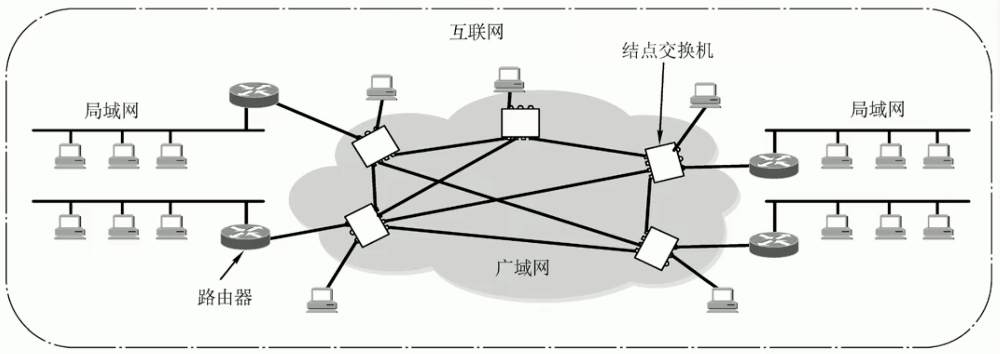
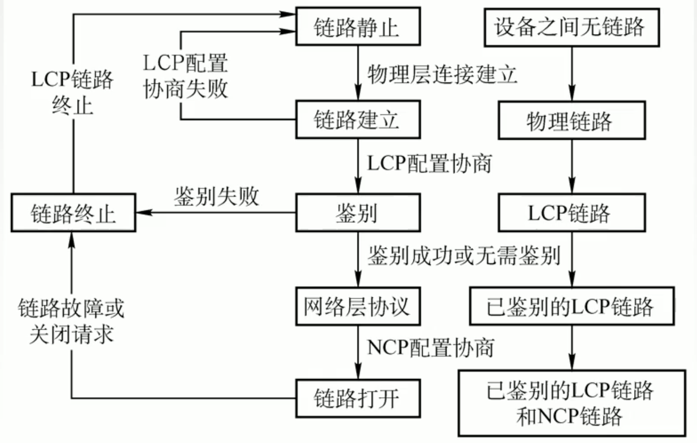
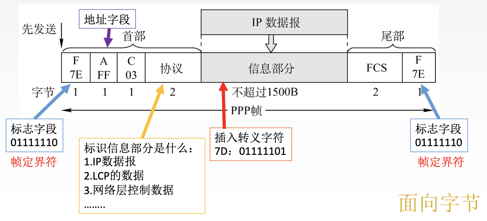

# 广域网

2022.2.15

[toc]

## 广域网基本概念

广域网(WAN, Wide Area Network),通常跨接很大的物理范围,所覆盖的范围从几十公里到几千公里,它能连接多个城市或国家,或横跨几个洲并能提供远距离通信,形成国际性的远程网络。

广域网的通信子网主要使用**分组交换技术**。广域网的通信子网可以利用公用分组交换网、卫星通信网和无线分组交换网,它将分布在不同地区的局域网或计算机系统互连起来,达到资源共享的目的。

因特网(Internet)是世界范围内最大的广域网。

与局域网的关系：

|             | 广域网                                                       | 局域网                 |
| :---------: | :----------------------------------------------------------- | ---------------------- |
|  覆盖范围   | 很广，通常跨区域                                             | 很小，通常在一个区域内 |
|  连接方式   | 节点间点对点连接，为了提高网络可靠性，一个节点交换机往往与多个节点交换机相连 | 普遍采用多点接入技术   |
| OSI参考模型 | 物理+数据链路+【网络层】                                     | 物理层+数据链路        |
|   着重点    | 强调资源共享                                                 | 强调数据传输           |

联系与相似点：广域网与局域网二者平等（而不是包含）；连接到一个广域网或局域网上的主机在该网进行通信时，只需要使用其网络的物理地址

## PPP协议

1. PPP( Point-to-Point Protocol，点对点协议 )是使用**串行**线路通信的**面向字节**的协议,该协议应用在直接连接两个结点的链路上，**只支持全双工**。设计的目的主要是用来通过拨号或专线方式建立点对点连接发送数据,使其成为各种主机、网桥和路由器之间简单连的一种共同的解决方案。

2. 背景：PPP协议是在**SLIP协议**的基础上发展而来的,它既可以在异步线路上传输,又可在同步线路上使用;不仅用于Modem链路,也用于租用的路由器到路由器的线路背景:SLIP主要完成数据报的传送,但没有寻址、数据检验、分组类型识别和数据压缩等功能,只能传送分组。如果上层不是IP协议,那么无法传输,并且此协议对一些高层应用也不支持,但实现比较简单。为了改进SLIP的缺点,于是制定了点对点协议(PPP）。

3. PPP协议应满足的要求

   1. 简单: 对于链路层的帧,**无需纠错,无需序号,无需流量控制**

   2. 封装成帧: **帧定界符**

   3. 透明传输: 与帧定界符一样比特组合的数据该如何处理:**异步线路用字节填充,同步线路用比特填充**。
   4. 多种网络层协议: 封装📦IP数据报可以采用**多种协议**。
   5. 多种类型链路: 串行/并行,同步/异步,电/光
   6. 差错检测: **错就丢弃**。
   7. 检测连接状态: 链路是否正常工作。
   8. 最大传送单元数据部分: 最大长度MTU。(1500B)
   9. 网络层地址协商: 知道通信双方的网络层地址。
   10. 数据压缩协商

4. PPP例题

   1. 为实现透明传输(注:默认为异步线路),PPP使用的填充方法是(B，异步字节，同步比特)

      A.位填充

      B.字符填充

      C.对字符数据使用字符填充,对非字符数据使用位填充

      D.对字符数据使用位填充,对非字符数据使用字符填充

   2. 以下对PPP的说法中,错误的是(B，PPP确实支持差错控制，错就丢弃)

      A.具有差错控制能力

      B.仅支持IP协议

      C.支持动态分配IP地址

      D.支持身份验证

      

5. PPP协议应无需满足的要求: 纠错、流量控制、序号、不支持多点线路

6. PPP协议有三个组成部分

   1. 一个将IP数据报封装到串行链路的方法。（同步串行/异步串行）。P数据报在PPP帧中就是其信息部分,这个信息部分的长度受最大传送单元(MTU)的限制。
   2. **链路控制协议(LCP)**。一种扩展链路控制协议,用于建立、配置、测试和管理数据链路（**物理链路**）。可以管理**身份验证**的功能
   3. **网络控制协议(NCP)**。PPP协议允许同时采用多种网络层协议,**每个**不同的**网络层协议**要用**一个相应**的**NCP**来配置,为网络层协议建立和配置**逻辑连接**。
   4. 

7. PPP帧的格式。PPP帧的前3个字段和最后2个字段与HDLC帧是一样的

   1. 标志字段(F)仍为7E(01111110),前后各占1字节,若它出现在信息字段中,就必须做字节填充,使用的控制转义字节是7D(01111101)。

   2. 地址字段(A)占1字节,规定为OXFF，控制字段(C)占1字节,规定为0x03,两者的内容始终是固定不变的。PPP是面向字节的,因而所有PPP帧的长度都是整数个字节。

   3. 第4个字段是协议字段,占2字节,在HDLC中没有该字段,它是说明信息段中运载的是什么种类的分组。以比特0开始的是诸如、IPX和 AppleTalk这样的网络层协议;以比特1开始的被用来协商其他协议,包括LCP及每个支持的网络层协议的一个不同的NCP。

   4. 第5段信息段的长度是可变的,大于等于**0**且小于等于1500B。为了实现透明传输,当信息

      段中出现和标志字段一样的比特组合时,必须采用一些措施来改进。

      注意:因为PPP是点对点的,并不是总线形,所以**无须采用CSMA/CD协议,自然就没有最短帧**,所以信息段占0~1500字节,而不是46~1500字节。另外,当数据部分出现和标志位样的比特组合时,就需要采用一些措施来实现透明传输。

   

   

## DHLC协议（考纲已删）

面向比特；ISO制定的；零比特插入法实现透明传输；全双工通信

