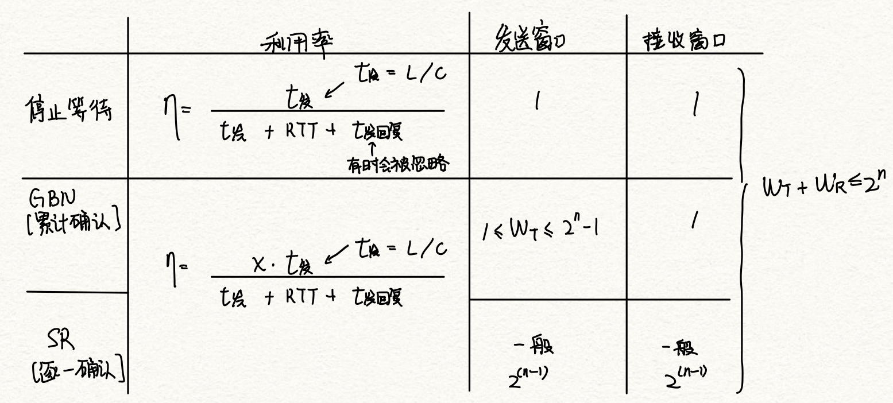

# 流量控制

2022.3.9

[toc]

## 停止等待与滑动窗口流量控制原理

1. 停止等待是窗口=1的滑动窗口
2. 窗口大小固定（传输层不固定）

## 可靠传输机制

1. 停止等待ARQ
2. 后退N帧ARQ
3. 选择重传ARQ
4. 2与3统称连续ARQ

## 单帧滑动窗口与停止等待协议

1. 0，1帧用ACK0，ACK1确认（**确认收到的帧**而不是下一帧）
2. 接收端重复接受n：表明发送端进行了超时重传
3. 发送端重复接受ACKn：表明接收端接到了重复帧

## 多帧滑动窗口与后退N帧协议

1. 累计确认

2. 接收方只能按序接受

3. 窗口大小
   $$
   1≤W_T≤2^n-1
   $$

## 多帧滑动窗口与选择重传协议

1. 选择重传ARQ协议；错误传NAK（否定帧）

2. 窗口大小（用nbit对帧编号）
   $$
   W_T+W_R≤2^n\\
   W_T=W_R=2^{n-1}
   $$

## 注意点

1. 链路层流量控制：接受方式不下就丢弃

2. 传输层流量控制：接受短肥发送方一个窗口公告

3. 小结

   

## 计算题总结

1. 【窗口的定义】
   对于窗口大小为n的滑动窗口,最多可以有()帧已发送但没有确认
   答案：n-1。**窗口大小是指2^k=n，发送窗口大小最大=窗口大小-1**
   
2. 【表述】
   注意要重发的“帧数”不是帧的序号
   
3. 【2012统考真题】两台主机之间的数据链路层采用后退N帧协议(**GBN**)传输数据,数据传输速率为**16kb/s**,单向传播时延为**270ms**,数据帧长度范围是**128~512字节**,接收方总是以与**数据帧等长**的帧进行确认。为使**信道利用率达到最高**,帧序号的比特数至少为(B)

   A.5

   B.4

   C.3

   D.2

   信道利用率最高，在发送某种帧一定量的情况下达到某吞吐量，为了达到吞吐量，要在最坏的情况下——全是128B帧，满足问题。
   $$
   \begin{align}
   t_{双方发}&=2*\frac{128\cdot 8b}{16kb/s}=128ms\\
   RTT&=540ms\\
   T&=668ms\\
   N&=\frac{668ms}{32ms}=10.4375\to11\\
   N&=2^n-1\to n≥4
   
   \end{align}
   $$

4. 【2014统考真题】主机甲与主机乙之间使用后退N帧协议(**GBN**)传输数据,甲的发送窗口尺寸为**1000**,数据帧长为**1000**字节,信道带宽为**100Mb/s**,乙每收到一个数据帧立即利用一个**短帧(忽略其传输延迟)进行确认**,若甲、乙之间的单向传播时延是**50ms**,则甲可以达到的最大平均数据传输速率约为()

   A. 10Mb/s

   B. 20Mb/s

   C. 80Mb/s

   D. 100Mb/s

   
   $$
   \begin{align}
   t_{发}&=\frac{8000b}{100Mb/s}=80\mu s\\
   t_{发全部窗口}&=80ms\\
   RTT&=100ms\\
   c&=100Mb/s\cdot 80\%=80Mb/s
   \end{align}
   $$

5. 【2015统考真题】主机甲通过**128kb/s**卫星链路,采用**滑动窗口协议**向主机乙发送数据,链路单向传播时延为**250ms**,帧长为**1000字节**。不考虑确认帧的开销,为使链路利用率不小于**80%**,帧序号的比特数至少是(B)

   A.3

   B.4

   C.7

   D.8
   $$
   \begin{align}
   t_{发1个}&=\frac{8000b}{128kb/s}=62.5ms\\
   T&=t_{发1个}+RTT=562.5ms\\
   N&=\frac{562.5}{62.5}\cdot 0.8=7.2\\
   N&≤2^n-1\to n≥4
   \end{align}
   $$

6. 【2018统考真题】主机甲采用**停止等待协议**向主机乙发送数据,数据传输速率是**3kb/s**,单向传播时延是**200ms**,忽略确认帧的传输时延。当信道利用率等于**40%**时,数据帧的长度为(D)

   A.240比特

   B.400比特

   C.480比特

   D.800比特
   $$
   \begin{align}
   t&=\frac{Lb}{3kb/s}=\frac{L}{3}ms\\
   T&=\frac{L}{3}+400ms\\
   0.4&=\frac{\frac{L}{3}}{\frac{L}{3}+400}\to L=800b
   \end{align}
   $$

7. 【2019统考真题】对于滑动窗口协议,若分组序号采用3比特编号,发送窗口大小为5,则接收窗口最大是(B)

   A.2	B.3	C.4	D.5
   $$
   2^3-5=3
   $$

8. 【2020统考真题】假设主机甲采用**停-等**协议向主机乙发送数据帧,**数据帧长与确认帧长均为1000B**,数据传输速率是**10kb/s**,单项传延时是**200ms**。则甲的最大信道利用率为(D)

   A.80%

   B.66.7%

   C.44.4%

   D.40%
   $$
   \begin{align}
   t&=\frac{16000b}{10kb/s}=1.6s\\
   \eta&=\frac{0.8s}{1.6s+0.4s}=40\%
   \end{align}
   $$

9. 假定卫星信道的数据率为**100kb/s**,卫星信道的单程传播时延为**250ms**,每个数据帧的长度均为**2000**位,并且不考虑误码、确认帧长、头部和处理时间等开销,为达到传输的最大效率,试问帧的顺序号应为多少位?此时信道利用率是多少?
   $$
   \begin{align}
   t_{1}&=\frac{2000b}{100kb/s}=20ms\\
   T&=520ms\\
   N&=520/20=26\\
   N&≤2^n-1\to n≥5\\
   \eta &= \frac{20\cdot\min(26,31)}{520}=100\%
   \end{align}
   $$

10. 在数据传输速率为50kb/s的卫星信道上传长度为1kbit的帧,假设确认帧总由数据帧捎带,帧头的序号长度为3bit,卫星信道端到端的单向传播延迟为270ms。对于下面三种协议,信道的最大利用率是多少?

    1)停止-等待协议（坑：**虽然是捎带确认，往返的都是数据帧，但是分母还是一个RTT😭，原来返回来的数据帧是确认的意义，所以对于前一个数据帧也算成确认帧发送时间的一部分**）
    $$
    t_1=\frac{1kb}{50kb/s}=20ms\\
    \eta=\frac{20ms}{20\cdot 2ms+540ms}=3.45\%
    $$
    2)后退N帧协议。
    $$
    \begin{align}
    N_{max}&=2^3-1=7\\
    \eta&=\frac{7\cdot20}{20\cdot 2+540}=24.14\%
    \end{align}
    $$
    3)选择重传协议(假设发送窗口和接收窗口相等)
    $$
    \begin{align}
    N_{max}&=2^{3-1}=4\\
    \eta&=\frac{4\cdot20}{20\cdot 2+540}=13.79\%
    \end{align}
    $$
    
11. 对于下列给定的值,不考虑差错重传,**非受限协议**(无须等待应答)和**停止等待协议**的有效数据率是多少?(即每秒传输了多少真正的数据,单位为b/s

    R=传输速率(16Mb/s)

    S=信号传播速率(200m/us)

    D=接收主机和发送主机之间传播距离(200m)

    T=创建帧的时间(2μs)

    F=每帧的长度(500bit)

    N=每帧中的数据长度(450bit)

    A=确认帧ACK的帧长(80bit)

    非受限协议:**不用加传输时延了😭**
    $$
    \begin{align}
    T_{发数据}&=\frac{450b}{16Mb/s}=28.125\mu s\\
    T_{发送端}&=\frac{500b}{16Mb/s}=31.25\mu s\\
    T_{传输}&=\frac{200m}{200m/\mu s}=1\mu s\\
    T_{创建}&=2\mu s\\
    \eta &= \frac{28.125}{31.25+2\ [这里不用加传输时延了]}\\
    c &= \eta\cdot16Mb/s=13.53Mb/s
    \end{align}
    $$
    

    停止等待协议:
    $$
    \begin{align}
    T_{发数据}&=\frac{450b}{16Mb/s}=28.125\mu s\\
    T_{发送端}&=\frac{500b}{16Mb/s}=31.25\mu s\\
    T_{接受端}&=\frac{80b}{16Mb/s}=5\mu s\\
    RTT&=\frac{400m}{200m/\mu s}=2\mu s\\
    T_{创建}&=4\mu s\\
    \eta &= \frac{28.125}{31.25+5+2+4}\\
    c &= \eta\cdot16Mb/s=10.65Mb/s
    \end{align}
    $$
    
12. 在某个卫星信道上,发送端从一个方向发长度为**512B**的帧,且发送端的数据发送速率为**64kb/s**,接收端在另一端返回一个很短确认帧。设卫星信道端到端的单向传播延时为**270ms**,对于发送窗口尺寸分别为**1、7、17和117**的情况,信道的吞吐率分别为多少?
    $$
    \begin{align}
    t_1&=\frac{512\cdot8b}{64kb/s}=64ms\\
    \eta&=\frac{[1,7,17,117]\cdot64ms}{64ms+540ms}=[10.60\%,74.17\%,100\%,100\%]\\
    c&=\eta\cdot c_0=[6.78kb/s,47.47kb/s,64kb/s,64kb/s]
    \end{align}
    $$

13. 【2017统考真题】甲乙双方均采用**后退N帧协议(GBN)**进行持续的双向数据传输,且双方始终采用**捎带确认**,帧长均为**1000B**, $$S_{x,y}和R_{x,y}$$分别表示甲方和乙方发送的数据帧,其中**x是发送序号,y是确认序号**(表示希望接收对方的下一帧序号),数据帧的发送序号和确认**序号**字段均为**3比特**。信道传输速率为**100Mb/s,RTT=0.96ms**。下图给出了甲方发送数据帧和接收数据帧的两种场景,其中$t_0$为初始时刻,此时甲方的发送和确认序号均为0,1时刻甲方有足够多的数据待发送

    请回答下列问题

    

    1)对于图(a),t0时刻到t1时刻期间,甲方可以断定乙方已正确接收的数据帧数是多少?正确接收的是哪几个帧(请用S形式给出)?
    $$
    GBN\to累计确认\\
    收到了R_{3,3}\to乙希望收到3\\
    正确接受3个:S_{0,0},S_{1,0},S_{2,0}
    $$
    
    2)对于图(a),从t1时刻起,甲方在不出现超时且未收到乙方新的数据帧之前,最多还可以发送多少个数据帧?其中第一个和最后一个帧分别是哪个(请用$$S_{x,y}$$形式给出)?
    $$
    N=2^3-1=7\\
    \to 0√,1√,2√,[3?,4?,5,6,7,0,1],2,3,4,5...\\
    ?:待确认\\
    √:已确认\\
    还可以发7-2=5个\\
    第一个是:S_{5,2}\\
    最后一个:S_{1,2}
    $$
    
    3)对于图(b),从t1时刻起,甲方在不出现新超时且未收到乙方新的数据帧之前,需要重发多少个数据帧?重发的第一个帧是哪个帧(请用$$S_{x,y}$$形式给出)
    $$
    甲发送窗口:0√,1√,[2,3?,4?,5,6,7,0],1,2,3...\\
    重新发送3个,重发的是已经发过的234,第一个是:S_{2,3}
    $$
    
    4)甲方可以达到的最大信道利用率是多少?
    $$
    \begin{align}
    t_1&=\frac{8kb}{100Mb/s}=80\mu s\\
    \eta&=\frac{7\cdot 80\mu s}{2\cdot 80\mu s+960ms}=50.45\%
    \end{align}
    $$

