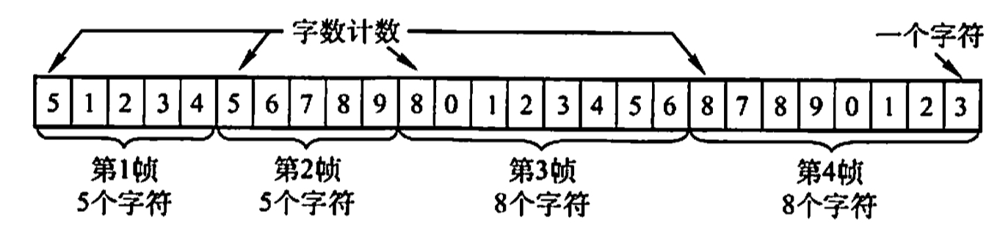
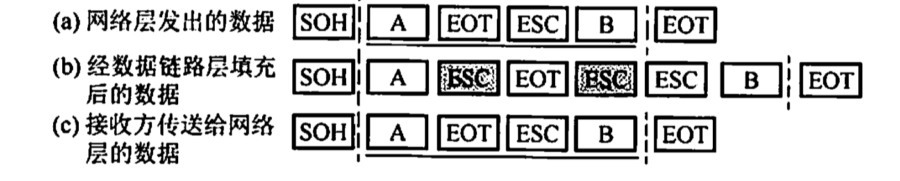
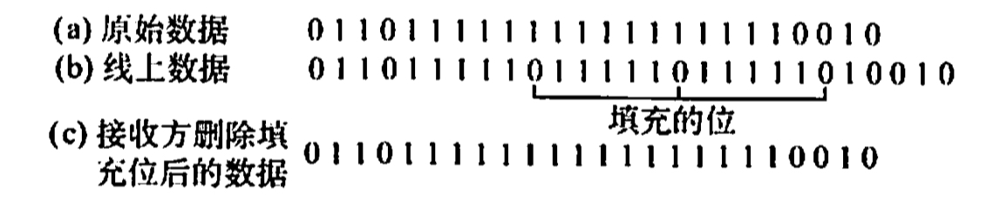

# 组帧

2023.2.1

* 字符计数法
  * **用于字符计数的字符也算入计数！！！**
  * 缺点，计数字段出错，帧会失去帧边界，收发端失去同步
  * 
* 字符填充的首尾定界符法
  * 开始，SOH（Start of Head）
  * 结束，EOT（End of Transformation）
  * 转义，ESC
  * 
* 零比特填充的首尾定界符法
  * 开始结束：01111110
  * 内容：个1一个0
  * 比符号填充更易由硬件实现，生活中常用
  * 案例，DHLC协议
  * 
* 违规编码法
  * 曼彻斯特编码，生活中常用
  * 利用00与11判断首尾，01和10表示0与1
  * 案例，局域网IEEE 802