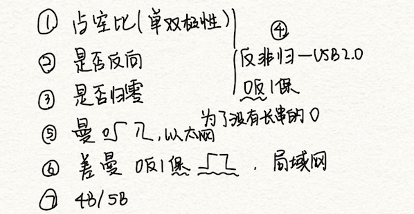
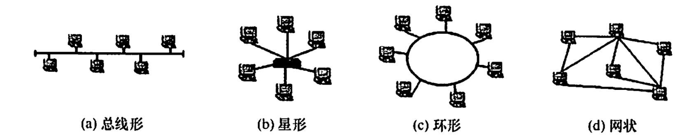

# 物理层

2022.07.09

[toc]

## 物理层概念与标准

1. **物理层协议**也叫做**物理层规程**。考虑的是怎样才能**在**连接**各种**计算机的传输**媒体上传输**数据**比特流**，而不是指具体的传输媒体。

2. 四种特性：

   1. **机械特性**：形状尺寸、引脚数量与排列、固定锁定装置。

   2. **电气特性**：电压范围。

   3. **功能特性**：电压意义。

   4. **过程特性**：不同功能的各种事件出现顺序。

   5. 例子：

      1. 某网络在物理层规定,信号的电平表示二进制0,用-10V~-15V表示二进制1,电线长度限于15m以内,这体现了物理层接口的(电气特性)

      2. 当描述一个物理层接口引脚处于高电平时的含义时,该描述属于(功能特性)

3. 常见标准

   1. [EIA RS-232](https://zh.wikipedia.org/wiki/RS-232)

   2. [ADSL](https://zh.wikipedia.org/wiki/ADSL)

      ADSL因为上行（从用户到电信服务提供商方向，如上传动作）和下行（从电信服务提供商到用户的方向，如下载动作）带宽不对称（即上行和下行的速率不相同）因此称为非对称数字用户线路。它采用频分多路复用技术把普通的电话线分成了电话、上行和下行三个相对独立的信道，从而避免了相互之间的干扰。

   3. [SONET/SDH](https://zh.wikipedia.org/wiki/%E5%90%8C%E6%AD%A5%E5%85%89%E7%BD%91%E7%BB%9C)

      同步光纤网络

4. 计算机内部：一般并行传输；数据在通信线路：串行传输。

5. 交换方式

   1. 电路交换
   2. 报文交换
      1. **不能用来传语音**
   3. 分组交换
      1. 数据报交换
         1. **在出错率很高的传输系统适合采用**
         2. 不保证有序到达
      2. 虚电路
         1. 保证有序到达
         2. 将数据报与电路交换结合起来
         3. 虚电路建立(呼叫请求&呼叫应答)、数据传输、虚电路释放(释放请求&释放应答)
         4. 建立虚电路时，选择一个没用过的虚电路号以区别其他虚电路
         5. 数据传输时，不仅有分组号、校验和等控制信息，还有虚电路号
         6. 结点维护虚电路表，虚电路表包含一个打开的虚电路信息、接受与发送链路的虚电路号、前后节点标识
         7. **【错】连接是临时性的，会话结束就立即释放**
      3. 信元交换（目前最先进）：又叫异步传输模式（Asynchronous Transfer Mode，ATM），是一种面向连接的快速分组交换技术，它是通过建立虚电路来进行数据传输的。

## 通信基础

1. 双方信息交互方式

   1. 单工通信：只能A到B
   2. 半双工通信：A与B交替通信
   3. 全双工通信：A与B同时通信

2. 调制：

   1. 基带调制/编码
   2. 带通调制：因为许多信号包含直流或低频成分，这些在通信线路上不好传输，所以需要用载波进行调制。

3. **基带传输**：将基带信号**直接**传送到通信线路(**数字信道**)上的传输方式。常用**局域网**传输，近距离传输。独占带宽，双向传输。

   **频带传输**：把基带信号经过**调制**后送到通信线路(**模拟信道**)上的方式。常用于**远距离**传输或无线传输。

   **宽带传输**：借助频带传输，把链路容量分成多个信道。比如频分复用。

   

4. **同步传输**：面向**比特**；单位是**帧**；通过字符起止的开始和停止码抓住再同步的机会；效率高。

   **异步传输**：面向**字节**；单位是**字符**；以数据中抽取同步信息；效率低。

   [资料](https://blog.csdn.net/u012842630/article/details/89893210)

5. **波特率**：每秒可能发生的**信号变化次数**

   > 课本：码元传输速率。又称波特率，它表示单位时间内数字通信系统所传输的码元个数（也可称为脉冲个数或信号变化的次数)，单位是波特(Baud)。1波特表示数字通信系统每秒传输一个码元。码元可以是多进制的，也可以是二进制的，码元速率与进制数无关。

6. **常用的编码方式**

   **保持是电平延续，比如差分曼彻斯特编码如果保持，是前一bit电平后一半与这一bit电平前一半相同**

   |                                                              | bit=0  | bit=1 | 时钟信号 |
   | ------------------------------------------------------------ | :----: | :---: | :------: |
   | 单/双极性不归零码（NRZ）（相当于占空比为1）                  | 0或-1  |   1   |    否    |
   | 单/双极性归零码（RZ）（占空比不为1）                         | 0或-1  |   1   |    是    |
   | [反向非归零码](https://www.c-fol.net/baike/content/3/1673.html)（INRZ）（USB 2.0采用） | 01互换 | 保持  |    是    |
   | 曼彻斯特编码（**以太网**采用）                               |   01   |  10   |    是    |
   | 差分曼彻斯特编码方式（常见于局域网传输）                     | 01互换 | 保持  |    是    |
   | 4B/5B编码                                                    |        |       |          |

   

   > | 助记问题                                    | 答案                                     |
   > | ------------------------------------------- | ---------------------------------------- |
   > | <u>反向非归零码</u>用于什么？规则是怎样的？ | USB2.0，0反1保                           |
   > | <u>差分曼彻斯特编码</u>用于什么？规则？     | 局域网，0反1保                           |
   > | <u>保持</u>是什么？                         | 前一bit电平后一半与这一bit电平前一半相同 |
   > | <u>曼彻斯特编码</u>用于什么？               | 以太网                                   |

7. 常用的带通调制方法

   * 调幅AM、调频FM、调相PM

   * 脉冲编码调制：数字信号编码模拟信号；常用于传输音频

   * 正交振幅调制(QAM) 

     * 模拟信号传数字数据
     * 采用m个相位，每个相位n种振幅：

     $$
     R=2W\log_2{mn}\\
     V = mn
     $$

5. **奈奎斯特准则**（发送速率与带宽）
   $$
   R=2W\log_2V=2B\\
   W:带宽\\
   B:波特率
   $$

6. **信噪比**
   $$
   信噪比(dB)=10log_{10}\frac{S}{N}\ (dB)
   $$

7. **香农公式**（发送速率与信噪比）
   $$
   R = W log_2(1+\frac{S}{N})
   $$

11. 小结

    

8. 三个公式例题

   1. 以太网数据波特率是40MBaud，数据率是？

      PS: 10BaseT，以太网 想到曼彻斯特码
      $$
      以太网\to 曼彻斯特\to 2bit传1bit\\
      40MBaud\to 每秒信号变40M次\to 20 Mb/s
      $$

   2. 无噪声8kHz信道，信号包含8级，每秒采样24k次，最大传输率
      $$
      R = 2W\log_2{V}=2\cdot 8k\cdot log_2{8}=48kb/s
      $$

   3. 二进制信号在信噪比127:1的4kHz信道上传输，最大数据传输速率可以达到（）
      $$
      R_1 = W\log_2({1+\frac{S}{N}})=4k\cdot\log_2(1+127)=28kb/s\\
      R_2 = 2W\log_2{V}=2\cdot 4k\cdot log_2{2} = 8kb/s\\
      \min{(R_1,R_2)}=8kb/s
      $$

   4. 信道每秒采样8次**不是**说B=8Hz

   5. 将1路模拟信号分别编码为数字信号后,与另外7路数字信号采用同步TDM方式复用到一条通信线路上。1路模拟信号的频率变化围为0~1kHz,每个采样点采用PCM方式编码为4位的二进制数,另外7路数字信号的数据率均为7.2kb/s。复用线路需要的最小通信能力是()。

      $$
      R = 2W\log_2V = 2\cdot 1k\cdot 4=8kb/s\\
      7.2kb/s < 8kb/s\\
      8\cdot8 = 64kb/s
      $$
      
   6. 站A发送到路由器S发送到站B。发送速率10Mb/s。S收到分组处理35us进行转发（处理时延35us）。链路传播时延20us。发送两个5000bit分组。从A到B总时间：
   
      | 时间 |       A        |            S            |    B    |
      | :--: | :------------: | :---------------------: | :-----: |
      |  0   |    开始发1     |                         |         |
      |  20  |                |         开始收1         |         |
      | 500  | 发完1，开始发2 |                         |         |
      | 520  |                |         刚收完1         |         |
      | 555  |                |         开始发1         |         |
      | 1000 |     发完2      |                         |         |
      | 1020 |                |          收完2          |         |
      | 1055 |                | 发完1，处理完2，开始发2 |         |
      | 1075 |                |                         | 开始收2 |
      | 1575 |                |                         |  收完2  |
   
      $$
      发送:(2链路+2发送节点-1)\cdot \frac{5000b}{10Mb/s}=1500\mu s\\
      传播:40\mu s\\
      处理:35\mu s(只有s处理了一次)
      $$
   
      
   
   7. 虚电路，分组头部h位，数据p位，现有L位报文，源点与终点之间线路数k，每条线路传播时延d s，数据传输速率b bit/s，虚电路建立s s，结点处理时延m s。求总用时
      $$
      \begin{align}
      N &= \frac{L}{p}\\
      d_{建立}&=s\\
      d_{传播}&=d\cdot k\\
      d_{发送}&=(N+k-1)\cdot \frac{h+p}{b}\\
      &=(\frac{L}{p}+k-1)\cdot \frac{h+p}{b}\\
      d_{处理}&=(k-1)\cdot m\\
      d &=d_{建立}+d_{传播}+d_{发送}+d_{处理}
      \end{align}
      $$
      

## 传输媒介

1. 传输媒体不是物理层，是在物理层之下的第零层。

2. 引导型(Guided)传输媒介

   1. 双绞线

      1. 屏蔽双绞线（STP，Shielded Twist Pair）（屏蔽**电磁**干扰）
      2. 非屏蔽双绞线（UTP，Unshilded Twist Pair）
      2. 10BASE-T：10代表10Mb/s，BASE代表基带传输，T代表Twist Pair
      3. **EIA/TIA-568，EIA/TIA-568-A**
         * [Wiki介绍](https://en.wikipedia.org/wiki/ANSI/TIA-568)

   2. 同轴电缆

      1. **50Ω同轴电缆**：传送**基带**数字信号，又称基带同轴电缆

      2. **75Ω同轴电缆**：传送**宽带**信号，又称宽带同轴电缆

      3. 利用一根同轴电缆互连主机构成以太网,则主机间的通信方式为(B)

         A.全双工

         B.半双工

         C.单工

         D.不确定

         【以太网采用广播通信，半双工，同时通信会碰撞（参考计算机网络实验中的场景）】

      4. 同轴电缆比双绞线的传输速率更快,得益于(C)

         A.同轴电缆的铜心比双绞线粗,能通过更大的电流

         B.同轴电缆的阻抗比较标准,减少了信号的衰减

         C.同轴电缆具有更高的屏蔽性,同时有更好的抗噪声性

         D.以上都正确

   3. 光缆

      1. 多模光纤：sx(短距离)
      2. 单模光纤：lx(长距离)，损耗低，昂贵

3. 非引导型传输媒介

   1. （甚特超极，VUSE）**极低频**(ELF)-**超低频**(SLF)-**特低频**(ULF)-**甚低频**(VLF)-**低频**(LF 30kHz~300kHz)-**中频**(MF 300kHz~3MHz)-**高频**(HF 3MHz~30MHz)-**甚高频**(VHF)-**特高频**(UHF)-**超高频**(SHF)-**极高频**(EHF)
   2. 无线电波：无线局域网(WLAN)，设备无需对准某个方向
   3. 微波、红外线和激光，需要视线通路（Line-of sight）
   4. 多径效应：多径效应就是同一个信号经过不同的反射路径到达同一个接收点,但各反射路径的衰减和时延都不相同,使得最后得到的合成信号失真很大。
   5. 两种类型：地面微波接力通信，卫星通信

## 物理层设备

1. **中继器**

   1. 别名：转发器
   2. 不能隔离冲突域与广播域
   3. 不能连接两个具有不同速率的网段
   4. 10BASE5以太网规定：“**5-4-3原则**”——<u>4个中继器连接5段通信介质只有三段可以挂载计算机</u>
   5. 放大器放大模拟信号，原理是信号放大，中继器放大数字信号，原理是信号再生

2. **集线器**

   1. 多端口中继器

   2. 只能半双工工作

   3. 集线器连接的网络在拓扑结构上属于**星形**

      

3. 小结

   1. **如果某个网络设备具有存储转发的功能,那么可以认为它能连接两个不同的协议**;如果该网络设备没有存储转发功能,那么认为它不能连接两个不同的协议。中继器没有存储转发功能,因此它不能连接两个速率不同的网段,中继器两端的网段一定要使用同一个协议

   2. 两个网段在物理层进行互联时要求（C，因为物理层连接成功，链路层可能没连接成功！）

      A.数据传输速率和数据链路层协议都可以不同

      B.数据传输速率和数据链路层协议都要相同

      C.数据传输速率要相同,但数据链路层协议可以不同

      D.数据传输速率可以不同,但数据链路层协议要相同

   3. |               | 隔离冲突域 | 隔离广播域 |
      | ------------- | ---------- | ---------- |
      | 集线器/中继器 | 否         | 否         |
      | 交换机        | 是         | 否         |
      | 路由器        | 是         | 是         |

## 信道复用技术

1. 频分复用FDM

2. 时分复用TDM / 同步时分复用

3. 统计时分复用STDM / 异步时分复用

   * **STDM帧的时隙数小于集中器连接的用户数**

4. 波分复用WDM

   1. 光复用器=合波器；掺铒光纤放大器EDFA(Erbium Doped Fiber Amplifier)；光分用器=分波器
   2. 密集波分复用DWDM

5. 码分复用CDM

   1. [通俗理解CDMA](https://blog.csdn.net/dog250/article/details/6420427)

   2. 沃尔什向量

      

   3. 一个比特被分为m bit的码片(Chip)，m通常为64或128

   4. 每一个站被指派自己的码片序列(取m=8)，比如：

      |      |   编码   |            码片序列            |
      | ---- | :------: | :----------------------------: |
      | A的1 | 11110000 |   1，1，1，1，-1，-1，-1，-1   |
      | A的0 | 00001111 |   -1，-1，-1，-1，1，1，1，1   |
      | B的1 | 11111111 |     1，1，1，1，1，1，1，1     |
      | B的0 | 00000000 | -1，-1，-1，-1，-1，-1，-1，-1 |

      CSMA要求，不同编码必须正交

      发送端，A发送0，B发送1
      $$
      [-1,-1,-1,-1,+1,+1,+1,+1]\\+[+1,+1,+1,+1,+1,+1,+1,+1]\\=
      [0,0,0,0,2,2,2,2]
      $$
      A接受端
      $$
      \frac{[0,0,0,0,2,2,2,2]\cdot [1,1,1,1,-1,-1,-1,-1]}{8}=-1
      $$
      B接受端
      $$
      \frac{[0,0,0,0,2,2,2,2]\cdot [1,1,1,1,1,1,1,1]}{8}=1
      $$
      
   5. 扩频(Spread Specturm)
   
      1. 原因：一个码片有m位，原来发送比特速率为b bit/s，现在就需要扩充到mb bit/s，对应的频率域也需要扩充。
      2. 直接序列扩频（DSSS）
      3. 调频扩频（FHSS）
